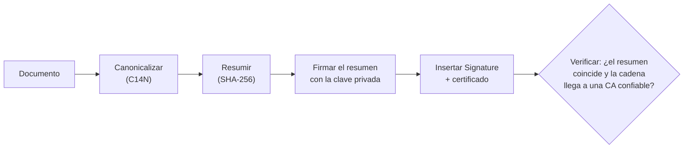

# 🧾 lg03 — Documentos firmados

> Python para desarrolladores Java senior · **Carta** · Track `lg` — Legado e intercambio
> sectorial · sección 3 de 7
> Se lee suelta: no hace falta ninguna otra sección de la carta. Conviene haber leído la
> [Fase 05](05-shell-con-esteroides.md), donde `aur` firma el XML llamando al binario del
> proveedor.
> Versiones verificadas contra PyPI el 05/10/2026 · Código probado el 05/10/2026 con Python 3.14.7,
> en contenedor: las salidas son las de esa corrida.

---

## 🎯 1. Qué problema resuelve

Hoy `aur` firma la factura electrónica de Áurea llamando por `subprocess` a un binario que entregó
el proveedor tecnológico. Funciona, y la Fase 05 explica por qué fue la decisión correcta para
empezar. Pero ese binario es una caja negra con tres costos: corre en un solo sistema operativo,
cada actualización del anexo técnico de la DIAN depende de que el proveedor la publique, y cuando
una firma falla el mensaje es un código numérico sin documentación.

Esta sección abre la caja. Muestra qué es una firma digital sobre un documento —XML o PDF—, cómo se
produce y se verifica desde Python, y qué hace falta para decidir si el binario se puede
reemplazar. No pretende reemplazarlo en una tarde: pretende que la próxima vez que falle sepas
leer el error.

Tres familias de documento firmado aparecen en el trabajo de Áurea:

- **XML firmado (XMLDSig, y su perfil XAdES).** La factura electrónica y sus notas. La firma va
  **dentro** del propio XML.
- **PDF firmado (PAdES).** El plan de tratamiento con el consentimiento del paciente, que la
  historia clínica tiene que poder demostrar años después.
- **Sello de tiempo (RFC 3161).** Una tercera parte certifica que el documento existía en un
  instante, para que la firma siga valiendo cuando el certificado expire.

---

## 🧠 2. El modelo

Una firma digital no cifra el documento. Calcula un **resumen** (*hash*) del contenido, cifra
ese resumen con la **clave privada** del firmante y adjunta el resultado junto con el
**certificado**, que contiene la clave pública y la cadena que la vincula con una autoridad de
certificación. Verificar es repetir el resumen, descifrar el adjunto con la clave pública y
comparar.

En un documento firmado, lo difícil no es la criptografía —eso lo hace `cryptography`— sino
**decidir exactamente qué bytes se resumen**. En XML eso tiene nombre propio:

- **Canonicalización (C14N).** Dos XML con los mismos datos pueden diferir en espacios, orden de
  atributos o prefijos. Antes de resumir, el documento se reescribe en una forma canónica.
- **Firma envolvente** (*enveloped*): la firma va dentro del documento que firma, y una
  transformación la excluye del resumen para que no se firme a sí misma.
- **XAdES** agrega propiedades firmadas —quién firma, con qué política, cuándo— que la DIAN exige.
  XMLDSig a secas no basta para la factura electrónica.



### 🪞 Tu instinto de Java dice… y esta vez se equivoca

En Java la firma XML viene en el JDK (`javax.xml.crypto.dsig`) y el reflejo es que en Python no
hay nada comparable, así que "mejor sigue con el binario". Python no trae XMLDSig en la biblioteca
estándar, es cierto, pero **`signxml` (5.1.0, del 2026-07-05) implementa XMLDSig y XAdES sobre
`lxml` y `cryptography`**, y `pyhanko` (0.37.0, del 2026-08-31) es probablemente el firmador de
PDF de código abierto más completo que existe en cualquier lenguaje. La pregunta no es si se puede:
es si tu certificado y tu política de firma están dentro de lo que esas bibliotecas soportan.

### 🩻 Esto sí funciona igual

El modelo de certificados es el mismo que en Java: X.509, cadenas, PKCS#12 (el `.p12` o `.pfx`
que entrega la entidad certificadora). Un `.p12` que abres con `KeyStore.getInstance("PKCS12")`
se abre en Python con `pkcs12.load_key_and_certificates` y la misma contraseña.

---

## 💻 3. El ejemplo que corre

```bash
uv add cryptography signxml lxml pyhanko
```

Para aprender sin un certificado real, el ejemplo fabrica uno autofirmado. **Nunca firmes una
factura real con él**: la DIAN rechaza todo lo que no venga de una entidad certificadora
acreditada.

`firmar.py`:

```python
"""Firma y verifica un XML (XMLDSig) y un PDF (PAdES) con un certificado de prueba."""

import datetime as dt
from pathlib import Path

from cryptography import x509
from cryptography.hazmat.primitives import hashes, serialization
from cryptography.hazmat.primitives.asymmetric import rsa
from cryptography.x509.oid import NameOID
from lxml import etree
from signxml import XMLSigner, XMLVerifier


def test_certificate(common_name: str) -> tuple[bytes, bytes]:
    """Clave y certificado autofirmado en PEM. Solo para pruebas: ninguna CA lo respalda."""
    key = rsa.generate_private_key(public_exponent=65537, key_size=3072)
    name = x509.Name([x509.NameAttribute(NameOID.COMMON_NAME, common_name)])
    now = dt.datetime.now(dt.UTC)
    cert = (
        x509.CertificateBuilder()
        .subject_name(name)
        .issuer_name(name)
        .public_key(key.public_key())
        .serial_number(x509.random_serial_number())
        .not_valid_before(now)
        .not_valid_after(now + dt.timedelta(days=30))
        .sign(key, hashes.SHA256())
    )
    key_pem = key.private_bytes(
        serialization.Encoding.PEM,
        serialization.PrivateFormat.PKCS8,
        serialization.NoEncryption(),
    )
    return key_pem, cert.public_bytes(serialization.Encoding.PEM)


def sign_xml(path: Path, key_pem: bytes, cert_pem: bytes) -> bytes:
    root = etree.parse(str(path)).getroot()
    # Firma envolvente con SHA-256: la firma queda dentro del documento que firma.
    signer = XMLSigner(signature_algorithm="rsa-sha256", digest_algorithm="sha256")
    signed = signer.sign(root, key=key_pem, cert=cert_pem)
    return etree.tostring(signed, xml_declaration=True, encoding="UTF-8")


def verify_xml(signed: bytes, cert_pem: bytes) -> etree._Element:
    # Se verifica contra el certificado esperado, no contra el que trae el documento:
    # un atacante también puede adjuntar un certificado.
    result = XMLVerifier().verify(signed, x509_cert=cert_pem)
    return result.signed_xml  # lo que de verdad está firmado: lee de aquí, no del original


if __name__ == "__main__":
    key_pem, cert_pem = test_certificate("Aurea pruebas de firma")
    signed = sign_xml(Path("factura.xml"), key_pem, cert_pem)
    Path("factura-firmada.xml").write_bytes(signed)
    verified = verify_xml(signed, cert_pem)
    print("firma válida; raíz firmada:", etree.QName(verified).localname)

    tampered = signed.replace(b"185000.00", b"18500.00")
    try:
        verify_xml(tampered, cert_pem)
    except Exception as error:  # signxml lanza InvalidDigest o InvalidSignature
        print("alterada:", type(error).__name__)
```

```bash
python3 firmar.py
```

Salida (Python 3.14.7, 05/10/2026):

```text
firma válida; raíz firmada: Invoice
alterada: InvalidDigest
```

**Detalles con intención**

- **`x509_cert=` en la verificación.** Sin él, `XMLVerifier` acepta cualquier certificado que
  traiga el documento, y un documento firmado por cualquiera es un documento firmado por nadie.
- **`result.signed_xml`.** Una firma puede cubrir solo una parte del documento. El patrón seguro es
  leer los datos **del árbol que la verificación devolvió**, nunca del XML que llegó: es la defensa
  contra los ataques de envoltura de firma (*signature wrapping*).
- **Cambiar un cero rompe el resumen**, no la firma: el error es `InvalidDigest`. Saber cuál de
  los dos falló dice si alteraron el contenido o la firma misma.

### XAdES: lo que pide la DIAN

`signxml` trae `XAdESSigner` y `XAdESVerifier` en `signxml.xades`, que agregan las propiedades
firmadas. La factura colombiana exige además una **política de firma** concreta —un identificador,
su resumen y su URL— que se le pasa al firmador. El esqueleto, sin la política, es este:

```python
from signxml.xades import XAdESSigner

signer = XAdESSigner(signature_algorithm="rsa-sha256", digest_algorithm="sha256")
signed = signer.sign(root, key=key_pem, cert=cert_pem)
```

El anexo técnico de la DIAN dice qué política, qué ubicación de la firma (dentro de
`ext:UBLExtensions`) y qué algoritmos. Contrastar ese anexo con lo que `signxml` soporta es el 🔴
de los ejercicios, y es exactamente el trabajo que decide si el binario del proveedor se puede
retirar.

### PDF: el consentimiento firmado

`firmar_pdf.py`, con el `.p12` que entrega la entidad certificadora (o uno de prueba):

```python
"""Firma el PDF del plan de tratamiento en un campo visible."""

from pyhanko.pdf_utils.incremental_writer import IncrementalPdfFileWriter
from pyhanko.sign import signers

signer = signers.SimpleSigner.load_pkcs12("firmante.p12", passphrase=b"cambia-esto")

with open("plan-de-tratamiento.pdf", "rb") as source:
    writer = IncrementalPdfFileWriter(source)
    metadata = signers.PdfSignatureMetadata(field_name="FirmaPaciente")
    with open("plan-firmado.pdf", "wb") as target:
        # La firma se agrega como una revisión incremental: el PDF original queda intacto adentro.
        signers.sign_pdf(writer, metadata, signer=signer, output=target)
```

```bash
pyhanko sign validate --pretty-print plan-firmado.pdf
```

---

## ⚠️ 4. Lo que se rompe

**Formatear el XML después de firmarlo.** Un `pretty_print=True`, un editor que cambia la
indentación o una plantilla que agrega un salto de línea, y la firma deja de valer. El documento
firmado se trata como binario: se guarda y se manda tal cual.

**Leer los datos del documento original.** Es el error que convierte una firma válida en una
vulnerabilidad: alguien agrega un segundo nodo `Invoice` sin firmar, la verificación pasa sobre el
primero y tu código lee el segundo. Se lee de `signed_xml`, siempre.

**El certificado que vence.** Una firma hecha con un certificado vigente se verifica años después,
cuando ya expiró, y la verificación ingenua falla. Para que siga valiendo hace falta el **sello de
tiempo** de una autoridad (RFC 3161) en el momento de firmar, y para un PDF de largo plazo, el
perfil PAdES-LTA que `pyhanko` sabe producir.

**El `.p12` en el repositorio.** La clave privada de firma de la empresa es el secreto más valioso
de esta sección. Vive en un gestor de secretos o en un token, nunca en git ni en una variable de
entorno que termina en un log.

---

## ⚖️ 5. Cuándo NO usarla

**Cuando el proveedor tecnológico ya firma y la firma no es tu problema.** Si el contrato con el
proveedor incluye la firma y la transmisión, reemplazar el binario es asumir un riesgo regulatorio
por ahorrarse una dependencia. El argumento para hacerlo es concreto —portabilidad, plazos de
actualización, errores ilegibles— o no existe.

**Cuando el certificado vive en un token físico.** Muchas entidades certificadoras entregan la
clave en un dispositivo criptográfico del que no sale. Firmar con él desde Python exige PKCS#11
(`python-pkcs11`, o el soporte de `pyhanko` para tokens) y el controlador del fabricante; es
posible, y es otra sección.

**Para inventar tu propio formato de firma.** Si dos sistemas tuyos necesitan comprobar que un
mensaje no se alteró, no hace falta XMLDSig: alcanza un HMAC o una firma Ed25519 sobre los bytes.
XMLDSig existe para interoperar con terceros que lo exigen.

---

## 🧪 6. Ejercicios (10)

**🟢 Fácil (1–3)**

1. Firma `factura.xml`, cambia una sola letra del número de factura en el archivo firmado y
   verifica. **Criterio:** la verificación falla con `InvalidDigest` y explicas por qué no con
   `InvalidSignature`.
2. Abre `factura-firmada.xml` y localiza `DigestValue`, `SignatureValue` y `X509Certificate`.
   **Criterio:** explicas en una línea qué contiene cada uno.
3. Verifica la firma pasando un certificado de prueba **distinto** en `x509_cert`.
   **Criterio:** falla, y anotas el tipo de excepción.

**🟡 Intermedio (4–6)**

4. Convierte la clave y el certificado de prueba a un `.p12` con contraseña usando
   `cryptography`, y cárgalo de vuelta. **Criterio:** la firma hecha con lo cargado verifica igual.
5. Firma el PDF con `pyhanko` y valídalo con la línea de comandos. **Criterio:** la validación
   informa la firma como íntegra y el certificado como no confiable, y explicas por qué las dos
   cosas son ciertas a la vez.
6. Agrega un sello de tiempo a la firma del PDF con un servidor RFC 3161 público de pruebas.
   **Criterio:** la validación muestra la hora del sello y de qué autoridad viene.

**🟠 Difícil (7–9)**

7. Reproduce un *signature wrapping*: agrega a un XML firmado un segundo elemento con otro total y
   demuestra que un lector que usa el documento original lee el total falso mientras la
   verificación pasa. **Criterio:** el mismo lector, cambiado a `signed_xml`, lee el verdadero.
8. Firma con `XAdESSigner` y compara la estructura resultante con un ejemplo de factura firmada del
   anexo técnico de la DIAN. **Criterio:** una lista de las diferencias, cada una marcada como
   "configurable en `signxml`" o "no soportada".
9. Mide cuánto tarda firmar 1.000 facturas con `signxml` contra llamar 1.000 veces al binario del
   proveedor (o a un binario de prueba que tarde lo mismo en arrancar). **Criterio:** reportas
   facturas por minuto de cada camino y dónde se va el tiempo del binario.

**🔴 Muy difícil (10)**

10. Escribe el informe que decide si `aur` puede retirar el binario del proveedor. **Criterio:** un
    documento de una página con una recomendación y su condición de reversa. *Rúbrica:* (a) contrasta
    el anexo técnico vigente con lo que `signxml` soporta, punto por punto; (b) dice dónde vive la
    clave privada y quién la puede usar; (c) incluye cómo se verifica que la firma propia es
    aceptada antes de producción; (d) nombra el costo de no hacerlo, en horas o en plata.

---

## 📚 7. Referencias

**Documentación oficial**

- `signxml`, con XAdES: https://xml-security.github.io/signxml/
- `pyhanko`, firmar y validar PDF: https://docs.pyhanko.eu/en/latest/
- `cryptography`, certificados X.509: https://cryptography.io/en/latest/x509/

**Estándares**

- XML Signature Syntax and Processing 1.1, del W3C: https://www.w3.org/TR/xmldsig-core1/
- XAdES, en ETSI (EN 319 132-1): https://www.etsi.org/deliver/etsi_en/319100_319199/31913201/
- Sellos de tiempo, RFC 3161: https://www.rfc-editor.org/rfc/rfc3161

**Orden de lectura sugerido:** la sección de *signature wrapping* de la documentación de
`signxml` primero, porque es la que evita el error grave; después el tutorial de `pyhanko`; los
estándares solo cuando un validador externo te rechace algo y necesites saber por qué.

---

## 🚀 8. Cierre

Una firma es un resumen cifrado más un certificado, y el trabajo real está en **qué bytes** se
resumen y **contra qué certificado** se verifica. Con eso, el binario del proveedor deja de ser
una caja negra y pasa a ser una decisión.

**La señal de que quedó bien:** *"Cuando la firma falló, supe si habían cambiado el documento o la
firma, y leí los datos del árbol firmado."*

> 🏷️ **Cierra la sección con su tag**, cuando los ejercicios que elegiste estén hechos:
>
> ```bash
> git tag -a op-lg-fase-03 -m "op lg03 cerrada: XMLDSig con signxml y PAdES con pyhanko"
> ```
>
> Los commits llevan su prefijo (`op lg03: …`) y los de ejercicio su número
> (`op lg03 ej07: …`).
