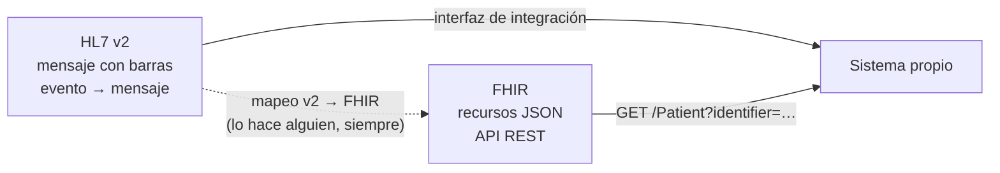

# 🧾 lg05 — Salud: HL7 v2 y FHIR

> Python para desarrolladores Java senior · **Carta** · Track `lg` — Legado e intercambio
> sectorial · sección 5 de 7
> Se lee suelta: no hace falta ninguna otra sección de la carta. Conviene tener presente la
> frontera de la historia clínica de [la historia de Áurea](00-historia-de-aurea.md) §5.
> Versiones verificadas contra PyPI el 05/10/2026 · Código probado el 05/10/2026 con Python 3.14.7,
> en contenedor: las salidas son las de esa corrida.

---

## 🎯 1. Qué problema resuelve

Áurea remite pacientes a un centro de radiología aliado para las panorámicas y las tomografías.
Hoy el centro avisa por WhatsApp que el estudio está listo, y alguien en recepción descarga el
informe de un portal y lo sube a Odontovía a mano. El centro, como casi cualquier sistema de
información de salud del mundo, **ya sabe mandar ese aviso en HL7**: es lo que su software habla
con los hospitales.

HL7 es la familia de estándares de intercambio de información clínica, y en la práctica son dos
cosas muy distintas que conviven:

- **HL7 v2**, de finales de los ochenta: mensajes de texto con barras verticales, que mueven la
  mayor parte del tráfico clínico real dentro de los hospitales. Feo, flexible hasta el abuso y
  omnipresente.
- **FHIR** (*Fast Healthcare Interoperability Resources*), de la última década: recursos JSON
  sobre una API REST, con un modelo de datos publicado y versionado. Es hacia donde van las
  regulaciones, incluida la colombiana de historia clínica electrónica interoperable (Ley 2015 de
  2020).

Esta sección enseña a leer los dos desde Python, y a desconfiar de la distancia entre lo que dice
el estándar y lo que manda el sistema que tienes al frente.

> ⚠️ **Todo lo de esta sección es dato clínico.** Los ejemplos usan pacientes inventados. Un
> mensaje HL7 real lleva nombre, documento y diagnóstico: no se loguea entero, no se guarda en un
> directorio temporal y no sale hacia ningún servicio que no esté autorizado (historia §5).

---

## 🧠 2. El modelo

**Un mensaje HL7 v2** es una lista de **segmentos** separados por retorno de carro (`\r`, no
`\n`). Cada segmento tiene un nombre de tres letras y **campos** separados por `|`; un campo puede
tener **repeticiones** (`~`), cada repetición **componentes** (`^`) y cada componente
**subcomponentes** (`&`). El carácter de escape es `\`. Y como en EDI, los delimitadores los
declara el propio mensaje: están en los primeros caracteres del segmento `MSH`.

```text
MSH|^~\&|RXCENTRO|ALIADO-07|AUREA|CENTRO|202609281015||ORU^R01^ORU_R01|MSG000183|P|2.5.1
PID|1||CC1023456789^^^RNEC^CC||PEREZ^ANA^MARIA||19880214|F
OBR|1|REM-4411|EST-88213|PAN^Radiografía panorámica^L|||202609280930
OBX|1|TX|INFORME^Informe^L||Sin hallazgos patológicos.||||||F
```

El campo 1 del `MSH` **es** el separador de campos, por eso el conteo de campos del `MSH` está
corrido en uno respecto de los demás segmentos: es la trampa clásica del primer parser.

**Un recurso FHIR** es un documento JSON con un `resourceType` y un modelo publicado. Un paciente,
una cita, un estudio de imagen (`ImagingStudy`), un informe diagnóstico (`DiagnosticReport`). Los
recursos se referencian entre sí (`"subject": {"reference": "Patient/123"}`) y se intercambian por
una API REST con búsqueda estandarizada.



### 🩻 Esto sí funciona igual

Si integraste alguna vez un hospital desde Java con HAPI, el modelo es exactamente el mismo: HAPI
tiene una biblioteca para v2 y otra para FHIR, y Python tiene el equivalente de cada una. Lo que
sabes de segmentos, eventos, recursos y perfiles se traslada entero; cambia la API, no el dominio.

---

## 💻 3. El ejemplo que corre

```bash
uv add hl7 fhir.resources
```

`hl7` (0.4.5) lleva desde 2022 sin publicar: **quieto porque está terminado**, no porque esté
muerto —HL7 v2 no cambia— y su API es una lista anidada con acceso por índices, que es justo lo
que hace falta. `hl7apy` (1.3.5, 2024) valida contra las definiciones de cada versión, y se nombra
como alternativa. `fhir.resources` (8.3.0, del 2026-07-03) son modelos de Pydantic generados desde
la especificación de FHIR.

`radiologia.py`:

```python
"""Lee el aviso de estudio listo en HL7 v2 y lo convierte en un DiagnosticReport de FHIR."""

import datetime as dt
from zoneinfo import ZoneInfo

import hl7
from fhir.resources.diagnosticreport import DiagnosticReport

# HL7 v2 casi nunca manda la zona horaria: la hora es la local del emisor, y hay que saber cuál es.
SENDER_ZONE = ZoneInfo("America/Bogota")

MESSAGE = "\r".join([
    "MSH|^~\\&|RXCENTRO|ALIADO-07|AUREA|CENTRO|202609281015||ORU^R01^ORU_R01|MSG000183|P|2.5.1",
    "PID|1||CC1023456789^^^RNEC^CC||PEREZ^ANA^MARIA||19880214|F",
    "OBR|1|REM-4411|EST-88213|PAN^Radiografía panorámica^L|||202609280930",
    "OBX|1|TX|INFORME^Informe^L||Sin hallazgos patológicos.||||||F",
])


def parse_hl7_timestamp(value: str) -> dt.datetime:
    # HL7 v2 permite precisión variable (AAAA, AAAAMM, AAAAMMDD, AAAAMMDDHHMM…) y un desplazamiento
    # opcional al final, que casi nadie manda. Si no viene, la hora es la del emisor.
    formats = {4: "%Y", 6: "%Y%m", 8: "%Y%m%d", 12: "%Y%m%d%H%M", 14: "%Y%m%d%H%M%S"}
    digits = value.split("+")[0].split("-")[0]
    naive = dt.datetime.strptime(digits, formats[len(digits)])
    return naive.replace(tzinfo=SENDER_ZONE)


def to_report(message: hl7.Message) -> DiagnosticReport:
    msh = message.segment("MSH")
    if str(msh[9][0][0]) != "ORU":
        raise ValueError(f"se esperaba un ORU y llegó {msh[9]}")
    pid = message.segment("PID")
    obr = message.segment("OBR")
    document = str(pid[3][0][0])           # CC1023456789: el identificador, sin el resto
    study_code = str(obr[4][0][0])         # PAN
    study_name = str(obr[4][0][1])         # Radiografía panorámica
    observed = parse_hl7_timestamp(str(obr[7]))
    conclusion = " ".join(str(obx[5]) for obx in message.segments("OBX"))

    return DiagnosticReport.model_validate({
        "resourceType": "DiagnosticReport",
        "status": "final",
        "code": {"coding": [{"system": "urn:aurea:estudios", "code": study_code}],
                 "text": study_name},
        # La referencia al paciente va por identificador, no por nombre: el nombre no viaja.
        "subject": {"identifier": {"system": "urn:co:rnec:cc", "value": document}},
        "effectiveDateTime": observed.isoformat(),
        "conclusion": conclusion,
        "identifier": [{"system": "urn:aliado-07:estudios", "value": str(obr[3])}],
    })


if __name__ == "__main__":
    message = hl7.parse(MESSAGE)
    print("evento:", message.segment("MSH")[9])
    report = to_report(message)
    print(report.model_dump_json(indent=2, exclude_none=True))
```

```bash
python3 radiologia.py
```

Salida (Python 3.14.7, 05/10/2026):

```text
evento: ORU^R01^ORU_R01
{
  "resourceType": "DiagnosticReport",
  "identifier": [
    {
      "system": "urn:aliado-07:estudios",
      "value": "EST-88213"
    }
  ],
  "status": "final",
  "code": {
    "coding": [
      {
        "system": "urn:aurea:estudios",
        "code": "PAN"
      }
    ],
    "text": "Radiografía panorámica"
  },
  "subject": {
    "identifier": {
      "system": "urn:co:rnec:cc",
      "value": "CC1023456789"
    }
  },
  "effectiveDateTime": "2026-09-28T09:30:00-05:00",
  "conclusion": "Sin hallazgos patológicos."
}
```

**Detalles con intención**

- **Los índices de `hl7` siguen la numeración del estándar**: `pid[3]` es el PID-3, no el cuarto
  elemento. Escribir `pid[3][0][0]` es leer "PID-3, primera repetición, primer componente" en
  voz alta.
- **El nombre del paciente se lee y se descarta.** El `DiagnosticReport` lo referencia por
  identificador: es minimización de datos aplicada en el punto donde el dato entra.
- **`model_validate` falla si el recurso no cumple el modelo** (un `status` inventado, una fecha
  mal formada). La validación del esquema la hace la biblioteca; la del **perfil** —qué campos son
  obligatorios en Colombia, qué sistemas de códigos se aceptan— sigue siendo tuya.
- **`fhir.resources` 8 usa por defecto FHIR R5.** Si el servidor con el que hablas es R4 (que es lo
  más común todavía), se importa desde `fhir.resources.R4B`, y la diferencia importa.

---

## ⚠️ 4. Lo que se rompe

**`\n` en vez de `\r`.** El separador de segmentos de HL7 v2 es el retorno de carro. Un mensaje
copiado de un correo o guardado en Windows llega con `\r\n` o con `\n`, y el parser ve un solo
segmento gigante. Se normaliza antes de parsear, y se deja anotado.

**El campo que el estándar dice y el que el sistema usa.** El PID-3 debería traer el documento con
su tipo; un sistema real puede mandarlo en el PID-2 (deprecado), en el PID-4, o en un segmento `ZPI`
que inventó el fabricante. Los segmentos `Z` son legales y son la norma: **cada interfaz HL7 v2
tiene su propia especificación**, y la del estándar es solo el punto de partida.

**El escape que nadie aplica.** Un informe con `|` o `^` en el texto debería llegar escapado
(`\F\`, `\S\`). Muchos emisores no escapan, y el texto se parte en campos. El síntoma es un OBX con
más campos de los que debería; la defensa es validar el conteo y rechazar, no adivinar.

**La hora sin zona.** FHIR exige desplazamiento en un `dateTime` que trae hora, y HL7 v2 casi
nunca lo manda. Sin el `replace(tzinfo=…)` del ejemplo, `model_validate` rechaza
`2026-09-28T09:30:00` con *"DateTime value string does not match spec regex"*, que no menciona la
zona. Esta sección lo descubrió así, en su prueba de humo: el desplazamiento se decide con el
emisor, por escrito, y no se adivina.

**Mezclar R4 y R5.** Un recurso R4 validado con los modelos R5 falla en campos que cambiaron de
nombre o de tipo, con un error de Pydantic que no menciona la versión. El servidor declara su
versión en su `CapabilityStatement`; se lee una vez y se fija.

---

## ⚖️ 5. Cuándo NO usarla

**Cuando el socio solo necesita mandarte un PDF.** Si el centro de radiología manda un informe que
nadie va a procesar —solo archivar y mostrar—, recibir el PDF por un canal seguro es más barato que
montar una interfaz HL7. HL7 se justifica cuando hay **datos** que tu sistema tiene que usar.

**Para inventar tu propio mensaje v2.** Si tú diseñas la integración, FHIR es la elección de este
siglo: modelo publicado, JSON, REST y validadores públicos. HL7 v2 se habla porque el otro lado
ya lo habla, no por elección.

**Para montar un servidor FHIR propio.** Leer y producir recursos es una biblioteca; **servir** una
API FHIR conforme —búsqueda, versiones, permisos, auditoría— es un producto. Si lo necesitas, se
compra o se adopta uno existente.

---

## 🧪 6. Ejercicios (10)

**🟢 Fácil (1–3)**

1. Agrega un segundo `OBX` con una observación y verifica que `conclusion` las une. **Criterio:**
   la conclusión trae las dos observaciones, en orden.
2. Haz que el script acepte el mensaje con `\n` como separador de segmentos. **Criterio:** el
   mismo mensaje con `\r`, `\n` y `\r\n` produce el mismo recurso.
3. Imprime el `DiagnosticReport` sin `exclude_none=True` y cuenta cuántas claves vacías aparecen.
   **Criterio:** explicas por qué en un intercambio se excluyen.

**🟡 Intermedio (4–6)**

4. Cambia el import a `fhir.resources.R4B.diagnosticreport` y anota qué cambia. **Criterio:** el
   recurso valida en las dos versiones o anotas exactamente qué campo falla y por qué.
5. Valida el mismo mensaje con `hl7apy` contra la versión 2.5.1. **Criterio:** reportas qué
   validación hace `hl7apy` que `hl7` no hace, con un mensaje que falle en una y pase en la otra.
6. Escribe el mensaje de acuse de recibo (`ACK`) que el estándar espera como respuesta, con el
   `MSA` correcto. **Criterio:** el `ACK` referencia el `MSH-10` del mensaje original.

**🟠 Difícil (7–9)**

7. Implementa el desescapado de HL7 v2 (`\F\`, `\S\`, `\T\`, `\R\`, `\E\`) para el texto de los
   `OBX`. **Criterio:** un informe con `|` y `^` escapados se lee con los caracteres originales.
8. El centro empieza a mandar el documento en un segmento `ZPI` propio. Diseña el lector para que
   acepte las dos formas y falle si llegan las dos con valores distintos. **Criterio:** tres pruebas,
   una por caso.
9. Levanta un servidor FHIR público de pruebas o usa uno de los servidores de prueba de la comunidad
   y sube el `DiagnosticReport` con `httpx`. **Criterio:** lo recuperas por su identificador con una
   búsqueda y explicas qué datos **no** subirías nunca a un servidor público.

**🔴 Muy difícil (10)**

10. Diseña la interfaz completa con el centro de radiología: transporte (MLLP sobre TCP o HTTPS),
    acuse de recibo, reintentos, mensajes duplicados y el destino final del informe en Odontovía.
    **Criterio:** un documento de una página y un prototipo que procese un mensaje de punta a
    punta. *Rúbrica:* (a) un mensaje duplicado no produce dos informes; (b) ningún dato clínico
    queda en un log; (c) un mensaje inválido se rechaza con un `ACK` de error y queda trazado; (d)
    dices qué parte de esto le corresponde al proveedor de Odontovía y cuánto costaría.

---

## 📚 7. Referencias

**Estándares**

- HL7 v2, el producto en HL7 International:
  https://www.hl7.org/implement/standards/product_brief.cfm?product_id=185
- FHIR, la especificación vigente: https://hl7.org/fhir/
- FHIR R4, que es la que todavía habla la mayoría de los servidores: https://hl7.org/fhir/R4/

**Bibliotecas**

- `hl7`: https://python-hl7.readthedocs.io/
- `hl7apy`: https://github.com/crs4/hl7apy
- `fhir.resources`: https://github.com/nazrulworld/fhir.resources

**Orden de lectura sugerido:** la página de recursos de FHIR para tener el mapa; después la
documentación de `hl7`, que es corta; y la especificación de v2 solo para el segmento concreto que
te toque, porque leerla de corrido no le sirve a nadie.

---

## 🚀 8. Cierre

HL7 v2 se lee como EDI con otros delimitadores, y FHIR como cualquier API con un modelo publicado.
Lo que separa una integración que funciona de una que se cae es otra cosa: la especificación de la
interfaz concreta, que nunca es igual al estándar, y la disciplina de que el dato clínico no se
quede donde no debe.

**La señal de que quedó bien:** *"El centro cambió dónde manda el documento y el lector lo detectó;
y en el log no había ni un nombre."*

> 🏷️ **Cierra la sección con su tag**, cuando los ejercicios que elegiste estén hechos:
>
> ```bash
> git tag -a op-lg-fase-05 -m "op lg05 cerrada: ORU de HL7 v2 a DiagnosticReport de FHIR"
> ```
>
> Los commits llevan su prefijo (`op lg05: …`) y los de ejercicio su número
> (`op lg05 ej07: …`).
