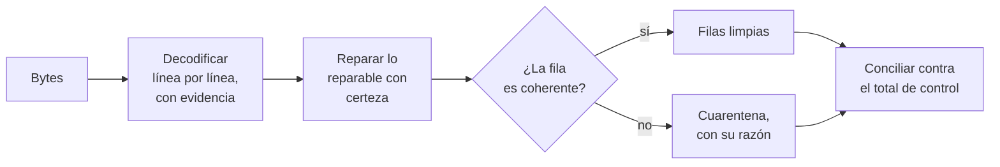

# 🧾 lg06 — Archivos planos hostiles

> Python para desarrolladores Java senior · **Carta** · Track `lg` — Legado e intercambio
> sectorial · sección 6 de 7
> Se lee suelta: no hace falta ninguna otra sección de la carta. **Empieza donde termina la
> [Fase 06](06-formatos-en-la-caja.md)**: el encoding declarado, el BOM, `errors=` y el dialecto
> del CSV ya están resueltos ahí.
> Versiones verificadas contra PyPI el 05/10/2026 · Código probado el 05/10/2026 con Python 3.14.7,
> en contenedor: las salidas son las de esa corrida.

---

## 🎯 1. Qué problema resuelve

La Fase 06 resuelve los archivos que **dicen** cómo están escritos, o cuyo origen conoces:
Odontovía exporta en Latin-1 con punto y coma, Excel mete un BOM, y se declara. Esta sección es
para los otros. Los que llegan al cierre de mes de Patricia sin que nadie sepa de dónde salieron:

- El CSV de uno de los dos franquiciados que trajeron su propio software, que **a veces** viene en
  UTF-8 y a veces en Windows-1252, según quién lo exportó ese mes.
- El archivo que alguien armó **concatenando** dos exports —uno en cada encoding— con `copy a+b`,
  así que la mitad de arriba se lee bien y la de abajo no.
- El nombre de paciente que dice `Rodríguez`: alguien leyó UTF-8 como Latin-1 y lo volvió a
  guardar en UTF-8. El dato **está** en el archivo, solo que codificado dos veces.
- Las filas con una columna de más porque una nota traía un `;` sin comillas, los bytes nulos que
  deja un programa viejo al final de cada registro y los saltos de línea de tres sabores en el mismo
  archivo.

Ninguno de estos problemas se resuelve con la herramienta correcta, porque **no hay herramienta
correcta**: hay un pipeline que detecta, repara lo que se puede reparar con certeza, **aparta** lo
que no, y concilia contra un total que sí conoces.

---

## 🧠 2. El modelo

El pipeline tiene cuatro etapas, y la tercera es la que casi todo el mundo se salta:



**Decodificar con evidencia** significa no adivinar el encoding del archivo entero: decodificar
cada línea, registrar cuál funcionó y decidir sobre esa estadística. UTF-8 tiene una propiedad que
lo hace detectable —una secuencia de bytes altos que no forma UTF-8 válido casi nunca es UTF-8—, y
Windows-1252 decodifica casi cualquier cosa, así que el orden de intento es siempre **UTF-8
estricto primero**.

**Reparar con certeza** es la frontera que separa un pipeline de una fábrica de datos falsos.
`Rodríguez → Rodríguez` es reparable con certeza: el patrón de la doble codificación es
inconfundible, y `ftfy` (6.3.1) lo deshace. *"Esta fila tiene once columnas y debería tener diez,
probablemente sobra un punto y coma en la nota"* **no** es reparable con certeza: se aparta.

**La cuarentena** es un archivo de rechazos con la línea original, su número y la razón, que
alguien puede abrir y corregir. Un pipeline sin cuarentena tiene dos opciones malas: fallar entero
por una fila, o descartar filas en silencio.

**La conciliación** cierra el círculo: el remitente casi siempre conoce un total —número de filas,
suma de valores— aunque no lo mande en el archivo. Si lo limpio más lo apartado no da ese total, el
pipeline perdió algo, y eso se sabe **antes** de facturar.

### 🪞 Tu instinto de Java dice… y esta vez se equivoca

En Java el reflejo es configurar el `CsvParser` con el encoding correcto y dejar que una excepción
detenga el lote. Con un archivo de una contraparte que no controlas, **detener el lote es la
peor respuesta**: Patricia se queda sin cierre por una fila. Y la configuración "correcta" no
existe cuando el archivo mezcla dos. El modelo que funciona es el de un validador de datos, no el de
un lector: todo entra, y cada fila sale clasificada.

---

## 💻 3. El ejemplo que corre

```bash
uv add charset-normalizer ftfy
```

`charset-normalizer` (3.5.2, del 2026-09-30) detecta el encoding probable de un bloque de bytes; es
el que usa `requests` por dentro. `ftfy` (6.3.1, del 2024-10-26) repara mojibake.

`limpiar_plano.py`:

```python
"""Lee un plano hostil: encoding por línea, reparación con certeza, cuarentena y conciliación."""

import csv
import io
from collections import Counter
from dataclasses import dataclass, field
from decimal import Decimal, InvalidOperation
from pathlib import Path

import ftfy
from charset_normalizer import from_bytes

EXPECTED_COLUMNS = 6  # sede;documento;paciente;codigo;fecha;valor


@dataclass
class Result:
    rows: list[dict[str, str]] = field(default_factory=list)
    quarantine: list[tuple[int, str, str]] = field(default_factory=list)  # (línea, razón, texto)
    encodings: Counter = field(default_factory=Counter)
    repaired: int = 0


def decode_line(raw: bytes) -> tuple[str, str]:
    """UTF-8 estricto primero; si falla, Windows-1252. Devuelve el texto y el encoding usado."""
    try:
        return raw.decode("utf-8"), "utf-8"
    except UnicodeDecodeError:
        return raw.decode("cp1252", errors="replace"), "cp1252"


def split_lines(data: bytes) -> list[bytes]:
    """Normaliza los tres finales de línea (\\r\\n, \\n y \\r solo) y quita los bytes nulos."""
    data = data.replace(b"\x00", b"").replace(b"\r\n", b"\n").replace(b"\r", b"\n")
    if data.startswith(b"\xef\xbb\xbf"):
        data = data[3:]
    return data.split(b"\n")


def read_hostile(path: Path) -> Result:
    data = path.read_bytes()
    # Una sola opinión sobre el archivo entero, para el informe. La decisión es por línea.
    guess = from_bytes(data).best()
    print("charset-normalizer dice:", guess.encoding if guess else "no sabe")

    result = Result()
    lines = split_lines(data)
    header = None
    for number, raw in enumerate(lines, start=1):
        if not raw.strip():
            continue
        text, encoding = decode_line(raw)
        result.encodings[encoding] += 1
        fixed = ftfy.fix_text(text)  # deshace la doble codificación; no inventa nada
        if fixed != text:
            result.repaired += 1
        fields = next(csv.reader(io.StringIO(fixed), delimiter=";"))
        if header is None:
            header = [f.strip().lower() for f in fields]
            continue
        if len(fields) != EXPECTED_COLUMNS:
            result.quarantine.append((number, f"{len(fields)} columnas", fixed))
            continue
        row = dict(zip(header, (f.strip() for f in fields), strict=True))
        try:
            Decimal(row["valor"].replace(".", "").replace(",", "."))
        except InvalidOperation:
            result.quarantine.append((number, "valor no numérico", fixed))
            continue
        result.rows.append(row)
    return result


def reconcile(result: Result, expected_rows: int, expected_total: Decimal) -> str:
    clean_total = sum(Decimal(r["valor"].replace(".", "").replace(",", ".")) for r in result.rows)
    accounted = len(result.rows) + len(result.quarantine)
    if accounted != expected_rows:
        return f"FALTAN FILAS: {accounted} contadas de {expected_rows}"
    return (f"{len(result.rows)} limpias suman {clean_total}; {len(result.quarantine)} en "
            f"cuarentena; esperado {expected_total}")


def write_sample(path: Path) -> None:
    """Un plano hostil de muestra: dos encodings, mojibake, una fila rota, nulos y \\r suelto."""
    utf8_part = (
        "sede;documento;paciente;codigo;fecha;valor\r\n"
        "SUBA;1023456789;Rodríguez Peña Ana;D0120;2026-09-02;185.000,00\r\n"
        "SUBA;52987654;Rodríguez Mora Luis;D1110;2026-09-03;95.000,00\r\n"
    ).encode("utf-8")
    cp1252_part = (
        "SUBA;80123456;Muñoz Óscar;D2391;2026-09-04;210.000,00\r"
        "SUBA;1019876543;Ibáñez Sofía;D0150;2026-09-05;60.000,00;nota con ; suelto\n"
    ).encode("cp1252")
    path.write_bytes(utf8_part + cp1252_part + b"\x00\x00")


if __name__ == "__main__":
    path = Path("suba-septiembre.csv")
    write_sample(path)
    result = read_hostile(path)
    print("encodings por línea:", dict(result.encodings))
    print("reparadas:", result.repaired)
    for row in result.rows:
        print("  ok", row["documento"], row["paciente"], row["valor"])
    for number, reason, text in result.quarantine:
        print(f"  cuarentena línea {number}: {reason}")
    print(reconcile(result, expected_rows=4, expected_total=Decimal("550000.00")))
```

```bash
python3 limpiar_plano.py
```

Salida (Python 3.14.7, 05/10/2026):

```text
charset-normalizer dice: hp_roman8
encodings por línea: {'utf-8': 3, 'cp1252': 2}
reparadas: 1
  ok 1023456789 Rodríguez Peña Ana 185.000,00
  ok 52987654 Rodríguez Mora Luis 95.000,00
  ok 80123456 Muñoz Óscar 210.000,00
  cuarentena línea 5: 8 columnas
3 limpias suman 490000.00; 1 en cuarentena; esperado 550000.00
```

La primera línea es la que no esperaba al escribir esta sección: sobre el archivo mezclado, el
detector eligió **`hp_roman8`**, un juego de caracteres de impresoras HP de los años ochenta. No es
un fallo de la biblioteca: no existe un encoding único que explique bytes UTF-8 y Windows-1252 a la
vez, y el detector devuelve el que menos se equivoca. Por eso su opinión va al informe y no a la
decisión. Y la fila rota tiene **ocho** columnas, no siete: la nota traía su propio punto y coma.

Lee la última línea dos veces: **cuadra el conteo y no cuadra la plata**, y la diferencia
—60.000— es exactamente la fila apartada. Eso es lo que la conciliación compra: Patricia sabe,
antes de radicar, que le falta una fila de 60.000 pesos y en qué línea está.

**Detalles con intención**

- **La opinión de `charset-normalizer` va al informe, no a la decisión.** Sobre un archivo mezclado
  cualquier respuesta global está mal en una parte; el detector sirve para saber qué esperar.
- **`ftfy.fix_text` va después de decodificar** y solo deshace patrones que reconoce. No traduce
  `?` ni `�` de vuelta a letras, porque esa información ya no existe.
- **La fila con columnas de más se aparta, no se recorta.** Recortar la séptima columna habría
  producido una fila "válida" con la nota perdida y, si la nota iba antes del valor, con el valor de
  otro campo.
- **El total esperado lo da el remitente**, aunque sea por correo: *"son cuatro filas y 550.000"*.
  Pedirlo es lo más barato de esta sección.

---

## ⚠️ 4. Lo que se rompe

**Decodificar el archivo entero con el encoding "detectado".** Es el error natural después de
instalar un detector: preguntarle y obedecerle. En un archivo mezclado, la mitad sale con mojibake
nuevo, fabricado por ti.

**`ftfy` sobre datos que no son texto humano.** `ftfy` también normaliza comillas tipográficas,
anchos de caracteres y algunos símbolos. Sobre un nombre está bien; sobre un código de
procedimiento o un identificador, puede cambiar un byte que importa. Se aplica a las columnas de
texto libre, y las de códigos se validan contra su catálogo.

**Normalizar `\r` a `\n` dentro de una celda entrecomillada.** El ejemplo corta el archivo en
líneas **antes** de pasar por `csv`, para poder decodificar cada una por separado. Eso rompe las
celdas con salto de línea legítimo adentro. Es un costo aceptado y declarado: con un plano hostil,
el encoding por línea vale más que la nota en dos renglones. Si tu archivo trae notas multilínea,
el ejercicio 8 es para ti.

**El valor con separadores de miles ambiguos.** `1.234` puede ser mil doscientos treinta y cuatro o
uno coma doscientos treinta y cuatro. El ejemplo asume el formato colombiano (punto de miles, coma
decimal) para todo el archivo. Si un remitente mezcla formatos, ninguna regla lo resuelve: se
aparta lo ambiguo.

---

## ⚖️ 5. Cuándo NO usarla

**Cuando puedes cambiar el formato en el origen.** Todo esto es para lo que **llega** y no
controlas. Si el franquiciado puede exportar en UTF-8 con un ajuste en su software, ese correo vale
más que el pipeline entero.

**Cuando el archivo tiene esquema y volumen.** Para cargas grandes y regulares, un esquema
declarativo (`pandera`, o un modelo de Pydantic por fila) y un motor que lea por lotes dan más que
este lector línea por línea. Este patrón es para el archivo mensual de una contraparte, no para el
lago de datos.

**Cuando no hay total contra qué conciliar.** Sin total de control, la cuarentena dice qué apartaste
pero no si perdiste algo. Antes de construir el pipeline, consigue el total.

---

## 🧪 6. Ejercicios (10)

**🟢 Fácil (1–3)**

1. Escribe la cuarentena a un archivo `rechazos.csv` con número de línea, razón y texto original.
   **Criterio:** Patricia lo abre en Excel y ve las tildes bien.
2. Agrega una fila con valor `ciento veinte mil`. **Criterio:** va a cuarentena con la razón
   `valor no numérico` y la conciliación sigue cuadrando el conteo.
3. Pasa `ftfy.fix_text` sobre cinco cadenas con mojibake fabricadas por ti con
   `.encode("utf-8").decode("latin-1")`. **Criterio:** las cinco vuelven al original.

**🟡 Intermedio (4–6)**

4. Busca en la documentación de `ftfy` qué hace `ftfy.fix_and_explain` y úsalo para registrar
   **qué** reparó en cada fila. **Criterio:** el informe dice, por fila reparada, la transformación
   aplicada.
5. Haz que el umbral de decisión sea explícito: si menos del 90% de las líneas decodifica como
   UTF-8, el informe lo marca como archivo mixto. **Criterio:** el archivo de muestra se marca
   mixto; uno solo en UTF-8 no.
6. Valida la columna `codigo` contra un catálogo de diez códigos permitidos. **Criterio:** un
   código inexistente va a cuarentena con la razón `código desconocido` y el código citado.

**🟠 Difícil (7–9)**

7. Detecta la doble codificación **antes** de `ftfy` y cuenta cuántas filas la tenían, por
   columna. **Criterio:** el informe distingue "venía con mojibake" de "lo repararé", y la cuenta
   cuadra con `repaired`.
8. Reescribe el lector para que soporte celdas con salto de línea legítimo entre comillas sin
   perder el encoding por registro. **Criterio:** una nota de dos renglones en la parte Windows-1252
   llega entera y con sus tildes.
9. Fabrica un archivo de 500.000 filas con un 1% de defectos y mide el tiempo del pipeline con y
   sin `ftfy`. **Criterio:** reportas filas por segundo de cada versión y decides si `ftfy` va en
   todas las columnas o solo en las de texto libre.

**🔴 Muy difícil (10)**

10. Convierte el lector en la entrada de datos de los dos franquiciados que tienen software propio,
    con un informe que Patricia pueda leer sin ti. **Criterio:** una corrida produce el archivo
    limpio, la cuarentena y una página de resumen. *Rúbrica:* (a) el resumen dice cuántas filas, cuánto
    dinero y cuántas apartadas, con su razón; (b) la conciliación usa el total que manda el
    franquiciado, y falla en voz alta si no cuadra; (c) ninguna fila se pierde sin quedar en algún
    lado; (d) explicas qué le pedirías a cada franquiciado para que la cuarentena del mes siguiente
    sea más corta.

---

## 📚 7. Referencias

**Documentación oficial**

- `charset-normalizer`: https://charset-normalizer.readthedocs.io/
- `ftfy`: https://ftfy.readthedocs.io/
- `codecs` y el manejo de errores de decodificación:
  https://docs.python.org/3/library/codecs.html#error-handlers
- `csv`, y por qué `newline=""`: https://docs.python.org/3/library/csv.html

**Orden de lectura sugerido:** la página de `ftfy` que explica qué es el mojibake y qué puede y qué
no puede reparar; después `charset-normalizer` para entender qué significa su puntaje; y la de
`codecs` solo para elegir un manejador de errores con conocimiento de causa.

---

## 🚀 8. Cierre

Un archivo hostil no se lee: se clasifica. Lo que decodifica con evidencia y se repara con certeza
entra; lo demás va a la cuarentena con su razón; y el total de control dice si algo se perdió en el
camino.

**La señal de que quedó bien:** *"Faltaban 60.000 pesos y Patricia supo en qué línea estaban antes
de radicar."*

> 🏷️ **Cierra la sección con su tag**, cuando los ejercicios que elegiste estén hechos:
>
> ```bash
> git tag -a op-lg-fase-06 -m "op lg06 cerrada: decodificación por línea, cuarentena y conciliación"
> ```
>
> Los commits llevan su prefijo (`op lg06: …`) y los de ejercicio su número
> (`op lg06 ej07: …`).
