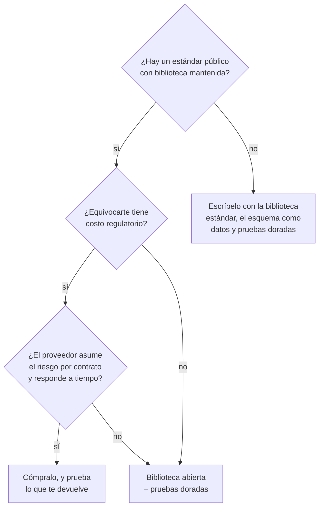

# ⚖️ lg07 — Veredicto: escribir el parser o comprarlo

> Python para desarrolladores Java senior · **Carta** · Track `lg` — Legado e intercambio
> sectorial · sección 7 de 7
> Se lee suelta: no hace falta ninguna otra sección de la carta, aunque esta cierra el track y
> enlaza a las seis anteriores.
> Versiones verificadas contra PyPI el 05/10/2026 · Código probado el 05/10/2026 con Python 3.14.7,
> en contenedor: las salidas son las de esa corrida.

---

## 🎯 1. Qué problema resuelve

Las seis secciones anteriores enseñan a leer formatos que no eligió nadie vivo: ancho fijo en
EBCDIC ([`lg01`](op001-lg01-ancho-fijo-y-mainframe.md)), XML con esquema
([`lg02`](op002-lg02-xml-en-serio.md)), documentos firmados
([`lg03`](op003-lg03-documentos-firmados.md)), EDI ([`lg04`](op004-lg04-edi.md)), mensajes clínicos
([`lg05`](op005-lg05-hl7-y-fhir.md)) y planos hostiles
([`lg06`](op006-lg06-archivos-planos-hostiles.md)). En todas aparece la misma pregunta, y esta
sección la contesta de frente: **¿escribo el parser, uso una biblioteca, o le compro el problema a
alguien?**

La respuesta honesta depende menos del formato que de **cómo cambia**. Un formato que cambia por
resolución una vez al año, con meses de aviso, es un problema distinto de uno que cambia cuando a la
contraparte se le ocurre, sin aviso, un martes. Y depende de quién paga cuando falla: un lote de
facturas rechazado se reintenta; una firma inválida en un consentimiento clínico se descubre cuatro
años después, en un tribunal.

---

## 🧠 2. El modelo

Tres opciones, y cada una gana en algún lugar:

| Opción | Gana cuando… | Pierde cuando… |
|---|---|---|
| **Escribir el parser** con la biblioteca estándar | El formato es privado, pequeño y estable (el ancho fijo de una aseguradora, el plano de un franquiciado) | El formato tiene un estándar con reglas que no vas a transcribir completas (firma XAdES, guías de X12) |
| **Biblioteca abierta** (`lxml`, `signxml`, `pyx12`, `fhir.resources`) | Hay un estándar público y una biblioteca mantenida que lo implementa | La biblioteca está quieta y el estándar no (mira la fecha en el inventario) |
| **Comprar** (proveedor tecnológico, traductor EDI, motor de integración) | El costo de equivocarse es regulatorio y el proveedor asume ese riesgo por contrato | El proveedor cobra cada cambio y tarda seis semanas, y el formato cambia más seguido que eso |

Y una regla que vale para las tres, **la regla del formato que cambia una vez al año**: si el
formato cambia con una frecuencia menor que la de tu memoria —una vez al año, o menos—, lo que
importa no es el parser sino **la red que detecta el cambio**. El parser se arregla en una tarde;
lo que cuesta es enterarse el día en que cambió y no tres meses después.



El nodo que aparece en tres de las cuatro hojas —**pruebas doradas**— es el que esta sección
construye.

---

## 💻 3. El ejemplo que corre

Una **prueba dorada** guarda un archivo real de la contraparte (anonimizado) junto con lo que tu
parser produjo de él la última vez que alguien lo revisó a mano. Si el parser cambia, o si el
archivo del mes trae algo que el parser interpreta distinto, la comparación falla y alguien mira.
Es la red barata para todos los formatos del track.

```bash
uv add --dev pytest
```

Estructura:

```text
tests/
  golden/
    glosas-2026-09.dat           el archivo de la aseguradora, anonimizado
    glosas-2026-09.expected.json lo que el parser produjo y alguien revisó
  test_golden.py
```

`test_golden.py`:

```python
"""Pruebas doradas: cada archivo real anonimizado tiene su salida revisada al lado."""

import dataclasses
import json
from decimal import Decimal
from pathlib import Path

import pytest

from glosas_mainframe import read_fixed  # el parser de la aseguradora (o cualquiera del track)

GOLDEN = Path(__file__).parent / "golden"


def as_jsonable(obj: object) -> object:
    # Decimal y fechas a texto: la comparación es exacta y el JSON se lee en una revisión de código.
    if isinstance(obj, Decimal):
        return str(obj)
    if hasattr(obj, "isoformat"):
        return obj.isoformat()
    raise TypeError(type(obj))


def parse_to_json(path: Path) -> str:
    rows = [dataclasses.asdict(item) for item in read_fixed(path)]
    return json.dumps(rows, default=as_jsonable, indent=2, ensure_ascii=False, sort_keys=True)


@pytest.mark.parametrize("source", sorted(GOLDEN.glob("*.dat")), ids=lambda p: p.name)
def test_golden(source: Path, request: pytest.FixtureRequest) -> None:
    expected_path = source.with_suffix(".expected.json")
    actual = parse_to_json(source)
    if request.config.getoption("--update-golden"):
        # Regenerar es una decisión humana: el diff del JSON se revisa en el commit.
        expected_path.write_text(actual, encoding="utf-8")
        pytest.skip("dorado regenerado; revisa el diff antes de commitear")
    assert actual == expected_path.read_text(encoding="utf-8")
```

`conftest.py`:

```python
def pytest_addoption(parser):
    parser.addoption("--update-golden", action="store_true",
                     help="reescribe los .expected.json con la salida actual")
```

```bash
pytest tests/test_golden.py                    # en CI y antes de cada cambio
pytest tests/test_golden.py --update-golden    # solo cuando un cambio es intencional
```

Salida (Python 3.14.7, 05/10/2026), con un archivo al que se le insertaron dos bytes dentro del
número de factura, que es lo que pasa el mes en que la aseguradora agranda un campo:

```text
FAILED tests/test_golden.py::test_golden[glosas-2026-10.dat] - ValueError: registro en el byte 0: time data '  202609' does not match format '%Y%m%d'
```

El error no habla del largo, y eso es lo interesante: el lector corta de a 83 bytes, así que los dos
bytes de más no cambian el tamaño de ningún registro sino **dónde cae cada campo**, y lo primero que
se nota es una fecha que empieza con dos espacios. La validación de cada campo es la que atrapa el
cambio; el largo del registro, solo, no lo habría atrapado nunca.

**Detalles con intención**

- **Un archivo nuevo de la contraparte se agrega cada mes**, anonimizado. Con un año de dorados, el
  parser tiene doce casos reales que ningún caso inventado reemplaza.
- **`--update-golden` es explícito y deja un diff.** El error clásico de las pruebas doradas es
  regenerarlas en automático y convertir la red en un sello de goma.
- **El JSON se ordena y se indenta** para que el diff de un cambio sea legible en una revisión.
- **Anonimizar es obligatorio**, no cortesía: los archivos de glosas, RIPS y HL7 tienen datos de
  pacientes, y un repositorio no es un lugar autorizado para ellos.

---

## ⚠️ 4. Lo que se rompe

**Comprar y no probar lo que vuelve.** El proveedor tecnológico asume el riesgo de la firma; no
asume el de que tu factura salga con el total equivocado. Lo comprado se prueba en su frontera con
el mismo rigor que lo propio: qué entra, qué sale, y un dorado por caso.

**La biblioteca abierta que se quedó atrás.** `hl7` lleva desde 2022 sin publicar y está bien,
porque HL7 v2 no cambia. Una biblioteca de factura electrónica quieta un año, con un anexo técnico
que cambió en ese año, está muerta aunque su código funcione. La fecha del inventario se lee contra
la velocidad del formato, no sola.

**El parser propio sin dueño.** El costo real de escribirlo no es la tarde que toma: es que alguien
tiene que acordarse de él cuando cambie. Si en la empresa nadie más que tú sabe que existe, el
costo de tu parser es tu reemplazo.

---

## ⚖️ 5. Cuándo NO usar este veredicto

**Cuando la decisión ya la tomó un contrato.** Si Áurea firmó con un proveedor que incluye la
transmisión a la DIAN, la pregunta no es técnica. Lo técnico es la prueba de lo que el proveedor
devuelve.

**Cuando el volumen cambia la cuenta.** Todo lo de arriba supone el volumen de una red de diez sedes.
Con millones de mensajes diarios, un motor de integración con monitoreo, reintentos y colas deja de
ser una compra cara y pasa a ser la única opción razonable.

---

## 🧪 6. Ejercicios (8)

**🟢 Fácil (1–2)**

1. Arma la carpeta `golden/` con dos archivos de glosas fabricados con el ejemplo de `lg01` y sus
   dorados. **Criterio:** `pytest` pasa, y cambiar un byte de un `.dat` lo hace fallar.
2. Clasifica cada formato del track en una de las tres opciones del modelo para el caso de Áurea.
   **Criterio:** una tabla de seis filas con la opción y la razón en una línea.

**🟡 Intermedio (3–4)**

3. Escribe el script que anonimiza un archivo de glosas antes de guardarlo como dorado: documentos y
   nombres reemplazados por valores fabricados de forma determinista. **Criterio:** el mismo archivo
   anonimizado dos veces da el mismo resultado, y ningún documento original sobrevive.
4. Busca la fecha de la última publicación de las bibliotecas que usarías en cada formato del track
   y el ritmo de cambio de ese formato. **Criterio:** una tabla con las dos fechas y un veredicto de
   "quieta y viva" o "quieta y muerta".

**🟠 Difícil (5–6)**

5. Agrega dorados al lector de HL7 de `lg05` y al tokenizador de `lg04`, con el mismo mecanismo.
   **Criterio:** un solo `pytest` corre los dorados de los tres formatos.
6. Haz que la falla de un dorado muestre el **primer campo distinto** en vez de dos JSON enteros.
   **Criterio:** el mensaje de error cabe en tres líneas y nombra registro y campo.

**🔴 Muy difícil (7–8)**

7. Escribe el informe de decisión para la factura electrónica de Áurea: proveedor actual, firma
   propia con `signxml`, o un proveedor distinto. **Criterio:** una página con una recomendación,
   su costo en horas al año y su condición de reversa. *Rúbrica:* (a) cuenta los cambios del anexo
   técnico de los últimos dos años; (b) estima el tiempo de respuesta de cada opción ante un cambio;
   (c) dice quién asume el riesgo de una factura rechazada en cada caso; (d) incluye la red de
   dorados en cualquiera de las tres.
8. Diseña la alarma de "el formato cambió": un proceso que corre al recibir cada archivo de una
   contraparte y avisa antes de procesarlo si algo no se parece a los anteriores. **Criterio:** un
   archivo con un campo corrido dispara la alarma y uno normal no. *Rúbrica:* (a) usa al menos dos
   señales —largo, distribución de caracteres, validación de campos—; (b) el aviso llega a una
   persona con el archivo y la razón; (c) no bloquea el lote salvo que la señal sea fuerte; (d)
   explicas la tasa de falsas alarmas que estás dispuesto a tolerar y por qué.

---

## 📚 7. Referencias

- `pytest`, parametrización y opciones de línea de comandos propias:
  https://docs.pytest.org/en/stable/how-to/parametrize.html
- Snapshot testing con `syrupy`, para quien prefiera una biblioteca a las veinte líneas de arriba:
  https://github.com/syrupy-project/syrupy

**Orden de lectura sugerido:** la página de parametrización de `pytest`, que es la mitad del
mecanismo; y `syrupy` solo si tienes más de cinco formatos con dorados y quieres su comando de
actualización.

---

## 🚀 8. Cierre

El track `lg` termina donde empezó: los formatos heredados no son difíciles, son **ajenos**. Se
escriben en una tarde cuando son privados, se leen con una biblioteca cuando son estándar, se
compran cuando el riesgo es regulatorio, y en los tres casos se protegen con la misma red: un
archivo real, la salida revisada, y una prueba que avisa cuando dejan de coincidir.

**La señal de que quedó bien:** *"La aseguradora cambió el formato un martes y el dorado falló el
martes, no en el cierre de mes."*

> 🏷️ **Cierra la sección con su tag**, cuando los ejercicios que elegiste estén hechos:
>
> ```bash
> git tag -a op-lg-fase-07 -m "op lg07 cerrada: veredicto del track y pruebas doradas"
> ```
>
> Los commits llevan su prefijo (`op lg07: …`) y los de ejercicio su número
> (`op lg07 ej07: …`).
