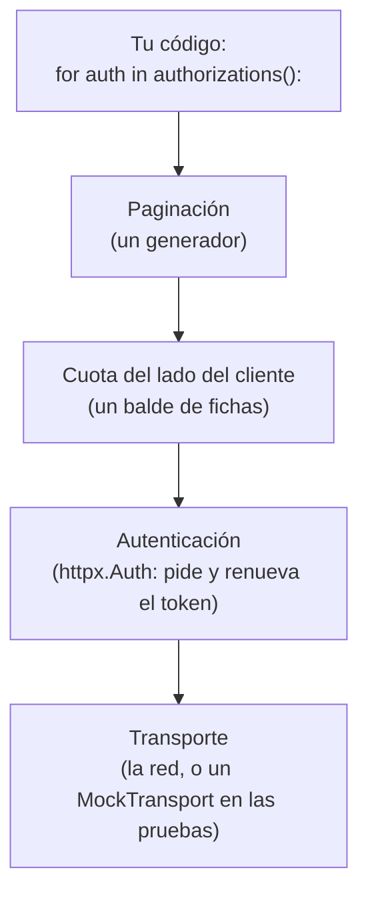

# 🤖 au01 — HTTP contra sistemas ajenos

> Python para desarrolladores Java senior · **Carta** · Track `au` — Automatización externa ·
> sección 1 de 7
> Se lee suelta: no hace falta ninguna otra sección de la carta. **Empieza donde termina la
> [Fase 13](13-integraciones.md)**: el cliente reutilizado, los cuatro timeouts, qué se reintenta y el
> *backoff* con *jitter* ya están ahí.
> Versiones verificadas contra PyPI el 05/10/2026 · Código probado el 05/10/2026 con Python 3.14.7,
> en contenedor: las salidas son las de esa corrida.

---

## 🎯 1. Qué problema resuelve

Una de las prepagadas con las que trabaja Áurea sí tiene API: una para consultar el estado de las
autorizaciones de tratamiento. Es una API **ajena**: no la diseñaste, no puedes cambiarla, su
documentación es un PDF de 2023 y tiene tres comportamientos que no aparecen en ningún tutorial de
`httpx`:

- **Pagina**, y no de una sola forma: la lista de autorizaciones usa un cursor en el cuerpo, y la de
  glosas un encabezado `Link` con la URL de la página siguiente.
- **Tiene cuota**: 60 peticiones por minuto por cliente. Al pasarla responde `429` con
  `Retry-After`, y si insistes, bloquea la credencial por una hora.
- **Autentica con OAuth 2.0 *client credentials***: pides un token con tu identificador y tu
  secreto, el token dura quince minutos y hay que renovarlo sin que la descarga de una hora se
  caiga en el minuto dieciséis.

Esta sección escribe las tres piezas que convierten esa API en un iterador de Python que el resto
del código usa sin saber nada de páginas, cuotas ni tokens.

---

## 🧠 2. El modelo

Las tres piezas viven en capas distintas del cliente, y separarlas es lo que hace que cada una se
pruebe sola:



**La paginación es un generador.** Es el caso de libro de las secuencias perezosas: quien consume
no sabe cuántas páginas hay ni cuándo se piden, y si deja de iterar a la mitad, no se piden las
que faltan.

**La cuota se respeta antes de que el servidor la haga cumplir.** Esperar el `429` y obedecer
`Retry-After` es lo mínimo; un **balde de fichas** (*token bucket*) del lado del cliente reparte las
peticiones para no llegar al `429` nunca, que con una API que bloquea la credencial es la diferencia
entre un proceso lento y un proceso caído una hora.

**La autenticación es un `httpx.Auth`.** `httpx` define un protocolo de autenticación como un
generador que puede **enviar peticiones propias** —pedir el token— antes de la petición del usuario,
y repetirla si el servidor responde `401`. Es el lugar exacto para el token que vence.

### 🪞 Tu instinto de Java dice… y esta vez se equivoca

En Spring, todo esto sería configuración: un `OAuth2AuthorizedClientManager` para el token, un
`RateLimiter` de Resilience4j y un `Pageable` del lado del servidor. El reflejo es buscar la misma
configuración en Python y, al no encontrarla, concluir que hay que escribir "un framework". Son
**tres piezas de veinte líneas** que se componen con el `Client` de `httpx`; escribirlas es más
corto que configurar sus equivalentes, y cada una se lee entera.

### 📖 Diccionario de traducción

| Spring / Java | Python con `httpx` | Dónde se rompe el paralelo |
|---|---|---|
| `OAuth2AuthorizedClientManager` | Una subclase de `httpx.Auth` | En `httpx` la renovación es un generador que tú escribes, no un bean configurado |
| `RateLimiter` de Resilience4j | Un balde de fichas propio, o `aiolimiter` en código asíncrono | No hay un estándar de facto en Python |
| `Page<T>` / `Pageable` | Un generador que hace `yield` de cada elemento | La página desaparece: el consumidor ve elementos, no páginas |
| `MockRestServiceServer` | `httpx.MockTransport` | Es parte de `httpx`, no una biblioteca aparte |

---

## 💻 3. El ejemplo que corre

```bash
uv add httpx
```

`httpx` (0.28.1, publicada el 2024-12-06) lleva casi dos años sin versión nueva y es el cliente que
usa el camino base.

> 📝 **Nota de ecosistema — `httpx2`.** En 2026 Pydantic tomó la continuación del proyecto bajo el
> nombre **`httpx2`** (2.13.1, del 2026-09-23), con la API de `httpx` y el `import httpx2`, porque
> `httpx` "ha tenido actividad limitada" según su propio anuncio. Algunas bibliotecas ya lo
> prefieren: `authlib` 1.8 avisa que su integración con `httpx` está deprecada. Todo lo de esta
> sección vale igual con `httpx2` cambiando el `import`; para un proyecto nuevo, mira el estado de
> los dos antes de elegir.

`prepagada.py` trae la API falsa adentro, con `MockTransport`, para que corra sin red:

```python
"""Cliente de la API de autorizaciones: paginación, cuota y token que vence."""

import base64
import time
from collections.abc import Iterator

import httpx

BASE_URL = "https://api.prepagada.example/v2"


class ClientCredentials(httpx.Auth):
    """Pide un token OAuth 2.0 (client credentials) y lo renueva antes de que venza."""

    requires_response_body = True

    def __init__(self, client_id: str, client_secret: str, token_url: str, margin: float = 60):
        self._credentials = (client_id, client_secret)
        self._token_url = token_url
        self._margin = margin  # se renueva un minuto antes de vencer, no un segundo después
        self._token: str | None = None
        self._expires_at = 0.0

    def _token_request(self) -> httpx.Request:
        # Las credenciales van en Basic (RFC 6749 §2.3.1). httpx.Request no acepta auth=: eso es
        # del cliente, así que el encabezado se arma aquí.
        basic = base64.b64encode(":".join(self._credentials).encode()).decode()
        return httpx.Request("POST", self._token_url, data={"grant_type": "client_credentials"},
                             headers={"Authorization": f"Basic {basic}"})

    def _store(self, response: httpx.Response) -> None:
        response.raise_for_status()
        payload = response.json()
        self._token = payload["access_token"]
        self._expires_at = time.monotonic() + payload["expires_in"] - self._margin

    def auth_flow(self, request: httpx.Request):
        if self._token is None or time.monotonic() >= self._expires_at:
            self._store((yield self._token_request()))
        request.headers["Authorization"] = f"Bearer {self._token}"
        response = yield request
        if response.status_code == 401:
            # El servidor revocó el token antes de tiempo: uno nuevo y un solo reintento.
            self._store((yield self._token_request()))
            request.headers["Authorization"] = f"Bearer {self._token}"
            yield request


class TokenBucket:
    """Cuota del lado del cliente: `rate` peticiones por segundo, con ráfagas de `burst`."""

    def __init__(self, rate: float, burst: int):
        self.rate, self.capacity = rate, burst
        self.tokens, self.updated = float(burst), time.monotonic()

    def acquire(self) -> None:
        while True:
            now = time.monotonic()
            self.tokens = min(self.capacity, self.tokens + (now - self.updated) * self.rate)
            self.updated = now
            if self.tokens >= 1:
                self.tokens -= 1
                return
            time.sleep((1 - self.tokens) / self.rate)


def get(client: httpx.Client, bucket: TokenBucket, url: str, **params) -> httpx.Response:
    for attempt in range(5):
        bucket.acquire()
        response = client.get(url, params=params or None)
        if response.status_code != 429:
            response.raise_for_status()
            return response
        # El servidor manda; Retry-After en segundos es lo habitual, y se respeta tal cual.
        time.sleep(float(response.headers.get("Retry-After", 2 ** attempt)))
    raise RuntimeError(f"la prepagada sigue respondiendo 429 después de 5 intentos: {url}")


def authorizations(client: httpx.Client, bucket: TokenBucket, since: str) -> Iterator[dict]:
    """Paginación por cursor en el cuerpo."""
    cursor = None
    while True:
        params = {"desde": since, **({"cursor": cursor} if cursor else {})}
        page = get(client, bucket, "/autorizaciones", **params).json()
        yield from page["items"]
        cursor = page.get("siguiente")
        if not cursor:
            return


def objections(client: httpx.Client, bucket: TokenBucket) -> Iterator[dict]:
    """Paginación por encabezado Link (RFC 8288): la URL siguiente la da el servidor."""
    url: str | None = "/glosas"
    while url:
        response = get(client, bucket, url)
        yield from response.json()
        url = response.links.get("next", {}).get("url")


def fake_api() -> httpx.MockTransport:
    """La prepagada, simulada: token, dos endpoints paginados y un 429 de cortesía."""
    state = {"calls": 0}

    def handler(request: httpx.Request) -> httpx.Response:
        path = request.url.path
        if path.endswith("/oauth/token"):
            return httpx.Response(200, json={"access_token": "tok-1", "expires_in": 900})
        assert request.headers["Authorization"] == "Bearer tok-1"
        state["calls"] += 1
        if state["calls"] == 2:
            return httpx.Response(429, headers={"Retry-After": "0"})
        if path.endswith("/autorizaciones"):
            if request.url.params.get("cursor") == "c2":
                return httpx.Response(200, json={"items": [{"id": "AUT-3"}], "siguiente": None})
            return httpx.Response(200, json={"items": [{"id": "AUT-1"}, {"id": "AUT-2"}],
                                             "siguiente": "c2"})
        if path.endswith("/glosas"):
            if request.url.params.get("page") == "2":
                return httpx.Response(200, json=[{"id": "GL-9"}])
            return httpx.Response(200, json=[{"id": "GL-7"}, {"id": "GL-8"}],
                                  headers={"Link": f'<{BASE_URL}/glosas?page=2>; rel="next"'})
        return httpx.Response(404)

    return httpx.MockTransport(handler)


if __name__ == "__main__":
    auth = ClientCredentials("aurea", "secreto-de-prueba", f"{BASE_URL}/oauth/token")
    bucket = TokenBucket(rate=1.0, burst=5)  # 60 por minuto, con ráfagas de 5
    with httpx.Client(base_url=BASE_URL, auth=auth, transport=fake_api(),
                      timeout=httpx.Timeout(10, connect=3)) as client:
        print([a["id"] for a in authorizations(client, bucket, since="2026-09-01")])
        print([g["id"] for g in objections(client, bucket)])
```

```bash
python3 prepagada.py
```

Salida (Python 3.14.7, 05/10/2026):

```text
['AUT-1', 'AUT-2', 'AUT-3']
['GL-7', 'GL-8', 'GL-9']
```

**Detalles con intención**

- **El `429` de la segunda llamada no se ve en la salida**, y esa es la idea: `get` lo absorbe
  respetando `Retry-After`, y la paginación ni se entera.
- **`response.links`** es el encabezado `Link` ya interpretado por `httpx`; no hace falta parsearlo.
- **El margen de renovación** evita la carrera en la que el token vence entre que lo miras y que la
  petición llega.
- **`MockTransport` reemplaza la red, no el cliente**: el `Client`, la autenticación, el balde y la
  paginación que corren en la prueba son los mismos que corren en producción.

---

## ⚠️ 4. Lo que se rompe

**Paginar por desplazamiento sobre datos que cambian.** Con `?offset=100&limit=50`, si entre la
página 2 y la 3 entra una autorización nueva, la 3 trae repetido el último elemento de la 2; si se
borra una, te saltas una. El cursor existe para eso. Si la API solo ofrece desplazamiento, ordena por
una clave estable y elimina duplicados por identificador.

**El token compartido entre hilos.** `ClientCredentials` guarda el token en el objeto. Con varios
hilos sobre el mismo cliente, dos pueden detectar el vencimiento a la vez y pedir dos tokens; con
algunos proveedores, el segundo revoca el primero. La solución es un `threading.Lock` alrededor de la
renovación, y es el ejercicio 7.

**`Retry-After` con fecha.** El estándar admite segundos **o** una fecha HTTP
(`Wed, 05 Oct 2026 14:30:00 GMT`). `float(...)` sobre la fecha lanza `ValueError`. Las APIs reales
usan casi siempre segundos; el lector robusto acepta los dos.

**El secreto en el log.** `httpx` no imprime encabezados por defecto, pero un `logging` de depuración
del transporte sí. El `Authorization` y el cuerpo de la petición del token no deben llegar nunca a
un log persistente.

---

## ⚖️ 5. Cuándo NO usarla

**Cuando la API tiene un SDK oficial mantenido.** Si la prepagada publica su propio cliente Python y
lo mantiene, sus problemas de paginación y token son de ella. Escribir el tuyo se justifica cuando el
SDK no existe, está abandonado o arrastra dependencias que no quieres.

**Cuando el volumen pide concurrencia.** Este cliente es síncrono y secuencial, que con 60 peticiones
por minuto es exactamente lo correcto. Con una cuota de miles por segundo, el cuello de botella pasa a
ser la latencia y el diseño cambia a `AsyncClient` con un limitador asíncrono.

**Cuando no hay API.** Si la información solo está en un portal web, lo que corresponde es otra
herramienta y otra sección del track: `au03`, con Playwright.

---

## 🧪 6. Ejercicios (10)

**🟢 Fácil (1–3)**

1. Haz que `fake_api` devuelva el token con `expires_in: 70` y verifica que con `margin=60` se pide
   un token nuevo después de diez segundos. **Criterio:** el `handler` cuenta dos peticiones al
   endpoint del token.
2. Agrega un tercer endpoint paginado por `?page=N` sin cursor ni `Link`, que termina cuando la
   página viene vacía. **Criterio:** el generador se detiene en la primera página vacía y no pide
   una más.
3. Deja de iterar `authorizations` después del primer elemento. **Criterio:** demuestras, contando
   llamadas en el `handler`, que la segunda página nunca se pidió.

**🟡 Intermedio (4–6)**

4. Acepta `Retry-After` como fecha HTTP. **Criterio:** una prueba con cada forma, y la espera
   calculada es correcta con un margen de un segundo.
5. Busca en la documentación de `httpx` qué hace `requires_response_body` y qué pasaría con un
   servidor que manda el token en un cuerpo grande sin esa bandera. **Criterio:** explicas el
   efecto en dos líneas.
6. Reemplaza el bucle de `get` por `stamina` o `tenacity`, manteniendo el respeto por `Retry-After`.
   **Criterio:** el mismo comportamiento con menos líneas, o explicas por qué no se pudo.

**🟠 Difícil (7–9)**

7. Haz que `ClientCredentials` sea segura con hilos y prueba con 20 hilos que comparten el cliente.
   **Criterio:** el `handler` cuenta exactamente una petición al token aunque los 20 arranquen a la
   vez con el token vencido.
8. Simula que la prepagada revoca el token a los cinco minutos (`401` con un token aún vigente).
   **Criterio:** la descarga sigue sin error y el `handler` registra el nuevo token.
9. Demuestra el problema del desplazamiento: una API falsa con `offset` donde se inserta un elemento
   entre páginas. **Criterio:** la versión ingenua devuelve un duplicado y la que deduplica por `id`
   no, y explicas qué se pierde si en vez de insertar se borra.

**🔴 Muy difícil (10)**

10. Convierte el cliente en una descarga nocturna de todas las autorizaciones del mes que se pueda
    interrumpir y reanudar. **Criterio:** matas el proceso en la mitad, lo vuelves a lanzar, y el
    resultado final es idéntico al de una corrida sin interrupción. *Rúbrica:* (a) el cursor se
    persiste después de procesar cada página, no antes; (b) un elemento repetido entre corridas no
    se procesa dos veces; (c) la cuota se respeta también al reanudar; (d) el token no se persiste
    en disco.

---

## 📚 7. Referencias

**Documentación oficial**

- `httpx`, autenticación personalizada: https://www.python-httpx.org/advanced/authentication/
- `httpx`, transportes y `MockTransport`: https://www.python-httpx.org/advanced/transports/
- OAuth 2.0, *client credentials* (RFC 6749 §4.4): https://www.rfc-editor.org/rfc/rfc6749#section-4.4
- El encabezado `Link` (RFC 8288): https://www.rfc-editor.org/rfc/rfc8288
- `Retry-After` en HTTP Semantics (RFC 9110): https://www.rfc-editor.org/rfc/rfc9110#field.retry-after

**Orden de lectura sugerido:** la página de autenticación de `httpx`, que explica el generador de
`auth_flow` mejor que cualquier resumen; después la de transportes; las RFC solo cuando una API
ajena se comporte distinto y necesites saber quién tiene razón.

---

## 🚀 8. Cierre

Una API ajena se domestica con tres piezas pequeñas en tres capas: un generador que esconde las
páginas, un balde que esconde la cuota y un `httpx.Auth` que esconde el token. El resto del código
ve una lista de autorizaciones, y las pruebas corren sin red.

**La señal de que quedó bien:** *"La descarga de una hora no se cayó en el minuto dieciséis, y nunca
vimos un 429 en producción."*

> 🏷️ **Cierra la sección con su tag**, cuando los ejercicios que elegiste estén hechos:
>
> ```bash
> git tag -a op-au-fase-01 -m "op au01 cerrada: paginación, cuota y token que vence"
> ```
>
> Los commits llevan su prefijo (`op au01: …`) y los de ejercicio su número
> (`op au01 ej07: …`).
