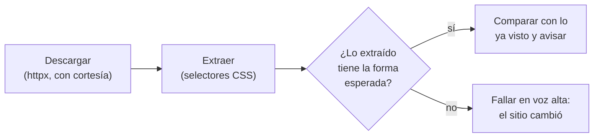

# 🤖 au02 — Scraping y su fragilidad

> Python para desarrolladores Java senior · **Carta** · Track `au` — Automatización externa ·
> sección 2 de 7
> Se lee suelta: no hace falta ninguna otra sección de la carta.
> Versiones verificadas contra PyPI el 05/10/2026 · Código probado el 05/10/2026 con Python 3.14.7,
> en contenedor: las salidas son las de esa corrida.

---

## 🎯 1. Qué problema resuelve

Las prepagadas mandan circulares sin avisar: un cambio de tarifa, un código que deja de cubrirse,
un nuevo soporte exigido para radicar. Algunas las mandan por correo, y otras **solo las publican**
en una página de su sitio, una lista con fecha, título y un PDF. Si nadie entra a mirarla, Áurea se
entera de la circular cuando le glosan la primera factura que la incumple.

Leer esa página todos los días es exactamente el trabajo para un *scraper*: descargar el HTML,
extraer la lista y avisar cuando aparece algo nuevo. Es también el ejemplo perfecto de por qué el
scraping tiene mala fama: la prepagada rediseña su sitio cada dos años, y el día que lo hace, el
scraper deja de encontrar circulares **sin fallar**. Devuelve una lista vacía, y una lista vacía se
parece mucho a "no hubo circulares nuevas".

Esta sección enseña a extraer con las dos bibliotecas que valen la pena —una rápida y una
tolerante—, y sobre todo a construir el scraper para que **se rompa en voz alta**.

---

## 🧠 2. El modelo

Un scraper tiene tres partes, y la fragilidad vive en la del medio:



**Los selectores son un contrato que la otra parte no firmó.** `div.content > ul > li:nth-child(2)`
describe la página de hoy. El selector que sobrevive a un rediseño se ancla en lo que tiene
**significado** —un `id`, un atributo `data-*`, el texto de un encabezado, la estructura de una
tabla con sus títulos— y no en la posición.

**Extraer vacío es un error, no un resultado.** La validación de forma —"una circular tiene fecha,
título y un enlace a PDF; la página tiene al menos una"— convierte el rediseño silencioso en una
excepción el mismo día.

**Hay dos clases de parser**, y se elige por el HTML que tienes:

| Biblioteca | Qué es | Cuándo |
|---|---|---|
| **`selectolax`** (1.0.0, del 2026-10-03) | Enlace a Lexbor, un parser HTML5 en C. Solo CSS, muy rápido | HTML razonable y mucho volumen |
| **BeautifulSoup** (4.15.0, del 2026-06-07) | Una API de navegación sobre un parser a elegir (`html.parser`, `lxml`, `html5lib`) | HTML roto, navegación por texto o estructura compleja |
| `lxml.html` | XPath sobre HTML | Cuando ya usas `lxml` y piensas en XPath |
| **Scrapy** (2.19.0, del 2026-09-10) | Un framework de rastreo: colas, concurrencia, reintentos, *pipelines* | Rastrear miles de páginas, no leer una |

### 🪞 Tu instinto de Java dice… y esta vez se equivoca

En Java el reflejo es Jsoup, y la API de `selectolax` se le parece mucho: `css()` es `select()`,
`css_first()` es `selectFirst()`. Lo que cambia es la costumbre: en Python el scraper suele empezar
como un script de veinte líneas sin pruebas, porque es tan fácil, y por eso se muere en silencio. La
parte que Jsoup no te da y que hace falta escribir es la **validación de forma** y la **prueba con el
HTML guardado**.

---

## 💻 3. El ejemplo que corre

```bash
uv add httpx selectolax beautifulsoup4
```

El ejemplo trae la página guardada como texto —es como se prueba un scraper— y la lee con las dos
bibliotecas para comparar.

`circulares.py`:

```python
"""Extrae las circulares de la página pública de una prepagada, y falla si la página cambió."""

import datetime as dt
from dataclasses import dataclass
from urllib.parse import urljoin

from bs4 import BeautifulSoup
from selectolax.lexbor import LexborHTMLParser

PAGE_URL = "https://www.prepagada.example/prestadores/circulares"

SAVED_PAGE = """
<html><body>
  <nav>Inicio · Prestadores · Circulares</nav>
  <section id="circulares">
    <h2>Circulares a prestadores</h2>
    <table>
      <thead><tr><th>Fecha</th><th>Asunto</th><th>Documento</th></tr></thead>
      <tbody>
        <tr><td>2026-09-30</td><td>Nuevo soporte para ortodoncia: foto intraoral fechada</td>
            <td><a href="/docs/circular-118.pdf">PDF</a></td></tr>
        <tr><td>2026-09-12</td><td>Actualización de tarifas de periodoncia</td>
            <td><a href="/docs/circular-117.pdf">PDF</a></td></tr>
      </tbody>
    </table>
  </section>
</body></html>
"""

EXPECTED_HEADERS = ["Fecha", "Asunto", "Documento"]


class PageChanged(Exception):
    """La página ya no tiene la forma que el scraper conoce."""


@dataclass(frozen=True)
class Circular:
    published_on: dt.date
    subject: str
    pdf_url: str


def check_and_build(headers: list[str], rows: list[tuple[str, str, str | None]]) -> list[Circular]:
    """La misma validación para los dos parsers: forma de la tabla, al menos una fila, tipos."""
    if headers != EXPECTED_HEADERS:
        raise PageChanged(f"encabezados {headers}, se esperaban {EXPECTED_HEADERS}")
    if not rows:
        raise PageChanged("la tabla de circulares está vacía: es más probable un rediseño que un mes sin circulares")
    circulars = []
    for date_text, subject, href in rows:
        if not href or not href.lower().endswith(".pdf"):
            raise PageChanged(f"la circular {subject!r} no enlaza un PDF")
        circulars.append(Circular(dt.date.fromisoformat(date_text), subject, urljoin(PAGE_URL, href)))
    return circulars


def with_selectolax(html: str) -> list[Circular]:
    tree = LexborHTMLParser(html)
    # Anclado en el id de la sección y en la tabla, no en la posición dentro de la página.
    section = tree.css_first("section#circulares")
    if section is None:
        raise PageChanged("no existe section#circulares")
    headers = [th.text(strip=True) for th in section.css("thead th")]
    rows = []
    for tr in section.css("tbody tr"):
        cells = tr.css("td")
        link = tr.css_first("a")
        rows.append((cells[0].text(strip=True), cells[1].text(strip=True),
                     link.attributes.get("href") if link else None))
    return check_and_build(headers, rows)


def with_beautifulsoup(html: str) -> list[Circular]:
    soup = BeautifulSoup(html, "html.parser")
    # Otra forma de anclarse: por el texto del título, que sobrevive a un cambio de id.
    title = soup.find("h2", string=lambda s: s and "Circulares" in s)
    if title is None:
        raise PageChanged("no aparece el título 'Circulares'")
    table = title.find_next("table")
    headers = [th.get_text(strip=True) for th in table.select("thead th")]
    rows = []
    for tr in table.select("tbody tr"):
        cells = tr.find_all("td")
        link = tr.find("a")
        rows.append((cells[0].get_text(strip=True), cells[1].get_text(strip=True),
                     link.get("href") if link else None))
    return check_and_build(headers, rows)


if __name__ == "__main__":
    fast = with_selectolax(SAVED_PAGE)
    tolerant = with_beautifulsoup(SAVED_PAGE)
    assert fast == tolerant, "los dos parsers no coinciden"
    for circular in fast:
        print(circular.published_on, circular.subject[:40], circular.pdf_url)

    redesigned = SAVED_PAGE.replace('id="circulares"', 'id="documentos"').replace("<th>Asunto</th>", "<th>Tema</th>")
    for parser in (with_selectolax, with_beautifulsoup):
        try:
            parser(redesigned)
        except PageChanged as error:
            print(f"{parser.__name__}: {error}")
```

```bash
python3 circulares.py
```

Salida (Python 3.14.7, 05/10/2026):

```text
2026-09-30 Nuevo soporte para ortodoncia: foto intr https://www.prepagada.example/docs/circular-118.pdf
2026-09-12 Actualización de tarifas de periodoncia https://www.prepagada.example/docs/circular-117.pdf
with_selectolax: no existe section#circulares
with_beautifulsoup: encabezados ['Fecha', 'Tema', 'Documento'], se esperaban ['Fecha', 'Asunto', 'Documento']
```

El rediseño simulado rompe **dos** anclas a la vez —el `id` y un encabezado—, y cada versión falla
por la suya. Ninguna devuelve una lista vacía.

### La descarga, con cortesía

```python
import httpx

HEADERS = {"User-Agent": "Aurea-circulares/1.0 (+contacto: sistemas@aurea.example)"}

def fetch(url: str) -> str:
    with httpx.Client(headers=HEADERS, timeout=15, follow_redirects=True) as client:
        response = client.get(url)
        response.raise_for_status()
        return response.text
```

Una petición al día, con un `User-Agent` que dice quién eres y cómo contactarte. Es una página
pública pensada para prestadores; leerla una vez al día es exactamente el uso previsto.

**Detalles con intención**

- **Dos parsers en el ejemplo, uno en producción.** Se comparan aquí para ver las dos APIs; en el
  scraper real se elige uno.
- **`urljoin`** convierte el `href` relativo en absoluto: el PDF se descarga desde otro proceso, que
  no sabe de qué página salió.
- **La validación es la misma función** para los dos parsers. La forma esperada es un dato del
  dominio, no del parser.

---

## ⚠️ 4. Lo que se rompe

**La página que se arma con JavaScript.** Si el HTML que devuelve `httpx` no trae la tabla —porque
el sitio la carga después con una llamada a su propia API—, ningún parser la va a encontrar. Lo
primero es abrir las herramientas del navegador y buscar esa llamada: muchas veces devuelve JSON y
se usa directamente, sin scraping. Si no, hace falta un navegador de verdad, que es `au03`.

**El bloqueo.** Un sitio que recibe cien peticiones por segundo de una sola IP las bloquea, con
razón. Scraping responsable es pocas peticiones, espaciadas, con identificación, respetando
`robots.txt` y los términos de uso. Lo que un portal de prestadores prohíbe en sus términos no se
automatiza, por más que se pueda.

**La codificación que miente.** `response.text` decodifica con el *charset* del encabezado HTTP, que
a veces contradice el `<meta charset>` del HTML. Si aparecen `Ã` en los títulos, se decodifica a
mano: `response.content.decode("utf-8")`.

**Guardar la página entera de la prueba en el repositorio.** El HTML guardado es la prueba, y está
bien versionarlo; pero si la página tiene datos de personas (un directorio de prestadores con
teléfonos, por ejemplo), se recorta a lo que el scraper necesita.

---

## ⚖️ 5. Cuándo NO usarla

**Cuando hay una API o un feed.** RSS, una API pública, un JSON que la propia página consume: todos
ganan al scraping por estabilidad, y vale la pena buscarlos diez minutos antes de escribir un
selector.

**Cuando lo que hace falta es un rastreador.** Para recorrer un sitio entero —miles de páginas,
enlaces que llevan a más páginas, deduplicación, reintentos— Scrapy resuelve lo que un script con
`httpx` tendría que reinventar. Para una página, Scrapy es un framework entero para leer una tabla.

**Cuando el contenido está detrás de un inicio de sesión con formularios dinámicos.** Eso es `au03`.

---

## 🧪 6. Ejercicios (10)

**🟢 Fácil (1–3)**

1. Agrega una tercera circular cuyo enlace sea un `.docx`. **Criterio:** el scraper falla con
   `PageChanged` nombrando la circular.
2. Persiste las circulares ya vistas en un archivo JSON y avisa solo de las nuevas. **Criterio:**
   la segunda corrida sobre la misma página no avisa nada.
3. Mide con `time.perf_counter` cuánto tarda cada parser sobre la página repetida mil veces en una
   sola tabla. **Criterio:** reportas las dos cifras con tu máquina y no sacas conclusiones de una
   sola corrida.

**🟡 Intermedio (4–6)**

4. Busca en la documentación de BeautifulSoup la diferencia entre los parsers `html.parser`, `lxml`
   y `html5lib` frente a HTML mal formado, y pruébala con una fila sin `</tr>`. **Criterio:** una
   tabla con lo que extrae cada uno.
5. Lee `robots.txt` con `urllib.robotparser` antes de descargar y respétalo. **Criterio:** si
   `robots.txt` prohíbe la ruta, el scraper no descarga y lo dice.
6. Escribe la prueba con `pytest` que corre el scraper contra el HTML guardado en un archivo de
   `tests/`. **Criterio:** la prueba no hace ninguna petición de red.

**🟠 Difícil (7–9)**

7. Convierte el aviso en un correo o un mensaje con el título, la fecha y el enlace al PDF.
   **Criterio:** una circular nueva produce exactamente un aviso, aunque el scraper corra tres veces
   ese día.
8. Descarga el PDF de cada circular nueva y guarda su *hash*; si la prepagada reemplaza el PDF con el
   mismo nombre, avisa. **Criterio:** cambiar el contenido del PDF de prueba produce un aviso de
   "circular modificada".
9. Busca una página pública real que cargue su tabla con JavaScript y encuentra la llamada a su API en
   las herramientas del navegador. **Criterio:** reemplazas el scraping por esa llamada y explicas qué
   ganaste y qué riesgo nuevo asumiste.

**🔴 Muy difícil (10)**

10. Diseña la detección de "la página cambió" con más señales que la forma de la tabla, para el día
    en que el rediseño mantiene la tabla pero cambia su significado (por ejemplo, la columna de
    fecha pasa a ser la de vigencia). **Criterio:** tres rediseños fabricados y el detector atrapa
    los tres. *Rúbrica:* (a) valida tipos y rangos, no solo nombres; (b) compara contra lo visto en
    las últimas corridas; (c) distingue "cambió el sitio" de "no hubo circulares" con evidencia;
    (d) el aviso de cambio llega a una persona con el HTML adjunto.

---

## 📚 7. Referencias

**Documentación oficial**

- `selectolax`: https://selectolax.readthedocs.io/
- BeautifulSoup: https://www.crummy.com/software/BeautifulSoup/bs4/doc/
- Scrapy: https://docs.scrapy.org/en/latest/
- `urllib.robotparser`: https://docs.python.org/3/library/urllib.robotparser.html

**Orden de lectura sugerido:** la sección de búsqueda de la documentación de BeautifulSoup, que es la
mejor explicación de cómo navegar un árbol HTML; después la de `selectolax`, que es corta; y Scrapy
solo cuando el problema sea rastrear y no leer.

---

## 🚀 8. Cierre

Un scraper es un contrato con alguien que no lo firmó. Se escribe anclado en lo que tiene
significado, se prueba con la página guardada, y sobre todo se escribe para que el día del rediseño
**falle** en vez de devolver una lista vacía.

**La señal de que quedó bien:** *"La prepagada rediseñó su sitio y nos enteramos ese día, por el
scraper, no por una glosa."*

> 🏷️ **Cierra la sección con su tag**, cuando los ejercicios que elegiste estén hechos:
>
> ```bash
> git tag -a op-au-fase-02 -m "op au02 cerrada: scraper con validación de forma y prueba guardada"
> ```
>
> Los commits llevan su prefijo (`op au02: …`) y los de ejercicio su número
> (`op au02 ej07: …`).
