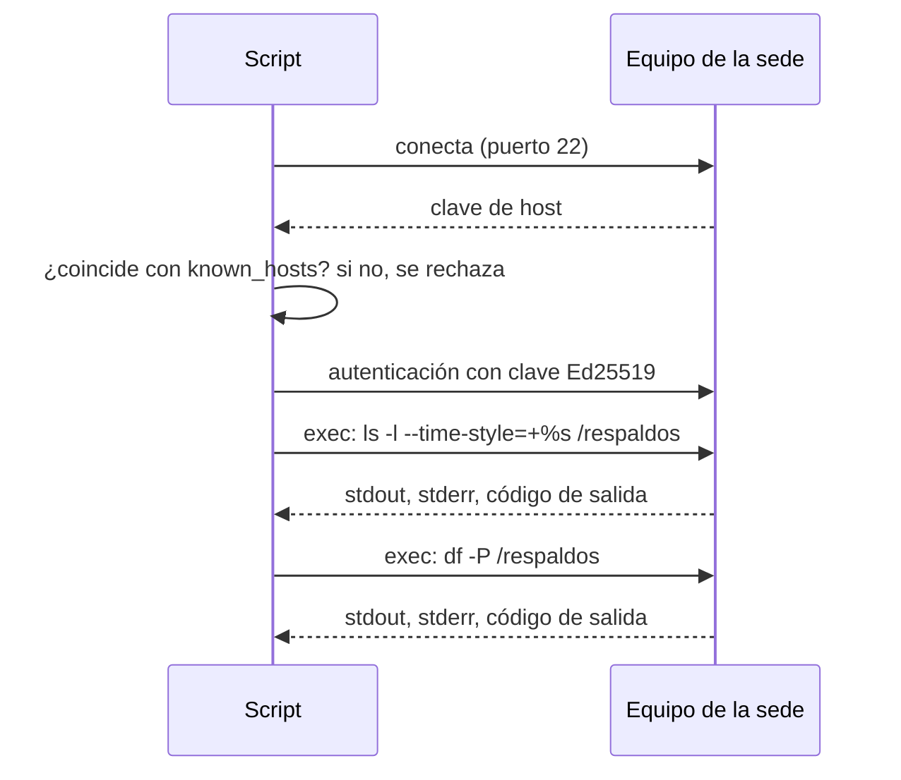

# 🤖 au04 — SSH y sistemas remotos

> Python para desarrolladores Java senior · **Carta** · Track `au` — Automatización externa ·
> sección 4 de 7
> Se lee suelta: no hace falta ninguna otra sección de la carta.
> Versiones verificadas contra PyPI el 05/10/2026 · Código probado el 05/10/2026 con Python 3.14.7,
> en contenedor: el revisor y el fragmento de Fabric, contra dos sedes construidas con este mismo
> `Dockerfile` en una red privada de Docker (sin los puertos del `compose.yaml`).

---

## 🎯 1. Qué problema resuelve

En seis sedes de Áurea, Odontovía corre en un equipo que vive debajo del mesón de recepción, con
una UPS que ya no aguanta. Cada uno tiene una tarea programada que hace el respaldo de MySQL a las
once de la noche. **Nadie sabe si corrió.** El proveedor dice que sí; la última vez que alguien
lo comprobó fue cuando hizo falta restaurar, y el archivo de respaldo de esa sede tenía cuatro
meses.

Revisarlo a mano es entrar por SSH a seis equipos, mirar la fecha y el tamaño del último archivo, y
el espacio libre del disco. Es el trabajo perfecto para un script: **conectarse a una lista de
máquinas, correr unos comandos y juntar las respuestas en un informe**. En Python eso se hace con
**Paramiko** (5.0.0, del 2026-05-09), una implementación de SSH en Python puro, o con **Fabric**
(3.2.3), que la envuelve en una API más cómoda.

La sección enseña las dos y termina con la pregunta que importa: **dónde termina un script de SSH y
empieza una herramienta de gestión de configuración como Ansible**.

---

## 🧠 2. El modelo

Una sesión SSH tiene tres pasos, y cada uno es una decisión de seguridad:

1. **Verificar el servidor.** El servidor presenta su clave de *host*. Si no la comparas contra una
   que conoces, cualquiera en la red puede hacerse pasar por él (*man-in-the-middle*).
2. **Autenticarte.** Con una clave privada, idealmente Ed25519 y exclusiva para este script, no con
   contraseña.
3. **Abrir canales.** Uno por comando (`exec`), uno para SFTP, o un túnel. Cada comando devuelve
   salida estándar, error estándar y **código de salida**, y el código es lo único fiable para saber
   si funcionó.



### 🪞 Tu instinto de Java dice… y esta vez se equivoca

En Java el reflejo es JSch, y con JSch casi todos los ejemplos de internet empiezan con
`config.put("StrictHostKeyChecking", "no")`. El equivalente en Paramiko es `AutoAddPolicy()`, y
aparece en la mayoría de los tutoriales por la misma razón: para que el ejemplo funcione a la
primera. **Paramiko rechaza por defecto los servidores desconocidos**, y ese es el comportamiento
correcto. La clave del *host* se agrega una vez, a mano y verificada, y el script la exige siempre.

---

## 💻 3. El ejemplo que corre

```bash
uv add paramiko fabric
```

### El laboratorio

Dos contenedores imitan dos sedes. `sede/Dockerfile`:

```dockerfile
FROM debian:trixie-slim
RUN apt-get update && apt-get install -y --no-install-recommends openssh-server \
    && rm -rf /var/lib/apt/lists/* && mkdir -p /run/sshd /respaldos \
    && useradd -m -s /bin/bash revisor
COPY revisor.pub /home/revisor/.ssh/authorized_keys
RUN chown -R revisor /home/revisor/.ssh && chmod 600 /home/revisor/.ssh/authorized_keys
CMD ["/usr/sbin/sshd", "-D", "-e"]
```

`compose.yaml`:

```yaml
services:
  sede-centro:
    build: ./sede
    ports: ["2201:22"]
  sede-suba:
    build: ./sede
    ports: ["2202:22"]
```

```bash
ssh-keygen -t ed25519 -N "" -f revisor -C "revisor de respaldos" && cp revisor.pub sede/
docker compose up -d --build
# Un respaldo reciente en Centro y uno de hace cuatro meses en Suba.
docker compose exec sede-centro sh -c 'head -c 2000000 /dev/urandom > /respaldos/odontovia.sql.gz'
docker compose exec sede-suba sh -c 'head -c 900000 /dev/urandom > /respaldos/odontovia.sql.gz && touch -d "120 days ago" /respaldos/odontovia.sql.gz'
# Las claves de host se registran una vez, aquí, y se revisan.
ssh-keyscan -p 2201 -t ed25519 127.0.0.1 > known_hosts
ssh-keyscan -p 2202 -t ed25519 127.0.0.1 >> known_hosts
```

### El revisor, con Paramiko

`revisar_respaldos.py`:

```python
"""Revisa por SSH el último respaldo de Odontovía en cada sede y el espacio libre del disco."""

import shlex
import time
from dataclasses import dataclass

import paramiko

SITES = {"Centro": ("127.0.0.1", 2201), "Suba": ("127.0.0.1", 2202)}
BACKUP = "/respaldos/odontovia.sql.gz"
MAX_AGE_HOURS = 26  # el respaldo es diario; dos horas de gracia


@dataclass
class Report:
    site: str
    ok: bool
    detail: str


def run(client: paramiko.SSHClient, command: str, timeout: float = 20) -> str:
    _, stdout, stderr = client.exec_command(command, timeout=timeout)
    status = stdout.channel.recv_exit_status()  # espera a que termine: es el código lo que cuenta
    if status != 0:
        raise RuntimeError(f"{command!r} terminó con {status}: {stderr.read().decode().strip()}")
    return stdout.read().decode()


def check_site(site: str, host: str, port: int) -> Report:
    client = paramiko.SSHClient()
    client.load_host_keys("known_hosts")
    client.set_missing_host_key_policy(paramiko.RejectPolicy())  # explícito: es el de por defecto
    try:
        client.connect(host, port=port, username="revisor", key_filename="revisor",
                       timeout=10, allow_agent=False, look_for_keys=False)
        size, mtime = run(client, f"stat -c '%s %Y' {shlex.quote(BACKUP)}").split()
        age_hours = (time.time() - int(mtime)) / 3600
        free_kb = int(run(client, "df -Pk /respaldos").splitlines()[1].split()[3])
    except (OSError, paramiko.SSHException, RuntimeError) as error:
        return Report(site, False, f"no se pudo revisar: {error}")
    finally:
        client.close()
    problems = []
    if age_hours > MAX_AGE_HOURS:
        problems.append(f"respaldo de hace {age_hours / 24:.0f} días")
    if int(size) < 1_000_000:
        problems.append(f"respaldo de {int(size) / 1e6:.1f} MB, sospechosamente pequeño")
    if free_kb < 5_000_000:
        problems.append(f"quedan {free_kb / 1e6:.1f} GB libres")
    return Report(site, not problems, "; ".join(problems) or f"{int(size) / 1e6:.1f} MB, de hace {age_hours:.0f} h")


if __name__ == "__main__":
    for report in (check_site(name, *address) for name, address in SITES.items()):
        print(f"{'✅' if report.ok else '❌'} {report.site}: {report.detail}")
```

```bash
python3 revisar_respaldos.py
```

Salida (Python 3.14.7, 05/10/2026):

```text
✅ Centro: 2.0 MB, de hace 0 h
❌ Suba: respaldo de hace 120 días; respaldo de 0.9 MB, sospechosamente pequeño
```

### Lo mismo con Fabric

Fabric envuelve Paramiko con una API pensada para esto, y ejecuta en grupo:

```python
from fabric import Connection

conn = Connection("127.0.0.1", port=2201, user="revisor",
                  connect_kwargs={"key_filename": "revisor", "look_for_keys": False})
result = conn.run("stat -c '%s %Y' /respaldos/odontovia.sql.gz", hide=True, warn=True)
print(result.ok, result.stdout.strip())
```

`warn=True` hace que un código de salida distinto de cero no lance una excepción sino que deje
`result.ok` en falso, que es lo que se quiere al revisar varias sedes.

**Detalles con intención**

- **`RejectPolicy` explícito**, aunque sea el de por defecto: el día que alguien copie el código y
  quiera cambiarlo por `AutoAddPolicy`, lo va a tener que escribir, y va a leer el comentario.
- **`recv_exit_status()` antes de leer la salida**, y el código de salida como única verdad. Un
  comando que falla puede escribir algo en `stdout` igual.
- **`shlex.quote` en todo lo que entre a un comando.** Hoy la ruta es una constante; el día que sea
  un parámetro, la inyección de comandos ya está cerrada.
- **`mkdir -p /run/sshd`** en el `Dockerfile`: en Debian trixie el paquete ya crea ese directorio, y
  sin `-p` la imagen no se construye. Lo encontró la prueba de esta sección.
- **Un fallo de conexión es un resultado, no una excepción.** Una sede apagada aparece en el informe
  y las demás se revisan igual.

---

## ⚠️ 4. Lo que se rompe

**La clave de host que cambia.** Si reinstalan el equipo de una sede, su clave de *host* cambia y el
script se niega a conectar. Es el comportamiento correcto: alguien verifica que la reinstalación fue
real y actualiza `known_hosts` a mano. Desactivar la verificación "porque molesta" es la forma más
común de abrir la puerta a un ataque en la red de la sede.

**El comando que espera algo.** `exec_command` no tiene terminal: un comando que pide confirmación o
contraseña se queda colgado hasta el `timeout`. Todo lo que se ejecuta así tiene que ser no
interactivo (`-y`, `--batch`, `sudo -n`).

**La salida en otro idioma.** `df` y `ls` cambian su formato con la configuración regional del
servidor. `df -P` (POSIX) y `stat -c` tienen formato fijo; parsear la salida "humana" de `ls -l` es
la causa de los scripts que funcionan en una sede y en otra no.

**La clave privada sin restricciones.** La clave del revisor solo necesita leer. En
`authorized_keys` se le puede restringir el comando (`command="…"`) y quitarle el reenvío de puertos
(`restrict`), y para un script que corre desatendido es lo correcto.

---

## ⚖️ 5. Cuándo NO usarla

**Cuando lo que quieres es un estado, no un comando.** "Que en las seis sedes exista el usuario
`revisor`, con esta clave, y el respaldo programado a las once" es **configuración**, y se describe
mejor de forma declarativa e idempotente con Ansible, que además está escrito en Python. La frontera
honesta: SSH desde Python para **preguntar** e **informar**; Ansible para **dejar** las máquinas en
un estado.

**Cuando el equipo de la sede no debería tener SSH abierto.** Exponer el 22 de un equipo que vive
debajo de un mesón, con una red de consultorio, es un riesgo en sí mismo. Un agente que **envía** su
estado a un servidor central (por HTTPS, desde dentro) invierte la conexión y cierra el puerto.

**Para mover archivos grandes.** SFTP por Paramiko sirve y está en el track de comunicaciones; para
sincronizar directorios, `rsync` sobre SSH es mejor que cualquier bucle de Python.

---

## 🧪 6. Ejercicios (10)

**🟢 Fácil (1–3)**

1. Borra `known_hosts` y corre el revisor. **Criterio:** las dos sedes fallan con un mensaje que
   menciona la clave de host, y ninguna se conecta.
2. Detén la sede Suba (`docker compose stop sede-suba`). **Criterio:** el informe la marca con
   "no se pudo revisar" y Centro se revisa igual.
3. Reescribe el revisor completo con Fabric. **Criterio:** la misma salida, y cuentas cuántas
   líneas te ahorraste.

**🟡 Intermedio (4–6)**

4. Restringe la clave en `authorized_keys` con `restrict,command="…"` a un solo script de solo
   lectura en el servidor. **Criterio:** el revisor funciona y un `exec_command("id")` devuelve la
   salida del script, no la de `id`.
5. Busca en la documentación de Paramiko qué hace `set_missing_host_key_policy` con cada política.
   **Criterio:** una tabla de tres filas con el riesgo de cada una.
6. Revisa las sedes en paralelo con `concurrent.futures.ThreadPoolExecutor`. **Criterio:** con seis
   sedes simuladas (agrega cuatro al `compose.yaml`) el tiempo total es cercano al de la sede más
   lenta, no a la suma.

**🟠 Difícil (7–9)**

7. Agrega una verificación de integridad: que el respaldo sea un gzip válido (`gzip -t`) sin
   descargarlo. **Criterio:** el respaldo de bytes aleatorios de Centro ahora falla, y explicas por
   qué el tamaño no bastaba.
8. Convierte el informe en un aviso diario que solo se manda si algo está mal. **Criterio:** con
   todo en verde no llega nada; con una sede mal llega un solo mensaje con el detalle.
9. Mide cuánto tarda revisar una sede con una conexión nueva por comando contra una conexión
   reutilizada para los dos comandos. **Criterio:** reportas los dos tiempos con tu máquina y
   explicas dónde se va la diferencia.

**🔴 Muy difícil (10)**

10. Escribe el mismo control como un *playbook* de Ansible (`stat` y `assert` sobre las dos sedes) y
    compáralo con el script. **Criterio:** los dos detectan la sede vencida. *Rúbrica:* (a) el
    *playbook* falla en la sede mala y no en la buena; (b) comparas líneas, dependencias y lo que
    cuesta entender cada uno a alguien nuevo; (c) dices cuál dejarías en Áurea y por qué; (d) dices
    qué parte del problema no resuelve ninguno de los dos.

---

## 📚 7. Referencias

**Documentación oficial**

- Paramiko, el cliente: https://docs.paramiko.org/en/stable/api/client.html
- Fabric: https://docs.fabfile.org/en/latest/
- OpenSSH, `authorized_keys` y sus opciones:
  https://man.openbsd.org/sshd.8#AUTHORIZED_KEYS_FILE_FORMAT
- Ansible, para la frontera: https://github.com/ansible/ansible (su sitio de documentación,
  `docs.ansible.com`, responde 429 a los clientes automáticos y no se pudo verificar)

**Orden de lectura sugerido:** la página de `SSHClient` de Paramiko; después las opciones de
`authorized_keys`, que casi nadie lee y resuelven la mitad de la seguridad de un script desatendido;
y Ansible cuando el script empiece a querer **cambiar** cosas en las sedes.

---

## 🚀 8. Cierre

SSH desde Python es tres decisiones —verificar el servidor, autenticarte con una clave propia,
confiar solo en el código de salida— y un informe que no se cae porque una sede esté apagada. Lo
que pase de preguntar a configurar, ya es de otra herramienta.

**La señal de que quedó bien:** *"El respaldo de Suba tenía cuatro meses, y nos enteramos por el
informe de la mañana, no el día que hubo que restaurar."*

> 🏷️ **Cierra la sección con su tag**, cuando los ejercicios que elegiste estén hechos:
>
> ```bash
> git tag -a op-au-fase-04 -m "op au04 cerrada: revisor de respaldos por SSH con Paramiko"
> ```
>
> Los commits llevan su prefijo (`op au04: …`) y los de ejercicio su número
> (`op au04 ej07: …`).
