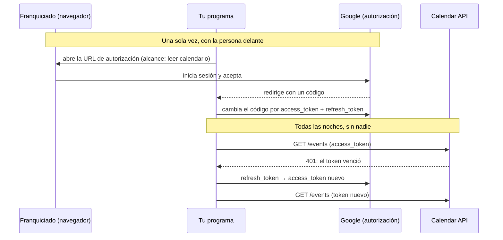

# 🤖 au05 — APIs de SaaS y su OAuth

> Python para desarrolladores Java senior · **Carta** · Track `au` — Automatización externa ·
> sección 5 de 7
> Se lee suelta: no hace falta ninguna otra sección de la carta.
> Versiones verificadas contra PyPI el 05/10/2026 · Código probado el 05/10/2026 con Python 3.14.7,
> en contenedor: las salidas son las de esa corrida.

---

## 🎯 1. Qué problema resuelve

De las cuatro sedes que no usan Odontovía, una lleva la agenda en Google Calendar. Cada vez que la
red quiere saber cuántas citas hubo, cuántas se perdieron o qué huecos quedan, alguien le pide al
franquiciado una captura de pantalla. La información **está** en una API pública y documentada; lo
que falta es el permiso para leerla, y ahí aparece el tema de esta sección: **OAuth 2.0 con una
persona del otro lado**.

Casi todos los SaaS con los que se integra un backend —Google Workspace, Microsoft 365, GitHub,
Slack, Jira— funcionan igual: la cuenta es de una persona o de una organización, y tu programa
necesita que esa persona lo **autorice** una vez, para un alcance concreto, y después trabaja con un
token que vence y se renueva solo. Esta sección enseña ese ciclo con `authlib` (1.8.0, del
2026-08-30), una biblioteca de OAuth genérica, y la compara con los SDK propios de cada servicio.

---

## 🧠 2. El modelo

El flujo de **código de autorización** tiene dos tiempos muy distintos:



Tres cosas de ese diagrama deciden si la integración funciona en el mes tres:

- **El `refresh_token` es una contraseña de larga duración.** Con él, cualquiera lee la agenda del
  franquiciado sin volver a preguntarle. Se guarda como un secreto, no en un JSON junto al código.
- **El alcance (*scope*) es el contrato.** `calendar.readonly` permite leer y nada más. Pedir más
  alcance del necesario es pedirle a una persona que confíe de más, y algunas consolas de
  proveedores lo revisan antes de aprobar la aplicación.
- **La renovación es automática o no es.** Un proceso nocturno que falla cuando vence el token, cada
  hora, no sirve. La biblioteca renueva antes de la llamada y te avisa del token nuevo para que lo
  guardes.

### 📖 Diccionario de traducción

| Java (Spring Security OAuth2 Client) | Python | Dónde se rompe el paralelo |
|---|---|---|
| `ClientRegistration` en `application.yml` | Los argumentos de `OAuth2Client` | No hay registro global: cada cliente se arma en código |
| `OAuth2AuthorizedClientService` (guarda los tokens) | El callback `update_token` | Tú decides dónde se guarda; la biblioteca solo te avisa |
| `WebClient` con el filtro OAuth2 | `OAuth2Client`, que **es** un `httpx.Client` | Se usa como cualquier cliente de `httpx` |
| El SDK oficial del proveedor | `google-api-python-client`, `PyGithub`, `slack-sdk` | En Python los SDK suelen traer su propio manejo de OAuth, distinto en cada uno |

---

## 💻 3. El ejemplo que corre

```bash
uv add authlib httpx keyring
```

`agenda_franquicia.py`, con las dos mitades del ciclo separadas: `authorize` corre una vez, con el
franquiciado delante; `fetch_events` corre todas las noches.

```python
"""Lee la agenda de Google Calendar de un franquiciado con OAuth 2.0 y renovación automática."""

import datetime as dt
import json
from collections.abc import Callable, Iterator

import keyring
from authlib.integrations.httpx_client import OAuth2Client

AUTH_URL = "https://accounts.google.com/o/oauth2/v2/auth"
TOKEN_URL = "https://oauth2.googleapis.com/token"
EVENTS_URL = "https://www.googleapis.com/calendar/v3/calendars/primary/events"
SCOPE = "https://www.googleapis.com/auth/calendar.readonly"
KEYRING_SERVICE = "aurea-agenda-franquicia"


def save_token(site: str) -> Callable[..., None]:
    """El token vive en el llavero del sistema operativo, no en un archivo junto al código."""
    def update(token: dict, refresh_token: str | None = None, access_token: str | None = None) -> None:
        keyring.set_password(KEYRING_SERVICE, site, json.dumps(token))
    return update


def load_token(site: str) -> dict | None:
    stored = keyring.get_password(KEYRING_SERVICE, site)
    return json.loads(stored) if stored else None


def build_client(client_id: str, client_secret: str, site: str, **httpx_options) -> OAuth2Client:
    return OAuth2Client(
        client_id, client_secret,
        scope=SCOPE,
        redirect_uri="http://127.0.0.1:8765/callback",
        token_endpoint=TOKEN_URL,  # con esto, authlib renueva solo cuando el token venció
        token=load_token(site),
        update_token=save_token(site),
        timeout=20,
        **httpx_options,
    )


def authorize(client: OAuth2Client, site: str) -> None:
    """Una sola vez, con la persona delante: muestra la URL y cambia el código por tokens."""
    url, _state = client.create_authorization_url(AUTH_URL, access_type="offline", prompt="consent")
    print("Abre esta dirección y acepta el acceso de solo lectura:\n", url)
    redirected = input("Pega aquí la dirección completa a la que te llevó Google: ")
    token = client.fetch_token(TOKEN_URL, authorization_response=redirected)
    save_token(site)(token)


def fetch_events(client: OAuth2Client, day: dt.date) -> Iterator[dict]:
    """Las citas de un día, siguiendo la paginación por nextPageToken."""
    start = dt.datetime.combine(day, dt.time.min).astimezone()
    params = {"timeMin": start.isoformat(), "timeMax": (start + dt.timedelta(days=1)).isoformat(),
              "singleEvents": "true", "orderBy": "startTime", "maxResults": "250"}
    while True:
        response = client.get(EVENTS_URL, params=params)
        response.raise_for_status()
        page = response.json()
        yield from page.get("items", [])
        if "nextPageToken" not in page:
            return
        params["pageToken"] = page["nextPageToken"]
```

Lo que de verdad hay que probar —la renovación automática y la paginación— se prueba sin Google,
con un transporte simulado y un llavero en memoria. `prueba_agenda.py`:

```python
"""Prueba la renovación y la paginación contra un Google simulado."""

import datetime as dt
import time

import httpx
import keyring
from keyring.backend import KeyringBackend

import agenda_franquicia as agenda


class MemoryKeyring(KeyringBackend):
    priority = 1
    store: dict = {}

    def get_password(self, service, user):
        return self.store.get((service, user))

    def set_password(self, service, user, password):
        self.store[(service, user)] = password

    def delete_password(self, service, user):
        self.store.pop((service, user), None)


def fake_google() -> httpx.MockTransport:
    def handler(request: httpx.Request) -> httpx.Response:
        if request.url.host == "oauth2.googleapis.com":
            return httpx.Response(200, json={"access_token": "nuevo", "expires_in": 3600,
                                             "token_type": "Bearer", "refresh_token": "r1"})
        assert request.headers["Authorization"] == "Bearer nuevo", "no renovó antes de llamar"
        if request.url.params.get("pageToken") == "p2":
            return httpx.Response(200, json={"items": [{"summary": "Control ortodoncia"}]})
        return httpx.Response(200, json={"items": [{"summary": "Valoración"}, {"summary": "Limpieza"}],
                                         "nextPageToken": "p2"})
    return httpx.MockTransport(handler)


keyring.set_keyring(MemoryKeyring())
expired = {"access_token": "viejo", "refresh_token": "r1", "token_type": "Bearer",
           "expires_at": int(time.time()) - 60}
keyring.set_password(agenda.KEYRING_SERVICE, "sede-calendar", __import__("json").dumps(expired))

client = agenda.build_client("id-de-prueba", "secreto-de-prueba", "sede-calendar", transport=fake_google())
print([e["summary"] for e in agenda.fetch_events(client, dt.date(2026, 10, 5))])
print("token guardado:", agenda.load_token("sede-calendar")["access_token"])
```

```bash
python3 prueba_agenda.py
```

Salida (Python 3.14.7, 05/10/2026):

```text
['Valoración', 'Limpieza', 'Control ortodoncia']
token guardado: nuevo
```

**Detalles con intención**

- **`access_type="offline"` y `prompt="consent"`** son lo que hace que Google entregue un
  `refresh_token`. Sin ellos, el programa funciona una hora y se muere en silencio a la mañana
  siguiente.
- **`update_token`** es la mitad del ciclo que casi todos olvidan: la biblioteca renueva, pero si no
  guardas el token nuevo, mañana vuelve a renovar con uno que el proveedor pudo haber revocado.
- **`keyring`** (25.7.0) guarda en el llavero del sistema operativo. En un servidor sin escritorio
  hace falta otro almacén —un gestor de secretos— y es el ejercicio 7.
- **`OAuth2Client` es un `httpx.Client`**: por eso recibe `transport=` y se prueba con
  `MockTransport` igual que cualquier otro cliente.

> 📝 **Nota de ecosistema.** Al correr la prueba, `authlib` 1.8.0 imprime
> `AuthlibDeprecationWarning: The httpx module is deprecated; please use httpx2 instead.`: la
> integración ya prefiere **`httpx2`** (2.13.1, del 2026-09-23), la continuación de `httpx` que
> mantiene Pydantic, y usa `httpx` solo como respaldo. El código de esta sección funciona igual con
> los dos; con `httpx2` instalado, el aviso desaparece.

---

## ⚠️ 4. Lo que se rompe

**El token que se revoca solo.** Google revoca los `refresh_token` de aplicaciones en modo de prueba
a los siete días, y los de cualquier aplicación si el usuario cambia la contraseña o lleva meses sin
usarlos. El proceso nocturno tiene que distinguir "la API falló" de "ya no tengo permiso", y lo
segundo es un aviso a una persona, no un reintento.

**La pantalla de consentimiento sin verificar.** Una aplicación que pide alcances sensibles y no pasó
la revisión del proveedor muestra una advertencia que espanta a cualquiera. Para leer el calendario de
una sola cuenta conocida, la aplicación se registra como interna o se le explica al franquiciado qué
va a ver y por qué.

**Mezclar el SDK y el cliente genérico.** `google-api-python-client` trae su propio manejo de
credenciales (`google-auth`), con otros objetos y otro formato de token. Usar el SDK para unas
llamadas y `authlib` para otras termina con dos tokens y dos renovaciones compitiendo.

**La zona horaria.** Calendar devuelve fechas con desplazamiento; `timeMin` sin zona se interpreta
como UTC. Una consulta por "el día" sin `astimezone()` pierde las citas de las siete de la noche.

---

## ⚖️ 5. Cuándo NO usarla

**Cuando el SDK del proveedor cubre el caso y está mantenido.** `google-api-python-client`
(2.201.0, del 2026-09-30), `PyGithub` (2.10.0) y `slack-sdk` (3.45.0) están vivos y conocen los
detalles de cada API. `authlib` gana cuando integras **varios** servicios con un mismo patrón, o
cuando el SDK arrastra más de lo que usas. `jira` (3.10.5) lleva desde julio de 2025 sin versión: no
está muerto, pero es la razón para mirar la fecha antes de elegirlo.

**Cuando la cuenta es de la empresa y no de una persona.** Para sistemas internos, el flujo es otro:
*client credentials* (máquina a máquina, en `au01`) o cuentas de servicio con delegación. No hay
pantalla de consentimiento porque no hay nadie a quien preguntar.

**Cuando la persona del otro lado no quiere.** El franquiciado tiene derecho a no darle a la central
acceso a su agenda. La alternativa técnica —que exporte un archivo semanal— es peor, y la decisión
no es técnica.

---

## 🧪 6. Ejercicios (10)

**🟢 Fácil (1–3)**

1. Cambia el token de prueba para que no esté vencido (`expires_at` en el futuro). **Criterio:** la
   prueba falla con "no renovó antes de llamar" porque ahora se usa el viejo; explicas por qué eso es
   lo correcto y ajustas la prueba.
2. Agrega una tercera página a la paginación simulada. **Criterio:** salen las tres páginas en orden
   y la cuarta nunca se pide.
3. Imprime la URL de autorización con un `client_id` falso y localiza en ella el alcance y
   `access_type`. **Criterio:** explicas en una línea qué pasa si quitas `access_type=offline`.

**🟡 Intermedio (4–6)**

4. Busca en la documentación de Google qué pasa con los `refresh_token` de una aplicación en estado
   de prueba. **Criterio:** escribes el aviso que el proceso nocturno mandaría cuando eso ocurra.
5. Haz que la respuesta simulada de la API devuelva `401` con un token vigente y verifica qué hace
   `authlib`. **Criterio:** describes el comportamiento con la prueba que lo demuestra.
6. Cuenta las citas por estado (`confirmed`, `cancelled`) y por hora del día. **Criterio:** una tabla
   que Patricia entiende sin explicación.

**🟠 Difícil (7–9)**

7. Reemplaza `keyring` por un almacén que funcione en un servidor sin escritorio (un archivo cifrado
   con una clave que llega por entorno, o un gestor de secretos). **Criterio:** el token nunca queda
   en texto plano en disco.
8. Escribe el mismo lector con `google-api-python-client` y compara. **Criterio:** una tabla con
   líneas, dependencias instaladas y cómo se prueba cada uno sin red.
9. Integra un segundo SaaS con el mismo patrón (GitHub o Slack) usando `authlib`. **Criterio:** la
   función que construye el cliente es la misma para los dos, con distinta configuración.

**🔴 Muy difícil (10)**

10. Diseña la integración completa para los cuatro franquiciados que no usan Odontovía, aunque cada
    uno use otra herramienta. **Criterio:** un documento de una página y un prototipo con dos fuentes
    simuladas. *Rúbrica:* (a) una interfaz común "citas de un día" y un adaptador por fuente; (b) un
    permiso revocado produce un aviso a la persona correcta, no un fallo silencioso; (c) ningún token
    queda en el repositorio ni en un log; (d) dices qué datos de la agenda **no** debería ver la
    central y cómo lo garantizas en el alcance pedido.

---

## 📚 7. Referencias

**Documentación oficial**

- `authlib`, cliente OAuth sobre `httpx`: https://docs.authlib.org/en/latest/oauth2/client/http/httpx.html
- Google, OAuth 2.0 para aplicaciones de servidor: https://developers.google.com/identity/protocols/oauth2/web-server
- Calendar API, listar eventos: https://developers.google.com/workspace/calendar/api/v3/reference/events/list
- `keyring`: https://keyring.readthedocs.io/

**Orden de lectura sugerido:** la página de Google sobre OAuth para aplicaciones de servidor, que
explica `offline` y la revocación mejor que cualquier resumen; después la de `authlib` para `httpx`;
y la referencia de la API solo para los parámetros de la llamada que necesites.

---

## 🚀 8. Cierre

Integrar un SaaS es un ciclo de dos tiempos: una autorización con una persona delante, y un proceso
que renueva y guarda su token sin nadie. Lo que separa una integración que dura de una que muere al
mes es lo que pasa en el segundo tiempo: dónde vive el token, qué se hace cuando lo revocan y cuánto
alcance se pidió.

**La señal de que quedó bien:** *"Hace tres meses que el franquiciado no manda capturas, y la vez que
cambió su contraseña nos llegó un aviso, no un informe vacío."*

> 🏷️ **Cierra la sección con su tag**, cuando los ejercicios que elegiste estén hechos:
>
> ```bash
> git tag -a op-au-fase-05 -m "op au05 cerrada: OAuth con renovación y token en el llavero"
> ```
>
> Los commits llevan su prefijo (`op au05: …`) y los de ejercicio su número
> (`op au05 ej07: …`).
