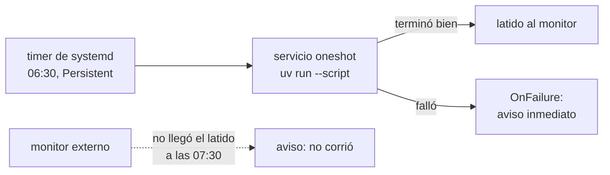

# 🤖 au06 — Desplegar automatizaciones

> Python para desarrolladores Java senior · **Carta** · Track `au` — Automatización externa ·
> sección 6 de 7
> Se lee suelta: no hace falta ninguna otra sección de la carta. **Empieza donde termina la
> [Fase 15](15-el-proceso-nocturno.md)**, que elige `cron` con `flock` para el cierre nocturno y
> explica por qué.
> Versiones verificadas contra PyPI el 05/10/2026 · Código probado en parte el 05/10/2026 con
> Python 3.14.7, en contenedor: el script con `uv run --script` y las dos unidades con
> `systemd-analyze verify`; el timer no se corrió en una máquina con `systemd` activo.

---

## 🎯 1. Qué problema resuelve

Las automatizaciones de este track —el revisor de circulares, el de respaldos, el robot de
radicación— funcionan en tu portátil. El problema empieza el día que tienen que correr **solas**, en
una máquina que no es la tuya, todos los días, y que alguien se entere cuando no corrieron. Ese
último punto es el que casi nadie resuelve: una automatización que falla escribe un error en un log;
una que **no arranca** no escribe nada, y el silencio se parece mucho a "todo bien".

La Fase 15 ya eligió `cron` para el cierre nocturno de Áurea, con buenas razones. Esta sección es el
resto del terreno para una máquina Linux pequeña —la virtual donde viven los procesos de la red—:

- **Empaquetar el script** para que corra con sus dependencias sin un entorno virtual a mano.
- **Programarlo con un timer de `systemd`**, que recupera la corrida perdida si la máquina estaba
  apagada y guarda la salida en el diario del sistema.
- **Darle sus secretos** sin dejarlos en una variable de entorno que cualquiera lee.
- **Enterarse de que no corrió**, con un interruptor de hombre muerto.

---

## 🧠 2. El modelo

Una automatización desplegada tiene cuatro piezas, y cada una contesta una pregunta distinta:

| Pieza | Pregunta | Herramienta en esta sección |
|---|---|---|
| El artefacto | ¿Qué corre, con qué dependencias? | Script con metadatos PEP 723, ejecutado con `uv run` |
| El planificador | ¿Cuándo, y qué pasa si la máquina estaba apagada? | Timer de `systemd` con `Persistent=true` |
| Los secretos | ¿Cómo llega la contraseña sin quedar a la vista? | `LoadCredential=` de `systemd` |
| La vigilancia | ¿Cómo me entero de que **no** corrió? | Un latido a un monitor externo, que avisa si falta |



El latido es la pieza que cambia todo: el monitor no espera un error, espera una **señal de vida**, y
avisa cuando falta. Así se atrapan los fallos que no producen ningún error: la máquina apagada, el
timer deshabilitado, el disco lleno que impidió arrancar.

### 🪞 Tu instinto de Java dice… y esta vez se equivoca

En Java, desplegar es construir un JAR y ponerlo bajo un servidor de aplicaciones o un planificador
como Quartz, dentro del proceso. El reflejo es buscar el equivalente: un proceso Python de larga vida
con un planificador adentro. Para tareas diarias, eso es **peor**: un proceso que vive para despertar
una vez al día acumula memoria, conexiones viejas y estado, y si muere, se lleva el planificador con
él. El sistema operativo ya sabe despertar procesos a una hora; la tarea arranca, hace lo suyo y
termina.

---

## 💻 3. El ejemplo que corre

### El artefacto: un script con sus dependencias adentro

PEP 723 permite declarar las dependencias **dentro** del script, en un comentario con formato, y `uv`
(0.12.23, del 2026-10-03) lo ejecuta creando el entorno al vuelo y guardándolo en caché.
`revisar_circulares.py`:

```python
# /// script
# requires-python = ">=3.14"
# dependencies = [
#     "httpx==0.28.1",
#     "selectolax==1.0.0",
# ]
# ///
"""Revisa las circulares de las prepagadas y manda un latido al monitor al terminar bien."""

import os
import sys
from pathlib import Path

import httpx


def read_secret(name: str) -> str:
    """systemd deja las credenciales en $CREDENTIALS_DIRECTORY, legibles solo por este servicio."""
    directory = os.environ.get("CREDENTIALS_DIRECTORY")
    if directory:
        return (Path(directory) / name).read_text().strip()
    return os.environ[name.upper().replace("-", "_")]  # en desarrollo, desde el entorno


def heartbeat(status: str = "") -> None:
    url = os.environ.get("HEARTBEAT_URL")
    if not url:
        return
    # El latido nunca tumba la tarea: si el monitor está caído, el monitor avisará solo.
    try:
        httpx.post(f"{url}{status}", timeout=10)
    except httpx.HTTPError as error:
        print(f"no se pudo enviar el latido: {error}", file=sys.stderr)


def main() -> int:
    token = read_secret("portal-token")
    print(f"revisando circulares con un token de {len(token)} caracteres")
    # … aquí va el scraper de la sección au02 …
    heartbeat()
    return 0


if __name__ == "__main__":
    try:
        sys.exit(main())
    except Exception:
        heartbeat("/fail")
        raise
```

```bash
PORTAL_TOKEN=prueba uv run --script revisar_circulares.py
```

Salida (Python 3.14.7, 05/10/2026); la primera vez, `uv` resuelve e instala las dos dependencias antes:

```text
revisando circulares con un token de 6 caracteres
```

### El planificador: un timer de systemd

`/etc/systemd/system/aurea-circulares.service`:

```ini
[Unit]
Description=Revisión diaria de circulares de las prepagadas
Wants=network-online.target
After=network-online.target
OnFailure=aurea-aviso@%n.service

[Service]
Type=oneshot
User=aurea
WorkingDirectory=/opt/aurea
ExecStart=/usr/local/bin/uv run --script /opt/aurea/revisar_circulares.py
Environment=HEARTBEAT_URL=https://monitor.aurea.example/ping/circulares
# El token llega como archivo, solo para este servicio; no aparece en el entorno del proceso.
LoadCredential=portal-token:/etc/aurea/credenciales/portal-token
TimeoutStartSec=15min
# Endurecimiento básico: la tarea no necesita escribir fuera de su directorio.
ProtectSystem=strict
ReadWritePaths=/opt/aurea /var/cache/aurea
PrivateTmp=true
NoNewPrivileges=true
Environment=UV_CACHE_DIR=/var/cache/aurea/uv
```

`/etc/systemd/system/aurea-circulares.timer`:

```ini
[Unit]
Description=Todos los días a las 06:30

[Timer]
OnCalendar=*-*-* 06:30:00
# Si la máquina estaba apagada a las 06:30, la tarea corre al arrancar.
Persistent=true
RandomizedDelaySec=5min

[Install]
WantedBy=timers.target
```

```bash
sudo systemd-analyze verify /etc/systemd/system/aurea-circulares.{service,timer}
sudo systemctl enable --now aurea-circulares.timer
systemctl list-timers aurea-circulares.timer     # cuándo corre la próxima vez
sudo systemctl start aurea-circulares.service    # correrla ya, para probar
journalctl -u aurea-circulares.service -n 50     # la salida, con fecha, en el diario
```

`systemd-analyze verify` revisa la sintaxis de las dos unidades antes de habilitarlas (en la prueba
de esta sección, sobre Debian trixie, no dio ningún aviso). Es el
equivalente a compilar, y atrapa las directivas mal escritas que `systemd` ignoraría en silencio.

### La vigilancia: el latido

Cualquier servicio de "interruptor de hombre muerto" —Healthchecks.io es el más conocido y tiene
versión de código abierto que se puede alojar— funciona igual: le dices "espero un latido todos los
días a las 06:30, con una hora de gracia", y si no llega, te avisa. El script de arriba manda el
latido **solo al terminar bien**, y `/fail` cuando falla, para que el aviso de error llegue de
inmediato y no una hora después.

**Detalles con intención**

- **Las versiones fijadas dentro del script** (`==`), no rangos: una tarea desatendida que se
  actualiza sola el día que sale una versión nueva es un fallo de las seis de la mañana.
- **`Type=oneshot`** dice que el servicio termina; `systemd` no lo reinicia y el timer lo vuelve a
  lanzar mañana.
- **`LoadCredential=`** deja el secreto en un directorio propio del servicio, que no aparece en
  `/proc/<pid>/environ` ni en `systemctl show`. Una variable de entorno, en cambio, la ve cualquiera
  que pueda inspeccionar el proceso.
- **`OnFailure=`** lanza otra unidad cuando esta falla: ahí va el aviso por correo o mensaje, con el
  nombre del servicio que falló en `%n`.

---

## ⚠️ 4. Lo que se rompe

**El entorno de `cron` y de `systemd` no es tu terminal.** No hay `PATH` de tu usuario, no hay
entorno virtual activado, no está tu `~/.ssh`. Por eso el `ExecStart` usa rutas absolutas y el
script declara sus dependencias: lo que funciona en tu terminal y falla en el timer es casi siempre
una variable de entorno que tu terminal tenía.

**La caché de `uv` en un directorio que el servicio no puede escribir.** Con `ProtectSystem=strict`,
el sistema de archivos es de solo lectura salvo lo que permitas. Sin `UV_CACHE_DIR` apuntando a un
directorio en `ReadWritePaths`, `uv` no puede crear el entorno y el servicio falla con un error de
permisos que no menciona la caché.

**El reloj.** `OnCalendar` usa la zona horaria del sistema. Una máquina virtual creada en otra región
puede estar en UTC, y la revisión "de las 06:30" corre a la una y media de la madrugada de Bogotá.
`timedatectl` lo dice, y `OnCalendar=*-*-* 06:30:00 America/Bogota` lo fija explícitamente.

**El latido que se manda al empezar.** Si el latido va al inicio, el monitor dice "corrió" aunque la
tarea muera a la mitad. Va al final, después de que el trabajo terminó bien.

---

## ⚖️ 5. Cuándo NO usarla

**Cuando ya tienes `cron` y funciona.** Para tres tareas en una máquina que no se apaga, `cron` con
`flock` y la salida a un archivo —la elección de la Fase 15— es suficiente. El timer gana cuando
necesitas recuperar corridas perdidas, endurecer el servicio o integrar el diario del sistema.

**Cuando las tareas dependen unas de otras.** "La radicación corre si la descarga terminó bien" es un
grafo, y ni `cron` ni `systemd` lo modelan bien. Eso es orquestación, y tiene su propio track.

**Cuando la plataforma ya planifica.** Si la empresa corre contenedores en una plataforma con tareas
programadas (un `CronJob` de Kubernetes, un planificador del proveedor de nube), la tarea se empaqueta
como imagen y se programa ahí, con el mismo latido al final.

---

## 🧪 6. Ejercicios (10)

**🟢 Fácil (1–3)**

1. Corre el script con `uv run --script` sin `PORTAL_TOKEN` en el entorno. **Criterio:** falla con un
   `KeyError` que nombra la variable, y explicas por qué es mejor que un valor por defecto.
2. Cambia una versión del bloque PEP 723 y vuelve a correr. **Criterio:** `uv` resuelve un entorno
   nuevo y explicas dónde quedó el anterior.
3. Escribe la expresión `OnCalendar` para "de lunes a viernes a las 06:30, hora de Bogotá" y
   valídala con `systemd-analyze calendar`. **Criterio:** la herramienta muestra las próximas cinco
   ejecuciones y son las correctas.

**🟡 Intermedio (4–6)**

4. Escribe la unidad `aurea-aviso@.service` que manda un correo o un mensaje con el nombre del servicio
   que falló y las últimas veinte líneas de su diario. **Criterio:** forzar un fallo produce un aviso
   con esas veinte líneas.
5. Busca en la documentación de `systemd.exec` qué otras directivas de endurecimiento aplican a esta
   tarea y corre `systemd-analyze security aurea-circulares.service`. **Criterio:** bajas la
   calificación de exposición y explicas cada directiva que agregaste.
6. Monta Healthchecks en un contenedor local y conecta el latido. **Criterio:** deshabilitar el timer
   produce un aviso de "no corrió" después del período de gracia.

**🟠 Difícil (7–9)**

7. Empaqueta la misma tarea como imagen de contenedor con `uv` y prográmala desde el timer con
   `docker run --rm`. **Criterio:** la imagen no contiene el token y el timer funciona igual.
8. Simula una máquina apagada a la hora del timer (detén el timer, cambia la hora de la corrida a un
   minuto atrás, vuelve a habilitarlo). **Criterio:** con `Persistent=true` la tarea corre al
   habilitar; sin él, no; muestras los dos diarios.
9. Mide cuánto tarda la primera corrida de `uv run --script` con la caché vacía y la segunda con la
   caché llena. **Criterio:** reportas los dos tiempos y decides si la caché tiene que sobrevivir a un
   reinicio de la máquina.

**🔴 Muy difícil (10)**

10. Despliega las tres automatizaciones del track (circulares, respaldos, radicación) en una máquina
    virtual pequeña, como se haría en Áurea. **Criterio:** un documento de una página con el
    inventario y un repositorio con las unidades y los scripts. *Rúbrica:* (a) cada tarea tiene
    timer, latido y aviso de fallo; (b) ningún secreto queda en el repositorio, en el entorno ni en
    el diario; (c) una persona que no eres tú puede saber, en un minuto, qué corrió anoche y qué no;
    (d) dices cuánto cuesta la máquina al mes y qué pasa si se apaga una semana.

---

## 📚 7. Referencias

**Documentación oficial**

- PEP 723, metadatos en scripts: https://peps.python.org/pep-0723/
- `uv`, ejecutar scripts: https://docs.astral.sh/uv/guides/scripts/
- `systemd.timer`: https://man7.org/linux/man-pages/man5/systemd.timer.5.html
- `systemd.exec`, credenciales y endurecimiento:
  https://man7.org/linux/man-pages/man5/systemd.exec.5.html
- Healthchecks, el monitor de latidos de código abierto: https://github.com/healthchecks/healthchecks

**Orden de lectura sugerido:** la guía de scripts de `uv`, que es corta; después `systemd.timer`
para `Persistent` y `OnCalendar`; y la sección de credenciales de `systemd.exec` cuando la tarea
necesite su primer secreto.

---

## 🚀 8. Cierre

Desplegar una automatización es darle cuatro cosas: un artefacto que trae sus dependencias, un
planificador que recupera lo perdido, un secreto que nadie más ve y un latido que avisa cuando falta.
Sin la cuarta, una tarea que dejó de correr hace tres semanas se ve exactamente igual que una que
corrió esta mañana.

**La señal de que quedó bien:** *"La máquina se reinició un domingo, el timer no arrancó, y el lunes a
las 07:30 llegó el aviso de que la revisión no había corrido."*

> 🏷️ **Cierra la sección con su tag**, cuando los ejercicios que elegiste estén hechos:
>
> ```bash
> git tag -a op-au-fase-06 -m "op au06 cerrada: PEP 723, timer de systemd, credenciales y latido"
> ```
>
> Los commits llevan su prefijo (`op au06: …`) y los de ejercicio su número
> (`op au06 ej07: …`).
