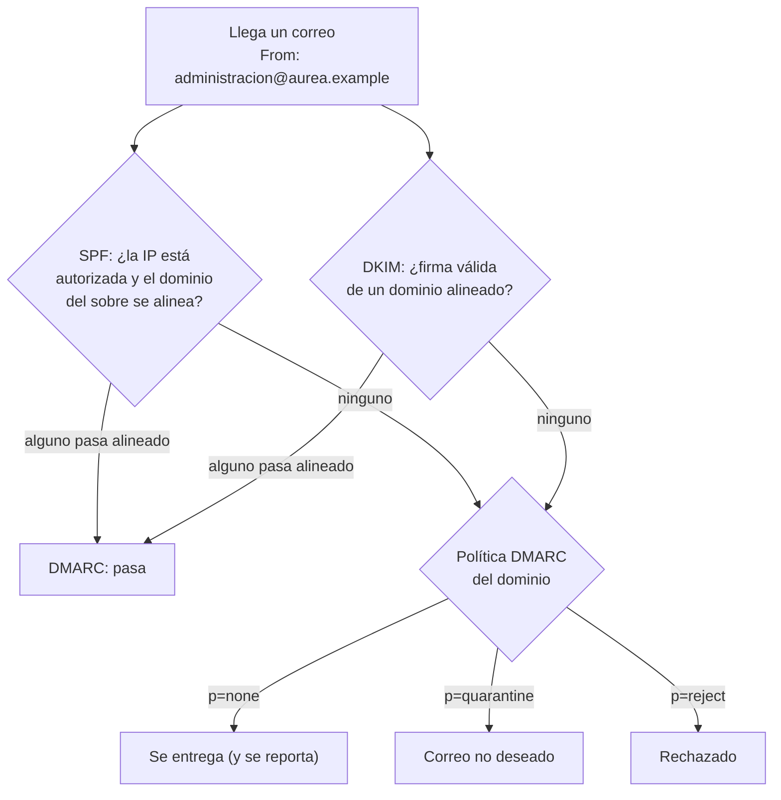

# 📮 co02 — Que el correo llegue

> Python para desarrolladores Java senior · **Carta** · Track `co` — Comunicaciones y
> transferencia · sección 2 de 7
> Se lee suelta: no hace falta ninguna otra sección de la carta.
> Versiones verificadas contra PyPI el 05/10/2026 · Código probado el 05/10/2026 con Python 3.14.7,
> en contenedor: las salidas son las de esa corrida.

---

## 🎯 1. Qué problema resuelve

Mandar un correo desde Python son cinco líneas. Que **llegue a la bandeja de entrada** no depende de
ninguna de esas cinco líneas. Depende de que el dominio desde el que escribes haya declarado,
públicamente y en el DNS, qué servidores pueden mandar en su nombre; de que el mensaje vaya firmado
por ese dominio; de que el dominio diga qué hacer con lo que no cumple; y de la reputación que
construyeron los correos anteriores.

Áurea lo descubrió con los recordatorios de citas: el primer mes, una parte llegó a la carpeta de
correo no deseado de Gmail, y los pacientes no vinieron. No había ningún error en el programa. Había
un dominio sin DMARC y un servidor de envío que el dominio no declaraba.

Esta sección enseña a **diagnosticar** eso desde Python —leer los registros SPF y DMARC de cualquier
dominio, y firmar y verificar con DKIM— y a reconocer la frontera: casi todo lo que decide la
entrega es **infraestructura**, y la respuesta correcta muchas veces es *"esto no lo resuelvas tú:
paga un servicio de envío"*.

---

## 🧠 2. El modelo

Tres mecanismos, publicados en el DNS del dominio remitente, y cada uno contesta una pregunta:

| Mecanismo | Dónde vive | Qué contesta |
|---|---|---|
| **SPF** | Registro TXT en `aurea.example` | ¿Este servidor puede mandar correo de este dominio? |
| **DKIM** | Clave pública en `<selector>._domainkey.aurea.example` | ¿El mensaje lo firmó el dominio y llegó sin alterarse? |
| **DMARC** | Registro TXT en `_dmarc.aurea.example` | ¿Qué hago si SPF y DKIM no cuadran con el `From:` visible, y a quién le aviso? |

El concepto que une a los tres es la **alineación**: no basta con que el mensaje pase SPF o DKIM;
el dominio que pasa tiene que coincidir con el del `From:` que ve la persona. Un correo que dice ser
de `administracion@aurea.example`, enviado por un servicio que firma con **su** dominio y no con el de
Áurea, pasa DKIM y **falla DMARC**.



Y encima de los tres, lo que ningún registro arregla: la **reputación** del dominio y de la IP, que
sube con correos que la gente abre y baja con rebotes, quejas y envíos a direcciones que no existen.
Desde febrero de 2024, Gmail y Yahoo exigen SPF, DKIM y DMARC a quien manda más de cinco mil correos
diarios a sus usuarios, y una forma de darse de baja en un clic para el correo masivo.

---

## 💻 3. El ejemplo que corre

```bash
uv add dnspython dkimpy
```

`dnspython` (2.8.0) consulta el DNS. `dkimpy` (1.1.8, del 2024-07-04) firma y verifica DKIM; lleva
más de dos años sin versión y es la implementación de referencia en Python, quieta porque el estándar
no cambia.

`diagnostico_correo.py`:

```python
"""Diagnóstico de entrega: SPF y DMARC de un dominio, y una firma DKIM firmada y verificada."""

import base64

import dkim
import dns.resolver
from cryptography.hazmat.primitives import serialization
from cryptography.hazmat.primitives.asymmetric import rsa


def txt_records(name: str) -> list[str]:
    try:
        answers = dns.resolver.resolve(name, "TXT")
    except (dns.resolver.NXDOMAIN, dns.resolver.NoAnswer):
        return []
    # Un registro TXT puede venir partido en varias cadenas de 255 bytes: se unen.
    return [b"".join(r.strings).decode() for r in answers]


def mail_policy(domain: str) -> dict[str, str]:
    spf = [r for r in txt_records(domain) if r.startswith("v=spf1")]
    dmarc = [r for r in txt_records(f"_dmarc.{domain}") if r.startswith("v=DMARC1")]
    tags = dict(t.strip().split("=", 1) for t in dmarc[0].split(";") if "=" in t) if dmarc else {}
    return {
        "spf": spf[0] if len(spf) == 1 else f"{len(spf)} registros SPF (debe haber exactamente uno)",
        "dmarc": tags.get("p", "sin DMARC"),
        "subdominios": tags.get("sp", tags.get("p", "—")),
        "reportes": tags.get("rua", "nadie los recibe"),
    }


def dkim_roundtrip() -> tuple[bool, bool]:
    """Firma un mensaje con una clave propia y lo verifica con un DNS simulado."""
    key = rsa.generate_private_key(public_exponent=65537, key_size=2048)
    private_pem = key.private_bytes(serialization.Encoding.PEM,
                                    serialization.PrivateFormat.TraditionalOpenSSL,
                                    serialization.NoEncryption())
    public_der = key.public_key().public_bytes(serialization.Encoding.DER,
                                               serialization.PublicFormat.SubjectPublicKeyInfo)
    # Esto es exactamente lo que se publica en recordatorios._domainkey.aurea.example
    record = b"v=DKIM1; k=rsa; p=" + base64.b64encode(public_der)

    message = (b"From: Recordatorios <citas@aurea.example>\r\n"
               b"To: paciente@correo.example\r\n"
               b"Subject: Recordatorio de cita\r\n\r\n"
               b"Le recordamos su cita de control el martes a las 3:40 p. m.\r\n")
    signature = dkim.sign(message, b"recordatorios", b"aurea.example", private_pem,
                          include_headers=[b"from", b"to", b"subject"])
    signed = signature + message

    def fake_dns(name: bytes, timeout: int = 5) -> bytes:
        return record if name == b"recordatorios._domainkey.aurea.example." else b""

    intact = dkim.verify(signed, dnsfunc=fake_dns)
    tampered = dkim.verify(signed.replace(b"3:40", b"4:40"), dnsfunc=fake_dns)
    return intact, tampered


if __name__ == "__main__":
    for key, value in mail_policy("gmail.com").items():
        print(f"gmail.com  {key:11} {value}")
    print("DKIM íntegro: %s · alterado: %s" % dkim_roundtrip())
```

```bash
python3 diagnostico_correo.py
```

Salida (Python 3.14.7, 05/10/2026) (los registros de un dominio real cambian; estos son los del día de
escritura):

```text
gmail.com  spf         v=spf1 redirect=_spf.google.com
gmail.com  dmarc       none
gmail.com  subdominios quarantine
gmail.com  reportes    mailto:mailauth-reports@google.com
DKIM íntegro: True · alterado: False
```

Dos lecturas de esa salida. La primera: **el propio `gmail.com` publica `p=none`** para su dominio
principal —entregar y reportar—, y `quarantine` para sus subdominios. Una política estricta no es
obligatoria para empezar; lo obligatorio es **tener** DMARC y **leer** los reportes. La segunda:
cambiar `3:40` por `4:40` en el cuerpo invalida la firma DKIM, que es justo para lo que existe.

**Detalles con intención**

- **Exactamente un registro SPF.** Dos registros `v=spf1` en el mismo dominio es un error de
  configuración frecuente, y el resultado es un fallo permanente de SPF para todo el dominio.
- **`dnsfunc` en `dkim.verify`** reemplaza la consulta DNS: así se prueba la firma sin publicar nada.
- **La clave DKIM es de 2048 bits**, y la pública cabe en el registro TXT si se parte en cadenas; con
  4096 hay proveedores de DNS que no la aceptan.

---

## ⚠️ 4. Lo que se rompe

**El servicio de envío nuevo que nadie declaró.** Alguien contrata un servicio para los
recordatorios, lo configura, manda, y el SPF del dominio no lo incluye. Pasa la prueba de enviarse a
sí mismo (el propio buzón confía) y falla con los pacientes. El SPF se actualiza **antes** del primer
envío, y DKIM se configura con el dominio de Áurea, no con el del servicio.

**El límite de diez consultas de SPF.** Cada `include:` del registro SPF cuesta consultas DNS, y el
estándar corta en diez. Un dominio que incluye Google, Microsoft, el servicio de envío, el CRM y la
plataforma de encuestas pasa el límite sin que nadie lo note, y SPF empieza a fallar para todos.

**Los rebotes que nadie mira.** Un rebote **duro** (la dirección no existe) se marca y no se vuelve a
intentar nunca; mandar repetidamente a direcciones inexistentes es la forma más rápida de destruir la
reputación de un dominio. Un rebote **blando** (buzón lleno, servidor caído) se reintenta unas veces.
Esa lista la tiene que mantener alguien, y un servicio de envío la mantiene por ti.

**Mandar los recordatorios desde el mismo dominio que la facturación.** Si los recordatorios masivos
dañan la reputación, arrastran a las liquidaciones de `co01`. Un subdominio para el correo masivo
(`citas.aurea.example`) separa las dos reputaciones.

---

## ⚖️ 5. Cuándo NO usarla

**Para operar la entrega tú mismo a escala.** Montar y mantener tu propio servidor de envío para miles
de correos —IP dedicada, calentamiento, listas de bloqueo, rebotes, quejas— es un trabajo de tiempo
completo. A partir de unos cientos de correos al día, un servicio de envío cuesta menos que el tiempo
que ahorra.

**Para los recordatorios urgentes.** Si el recordatorio tiene que llegar sí o sí, el correo no es el
mejor canal: un mensaje de texto o de WhatsApp tiene otra tasa de lectura. Eso es `co06`.

**Esta sección no reemplaza leer los reportes de DMARC.** El diagnóstico de arriba dice cómo está
configurado el dominio; los reportes agregados dicen qué está pasando con los correos de verdad, y
quién manda en nombre de tu dominio sin que lo sepas.

---

## 🧪 6. Ejercicios (10)

**🟢 Fácil (1–3)**

1. Corre el diagnóstico sobre tres dominios que conozcas. **Criterio:** una tabla con su política
   DMARC y si tienen exactamente un SPF.
2. Cambia el `To:` del mensaje firmado después de firmar. **Criterio:** DKIM falla, y explicas por qué
   cambiar un encabezado no firmado no lo haría.
3. Escribe el registro SPF de Áurea si manda desde Google Workspace y un servicio de envío.
   **Criterio:** un solo registro, con los dos `include:` y `~all` o `-all`, y explicas tu elección.

**🟡 Intermedio (4–6)**

4. Usa `checkdmarc` (6.0.3) sobre los mismos dominios del ejercicio 1. **Criterio:** reportas qué
   advertencias da que tu diagnóstico no daba.
5. Cuenta las consultas DNS del SPF de un dominio grande siguiendo sus `include:` y `redirect=`.
   **Criterio:** un número, y si está por debajo de diez.
6. Busca en la especificación de DMARC qué contiene un reporte agregado y en qué formato llega.
   **Criterio:** describes los tres campos que mirarías primero.

**🟠 Difícil (7–9)**

7. Escribe un lector de reportes agregados de DMARC (XML comprimido) que resuma por IP de origen
   cuántos mensajes pasaron y fallaron. **Criterio:** con un reporte de ejemplo, la tabla identifica
   una IP que manda en nombre del dominio sin estar autorizada.
8. Firma con DKIM los correos de `co01` antes de mandarlos al servidor de prueba. **Criterio:** el
   mensaje guardado tiene el encabezado `DKIM-Signature` y verifica con el `fake_dns`.
9. Diseña la lista de supresión de rebotes duros para los recordatorios. **Criterio:** una dirección
   que rebotó en duro una vez no recibe ningún correo más, demostrado con una prueba.

**🔴 Muy difícil (10)**

10. Escribe el plan para llevar el dominio de Áurea de "sin DMARC" a `p=reject` sin perder correo
    legítimo. **Criterio:** un plan por semanas con su criterio para avanzar cada paso. *Rúbrica:* (a)
    empieza en `p=none` con reportes y dice cuánto tiempo los lee; (b) inventaría todos los que mandan
    en nombre del dominio antes de endurecer; (c) separa el correo masivo en un subdominio; (d) dice
    cómo se revierte si `quarantine` empieza a esconder liquidaciones.

---

## 📚 7. Referencias

**Estándares**

- SPF, RFC 7208: https://www.rfc-editor.org/rfc/rfc7208
- DKIM, RFC 6376: https://www.rfc-editor.org/rfc/rfc6376
- DMARC, RFC 7489: https://www.rfc-editor.org/rfc/rfc7489

**Guías y bibliotecas**

- Google, requisitos para remitentes: https://support.google.com/mail/answer/81126
- `dkimpy`: https://launchpad.net/dkimpy
- `checkdmarc`: https://domainaware.github.io/checkdmarc/

**Orden de lectura sugerido:** la guía de Google para remitentes, que resume en una página lo que de
verdad se exige hoy; después la sección de alineación de la RFC de DMARC; SPF y DKIM solo cuando un
diagnóstico concreto lo pida.

---

## 🚀 8. Cierre

Que el correo llegue se decide en el DNS y en la reputación, no en el código. Desde Python se puede
diagnosticar, firmar y leer reportes; lo demás es configurar bien el dominio y, a partir de cierto
volumen, pagar a quien vive de que el correo llegue.

**La señal de que quedó bien:** *"El dominio tiene un SPF, DKIM alineado y DMARC con reportes, y los
recordatorios salen de un subdominio que no arrastra a las liquidaciones."*

> 🏷️ **Cierra la sección con su tag**, cuando los ejercicios que elegiste estén hechos:
>
> ```bash
> git tag -a op-co-fase-02 -m "op co02 cerrada: diagnóstico SPF y DMARC, firma DKIM verificada"
> ```
>
> Los commits llevan su prefijo (`op co02: …`) y los de ejercicio su número
> (`op co02 ej07: …`).
