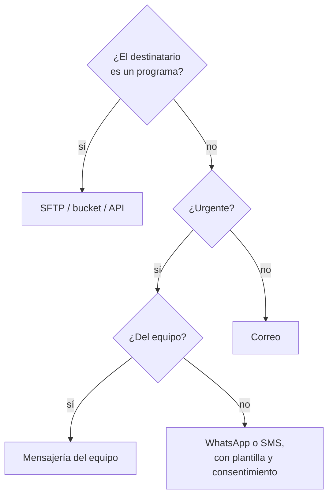

# ⚖️ co07 — Veredicto: qué protocolo para qué

> Python para desarrolladores Java senior · **Carta** · Track `co` — Comunicaciones y
> transferencia · sección 7 de 7
> Se lee suelta: no hace falta ninguna otra sección de la carta, aunque esta cierra el track y
> enlaza a las seis anteriores.
> Versiones verificadas contra PyPI el 05/10/2026 · Código probado el 05/10/2026 con Python 3.14.7,
> en contenedor: las salidas son las de esa corrida.

---

## 🎯 1. Qué problema resuelve

El track recorre los protocolos viejos que sostienen el trabajo real: correo saliente
([`co01`](op015-co01-correo-saliente.md)) y su entrega ([`co02`](op016-co02-que-el-correo-llegue.md)),
correo entrante ([`co03`](op017-co03-correo-entrante.md)) y cómo probarlo
([`co04`](op018-co04-probar-correo.md)), transferencia de archivos
([`co05`](op019-co05-transferencia-de-archivos.md)) y mensajería
([`co06`](op020-co06-mensajeria.md)). Cada uno resuelve bien una cosa y mal otras, y la pregunta que
cierra el track es la que aparece cada vez que alguien en Áurea dice *"mándaselo"*: **¿por dónde?**

La propuesta de este track adelantaba una cifra provocadora —que el correo gana en el 60% de los
casos—. Esta sección no la repite como dato, porque no hay medición que la sostenga: la reemplaza por
algo que sí se puede hacer, que es **clasificar los envíos reales de Áurea** con un criterio explícito
y ver qué sale.

---

## 🧠 2. El modelo

Cuatro preguntas deciden el canal, y casi nunca hace falta una quinta:

1. **¿Quién es el destinatario?** Una persona del equipo, una persona de afuera, o un programa.
2. **¿Tiene que quedar constancia** —qué se mandó, cuándo, y que se puede reproducir después—?
3. **¿Es urgente**, en el sentido de que alguien tiene que actuar en minutos?
4. **¿Lleva un archivo grande o estructurado** que otro programa va a procesar?

| Si… | El canal es… | Porque… |
|---|---|---|
| El destinatario es un programa y hay archivo | **SFTP** (o un *bucket*, o una API) | Hay "terminó de llegar", reintento y verificación (`co05`) |
| Hay que dejar constancia y el destinatario es una persona de afuera | **Correo** | Queda en los dos buzones, se adjunta, se responde, se archiva |
| Es urgente y el destinatario es del equipo | **Mensajería del equipo** (Slack, Telegram) | Se ve en minutos; no compite con el correo de todo el día |
| Es urgente y el destinatario es un paciente | **WhatsApp o SMS**, con plantilla y consentimiento | Es donde el paciente mira; con las reglas de `co06` |
| Nada de lo anterior | **Correo** | Es el mínimo común: todos lo tienen y nadie lo bloquea |



---

## 💻 3. El ejemplo que corre

Sin dependencias. `canales.py` aplica el árbol a la lista de envíos que Áurea hace en un mes típico
—la lista sale de las secciones del track y de la historia de la empresa— y cuenta.

```python
"""Clasifica los envíos de un mes de Áurea con las cuatro preguntas, y cuenta por canal."""

from collections import Counter
from dataclasses import dataclass


@dataclass(frozen=True)
class Delivery:
    what: str
    to_program: bool
    urgent: bool
    team: bool
    per_month: int


DELIVERIES = [
    Delivery("Liquidación de regalías a cada franquiciado", False, False, False, 2),  # 6 por trimestre
    Delivery("Respuesta a glosas a la aseguradora", False, False, False, 40),
    Delivery("Relación de pagos de la aseguradora", True, False, False, 8),
    Delivery("Lote RIPS para radicar", True, False, False, 10),
    Delivery("Recordatorio de cita a paciente", False, True, False, 3900),
    Delivery("Aviso: el cierre nocturno falló", False, True, True, 2),
    Delivery("Aviso: respaldo de una sede vencido", False, True, True, 3),
    Delivery("Circular nueva de una prepagada", False, False, True, 4),
    Delivery("Informe mensual por sede a los dueños", False, False, False, 10),
    Delivery("Factura del convenio a un aliado", False, False, False, 23),
]


def channel(d: Delivery) -> str:
    if d.to_program:
        return "SFTP / API"
    if d.urgent:
        return "mensajería del equipo" if d.team else "WhatsApp o SMS"
    return "correo"


if __name__ == "__main__":
    by_kind = Counter(channel(d) for d in DELIVERIES)
    by_volume = Counter()
    for d in DELIVERIES:
        by_volume[channel(d)] += d.per_month
    total_kinds, total_volume = len(DELIVERIES), sum(by_volume.values())
    for name in sorted(by_kind, key=by_kind.get, reverse=True):
        print(f"{name:22} {by_kind[name]:2} de {total_kinds} tipos ({by_kind[name] / total_kinds:.0%})"
              f"   {by_volume[name]:5} envíos al mes ({by_volume[name] / total_volume:.1%})")
```

```bash
python3 canales.py
```

Salida (Python 3.14.7, 05/10/2026):

```text
correo                  5 de 10 tipos (50%)      79 envíos al mes (2.0%)
SFTP / API              2 de 10 tipos (20%)      18 envíos al mes (0.4%)
mensajería del equipo   2 de 10 tipos (20%)       5 envíos al mes (0.1%)
WhatsApp o SMS          1 de 10 tipos (10%)    3900 envíos al mes (97.5%)
```

Las dos columnas cuentan historias opuestas, y por eso la cifra del 60% no se sostenía sin decir **60%
de qué**. Por tipo de envío, el correo gana la mitad de los casos: casi todo lo que Áurea manda a
personas de afuera, sin urgencia, con constancia. Por volumen, los recordatorios a pacientes son el 97%
de todo lo que sale. La conclusión práctica no es un porcentaje sino una prioridad: **el canal que más
cuidado necesita es el de mayor volumen y más regulado**, y el que más tipos de envío cubre es el que
más vale tener bien configurado (`co02`).

**Detalles con intención**

- **La lista de envíos es un dato del dominio**, no del código. Agregar un envío nuevo es agregar una
  fila y ver qué canal le toca.
- **La circular nueva va por correo aunque sea del equipo**, porque no es urgente: se lee el mismo
  día, no en los próximos cinco minutos. Es el caso que más discute el árbol, y está bien que lo
  discuta.
- **Los 3.900 recordatorios** son la cifra de citas mensuales de la red que usa el conjunto de
  ausentismo del curso; el volumen real depende de cuántos pacientes autorizaron el canal.

---

## ⚠️ 4. Lo que se rompe

**Elegir el canal por costumbre de quien manda.** Patricia manda por correo porque es lo que usa; Yuli
manda por WhatsApp porque es lo que usa. El árbol existe para que el canal lo decida el envío, no la
persona.

**Un canal para todo.** Mandar las alertas del cierre por correo las entierra entre cien correos;
mandar las liquidaciones por WhatsApp las pierde en un chat. Cada mezcla se ve bien el primer mes.

**El canal sin dueño.** Un canal de Slack de alertas que nadie atiende es peor que no tenerlo, porque da
la impresión de que alguien está mirando. Cada aviso tiene un responsable con nombre.

---

## ⚖️ 5. Cuándo NO usar este árbol

**Cuando la contraparte ya decidió.** Si la aseguradora solo recibe glosas por su portal, el canal es
el portal, y eso es otro track (automatización). El árbol es para lo que Áurea manda y decide cómo.

**Cuando hay obligación legal de un canal.** Las notificaciones con efectos jurídicos tienen sus
propios canales y constancias, y no los decide una tabla de cuatro preguntas.

---

## 🧪 6. Ejercicios (8)

**🟢 Fácil (1–2)**

1. Agrega tres envíos que Áurea hace y no están en la lista. **Criterio:** cada uno con su canal y,
   si el árbol te dio un canal que te parece mal, la pregunta que le falta.
2. Cambia el volumen de recordatorios a la mitad (los pacientes que autorizaron el canal).
   **Criterio:** reportas cómo cambia la columna de volumen.

**🟡 Intermedio (3–4)**

3. Agrega la pregunta de constancia como campo explícito y haz que cambie la decisión en al menos un
   caso. **Criterio:** un envío urgente que necesita constancia va por correo **y** por mensajería, y
   explicas por qué los dos.
4. Calcula el costo mensual de cada canal con tarifas publicadas de un proveedor de WhatsApp y uno de
   correo transaccional. **Criterio:** una tabla con la fuente y la fecha de cada tarifa.

**🟠 Difícil (5–6)**

5. Convierte el árbol en el código que elige el canal dentro del notificador de `co06`. **Criterio:** el
   dominio dice "avisa esto a este destinatario" y el canal sale del árbol, con una prueba por rama.
6. Mide durante una semana (o simula con datos fabricados) cuánto tarda en leerse un aviso por correo y
   por mensajería del equipo. **Criterio:** una distribución por canal y la recomendación que sale de
   ella.

**🔴 Muy difícil (7–8)**

7. Escribe la política de comunicaciones de Áurea en una página: qué se manda por dónde, quién atiende
   cada canal y qué se hace cuando un canal falla. **Criterio:** la política cubre los diez envíos de la
   lista. *Rúbrica:* (a) cada canal tiene dueño; (b) cada envío a pacientes nombra su base legal; (c) hay
   un canal de respaldo para cada urgente; (d) cabe en una página.
8. Diseña la medición que confirmaría o desmentiría la cifra del 60% de la propuesta. **Criterio:** una
   especificación con hipótesis, qué se cuenta, durante cuánto tiempo y qué resultado la desmentiría.
   *Rúbrica:* (a) define "caso" sin ambigüedad; (b) separa tipos de volumen; (c) dice de dónde salen los
   datos sin mirar el contenido de los mensajes; (d) declara qué no se puede medir.

---

## 📚 7. Referencias

Las de cada sección del track. Para esta, una sola:

- `collections.Counter`: https://docs.python.org/3/library/collections.html#collections.Counter

---

## 🚀 8. Cierre

El canal lo decide el envío —quién lo recibe, si deja constancia, si es urgente, si lleva un archivo
para un programa—, no la costumbre de quien lo manda. Y una cifra como "el correo gana en el 60% de los
casos" no significa nada hasta que dice 60% de qué: por tipo de envío y por volumen se cuentan dos
historias distintas, y las dos son ciertas.

**La señal de que quedó bien:** *"Cuando apareció un envío nuevo, nadie preguntó por dónde: le tocó un
canal en una línea, y tenía dueño."*

> 🏷️ **Cierra la sección con su tag**, cuando los ejercicios que elegiste estén hechos:
>
> ```bash
> git tag -a op-co-fase-07 -m "op co07 cerrada: el árbol de canales y la cuenta de un mes"
> ```
>
> Los commits llevan su prefijo (`op co07: …`) y los de ejercicio su número
> (`op co07 ej07: …`).
