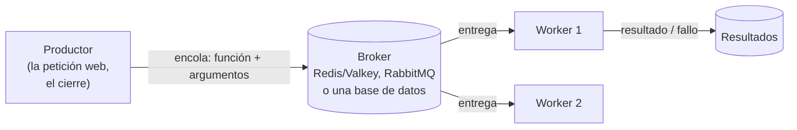

# 🔁 wf02 — Colas de tareas

> Python para desarrolladores Java senior · **Carta** · Track `wf` — Orquestación de trabajos y
> flujos · sección 2 de 8
> Se lee suelta: no hace falta ninguna otra sección de la carta. Conviene haber leído la
> [Fase 15](15-el-proceso-nocturno.md), cuya nota de ecosistema presenta Celery, RQ y `arq`.
> Versiones verificadas contra PyPI el 05/10/2026 · Código probado el 05/10/2026 con Python 3.14.7,
> en contenedor: RQ contra Valkey 9.0.6 (en una red privada) y Huey sobre SQLite.

---

## 🎯 1. Qué problema resuelve

Generar el PDF de la liquidación de un franquiciado tarda unos segundos; generar los seis, con sus
anexos, tarda minutos. Hoy lo hace la misma petición web que Patricia lanza desde el back-office, y
si el navegador espera más de un minuto, la petición se corta y nadie sabe si los PDF quedaron a medio
hacer. El cierre nocturno tiene el problema inverso: un paso que falla porque el portal de la
aseguradora no responde a las 2:00 debería **reintentarse a las 2:30**, no abortar el cierre.

Las dos cosas son el mismo patrón: **trabajo diferido**. La petición web deja un encargo en una cola y
responde de inmediato; un proceso aparte —el *worker*— toma los encargos, los hace, los reintenta si
fallan, y deja el resultado donde se pueda consultar. Es el segundo escalón del eje de `wf01`.

Python tiene cinco colas de tareas vivas y conocidas, y la pregunta que importa no es cuál es mejor,
sino **qué *broker* puedes operar**.

---

## 🧠 2. El modelo

Una cola de tareas tiene tres piezas:



Y una propiedad que decide todo lo demás: **casi todas entregan "al menos una vez"**. Si un *worker*
muere en la mitad de una tarea, la tarea se vuelve a entregar —o se pierde, según la configuración—, y
la única forma segura de vivir con eso es que la tarea sea **idempotente**: hacerla dos veces deja lo
mismo que hacerla una.

| Biblioteca | *Broker* | Lo que la distingue | Para quién |
|---|---|---|---|
| **Celery** (5.6.3) | RabbitMQ, Redis, otros | Hace de todo: grafos de tareas, tareas periódicas, enrutamiento | Equipos con quien la opere |
| **RQ** (2.12.0) | Solo Redis/Valkey | Muy simple: encolas una función y listo | Quien ya tiene Redis |
| **Dramatiq** (2.2.1) | RabbitMQ o Redis | Reintentos con espera exponencial y confirmación tardía **por defecto** | Quien quiere defaults seguros |
| **`arq`** (0.28.0) | Solo Redis/Valkey | Asíncrono de punta a punta | Código `async` |
| **Huey** (3.4.0) | Redis **o SQLite** | Puede no necesitar ningún servicio extra | Un equipo de uno |

### 🪞 Tu instinto de Java dice… y esta vez se equivoca

En Java, el trabajo diferido suele ser JMS o un `@Async` con un `ThreadPoolTaskExecutor` dentro de la
aplicación. El reflejo en Python es usar un hilo de fondo dentro del servidor web. **No sobrevive a un
reinicio**: el servidor se reinicia en cada despliegue, y los PDF que estaba generando desaparecen sin
dejar rastro. La cola existe precisamente para que el encargo viva **fuera** del proceso que lo creó.

### 📖 Diccionario de traducción

| Java | Python | Dónde se rompe el paralelo |
|---|---|---|
| `JmsTemplate.convertAndSend` | `queue.enqueue(funcion, *args)` | En Python se encola **una referencia a una función** y sus argumentos, no un mensaje con forma propia |
| `@JmsListener` | el *worker* de la biblioteca (`rq worker`, `huey_consumer`) | El *worker* es un proceso aparte que importa tu código |
| `@Async` | un hilo de fondo | No es lo mismo: el hilo muere con el proceso |
| `@Retryable` | `Retry(max=3)` en RQ, `retries=3` en Huey | Configurado por tarea, al encolar o al declarar |

---

## 💻 3. El ejemplo que corre

La misma tarea —generar el PDF de una liquidación— en dos colas: RQ sobre Valkey y Huey sobre SQLite.

```bash
uv add rq huey
```

`tareas.py`, el trabajo, igual para las dos:

```python
"""La tarea: generar el PDF de la liquidación de una sede. Idempotente por diseño."""

import time
from pathlib import Path

OUT = Path("liquidaciones")
ATTEMPTS = Path("intentos.log")


def build_settlement_pdf(franchise: str, quarter: str) -> str:
    target = OUT / f"liquidacion-{franchise.lower()}-{quarter}.pdf"
    with ATTEMPTS.open("a") as log:
        log.write(f"{franchise}\n")
    if target.exists():
        return f"ya existía {target.name}"        # idempotente: repetir no duplica ni pisa
    # Simulación de un fallo transitorio: la primera vez, el servicio de firma no responde.
    if franchise == "Suba" and ATTEMPTS.read_text().count("Suba") == 1:
        raise ConnectionError("el servicio de firma no responde")
    time.sleep(0.5)                                 # el PDF de verdad se genera aquí
    OUT.mkdir(exist_ok=True)
    tmp = target.with_suffix(".tmp")
    tmp.write_bytes(b"%PDF-1.7\n")
    tmp.replace(target)                             # aparece completo o no aparece
    return f"generado {target.name}"
```

### Con RQ sobre Valkey

`encolar_rq.py`:

```python
"""Encola las liquidaciones en RQ, con reintentos, y espera los resultados."""

import os
import time

from redis import Redis
from rq import Queue, Retry

from tareas import build_settlement_pdf

queue = Queue("liquidaciones", connection=Redis.from_url(os.environ.get("REDIS_URL", "redis://127.0.0.1:6379")))
jobs = [queue.enqueue(build_settlement_pdf, sede, "2026T3",
                      retry=Retry(max=3, interval=[1, 2, 4]),   # en producción, minutos
                      job_timeout=300, result_ttl=86_400)
        for sede in ("Suba", "Zipaquirá")]
while not all(j.is_finished or j.is_failed for j in jobs):
    time.sleep(0.5)
    for j in jobs:
        j.refresh()
for j in jobs:
    print(j.args[0], j.get_status(), j.return_value())
```

```bash
docker run -d --name valkey -p 6379:6379 valkey/valkey:9.0.6-alpine
rq worker liquidaciones --url redis://127.0.0.1:6379 --with-scheduler &   # el planificador hace los reintentos con espera
python3 encolar_rq.py
```

Salida (Python 3.14.7, 05/10/2026):

```text
Suba JobStatus.FINISHED generado liquidacion-suba-2026T3.pdf
Zipaquirá JobStatus.FINISHED generado liquidacion-zipaquirá-2026T3.pdf
```

`Suba` falló la primera vez, RQ la volvió a encolar con su espera, y el segundo intento la generó. El
productor no se enteró del fallo: solo del resultado.

### Con Huey sobre SQLite, sin ningún servicio

`cola_huey.py`:

```python
"""La misma tarea en Huey, con SQLite como broker: un archivo, ningún servidor."""

from huey import SqliteHuey

import tareas

huey = SqliteHuey(filename="cola.db")


@huey.task(retries=3, retry_delay=1)
def build_settlement_pdf(franchise: str, quarter: str) -> str:
    return tareas.build_settlement_pdf(franchise, quarter)
```

```bash
huey_consumer cola_huey.huey --workers 2 &
python3 -c "
from cola_huey import build_settlement_pdf
results = [build_settlement_pdf(s, '2026T4') for s in ('Suba', 'Zipaquirá')]
print([r.get(blocking=True, timeout=30) for r in results])"
```

La cola es el archivo `cola.db`. Para un equipo de una persona, eso cambia la cuenta: no hay Redis que
monitorear, respaldar ni actualizar, y la cola sobrevive a un reinicio porque es un archivo.

**Detalles con intención**

- **La tarea es una función del dominio**, que se puede llamar a mano y probar sin ninguna cola. Las
  colas la **envuelven**; no la contienen.
- **Idempotencia por existencia del archivo**, y escritura atómica con `.tmp` y `replace`: si el
  *worker* muere después de escribir y antes de confirmar, el reintento encuentra el PDF y no lo pisa.
- **`result_ttl`** dice cuánto vive el resultado en Valkey. Sin él, los resultados se acumulan para
  siempre en la memoria del *broker*.
- **`--with-scheduler`** arranca, junto al *worker*, el planificador que mueve las tareas programadas
  —los reintentos con espera— a la cola cuando les toca. Sin él, `Retry(interval=…)` deja la tarea
  esperando para siempre (§4).

---

## ⚠️ 4. Lo que se rompe

**El reintento que nunca llega.** En RQ, un reintento con `interval` no vuelve a la cola: queda
**programado**, y lo mueve el planificador. La primera versión de esta sección arrancaba el *worker*
con `--burst` —que termina cuando la cola se vacía— y sin `--with-scheduler`. En la prueba, Suba falló,
su reintento quedó programado, el *worker* vio la cola vacía y se fue, y el productor se quedó
esperando sin ningún error. El *worker* que procesa reintentos con espera lleva planificador y no es
`--burst`.

**Encolar objetos que no se pueden serializar.** La cola guarda la función y los argumentos con
`pickle` (RQ y Huey por defecto). Un argumento que es una conexión a la base de datos o un archivo
abierto falla al encolar, o peor, se serializa y no sirve del otro lado. Se encolan **identificadores**,
no objetos: `"Suba", "2026T3"`, no la sesión de SQLAlchemy.

**El código del *worker* desactualizado.** El *worker* importa tu código cuando arranca. Si despliegas
una versión nueva de `tareas.py` y no reinicias los *workers*, siguen corriendo la vieja. Y si cambias la
firma de una función, las tareas encoladas con la firma anterior fallan al ejecutarse.

**La confirmación temprana.** Celery confirma por defecto la tarea **al recibirla**, no al terminarla:
si el *worker* muere a la mitad, la tarea se pierde. `acks_late=True` lo invierte —y con él llega la
reentrega, y la necesidad de idempotencia—. Dramatiq confirma tarde por defecto, que es una de sus
razones para existir.

**`pickle` desde un broker expuesto.** Quien pueda escribir en el *broker* puede encolar un objeto que
ejecute código al deserializarse. El *broker* va en una red privada, con contraseña, nunca expuesto.

---

## ⚖️ 5. Cuándo NO usarla

**Para tres trabajos nocturnos sin reintentos diferidos.** Es la conclusión de la Fase 15: `cron`.

**Cuando el trabajo diferido es corto y se puede perder.** Un correo de cortesía o una métrica pueden
ir en una tarea de fondo del propio framework (`BackgroundTasks` de FastAPI), que no sobrevive a un
reinicio y no lo necesita.

**Cuando hay dependencias entre tareas.** Celery tiene `chain` y `chord`, y funcionan; pero un grafo de
diez tareas con dependencias se lee, se reanuda y se ve mejor en un orquestador de grafos (`wf04`,
`wf05`).

---

## 🧪 6. Ejercicios (10)

**🟢 Fácil (1–3)**

1. Encola las dos liquidaciones dos veces seguidas. **Criterio:** la segunda vez las dos responden "ya
   existía", y `intentos.log` muestra los cuatro intentos más el reintento de Suba.
2. Quita el `retry=` de RQ. **Criterio:** Suba termina en `failed` y explicas dónde la ves con
   `rq info` o en el registro de fallidas.
3. Pasa como argumento un archivo abierto en vez del nombre de la sede. **Criterio:** describes el error
   y en qué momento ocurre: al encolar o al ejecutar.

**🟡 Intermedio (4–6)**

4. Busca en la documentación de RQ qué pasa con una tarea cuyo *worker* muere a la mitad (`kill -9`).
   **Criterio:** lo reproduces y explicas en qué registro queda la tarea y si se reintenta sola.
5. Implementa la misma tarea en Dramatiq con Redis. **Criterio:** reintentos con espera exponencial sin
   configurar nada extra, y explicas qué hace su `Retries` por defecto.
6. Mide cuánto ocupa en Valkey cada resultado y qué pasa sin `result_ttl` después de mil tareas.
   **Criterio:** reportas la memoria usada (`INFO memory`) antes y después.

**🟠 Difícil (7–9)**

7. Reproduce la pérdida con Celery y `acks_late=False`: mata el *worker* durante una tarea larga.
   **Criterio:** la tarea se pierde; con `acks_late=True` se reentrega, y la idempotencia evita el
   duplicado.
8. Despliega una versión nueva de `tareas.py` con una firma distinta mientras hay tareas encoladas con
   la vieja. **Criterio:** reproduces el fallo y propones la regla de despliegue que lo evita.
9. Compara la latencia de encolar y completar 1.000 tareas triviales en RQ sobre Valkey y en Huey sobre
   SQLite. **Criterio:** tareas por segundo de cada una, con la máquina, y la conclusión para el volumen
   de Áurea.

**🔴 Muy difícil (10)**

10. Mueve la generación de liquidaciones del back-office a una cola, con su estado visible para
    Patricia. **Criterio:** un prototipo y un documento de una página. *Rúbrica:* (a) la petición web
    responde en menos de un segundo con un identificador de trabajo; (b) Patricia ve "en curso",
    "listo" o "falló, reintentando" sin recargar a ciegas; (c) un reinicio del servidor web no pierde
    ningún encargo; (d) justificas el *broker* elegido con lo que cuesta operarlo.

---

## 📚 7. Referencias

**Documentación oficial**

- RQ, reintentos y registros de trabajos: https://python-rq.org/docs/
- Huey: https://huey.readthedocs.io/
- Dramatiq, la guía de motivación (por qué existe frente a Celery): https://dramatiq.io/motivation.html
- Celery, confirmación tardía (`acks_late`): https://docs.celeryq.dev/en/stable/userguide/tasks.html

**Orden de lectura sugerido:** la página de motivación de Dramatiq, que es la mejor explicación de los
defaults que importan en cualquier cola; después la de la que elijas.

---

## 🚀 8. Cierre

Una cola de tareas saca el trabajo lento del proceso que lo pidió y lo reintenta cuando falla. Se elige
por el *broker* que puedes operar —y Huey sobre SQLite demuestra que a veces es ninguno—, y en todas
vale la misma regla: lo que se reintenta tiene que ser idempotente, porque se va a reintentar.

**La señal de que quedó bien:** *"El servicio de firma se cayó a las 2:00, la liquidación de Suba se
generó en el reintento de las 2:01, y nadie tuvo que relanzar nada."*

> 🏷️ **Cierra la sección con su tag**, cuando los ejercicios que elegiste estén hechos:
>
> ```bash
> git tag -a op-wf-fase-02 -m "op wf02 cerrada: la misma tarea en RQ y en Huey, idempotente"
> ```
>
> Los commits llevan su prefijo (`op wf02: …`) y los de ejercicio su número
> (`op wf02 ej07: …`).
