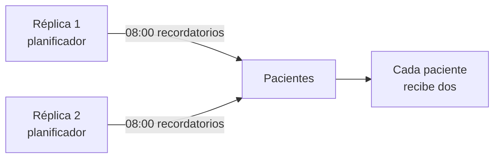

# 🔁 wf03 — Programación en proceso

> Python para desarrolladores Java senior · **Carta** · Track `wf` — Orquestación de trabajos y
> flujos · sección 3 de 8
> Se lee suelta: no hace falta ninguna otra sección de la carta. Conviene haber leído la
> [Fase 15](15-el-proceso-nocturno.md), que argumenta por qué el planificador vive **fuera** del
> proceso.
> Versiones verificadas contra PyPI el 05/10/2026 · Código probado el 05/10/2026 con Python 3.14.7,
> en contenedor: las dos réplicas con APScheduler, y la zona horaria de `schedule`.

---

## 🎯 1. Qué problema resuelve

La Fase 15 defiende que el planificador viva fuera del proceso: si el proceso muere, `cron` sigue
vivo, y cambiar la hora no exige desplegar nada. Es la regla correcta para trabajos que **arrancan,
hacen algo y terminan**. Pero hay otra clase de trabajo periódico que no encaja ahí: el que vive
**dentro** de un servicio que ya está corriendo todo el día.

AgendaAPI, el servicio de agenda de la red, guarda en memoria la disponibilidad de los odontólogos
para responder rápido, y esa copia hay que refrescarla cada cinco minutos. Lanzar un proceso aparte
con `cron` para eso no sirve: el proceso nuevo no tiene acceso a la memoria del servicio. El trabajo
periódico pertenece al proceso, y para eso existen los planificadores en proceso:
**APScheduler** (3.11.3, del 2026-06-28) y `schedule` (1.2.2, quieto desde mayo de 2024).

Esta sección enseña a usarlos y, sobre todo, las dos trampas que traen: **qué pasa con las corridas
que se perdieron** mientras el proceso estaba caído, y **qué pasa cuando hay dos copias del servicio**.

---

## 🧠 2. El modelo

Un planificador en proceso es un hilo (o una tarea de `asyncio`) que despierta a las horas indicadas y
llama a funciones. Tres conceptos de APScheduler deciden casi todo su comportamiento:

| Concepto | Qué decide | El valor que casi siempre conviene |
|---|---|---|
| **Disparador** (*trigger*) | Cuándo: cada N minutos (`interval`), a una hora (`cron`), una vez (`date`) | Con zona horaria explícita |
| **`coalesce`** | Si se perdieron varias corridas, ¿se ejecutan todas o una sola? | `True`: una sola |
| **`max_instances`** | ¿Puede correr de nuevo si la anterior no terminó? | `1`: nunca se solapa consigo misma |
| **`misfire_grace_time`** | ¿Cuánto tarde puede correr una ejecución atrasada antes de descartarse? | Un poco menos que el intervalo |

Y una cuarta cosa que **no** es un concepto de APScheduler sino del despliegue: **cada copia del
proceso tiene su propio planificador**. Si AgendaAPI corre en dos réplicas detrás de un balanceador,
el refresco de la caché corre dos veces. Para refrescar una caché local está bien —cada réplica tiene
la suya—; para mandar los recordatorios del día, es mandar cada recordatorio dos veces.



### 🪞 Tu instinto de Java dice… y esta vez se equivoca

En Spring, `@Scheduled` es la forma natural de cualquier trabajo periódico, y con varias instancias
se agrega ShedLock para que solo una lo ejecute. El reflejo en Python es buscar el `@Scheduled` de
Python y meter ahí todo. **Lo que en Java es un trabajo de `@Scheduled` en Python suele ser un `cron`
o un timer**, porque arrancar el proceso de Python para una tarea es barato. El planificador en
proceso queda para lo que de verdad necesita el estado del proceso, y para eso sí: con su equivalente
de ShedLock, que es un bloqueo fuera del proceso.

---

## 💻 3. El ejemplo que corre

```bash
uv add apscheduler
```

`agenda_cache.py` simula dos réplicas de AgendaAPI en el mismo proceso, cada una con su planificador,
y dos trabajos: el refresco de la caché local (que **debe** correr en las dos) y el envío de
recordatorios (que debe correr en **una sola**). La exclusión se hace con un bloqueo de archivo; en
producción sería un bloqueo de la base de datos compartida.

```python
"""Dos réplicas con planificador propio: un trabajo por réplica y otro una sola vez en total."""

import fcntl
import threading
import time
from contextlib import contextmanager
from zoneinfo import ZoneInfo

from apscheduler.schedulers.background import BackgroundScheduler

BOGOTA = ZoneInfo("America/Bogota")
log: list[str] = []
log_lock = threading.Lock()


def record(text: str) -> None:
    with log_lock:
        log.append(text)


@contextmanager
def single_runner(name: str):
    """El ShedLock de esta sección: un bloqueo exclusivo y no bloqueante sobre un archivo."""
    with open(f"/tmp/{name}.lock", "w") as handle:
        try:
            fcntl.flock(handle, fcntl.LOCK_EX | fcntl.LOCK_NB)
        except BlockingIOError:
            yield False                     # otra réplica lo tiene: esta no hace nada
            return
        try:
            yield True
        finally:
            fcntl.flock(handle, fcntl.LOCK_UN)


def refresh_cache(replica: str) -> None:
    record(f"{replica}: caché refrescada")      # cada réplica tiene la suya: corre en todas


def send_reminders(replica: str) -> None:
    with single_runner("recordatorios") as mine:
        if not mine:
            record(f"{replica}: recordatorios — los manda otra réplica")
            return
        time.sleep(0.3)                          # mandar los recordatorios del día
        record(f"{replica}: recordatorios enviados")


def start_replica(name: str) -> BackgroundScheduler:
    scheduler = BackgroundScheduler(
        timezone=BOGOTA,
        job_defaults={"coalesce": True, "max_instances": 1, "misfire_grace_time": 30},
    )
    scheduler.add_job(refresh_cache, "interval", seconds=1, args=[name], id="cache")
    # En producción: "cron", hour=8. Aquí, cada dos segundos para verlo en la prueba.
    scheduler.add_job(send_reminders, "interval", seconds=2, args=[name], id="reminders")
    scheduler.start()
    return scheduler


if __name__ == "__main__":
    replicas = [start_replica("réplica-1"), start_replica("réplica-2")]
    time.sleep(2.5)
    for scheduler in replicas:
        scheduler.shutdown(wait=True)
    for line in sorted(log):
        print(line)
```

```bash
python3 agenda_cache.py
```

Salida (Python 3.14.7, 05/10/2026):

```text
réplica-1: caché refrescada
réplica-1: caché refrescada
réplica-1: recordatorios enviados
réplica-2: caché refrescada
réplica-2: caché refrescada
réplica-2: recordatorios — los manda otra réplica
```

La caché se refrescó en las dos réplicas, dos veces cada una, que es lo correcto. Los recordatorios
se mandaron **una vez**: la segunda réplica encontró el bloqueo tomado y no hizo nada. Cuál de las dos
los manda depende de cuál llegó primero, y no importa.

**Detalles con intención**

- **`timezone=BOGOTA` explícito.** Sin él, APScheduler usa la zona horaria local de la máquina, que en
  un servidor suele ser UTC: "a las 8" se convierte en las 3 de la madrugada de Bogotá.
- **`coalesce=True`**: si el proceso estuvo detenido diez minutos, al volver refresca la caché **una**
  vez, no diez seguidas.
- **`max_instances=1`**: si el envío de recordatorios tarda más que su intervalo, la siguiente
  ejecución se salta en vez de empezar encima de la anterior.
- **El bloqueo es no bloqueante** (`LOCK_NB`): la réplica que no lo consigue no espera, se va. Esperar
  sería mandar los recordatorios dos veces, solo que un poco más tarde.

### `schedule`, la versión mínima

```python
import time

import schedule

schedule.every(5).minutes.do(refresh_cache, "réplica-1")
schedule.every().day.at("08:00", "America/Bogota").do(send_reminders, "réplica-1")
while True:
    schedule.run_pending()
    time.sleep(1)
```

`schedule` es legible y no tiene hilos propios: corre en el bucle que tú escribes. A cambio, no tiene
`coalesce`, ni `max_instances`, ni persistencia. Está quieto desde mayo de 2024, y para lo que hace —un
bucle con horarios— casi no necesita cambiar.

> ⚠️ **La zona horaria de `schedule` necesita `pytz`, y no lo declara.** `.at("08:00",
> "America/Bogota")` importa `pytz` por dentro, pero el paquete no lo instala: sin él, la línea falla
> con `ModuleNotFoundError: No module named 'pytz'`. Lo encontró la prueba de esta sección. La
> instalación es `uv add schedule pytz` (`pytz` 2026.5, del 2026-10-04).

---

## ⚠️ 4. Lo que se rompe

**El planificador en un servidor web con varios *workers*.** Gunicorn o Uvicorn con cuatro procesos
*workers* arrancan **cuatro** planificadores, aunque haya una sola máquina. El síntoma es el mismo de las
réplicas, y aparece en desarrollo sin que nadie haya pensado en réplicas.

**Las corridas perdidas que no se recuperan.** El planificador vive en la memoria del proceso: si el
proceso estuvo caído a las 8:00, el trabajo de las 8:00 no corrió, y por defecto no correrá. APScheduler
puede guardar sus trabajos en una base de datos (*job stores*) y recuperar lo perdido dentro de
`misfire_grace_time`; un timer de `systemd` con `Persistent=true` lo hace sin código.

**El trabajo largo que bloquea a los demás.** Con un `BackgroundScheduler` y su grupo de hilos por
defecto, un trabajo que tarda veinte minutos ocupa un hilo veinte minutos. Si los trabajos largos son
varios, se quedan sin hilos y los cortos se atrasan.

---

## ⚖️ 5. Cuándo NO usarla

**Para trabajos que arrancan, hacen algo y terminan.** Es la regla de la Fase 15, y sigue en pie:
`cron` o un timer, fuera del proceso.

**Para trabajos que tienen que correr exactamente una vez en un sistema con réplicas**, si no tienes
dónde poner un bloqueo compartido. Sin bloqueo, la respuesta es sacar el trabajo del servicio y
ponerlo en un único lugar: un timer, o una tarea de una cola.

**Como orquestador.** Un planificador en proceso no sabe de dependencias ni tiene panel. Si los
trabajos periódicos empiezan a depender unos de otros, es el escalón de los grafos (`wf04`, `wf05`).

---

## 🧪 6. Ejercicios (10)

**🟢 Fácil (1–3)**

1. Quita el `single_runner` de `send_reminders`. **Criterio:** la salida muestra los recordatorios
   enviados por las dos réplicas.
2. Quita `timezone=BOGOTA` y agrega un trabajo `cron` a las 8:00. **Criterio:** muestras, con
   `scheduler.get_jobs()`, a qué hora UTC quedó programado con y sin la zona.
3. Haz que `refresh_cache` tarde tres segundos con un intervalo de uno. **Criterio:** con
   `max_instances=1` las ejecuciones no se solapan, y el registro de APScheduler dice que se saltaron.

**🟡 Intermedio (4–6)**

4. Busca en la documentación de APScheduler cómo se configura un *job store* en SQLAlchemy y úsalo con
   SQLite. **Criterio:** al reiniciar el proceso, los trabajos siguen programados sin volver a
   agregarlos.
5. Detén el proceso durante tres intervalos y vuelve a arrancarlo con `coalesce=True` y con
   `coalesce=False`. **Criterio:** cuentas cuántas veces corre el trabajo atrasado en cada caso.
6. Reemplaza el bloqueo de archivo por un *advisory lock* de PostgreSQL (`pg_try_advisory_lock`).
   **Criterio:** dos procesos en contenedores distintos contra la misma base: solo uno manda los
   recordatorios.

**🟠 Difícil (7–9)**

7. Arranca AgendaAPI con Uvicorn y cuatro *workers*, con el planificador dentro de la aplicación.
   **Criterio:** reproduces los cuatro envíos y propones dónde arrancar el planificador para que haya
   uno solo.
8. Usa el `AsyncIOScheduler` dentro de la aplicación FastAPI de la Fase 10, arrancándolo y
   deteniéndolo en el ciclo de vida de la aplicación. **Criterio:** el planificador se detiene limpio al
   apagar el servidor, sin trabajos a medias.
9. Mide la deriva de un trabajo de intervalo de un segundo durante diez minutos en una máquina cargada.
   **Criterio:** reportas el retraso máximo y medio, y si se acumula.

**🔴 Muy difícil (10)**

10. Decide, para cada trabajo periódico de Áurea, si va en proceso, en un timer o en una cola.
    **Criterio:** una tabla con todos los trabajos y un documento de una página. *Rúbrica:* (a) cada
    trabajo en proceso justifica qué estado del proceso necesita; (b) cada trabajo que debe correr una
    vez tiene su mecanismo de exclusión nombrado; (c) dices qué pasa con cada uno si el servicio está
    caído a su hora; (d) dices cómo lo cambiarías si AgendaAPI pasara a tres réplicas.

---

## 📚 7. Referencias

**Documentación oficial**

- APScheduler 3.x, guía de uso: https://apscheduler.readthedocs.io/en/3.x/userguide.html
- `schedule`: https://schedule.readthedocs.io/en/stable/
- `fcntl.flock`: https://docs.python.org/3/library/fcntl.html#fcntl.flock

**Orden de lectura sugerido:** la guía de uso de APScheduler 3.x, en concreto las secciones de
*job stores* y de ejecuciones perdidas; la documentación apunta a veces a la versión 4, todavía en
desarrollo, y conviene fijarse en el selector de versión.

---

## 🚀 8. Cierre

El planificador en proceso es para el trabajo periódico que necesita el estado de un servicio que ya
está corriendo. Se configura con zona horaria, `coalesce` y `max_instances`, y se despliega sabiendo
que cada copia del proceso trae el suyo: lo que debe correr una sola vez necesita un bloqueo fuera del
proceso.

**La señal de que quedó bien:** *"AgendaAPI pasó a dos réplicas y los pacientes siguieron recibiendo un
recordatorio, no dos."*

> 🏷️ **Cierra la sección con su tag**, cuando los ejercicios que elegiste estén hechos:
>
> ```bash
> git tag -a op-wf-fase-03 -m "op wf03 cerrada: APScheduler con zona, coalesce y bloqueo entre réplicas"
> ```
>
> Los commits llevan su prefijo (`op wf03: …`) y los de ejercicio su número
> (`op wf03 ej07: …`).
