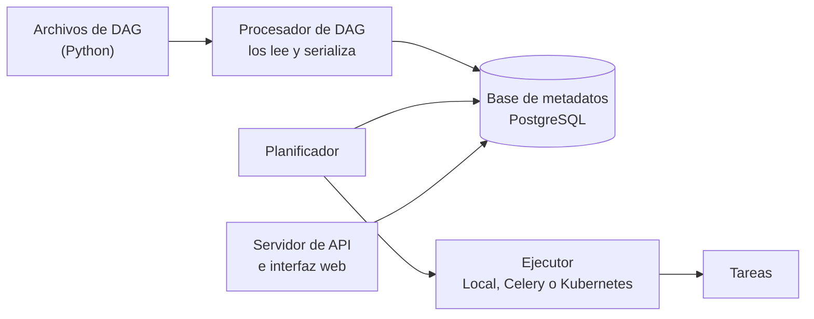

# 🔁 wf04 — Airflow: el grafo declarativo

> Python para desarrolladores Java senior · **Carta** · Track `wf` — Orquestación de trabajos y
> flujos · sección 4 de 8
> Se lee suelta: no hace falta ninguna otra sección de la carta.
> Versiones verificadas contra PyPI el 05/10/2026 · Código probado el 05/10/2026 con Python 3.14.7,
> en contenedor: `airflow db migrate` y `airflow dags test` con Airflow 3.3.2 y SQLite.

---

## 🎯 1. Qué problema resuelve

Cuando la noche deja de ser tres trabajos y pasa a ser un grafo —consolidar, después radicar y calcular
regalías en paralelo, después glosas y comisiones, al final el informe—, hace falta algo que entienda
dependencias, reintente cada paso por su cuenta, permita **reanudar desde el paso que falló** sin
repetir los anteriores, y muestre en un panel qué pasó anoche. Ese es el tercer escalón del eje, y
**Apache Airflow** (3.3.2, del 2026-09-17) es su estándar de hecho: lo usa media industria de datos, y
casi cualquier equipo con el que Áurea llegue a integrarse lo conoce.

Esta sección escribe la noche de Áurea como un DAG de Airflow 3, la corre en la máquina sin servidor,
y termina con lo que la documentación no pone en la primera página: **cuánto cuesta operarlo**.

---

## 🧠 2. El modelo

Un DAG de Airflow es **un archivo de Python que describe un grafo**; no es el grafo corriendo. Airflow
lee el archivo, construye el grafo y lo guarda; el planificador decide cuándo toca una ejecución y
manda cada tarea a un ejecutor. Las piezas que hay que operar son varias:



Tres conceptos de Airflow cambian cómo se escribe el código de las tareas:

- **La fecha lógica.** Cada ejecución tiene una fecha lógica —"la noche del 5 de octubre"— y la tarea
  la recibe. La tarea correcta procesa **su** fecha, no "lo que haya hoy": así, relanzar la ejecución
  de anteayer procesa los datos de anteayer. En Airflow 3, un `schedule` escrito como expresión `cron`
  usa por defecto un *timetable* de disparo: el intervalo de datos se reduce a un punto
  (`data_interval_start` igual a `data_interval_end`), que es un cambio respecto de Airflow 2, donde
  cada ejecución cubría el intervalo anterior. Si tus tareas razonan en intervalos, eso se configura
  explícitamente.
- **Las tareas no comparten memoria.** Cada una corre en su proceso, a veces en otra máquina. Lo que
  pasa de una a otra (XCom) es para valores pequeños —un identificador, una ruta—, nunca para los datos.
- **`catchup` y *backfill*.** Si el DAG se crea hoy con fecha de inicio de hace un mes, Airflow puede
  correr las treinta noches pendientes. Es potentísimo para reconstruir historia y es un desastre si
  nadie lo esperaba.

### 🪞 Tu instinto de Java dice… y esta vez se equivoca

Viniendo de Spring Batch, el reflejo es meter la lógica dentro de las tareas de Airflow, como si cada
`@task` fuera un `Step` con su `ItemProcessor`. En Airflow la tarea tiene que ser **delgada**: llama a
una función del dominio que vive en tu paquete, se puede correr a mano y se prueba sin Airflow. Si la
liquidación de regalías vive dentro del archivo del DAG, no hay forma de probarla sin levantar Airflow,
y cambiar de orquestador es reescribirla.

---

## 💻 3. El ejemplo que corre

```bash
uv add "apache-airflow==3.3.2"
```

Airflow publica un archivo de *constraints* por versión de Airflow y de Python, porque sus cientos de
dependencias transitivas solo están probadas juntas; en producción se instala con él (la guía de
instalación lo explica). Para el ejemplo basta la línea de arriba.

`dags/noche_aurea.py`:

```python
"""La noche de Áurea como DAG de Airflow 3: tareas delgadas que llaman al dominio."""

import datetime as dt

from airflow.sdk import dag, task


# En un proyecto real estas funciones viven en el paquete de Cartera y se importan.
def consolidate_rips(day: str) -> str:
    return f"/datos/rips/{day}.json"


def file_claims(batch: str) -> int:
    return 12


def compute_royalties(batch: str) -> int:
    return 6


@dag(
    schedule="0 2 * * *",
    start_date=dt.datetime(2026, 10, 1, tzinfo=dt.timezone(dt.timedelta(hours=-5))),
    catchup=False,                      # no correr las noches pasadas al activar el DAG
    default_args={"retries": 2, "retry_delay": dt.timedelta(minutes=10)},
    tags=["cartera"],
)
def noche_aurea():
    @task
    def consolidar(logical_date=None) -> str:
        # La tarea procesa SU noche, no "hoy": relanzar la del día 3 procesa el día 3.
        return consolidate_rips(logical_date.strftime("%Y-%m-%d"))

    @task
    def radicar(batch: str) -> int:
        return file_claims(batch)

    @task
    def regalias(batch: str) -> int:
        return compute_royalties(batch)

    @task
    def informe(radicadas: int, liquidadas: int) -> None:
        print(f"radicadas {radicadas}, liquidaciones {liquidadas}")

    batch = consolidar()                       # pasa una RUTA, no los datos
    informe(radicar(batch), regalias(batch))   # radicar y regalias corren en paralelo


noche_aurea()
```

`airflow dags test` corre una ejecución completa del DAG en el propio proceso, sin planificador ni
servidor, con una base SQLite temporal:

```bash
export AIRFLOW_HOME=$PWD/airflow-home AIRFLOW__CORE__DAGS_FOLDER=$PWD/dags AIRFLOW__CORE__LOAD_EXAMPLES=False
airflow db migrate
airflow dags test noche_aurea 2026-10-05
```

Salida (Python 3.14.7, 05/10/2026), recortada: Airflow escribe varias líneas por tarea.

```text
... get next_dagrun_info_v2 ... run_after=DateTime(2026, 10, 5, 7, 0, 0, tzinfo=Timezone('UTC')) ...
... Task instance state updated ... new_state=success ...
... Task instance state updated ... new_state=success ...
... Task instance state updated ... new_state=success ...
radicadas 12, liquidaciones 6
... Task instance state updated ... new_state=success ...
... DagRun Finished: dag_id=noche_aurea, logical_date=2026-10-05 00:00:00+00:00, ... state=success,
    ... data_interval_start=2026-10-05 00:00:00+00:00, data_interval_end=2026-10-05 00:00:00+00:00
```

Dos datos que da esta salida y que valen la sección: la próxima ejecución programada es a las
**07:00 UTC, que son las 2:00 de Bogotá** —el `start_date` con zona hizo su trabajo—, y el intervalo de
datos empieza y termina en el mismo instante, que es la semántica de Airflow 3 descrita en §2.

**Detalles con intención**

- **`from airflow.sdk import dag, task`** es la API de Airflow 3. El código de Airflow 2 importaba de
  `airflow.decorators` y de `airflow.models`, y buena parte de lo que se encuentra en internet todavía
  lo hace.
- **`catchup=False`** al activar un DAG nuevo, salvo que quieras reconstruir el pasado a propósito.
- **Lo que viaja entre tareas es una ruta y dos números**: XCom guarda los valores devueltos en la base
  de metadatos, y un DataFrame de cien mil filas ahí es un problema de rendimiento de toda la
  instalación.
- **`logical_date`** se inyecta en la tarea por nombre. Es la diferencia entre una tarea que se puede
  relanzar para cualquier noche y una que solo sabe procesar "hoy".

---

## ⚠️ 4. Lo que se rompe

**El código del archivo de DAG que se ejecuta a cada rato.** El procesador de DAG **importa el archivo
una y otra vez** para detectar cambios. Una consulta a la base de datos o una llamada a una API escrita
a nivel de módulo —fuera de las tareas— se ejecuta cada vez que se lee el archivo, aunque ninguna tarea
corra. El archivo del DAG solo **declara**.

**El `start_date` dinámico.** `start_date=dt.datetime.now()` parece razonable y hace que el DAG nunca
llegue a tener una ejecución, porque la fecha de inicio se mueve cada vez que se lee el archivo. La
fecha de inicio es fija.

**La zona horaria.** Airflow guarda todo en UTC. Un `schedule="0 2 * * *"` sin zona en el `start_date`
corre a las 2:00 UTC, que son las 9:00 p. m. del día anterior en Bogotá. El `start_date` con zona fija
la interpretación del horario.

**Subir de Airflow 2 a 3 sin leer la guía.** La versión 3 separó el servidor de API del planificador,
movió la API de los DAG al *Task SDK* y cambió el modelo de acceso a la base de metadatos desde las
tareas. Los DAG de la versión 2 necesitan cambios, y la guía de actualización los enumera.

---

## ⚖️ 5. Cuándo NO usarla

**Para Áurea, hoy.** Airflow en producción es, como mínimo, un planificador, un servidor de API, un
procesador de DAG, un PostgreSQL de metadatos y sus respaldos, con actualizaciones dos o tres veces al
año. Para seis trabajos y un solo ingeniero, eso es más operación que la noche entera. La respuesta
honesta de la Fase 15 —`cron` con tabla de avance— sigue ganando hasta que haya varias decenas de
trabajos o un equipo de plataforma.

**Cuando el grafo es de funciones de Python que se llaman entre sí.** Prefect y Dagster (`wf05`) hacen
ese caso con menos ceremonia y sin un procesador de archivos de DAG.

**Para procesos de días con esperas humanas.** Airflow planifica ejecuciones por intervalos; un proceso
que espera tres días a que un franquiciado apruebe algo es el caso de un flujo durable (`wf06`).

**Cuando lo necesitas pero no quieres operarlo.** Hay servicios administrados de Airflow en las
principales nubes; se paga la operación en vez de hacerla.

---

## 🧪 6. Ejercicios (10)

**🟢 Fácil (1–3)**

1. Haz que `radicar` falle con una excepción y corre `airflow dags test`. **Criterio:** `informe` queda
   en estado `upstream_failed`, y explicas qué significa.
2. Agrega la tarea `glosas_por_vencer` después de `radicar` y haz que el informe la espere.
   **Criterio:** el grafo en la interfaz (o en `airflow dags show`) tiene la forma esperada.
3. Corre `airflow dags test` para dos fechas distintas. **Criterio:** `consolidar` devuelve dos rutas
   distintas, una por noche.

**🟡 Intermedio (4–6)**

4. Busca en la guía de actualización de Airflow 3 tres cambios que afecten a un DAG escrito para Airflow
   2. **Criterio:** los tres, cada uno con el código de antes y el de ahora.
5. Mueve las funciones del dominio a un paquete aparte y escribe pruebas con `pytest` que no importen
   Airflow. **Criterio:** las pruebas corren sin Airflow instalado.
6. Pon una consulta lenta (`time.sleep(5)`) a nivel de módulo en el archivo del DAG y mide cuánto tarda
   el procesador en leerlo. **Criterio:** reportas el tiempo y explicas por qué ese código se ejecuta
   aunque no corra ninguna tarea.

**🟠 Difícil (7–9)**

7. Levanta Airflow completo con su `docker compose` oficial y corre la noche desde la interfaz.
   **Criterio:** reanudas una ejecución desde la tarea fallida (`clear` de esa tarea) sin repetir
   `consolidar`.
8. Haz un *backfill* de las cinco noches anteriores con `catchup` controlado. **Criterio:** cinco
   ejecuciones, una por noche, y explicas qué pasaría si `consolidar` usara la fecha de hoy en vez de
   `logical_date`.
9. Pasa un DataFrame de 100.000 filas por XCom en vez de una ruta y mide el tamaño de la fila en la base
   de metadatos. **Criterio:** reportas el tamaño y la alternativa.

**🔴 Muy difícil (10)**

10. Calcula el costo de operar Airflow para Áurea durante un año. **Criterio:** un documento de una página
    con horas y dinero. *Rúbrica:* (a) incluye máquina, base de datos, respaldos y actualizaciones, con
    precios publicados y su fecha; (b) incluye las horas del único ingeniero; (c) lo compara con `cron`
    más tabla de avance y con un servicio administrado; (d) dice con cuántos trabajos y dependencias
    cambiaría la recomendación.

---

## 📚 7. Referencias

**Documentación oficial**

- Airflow, conceptos básicos: https://airflow.apache.org/docs/apache-airflow/stable/core-concepts/index.html
- La API de TaskFlow: https://airflow.apache.org/docs/apache-airflow/stable/tutorial/taskflow.html
- Instalación con *constraints*: https://airflow.apache.org/docs/apache-airflow/stable/installation/installing-from-pypi.html
- Actualizar a Airflow 3: https://airflow.apache.org/docs/apache-airflow/stable/installation/upgrading_to_airflow3.html

**Orden de lectura sugerido:** los conceptos básicos, en concreto la parte de la fecha lógica y los
intervalos de datos; después el tutorial de TaskFlow; y la guía de actualización solo si heredas DAG de
Airflow 2.

---

## 🚀 8. Cierre

Airflow describe la noche como un grafo en un archivo de Python, y a cambio pide operar cuatro piezas y
una base de datos. Las tareas se escriben delgadas, procesan su propio intervalo y se pasan rutas, no
datos. Y la primera pregunta no es cómo se escribe el DAG, sino si hay quién lo opere.

**La señal de que quedó bien:** *"Falló la radicación de anoche, relanzamos solo esa tarea esta mañana,
y procesó los datos de anoche, no los de hoy."*

> 🏷️ **Cierra la sección con su tag**, cuando los ejercicios que elegiste estén hechos:
>
> ```bash
> git tag -a op-wf-fase-04 -m "op wf04 cerrada: la noche como DAG de Airflow 3 con TaskFlow"
> ```
>
> Los commits llevan su prefijo (`op wf04: …`) y los de ejercicio su número
> (`op wf04 ej07: …`).
