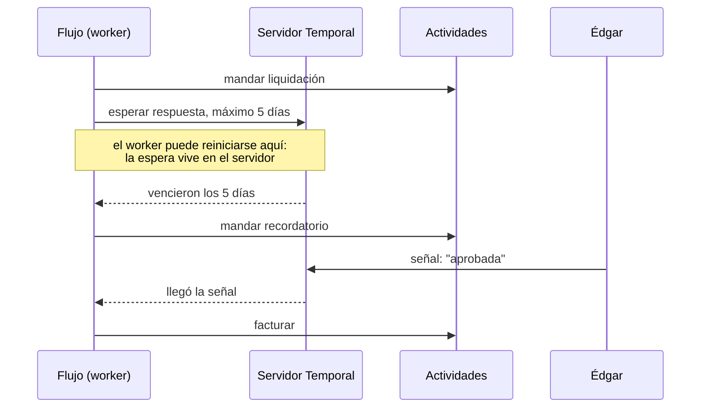

# 🔁 wf06 — Temporal: flujos durables

> Python para desarrolladores Java senior · **Carta** · Track `wf` — Orquestación de trabajos y
> flujos · sección 6 de 8
> Se lee suelta: no hace falta ninguna otra sección de la carta.
> Versiones verificadas contra PyPI el 05/10/2026 · Código probado el 05/10/2026 con Python 3.14.7,
> en contenedor, con el entorno de pruebas de Temporal que salta el tiempo.

---

## 🎯 1. Qué problema resuelve

Cada trimestre, Áurea manda a Édgar su liquidación de regalías, y Édgar la discute. El proceso real
dura semanas: se manda la liquidación; si en cinco días no responde, se le recuerda; si en otros cinco
sigue sin responder, se escala a Julián; si responde "no estoy de acuerdo", se abre una revisión que
puede tardar otro mes; y si la aprueba, se factura. Hoy todo eso vive en la memoria de Patricia y en un
hilo de correos.

Ningún escalón anterior del track resuelve bien esto. `cron` no recuerda que hace cinco días se mandó
algo. Una cola no espera días. Un grafo de Airflow planifica ejecuciones por intervalos, no procesos que
esperan una respuesta humana. Lo que hace falta es un **programa que pueda esperar diez días a que pase
algo, sobrevivir a todos los reinicios de servidores de esos diez días, y seguir exactamente donde
estaba**. Eso es un flujo durable, y **Temporal** es la plataforma de referencia; su SDK de Python es
`temporalio` (1.34.0, del 2026-09-30).

---

## 🧠 2. El modelo

En Temporal escribes el proceso como **una función asíncrona normal**, con esperas, condiciones y
bucles. El servidor de Temporal guarda cada evento de su ejecución —"se llamó a esta actividad", "llegó
esta señal", "venció este temporizador"— y si el proceso que la corre muere, otro la **reconstruye
reproduciendo su historia** hasta el punto donde estaba.

Dos tipos de código, con reglas opuestas:

| | Flujo (*workflow*) | Actividad (*activity*) |
|---|---|---|
| Qué es | La lógica del proceso: qué sigue después de qué | El trabajo con efectos: mandar un correo, escribir en la base |
| Puede tardar | Días, meses | Segundos o minutos, con su tiempo límite |
| Regla de oro | **Determinista**: misma historia, mismas decisiones | Idempotente: se reintenta |
| Prohibido | Leer la hora del sistema, azar, I/O, hilos | Nada en particular |
| Cómo espera | `workflow.sleep`, `wait_condition`: temporizadores durables | No espera: hace y termina |



**Por qué el determinismo.** La reconstrucción reproduce el código del flujo contra la historia
guardada. Si el código, al reproducirse, toma otra decisión —porque leyó la hora actual, o un número
aleatorio—, la historia y el código dejan de coincidir y Temporal lo detecta como un error. Por eso la
hora se pide a `workflow.now()` y lo que tiene efectos va en actividades.

### 🪞 Tu instinto de Java dice… y esta vez se equivoca

En Java, un proceso así se modela como una máquina de estados en la base de datos: una tabla
`liquidacion` con una columna `estado`, un `cron` que revisa cada hora qué venció, y una lógica
repartida entre el *job* y los controladores. Funciona, y nadie puede leer el proceso de corrido. Con
Temporal, el proceso **es** la función: los "estados" son las líneas donde el código espera. El reflejo
de convertirlo de vuelta en una máquina de estados explícita le quita a Temporal su única razón de ser.

---

## 💻 3. El ejemplo que corre

```bash
uv add temporalio
```

`aprobacion.py`:

```python
"""La aprobación trimestral de la liquidación de un franquiciado, como flujo durable."""

import asyncio
from datetime import timedelta

from temporalio import activity, workflow
from temporalio.common import RetryPolicy

SENT: list[str] = []  # registro de efectos, para verlos en la prueba


@activity.defn
async def send_settlement(franchise: str) -> None:
    SENT.append(f"liquidación a {franchise}")


@activity.defn
async def send_reminder(franchise: str) -> None:
    SENT.append(f"recordatorio a {franchise}")


@activity.defn
async def escalate(franchise: str) -> None:
    SENT.append(f"escalado a Julián: {franchise} no respondió")


@activity.defn
async def invoice(franchise: str) -> None:
    SENT.append(f"factura de regalías a {franchise}")


@workflow.defn
class SettlementApproval:
    def __init__(self) -> None:
        self.decision: str | None = None

    @workflow.signal
    def respond(self, decision: str) -> None:
        self.decision = decision

    @workflow.query
    def status(self) -> str:
        return self.decision or "esperando respuesta"

    async def _wait_for_answer(self, days: int) -> bool:
        try:
            await workflow.wait_condition(lambda: self.decision is not None, timeout=timedelta(days=days))
            return True
        except asyncio.TimeoutError:
            return False

    @workflow.run
    async def run(self, franchise: str) -> str:
        options = {"start_to_close_timeout": timedelta(minutes=2),
                   "retry_policy": RetryPolicy(maximum_attempts=5)}
        await workflow.execute_activity(send_settlement, franchise, **options)
        if not await self._wait_for_answer(days=5):
            await workflow.execute_activity(send_reminder, franchise, **options)
            if not await self._wait_for_answer(days=5):
                await workflow.execute_activity(escalate, franchise, **options)
                return "escalada"
        if self.decision == "aprobada":
            await workflow.execute_activity(invoice, franchise, **options)
        return self.decision
```

`prueba_aprobacion.py` usa el entorno de pruebas de Temporal **que salta el tiempo**: los cinco días de
espera pasan en milisegundos, porque nadie está mirando.

```python
"""Dos trimestres: uno en que Édgar aprueba enseguida y otro en que no responde nunca."""

import asyncio
import uuid

from temporalio.testing import WorkflowEnvironment
from temporalio.worker import Worker

import aprobacion as a


async def main() -> None:
    async with await WorkflowEnvironment.start_time_skipping() as env:
        async with Worker(env.client, task_queue="liquidaciones", workflows=[a.SettlementApproval],
                          activities=[a.send_settlement, a.send_reminder, a.escalate, a.invoice]):
            quick = await env.client.start_workflow(a.SettlementApproval.run, "Suba",
                                                    id=f"suba-{uuid.uuid4()}", task_queue="liquidaciones")
            await quick.signal(a.SettlementApproval.respond, "aprobada")
            print("trimestre 3:", await quick.result())

            silent = await env.client.start_workflow(a.SettlementApproval.run, "Suba",
                                                     id=f"suba-{uuid.uuid4()}", task_queue="liquidaciones")
            print("estado:", await silent.query(a.SettlementApproval.status))
            print("trimestre 4:", await silent.result())   # diez días simulados
    for line in a.SENT:
        print(" ·", line)


asyncio.run(main())
```

```bash
python3 prueba_aprobacion.py
```

Salida (Python 3.14.7, 05/10/2026); la primera vez, el entorno descarga el servidor de pruebas de Temporal:

```text
trimestre 3: aprobada
estado: esperando respuesta
trimestre 4: escalada
 · liquidación a Suba
 · factura de regalías a Suba
 · liquidación a Suba
 · recordatorio a Suba
 · escalado a Julián: Suba no respondió
```

Antes de esas líneas, el servidor de pruebas imprime un aviso (`WARN … heartbeat details may be lost
on failure`): el servidor que descarga el entorno de pruebas es más viejo que lo que el SDK espera para
una función que este ejemplo no usa, y no afecta al resultado.

El segundo trimestre "esperó" diez días en una fracción de segundo: el entorno de pruebas adelantó el
reloj de Temporal cada vez que todos los flujos estaban esperando. En producción esas esperas son días
de verdad, y viven en el servidor: el *worker* puede reiniciarse cien veces en medio.

**Detalles con intención**

- **`wait_condition` con `timeout`** es un temporizador durable, no un `asyncio.sleep`: vive en el
  servidor y sobrevive a que el *worker* muera.
- **La señal (`respond`) solo cambia estado**; la decisión de qué hacer la toma `run`. Así la historia
  de decisiones queda en un solo lugar.
- **`query` lee el estado sin cambiarlo**: es lo que mostraría el back-office a Patricia — "la
  liquidación de Suba lleva tres días esperando respuesta".
- **Cada actividad tiene tiempo límite y política de reintento.** El correo que no sale se reintenta
  cinco veces sin que el flujo lo sepa.

---

## ⚠️ 4. Lo que se rompe

**Leer la hora o el azar dentro del flujo.** `datetime.now()` o `random()` en el código del flujo
rompen la reproducción. El SDK de Python ejecuta los flujos en una caja de arena que bloquea buena
parte de esto y avisa, pero no todo: la hora va por `workflow.now()` y el azar por `workflow.random()`.

**Cambiar el código de un flujo con ejecuciones en curso.** Una liquidación que lleva siete días
esperando se reproduce con el código **nuevo** cuando el *worker* se reinicia. Si el código nuevo toma
otro camino —agregaste una actividad antes del recordatorio—, la historia no coincide. Temporal tiene
versionado de flujos (`workflow.patched`) para eso, y es la disciplina más difícil de la herramienta.

**Pasar datos grandes como argumentos.** Los argumentos y resultados de flujos y actividades se guardan
en la historia del servidor. Un PDF entero como argumento infla la historia; se pasa su ruta o su
identificador.

---

## ⚖️ 5. Cuándo NO usarla

**Para el cierre nocturno.** Un proceso de veinte minutos que se reintenta entero no necesita un
servidor que guarde cada evento. Para eso están los escalones anteriores.

**Cuando no puedes operar el servidor.** Temporal es un servidor con su base de datos, o un servicio de
pago (Temporal Cloud). Para un solo proceso trimestral de seis franquiciados, una tabla con el estado y
un timer diario resuelven lo mismo con menos piezas, a costa de que el proceso no se lea de corrido.

**Cuando el equipo no va a sostener la disciplina del determinismo.** Un flujo durable mal versionado
falla en producción días después del despliegue, cuando se reproduce una ejecución vieja. Si nadie en
el equipo va a entender por qué, la herramienta es un riesgo.

---

## 🧪 6. Ejercicios (10)

**🟢 Fácil (1–3)**

1. Haz que Édgar responda "no estoy de acuerdo". **Criterio:** el flujo termina con esa respuesta y no
   factura.
2. Haz que Édgar responda después del recordatorio (manda la señal tras consultar que ya se envió).
   **Criterio:** el registro muestra liquidación, recordatorio y factura, sin escalamiento.
3. Agrega `datetime.now()` dentro de `run` y corre la prueba. **Criterio:** describes qué hace la caja
   de arena del SDK con esa línea.

**🟡 Intermedio (4–6)**

4. Levanta un servidor de desarrollo de Temporal (`temporal server start-dev` en un contenedor) y corre
   el flujo contra él con tiempos cortos (minutos en vez de días). **Criterio:** reinicias el *worker* en
   medio de una espera y el flujo sigue donde estaba.
5. Busca en la documentación de Temporal qué hace `workflow.patched` y úsalo para agregar un segundo
   recordatorio sin romper los flujos en curso. **Criterio:** un flujo iniciado con la versión vieja
   termina con la vieja lógica.
6. Agrega el camino de revisión: si la respuesta es "no estoy de acuerdo", el flujo espera la señal
   `revision_cerrada` hasta 30 días. **Criterio:** dos pruebas, una que cierra la revisión y una que vence.

**🟠 Difícil (7–9)**

7. Haz que la actividad `invoice` falle tres veces y después funcione. **Criterio:** el flujo termina
   bien y la interfaz de Temporal (o la historia) muestra los cuatro intentos.
8. Corre los seis franquiciados en paralelo, un flujo por franquiciado, y muestra el estado de todos con
   una consulta. **Criterio:** una tabla con el estado de cada uno, sacada de `query`.
9. Mide cuánto ocupa la historia de un flujo que espera diez días con un recordatorio diario.
   **Criterio:** reportas el número de eventos y explicas cuándo haría falta `continue_as_new`.

**🔴 Muy difícil (10)**

10. Compara este flujo con la versión "tabla de estados más timer diario" para el mismo proceso.
    **Criterio:** las dos implementaciones y un documento de una página. *Rúbrica:* (a) las dos pasan los
    mismos tres escenarios; (b) cuentas líneas y piezas a operar de cada una; (c) dices cuál se lee de
    corrido y cuál se depura mejor a las 3 de la mañana; (d) eliges una para Áurea y dices con cuántos
    procesos así cambiaría la elección.

---

## 📚 7. Referencias

**Documentación oficial**

- Temporal, SDK de Python: https://docs.temporal.io/develop/python
- El determinismo y la caja de arena de Python: https://docs.temporal.io/develop/python/python-sdk-sandbox
- Pruebas con salto de tiempo: https://docs.temporal.io/develop/python/testing-suite
- `temporalio` en GitHub, con ejemplos: https://github.com/temporalio/sdk-python

**Orden de lectura sugerido:** la página de la caja de arena primero —explica las reglas del flujo
mejor que cualquier resumen—; después la de pruebas; y el repositorio de ejemplos para los patrones de
señales y temporizadores.

---

## 🚀 8. Cierre

Un flujo durable es una función que puede esperar días, sobrevivir a todo y seguir donde estaba. Se
paga con un servidor y con una disciplina —determinismo en el flujo, efectos en las actividades,
versionado al cambiar el código—, y se justifica cuando el proceso dura más que la vida de un proceso
del sistema operativo.

**La señal de que quedó bien:** *"Édgar no respondió en diez días, Julián recibió el aviso, y nadie
tuvo que acordarse de nada."*

> 🏷️ **Cierra la sección con su tag**, cuando los ejercicios que elegiste estén hechos:
>
> ```bash
> git tag -a op-wf-fase-06 -m "op wf06 cerrada: aprobación de la liquidación como flujo durable"
> ```
>
> Los commits llevan su prefijo (`op wf06: …`) y los de ejercicio su número
> (`op wf06 ej07: …`).
