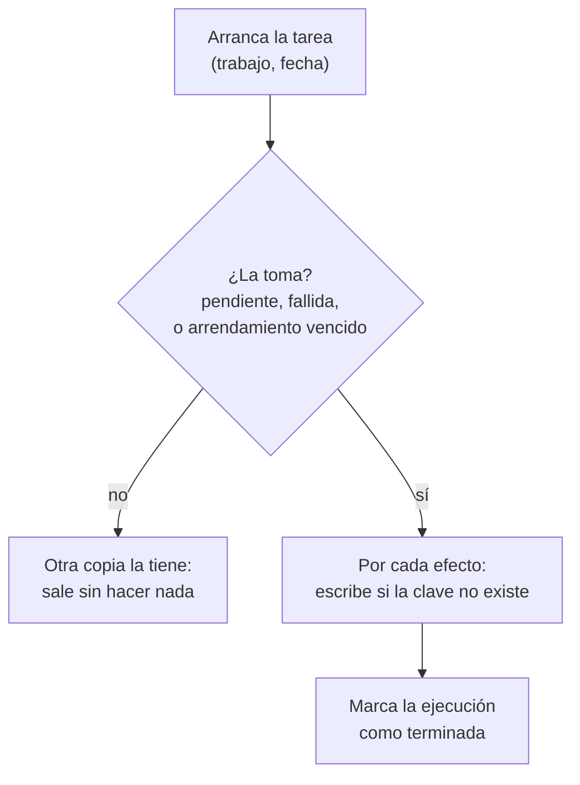

# 🔁 wf07 — Idempotencia, reanudación y *backfill*

> Python para desarrolladores Java senior · **Carta** · Track `wf` — Orquestación de trabajos y
> flujos · sección 7 de 8
> Se lee suelta: no hace falta ninguna otra sección de la carta. Conviene haber leído la
> [Fase 15](15-el-proceso-nocturno.md), que construye el lote reanudable del cierre y su idempotencia.
> Versiones verificadas contra PyPI el 05/10/2026 · Código probado el 05/10/2026 con Python 3.14.7,
> en contenedor: las salidas son las de esa corrida.

---

## 🎯 1. Qué problema resuelve

Todos los orquestadores del track reintentan. Ninguno sabe si **reintentar es seguro**. Si la tarea
"liquidar regalías del tercer trimestre" corrió hasta la mitad, insertó tres de seis liquidaciones y se
cayó, el reintento puede insertar las seis otra vez —y Édgar recibe dos facturas— o detenerse en la
tercera porque ya había algo. Y si el planificador, por un error de configuración o un *worker* que
pareció muerto y no lo estaba, lanza la misma tarea **dos veces a la vez**, el problema ya no es el
reintento sino la carrera.

Esta sección trata lo que la propuesta llama *lo transversal*, porque vale igual con `cron`, con una
cola, con Airflow o con Temporal:

- **Idempotencia**: correr dos veces deja lo mismo que correr una.
- **Exclusión**: dos copias simultáneas de la misma tarea no hacen dos veces el trabajo.
- **Reanudación**: una tarea que se cayó sigue donde estaba, o rehace su unidad completa.
- ***Backfill***: rehacer las noches de la semana pasada procesa los datos de **cada** noche, no los de
  hoy siete veces.

La Fase 15 resolvió esto para el cierre con su tabla de avance. Aquí va en una forma que sirve para
cualquier trabajo.

---

## 🧠 2. El modelo

Tres mecanismos, y cada uno cubre un fallo distinto:

| Mecanismo | Qué evita | Cómo |
|---|---|---|
| **Clave de ejecución** `(trabajo, fecha lógica)` | Correr dos veces la misma noche | Una fila por ejecución, con estado; la clave es única |
| **Arrendamiento** (*lease*) con vencimiento | Que una copia muerta bloquee para siempre, y que dos vivas corran a la vez | Quien toma la ejecución la marca con un plazo; otra solo puede tomarla si el plazo venció |
| **Clave de efecto** por cada cosa que se escribe afuera | Duplicar un efecto al reintentar | Cada efecto tiene una clave natural (`regalia:Suba:2026T3`) y se escribe "si no existe" |

El tercero es el que más se olvida y el que más importa. La clave de ejecución dice "esta noche ya
corrió"; la clave de efecto dice "**esta factura** ya existe", que es lo que de verdad no se puede
duplicar. Con claves de efecto, hasta un reintento a la mitad es seguro: lo que ya estaba no se vuelve a
escribir y lo que faltaba se escribe.



### 🪞 Tu instinto de Java dice… y esta vez se equivoca

En Java el reflejo es una transacción grande: `@Transactional` alrededor de toda la liquidación, y si
algo falla, *rollback* y se reintenta desde cero. Funciona mientras todo vive en una sola base de datos.
El día que uno de los efectos es **externo** —mandar el correo, radicar en el portal—, la transacción ya
no lo puede deshacer: el correo salió aunque la base haga *rollback*. Las claves de efecto funcionan
con efectos externos; la transacción grande, no.

---

## 💻 3. El ejemplo que corre

Sin dependencias: `sqlite3` de la biblioteca estándar y `multiprocessing` para lanzar la misma tarea
dos veces a la vez.

`ejecuciones.py`:

```python
"""Ejecuciones con clave, arrendamiento y efectos idempotentes, sobre SQLite."""

import os
import sqlite3
import time
from multiprocessing import Process

DB = "ejecuciones.db"
LEASE_SECONDS = 2.0
# La historia de Áurea nombra dos de las seis franquicias; las otras cuatro van sin nombre.
FRANCHISES = ["Suba", "Zipaquirá", "franquicia-3", "franquicia-4", "franquicia-5", "franquicia-6"]


def connect() -> sqlite3.Connection:
    conn = sqlite3.connect(DB, timeout=10, isolation_level=None)  # transacciones explícitas
    conn.execute("PRAGMA journal_mode=WAL")
    conn.executescript("""
        CREATE TABLE IF NOT EXISTS runs (
            job TEXT, logical_date TEXT, status TEXT, owner TEXT, lease_until REAL,
            attempts INTEGER DEFAULT 0, PRIMARY KEY (job, logical_date));
        CREATE TABLE IF NOT EXISTS effects (effect_key TEXT PRIMARY KEY, created_by TEXT);
    """)
    return conn


def claim(conn: sqlite3.Connection, job: str, day: str, owner: str) -> bool:
    """Toma la ejecución si está libre, falló o su arrendamiento venció. Atómico."""
    now = time.time()
    conn.execute("BEGIN IMMEDIATE")            # un solo escritor a la vez en SQLite
    try:
        conn.execute("INSERT OR IGNORE INTO runs (job, logical_date, status) VALUES (?, ?, 'pending')",
                     (job, day))
        taken = conn.execute(
            """UPDATE runs SET status = 'running', owner = ?, lease_until = ?, attempts = attempts + 1
               WHERE job = ? AND logical_date = ?
                 AND (status IN ('pending', 'failed') OR (status = 'running' AND lease_until < ?))""",
            (owner, now + LEASE_SECONDS, job, day, now)).rowcount == 1
        conn.execute("COMMIT")
        return taken
    except BaseException:
        conn.execute("ROLLBACK")
        raise


def write_effect(conn: sqlite3.Connection, key: str, owner: str) -> bool:
    """El efecto se escribe una sola vez en la historia, aunque la tarea corra diez."""
    return conn.execute("INSERT OR IGNORE INTO effects VALUES (?, ?)", (key, owner)).rowcount == 1


def settle_quarter(day: str, crash_after: int | None = None) -> None:
    owner = f"pid-{os.getpid()}"
    conn = connect()
    if not claim(conn, "regalias", day, owner):
        print(f"{owner}: la ejecución de {day} la tiene otra copia; salgo")
        return
    for i, franchise in enumerate(FRANCHISES, start=1):
        written = write_effect(conn, f"regalia:{franchise}:{day}", owner)
        # flush: os._exit no vacía el búfer, y sin esto lo que imprimió la copia que se cae se pierde.
        print(f"{owner}: {franchise} {'facturada' if written else 'ya estaba'}", flush=True)
        if crash_after == i:
            print(f"{owner}: se cae a la mitad", flush=True)
            os._exit(1)                         # sin limpiar nada: como un kill -9
        time.sleep(0.1)
    conn.execute("UPDATE runs SET status = 'done' WHERE job = 'regalias' AND logical_date = ?", (day,))


if __name__ == "__main__":
    if os.path.exists(DB):
        os.remove(DB)
    print("== dos copias a la vez")
    copies = [Process(target=settle_quarter, args=("2026T3",)) for _ in range(2)]
    for p in copies:
        p.start()
    for p in copies:
        p.join()

    print("== una copia que se cae, y el reintento después del arrendamiento")
    crashing = Process(target=settle_quarter, args=("2026T4", 3))
    crashing.start()
    crashing.join()
    settle_quarter("2026T4")                    # el arrendamiento sigue vigente: no la toma
    time.sleep(LEASE_SECONDS)
    settle_quarter("2026T4")                    # venció: la toma y completa lo que faltaba

    conn = connect()
    print("== efectos por trimestre:",
          dict(conn.execute("SELECT substr(effect_key, -6), count(*) FROM effects GROUP BY 1")))
    print("== intentos:", conn.execute("SELECT logical_date, status, attempts FROM runs").fetchall())
```

```bash
python3 ejecuciones.py
```

Salida (Python 3.14.7, 05/10/2026) (los `pid` cambian):

```text
== dos copias a la vez
pid-101: la ejecución de 2026T3 la tiene otra copia; salgo
pid-100: Suba facturada
pid-100: Zipaquirá facturada
pid-100: franquicia-3 facturada
pid-100: franquicia-4 facturada
pid-100: franquicia-5 facturada
pid-100: franquicia-6 facturada
== una copia que se cae, y el reintento después del arrendamiento
pid-102: Suba facturada
pid-102: Zipaquirá facturada
pid-102: franquicia-3 facturada
pid-102: se cae a la mitad
pid-99: la ejecución de 2026T4 la tiene otra copia; salgo
pid-99: Suba ya estaba
pid-99: Zipaquirá ya estaba
pid-99: franquicia-3 ya estaba
pid-99: franquicia-4 facturada
pid-99: franquicia-5 facturada
pid-99: franquicia-6 facturada
== efectos por trimestre: {'2026T3': 6, '2026T4': 6}
== intentos: [('2026T3', 'done', 1), ('2026T4', 'done', 2)]
```

Seis facturas por trimestre, ni una más, después de una carrera y de una caída a la mitad. La copia que
se cayó dejó tres efectos escritos; el reintento los encontró ("ya estaba") y escribió solo los tres que
faltaban.

**Detalles con intención**

- **`BEGIN IMMEDIATE`** toma el bloqueo de escritura al empezar la transacción, no al primer `UPDATE`:
  dos copias no pueden leer "pendiente" a la vez y tomarla las dos. En PostgreSQL, el equivalente es
  `UPDATE … WHERE … RETURNING` o `SELECT … FOR UPDATE SKIP LOCKED`.
- **El arrendamiento vence**: la copia que murió con `kill -9` no puede avisar que murió, así que el
  sistema se lo supone cuando su plazo pasa. El plazo tiene que ser mayor que la duración normal de la
  tarea, o una copia lenta pero viva pierde su ejecución.
- **La clave de efecto es natural**: `regalia:Suba:2026T3` se puede calcular en cualquier reintento sin
  saber nada de las corridas anteriores.
- ***Backfill*** es simplemente llamar a `settle_quarter` con fechas lógicas pasadas: como cada
  ejecución y cada efecto llevan su fecha, rehacer la semana pasada no toca la de esta.

---

## ⚠️ 4. Lo que se rompe

**El efecto externo sin clave.** Una clave de efecto en tu base no impide que el correo salga dos veces
si el proceso se cae **entre** mandar el correo y escribir la clave. Para efectos externos hay dos
salidas: escribir la clave **antes** (y aceptar que algún efecto no salga y haya que reintentarlo a
mano), o usar la clave de idempotencia del servicio externo cuando la tiene —muchas APIs de pago y de
mensajería aceptan una—.

**El arrendamiento demasiado corto.** Si la liquidación tarda tres minutos y el arrendamiento es de dos,
la segunda copia toma una ejecución viva y las dos trabajan a la vez. Las claves de efecto evitan los
duplicados, pero el trabajo se hace dos veces. La copia que trabaja renueva su arrendamiento (un
*heartbeat*) mientras avanza.

**"Hoy" dentro de la tarea.** Una tarea que calcula su fecha con `date.today()` no se puede rehacer para
anteayer: el *backfill* procesa hoy siete veces. La fecha lógica entra como argumento, siempre.

**El reintento infinito.** Una ejecución que falla siempre —un dato corrupto— se reintenta para siempre
si no hay tope. `attempts` existe para eso: después de N, la ejecución queda en un estado que pide una
persona.

---

## ⚖️ 5. Cuándo NO usarla

**Cuando el orquestador ya lo da y lo usas bien.** Temporal garantiza que un flujo no corre dos veces con
el mismo identificador; Airflow tiene su clave por fecha lógica. La tabla propia sobra para la
**ejecución**; las claves de efecto, en cambio, siguen siendo tuyas en todos.

**Para efectos que ya son idempotentes por naturaleza.** "Dejar el archivo del informe en su ruta" o
"poner el estado en `pagado`" se pueden repetir sin daño. Las claves son para los efectos que suman: una
factura, un pago, un mensaje.

---

## 🧪 6. Ejercicios (10)

**🟢 Fácil (1–3)**

1. Lanza cinco copias a la vez del trimestre 2026T3. **Criterio:** una factura, cuatro salidas
   inmediatas y seis efectos en total.
2. Quita el `INSERT OR IGNORE` de `write_effect` (usa `INSERT`). **Criterio:** describes qué pasa en el
   reintento después de la caída.
3. Haz el *backfill* de cuatro trimestres seguidos con un bucle. **Criterio:** 24 efectos, y correr el
   *backfill* otra vez no agrega ninguno.

**🟡 Intermedio (4–6)**

4. Agrega un *heartbeat*: la tarea extiende su arrendamiento después de cada franquiciado. **Criterio:**
   con un arrendamiento de un segundo y una tarea de tres, ninguna segunda copia la toma.
5. Agrega el tope de intentos: después de tres, la ejecución queda en `needs_human`. **Criterio:** una
   tarea que siempre falla termina en ese estado y no se vuelve a tomar.
6. Busca en la documentación de SQLite qué hace exactamente `BEGIN IMMEDIATE` frente a `BEGIN`.
   **Criterio:** explicas qué carrera aparece si lo cambias a `BEGIN` y la reproduces.

**🟠 Difícil (7–9)**

7. Lleva el ejemplo a PostgreSQL con `SELECT … FOR UPDATE SKIP LOCKED`. **Criterio:** dos procesos en
   contenedores distintos contra la misma base, y el mismo resultado de seis efectos.
8. Agrega un efecto externo simulado (una API que cobra por llamada) con clave de idempotencia del lado
   del servicio. **Criterio:** una caída entre la llamada y la escritura de la clave no produce dos
   cobros.
9. Mide cuántas tomas por segundo soporta `claim` sobre SQLite con ocho procesos compitiendo.
   **Criterio:** reportas el número con la máquina, y decides si alcanza para los trabajos de Áurea.

**🔴 Muy difícil (10)**

10. Audita un trabajo real de Áurea —el que elijas— con los tres mecanismos. **Criterio:** una tabla de
    sus efectos y un prototipo. *Rúbrica:* (a) cada efecto tiene su clave natural o dice por qué no
    puede tenerla; (b) se demuestra con una prueba que una caída en cada punto del trabajo no duplica
    nada; (c) se dice qué efecto externo no se puede hacer idempotente y qué se hace con él; (d) el
    *backfill* de una semana es una sola línea.

---

## 📚 7. Referencias

**Documentación oficial**

- SQLite, transacciones y `BEGIN IMMEDIATE`: https://www.sqlite.org/lang_transaction.html
- `sqlite3` de Python y el control de transacciones: https://docs.python.org/3/library/sqlite3.html
- PostgreSQL, `SKIP LOCKED`: https://www.postgresql.org/docs/current/sql-select.html#SQL-FOR-UPDATE-SHARE

**Orden de lectura sugerido:** la página de transacciones de SQLite, que es corta y precisa; después la
de `SKIP LOCKED` de PostgreSQL, que es como se hace esto en una base compartida.

---

## 🚀 8. Cierre

Lo transversal es lo que hace seguro a cualquier orquestador: una clave por ejecución, un arrendamiento
que vence, y una clave natural por cada efecto. Con las tres, dos copias a la vez y una caída a la mitad
terminan en el mismo lugar que una corrida limpia.

**La señal de que quedó bien:** *"La liquidación se cayó en el tercer franquiciado, el reintento hizo
los otros tres, y Édgar recibió una factura."*

> 🏷️ **Cierra la sección con su tag**, cuando los ejercicios que elegiste estén hechos:
>
> ```bash
> git tag -a op-wf-fase-07 -m "op wf07 cerrada: clave de ejecución, arrendamiento y claves de efecto"
> ```
>
> Los commits llevan su prefijo (`op wf07: …`) y los de ejercicio su número
> (`op wf07 ej07: …`).
