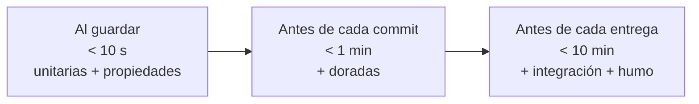

# 🧪 qa01 — La pirámide para un equipo de uno

> Python para desarrolladores Java senior · **Carta** · Track `qa` — Calidad, pruebas y
> mantenimiento · sección 1 de 10
> Se lee suelta: no hace falta ninguna otra sección de la carta. Conviene haber leído la
> [Fase 08](08-el-contrato-del-codigo.md), que deja `pytest`, las *fixtures* y la cobertura con criterio.
> Versiones verificadas contra PyPI el 05/10/2026 · Código probado el 05/10/2026 con Python 3.14.7,
> en contenedor: las salidas son las de esa corrida.

---

## 🎯 1. Qué problema resuelve

La tesis del curso es que el sistema de Áurea tiene que sobrevivir tres años con **un solo ingeniero**.
Ese ingeniero no tiene QA, no tiene un equipo que revise, y no tiene tiempo para escribir todas las
pruebas que recomienda un libro. La pirámide de pruebas clásica —muchas unitarias, algunas de
integración, pocas de punta a punta— supone un equipo que la mantenga. Para uno, la pregunta cambia:
**¿qué pruebas valen el tiempo que cuestan escribirlas y, sobre todo, mantenerlas?**

Esta sección contesta con dos herramientas que no son de `pytest` sino de criterio —un mapa de riesgo y
un presupuesto de tiempo de la suite— y con la configuración de `pytest` que las hace cumplir: marcas
para separar lo rápido de lo lento, y una suite que corre en segundos en cada cambio y entera antes de
cada entrega.

---

## 🧠 2. El modelo

**El mapa de riesgo** cruza dos preguntas por cada parte del sistema: *¿cuánto cuesta que falle?* y
*¿con qué frecuencia cambia?* Lo que cuesta mucho y cambia seguido se prueba a fondo; lo que cuesta poco
y no cambia casi no se prueba.

| Parte de Cartera | Costo de un error | Cambia | Qué prueba vale |
|---|---|---|---|
| Liquidación de regalías y comisiones | Alto: dinero y discusiones con Édgar | Cada trimestre | Unitarias exhaustivas + propiedades |
| Lectura de formatos de las aseguradoras | Alto: glosas mal leídas | Cuando ellas quieren | Pruebas doradas con archivos reales |
| Acceso a la base de datos | Medio | Poco | Pocas de integración, contra un Postgres real |
| Pantallas del back-office | Bajo: Patricia avisa | Seguido | Casi ninguna automatizada |
| El cierre de punta a punta | Alto | Rara vez entero | Una sola prueba de humo |

**El presupuesto de tiempo** decide dónde corre cada prueba. Una suite que tarda diez minutos no se
corre en cada cambio, y una prueba que no se corre no protege nada.



### 🪞 Tu instinto de Java dice… y esta vez se equivoca

En un equipo Java el reflejo es apuntar a un porcentaje de cobertura —80% es el número de moda— y
escribir pruebas hasta llegar. Para uno solo, perseguir la cobertura reparte el esfuerzo por igual
entre lo que importa y lo que no: el mismo tiempo para el *getter* que para la regla de regalías. El
mapa de riesgo concentra el esfuerzo donde está el dinero, y deja la cobertura como lo que la Fase 08
dice que es: una herramienta para encontrar lo que se te olvidó, no una meta.

---

## 💻 3. El ejemplo que corre

```bash
uv add --dev pytest hypothesis
```

`pyproject.toml`, la parte de `pytest`:

```toml
[tool.pytest.ini_options]
addopts = "-ra --strict-markers"
markers = [
    "integration: necesita servicios reales (Postgres); corre antes de cada entrega",
    "golden: compara contra archivos reales anonimizados",
]
```

`liquidacion.py`, la parte del dominio que el mapa marca en rojo:

```python
"""Regalías del trimestre: la regla que más dinero mueve y más se discute."""

from decimal import ROUND_HALF_EVEN, Decimal

ROYALTY_RATE = Decimal("0.06")


def royalty(billed: Decimal, refunds: Decimal = Decimal(0)) -> Decimal:
    if billed < 0 or refunds < 0:
        raise ValueError("facturado y devoluciones no pueden ser negativos")
    base = max(billed - refunds, Decimal(0))
    return (base * ROYALTY_RATE).quantize(Decimal("1"), rounding=ROUND_HALF_EVEN)
```

`test_liquidacion.py`, las pruebas que corren al guardar:

```python
"""Unitarias y propiedades de la regalía: rápidas, sin servicios, en cada cambio."""

from decimal import Decimal

import pytest
from hypothesis import given
from hypothesis import strategies as st

from liquidacion import royalty

money = st.decimals(min_value=0, max_value=10**10, places=2)


@pytest.mark.parametrize(("billed", "refunds", "expected"), [
    ("18420000", "0", "1105200"),
    ("18420000", "420000", "1080000"),
    ("100", "500", "0"),          # devoluciones mayores que lo facturado: cero, nunca negativo
])
def test_known_cases(billed, refunds, expected):
    assert royalty(Decimal(billed), Decimal(refunds)) == Decimal(expected)


@given(billed=money, refunds=money)
def test_never_negative_and_never_above_rate(billed, refunds):
    value = royalty(billed, refunds)
    assert Decimal(0) <= value <= (billed * Decimal("0.06")).quantize(Decimal("1")) + 1


@pytest.mark.integration
def test_settlement_persists_in_postgres():
    pytest.skip("necesita Postgres: corre con -m integration antes de cada entrega")
```

```bash
pytest -m "not integration" --durations=3
pytest -m integration
```

Salida (Python 3.14.7, 05/10/2026), recortada:

```text
4 passed, 1 deselected in 0.53s
...
SKIPPED [1] test_liquidacion.py:31: necesita Postgres: corre con -m integration antes de cada entrega
1 skipped, 4 deselected in 0.09s
```

**Detalles con intención**

- **`--strict-markers`** convierte una marca mal escrita (`@pytest.mark.integracion`) en un error. Sin
  él, la prueba mal marcada corre al guardar, tarda un minuto y nadie sabe por qué la suite se volvió
  lenta.
- **La propiedad captura lo que importa del dinero**: nunca negativa, nunca por encima de la tasa. Los
  tres casos conocidos fijan los números que Édgar ya vio; la propiedad cubre los que nadie pensó.
- **`--durations=3`** muestra las tres pruebas más lentas. Cuando la suite rápida pase de diez segundos,
  esa lista dice cuál mover al siguiente escalón.
- **La prueba de integración no se escribe con un `if` dentro**: se marca, y se elige en la línea de
  comandos qué grupo correr.

---

## ⚠️ 4. Lo que se rompe

**La suite que nadie corre.** Una suite de diez minutos se deja para "después", y después no llega. El
presupuesto de tiempo no es una sugerencia: lo que pasa del límite se mueve de escalón, o se acelera.

**Las pruebas de la pantalla.** Probar automáticamente el HTML del back-office, que cambia cada semana,
produce pruebas que se rompen con cada cambio de diseño y se arreglan copiando la salida nueva. Para un
equipo de uno es la peor inversión del mapa. Una prueba de humo que verifica que la página carga, y
nada más.

**El mapa que no se actualiza.** El riesgo cambia: la lectura de formatos de una aseguradora que nunca
cambió pasa a ser roja el trimestre en que empieza a cambiar. El mapa se revisa cuando se revisa el
trimestre.

---

## ⚖️ 5. Cuándo NO usarla

**En un equipo con QA.** Si hay personas dedicadas a probar, la pirámide clásica y la cobertura como
señal compartida tienen sentido: el costo de mantener se reparte.

**Para código que se tira.** Un script de migración que corre una vez no necesita suite; necesita una
copia de seguridad antes de correrlo y una verificación de conteos después.

---

## 🧪 6. Ejercicios (10)

**🟢 Fácil (1–3)**

1. Escribe el mapa de riesgo de un sistema tuyo con cinco partes. **Criterio:** cada parte con costo,
   frecuencia de cambio y la prueba que vale.
2. Marca una prueba con `@pytest.mark.integracion` (mal escrito) y corre la suite. **Criterio:** falla
   por `--strict-markers` y explicas qué habría pasado sin él.
3. Agrega a `test_known_cases` el caso de facturado cero. **Criterio:** pasa y explicas por qué el
   redondeo no importa en ese caso.

**🟡 Intermedio (4–6)**

4. Cambia el redondeo a `ROUND_HALF_UP` y busca con Hypothesis un caso en que las dos reglas difieran.
   **Criterio:** el contraejemplo mínimo que encontró y la diferencia en pesos.
5. Busca en la documentación de `pytest` cómo se configura un `conftest.py` que salte automáticamente
   las pruebas `integration` si no hay variable `DATABASE_URL`. **Criterio:** la suite rápida nunca
   intenta conectarse.
6. Mide la suite de un proyecto tuyo con `--durations=10`. **Criterio:** clasificas las diez pruebas
   más lentas en los tres escalones del presupuesto.

**🟠 Difícil (7–9)**

7. Convierte el presupuesto en una regla del CI: la suite rápida falla si pasa de diez segundos.
   **Criterio:** una prueba lenta agregada a propósito hace fallar el CI con un mensaje que la nombra.
8. Escribe la prueba de humo del cierre de punta a punta con datos fabricados. **Criterio:** corre en
   menos de un minuto y falla si cualquier paso falla.
9. Cuenta cuántas pruebas de tu proyecto se cambiaron en los últimos tres meses sin que cambiara la
   regla que prueban. **Criterio:** el número, y qué parte del mapa las concentra.

**🔴 Muy difícil (10)**

10. Escribe la estrategia de pruebas de Cartera para los próximos tres años con un solo ingeniero.
    **Criterio:** un documento de una página. *Rúbrica:* (a) el mapa de riesgo con cada parte; (b) el
    presupuesto de tiempo con lo que corre en cada escalón; (c) qué **no** se va a probar, dicho en voz
    alta; (d) cuántas horas al mes cuesta mantenerla.

---

## 📚 7. Referencias

**Documentación oficial**

- `pytest`, marcas y selección: https://docs.pytest.org/en/stable/how-to/mark.html
- `pytest`, configuración en `pyproject.toml`: https://docs.pytest.org/en/stable/reference/customize.html
- Hypothesis: https://hypothesis.readthedocs.io/en/latest/

**Orden de lectura sugerido:** la página de marcas de `pytest`, que es corta; las demás secciones del
track profundizan cada escalón del presupuesto.

---

## 🚀 8. Cierre

Para un equipo de uno, la pirámide se reemplaza por un mapa de riesgo y un presupuesto de tiempo: se
prueba a fondo lo que cuesta dinero y cambia seguido, se marca lo lento para que no se corra al guardar,
y se dice en voz alta qué no se prueba.

**La señal de que quedó bien:** *"La suite rápida tarda cuatro segundos, la corro en cada cambio, y
cuando cambió la regla de regalías me avisó antes de que Édgar."*

> 🏷️ **Cierra la sección con su tag**, cuando los ejercicios que elegiste estén hechos:
>
> ```bash
> git tag -a op-qa-fase-01 -m "op qa01 cerrada: mapa de riesgo, presupuesto y marcas de pytest"
> ```
>
> Los commits llevan su prefijo (`op qa01: …`) y los de ejercicio su número
> (`op qa01 ej07: …`).
