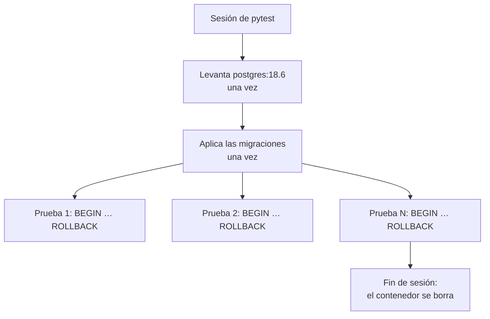

# 🧪 qa04 — Integración de verdad con `testcontainers`

> Python para desarrolladores Java senior · **Carta** · Track `qa` — Calidad, pruebas y
> mantenimiento · sección 4 de 10
> Se lee suelta: no hace falta ninguna otra sección de la carta. Conviene haber leído la
> [Fase 11](11-persistencia.md), que lleva Cartera a PostgreSQL con SQLAlchemy.
> Versiones verificadas contra PyPI el 05/10/2026 · Código probado el 05/10/2026 con Python 3.14.7,
> en contenedor, con `testcontainers` levantando un `postgres:18.6` hermano por el *socket* de Docker.

---

## 🎯 1. Qué problema resuelve

Las pruebas de la capa de datos de Cartera corren contra SQLite en memoria "porque es más rápido". Pasan
todas. En producción, contra PostgreSQL, el cierre falla con un error de tipo en una columna que SQLite
aceptó sin decir nada, y un `INSERT … ON CONFLICT` que en SQLite hacía una cosa y en Postgres otra.

El doble de la base de datos **miente**, y no por mala configuración: SQLite y PostgreSQL son motores
distintos, con tipos, restricciones y semánticas distintas. Una prueba de integración que no corre contra
el mismo motor que producción prueba otra cosa. La solución dejó de ser cara hace años: **un PostgreSQL de
verdad en un contenedor**, que la suite levanta al empezar y tira al terminar. En Python eso es
**`testcontainers`** (4.15.0, del 2026-07-24), el mismo proyecto que en Java se usa con JUnit.

---

## 🧠 2. El modelo

Tres decisiones arman una suite de integración que sea rápida y confiable a la vez:

| Decisión | Lo que se elige | Por qué |
|---|---|---|
| **Cuántas veces se levanta Postgres** | Una por sesión de `pytest` | Arrancar el contenedor cuesta segundos; una vez, no cuatrocientas |
| **Cómo se crea el esquema** | Con las **mismas migraciones** de producción, una vez | El esquema de prueba no puede ser otro distinto escrito a mano |
| **Cómo se aíslan las pruebas** | Cada prueba en una transacción que se deshace al final | Sin borrar tablas entre pruebas, y sin que una vea los datos de otra |



### 🪞 Tu instinto de Java dice… y esta vez se equivoca

En Java el reflejo de la prueba de datos es H2 en memoria en "modo PostgreSQL". Es el mismo error que
SQLite en Python, con un nombre que promete compatibilidad: el modo de compatibilidad imita la sintaxis,
no la semántica. Testcontainers existe en los dos lenguajes precisamente porque los dos ecosistemas
llegaron a la misma conclusión.

### 🩻 Esto sí funciona igual

El modelo de Testcontainers de Java se traslada entero: un contenedor por tipo de servicio, puerto
asignado al azar, espera a que el servicio esté listo, y limpieza al terminar. Si ya lo usaste con
`@Testcontainers` y `@Container`, en Python es una fixture de sesión.

---

## 💻 3. El ejemplo que corre

```bash
uv add sqlalchemy "psycopg[binary]"
uv add --dev pytest "testcontainers[postgres]"
```

Hace falta Docker corriendo en la máquina; `testcontainers` lo encuentra solo.

`esquema.sql`, que en un proyecto real son las migraciones:

```sql
CREATE TABLE settlements (
    id          bigserial PRIMARY KEY,
    franchise   text NOT NULL,
    quarter     text NOT NULL,
    amount      numeric(14, 2) NOT NULL CHECK (amount >= 0),
    UNIQUE (franchise, quarter)
);
```

`conftest.py`:

```python
"""Un PostgreSQL de verdad por sesión, el esquema de producción, y una transacción por prueba."""

from pathlib import Path

import pytest
from sqlalchemy import create_engine, text
from testcontainers.community.postgres import PostgresContainer


@pytest.fixture(scope="session")
def engine():
    with PostgresContainer("postgres:18.6", driver="psycopg") as postgres:
        engine = create_engine(postgres.get_connection_url())
        with engine.begin() as conn:
            conn.execute(text(Path("esquema.sql").read_text()))   # las migraciones, una vez
        yield engine
        engine.dispose()


@pytest.fixture
def conn(engine):
    """Cada prueba corre dentro de una transacción que se deshace: no ve ni deja datos de otras."""
    with engine.connect() as connection:
        transaction = connection.begin()
        yield connection
        transaction.rollback()
```

`test_liquidaciones_db.py`:

```python
"""Lo que SQLite deja pasar y PostgreSQL no: la prueba tiene que correr contra el motor real."""

import pytest
from sqlalchemy import create_engine, text
from sqlalchemy.exc import DataError, IntegrityError

UPSERT = text("""
    INSERT INTO settlements (franchise, quarter, amount) VALUES (:f, :q, :a)
    ON CONFLICT (franchise, quarter) DO UPDATE SET amount = EXCLUDED.amount
    RETURNING id, amount
""")


def test_upsert_keeps_one_row_per_quarter(conn):
    first = conn.execute(UPSERT, {"f": "Suba", "q": "2026T3", "a": "1105200.00"}).one()
    second = conn.execute(UPSERT, {"f": "Suba", "q": "2026T3", "a": "1080000.00"}).one()
    assert first.id == second.id
    assert conn.execute(text("SELECT count(*) FROM settlements")).scalar_one() == 1


def test_postgres_rejects_text_in_numeric(conn):
    with pytest.raises(DataError):
        conn.execute(text("INSERT INTO settlements (franchise, quarter, amount) VALUES ('Suba', 'T', 'mil')"))


def test_negative_amount_violates_the_check(conn):
    with pytest.raises(IntegrityError):
        conn.execute(text("INSERT INTO settlements (franchise, quarter, amount) VALUES ('Suba', 'T', -1)"))


def test_isolation_previous_tests_left_nothing(conn):
    assert conn.execute(text("SELECT count(*) FROM settlements")).scalar_one() == 0


def test_sqlite_would_have_lied():
    """La misma inserción contra SQLite: pasa sin error, y esa es la mentira."""
    sqlite = create_engine("sqlite://")
    with sqlite.begin() as c:
        c.execute(text("CREATE TABLE settlements (franchise text, quarter text, amount numeric(14, 2))"))
        c.execute(text("INSERT INTO settlements VALUES ('Suba', 'T', 'mil')"))
        assert c.execute(text("SELECT amount FROM settlements")).scalar_one() == "mil"
```

```bash
pytest -q test_liquidaciones_db.py
```

Salida (Python 3.14.7, 05/10/2026); la primera vez, Docker descarga la imagen de PostgreSQL:

```text
.....                                                                    [100%]
5 passed in 1.65s
```

La última prueba es la que justifica la sección: SQLite guardó la palabra `"mil"` en una columna
`numeric(14, 2)` y la devolvió tal cual; PostgreSQL la rechazó con `DataError`. Una suite que corre contra
SQLite no habría visto nunca el error que produce un archivo con el monto mal escrito.

**Detalles con intención**

- **El contenedor vive en una fixture de sesión**: los segundos de arranque se pagan una vez.
- **`esquema.sql` es el mismo que se aplica en producción.** Si el esquema de prueba se escribe aparte,
  diverge del real en el primer cambio, y las pruebas vuelven a probar otra cosa.
- **La transacción por prueba con `rollback`** aísla sin borrar tablas, y es más rápida que recrear el
  esquema. La prueba de aislamiento lo demuestra: no ve las filas de las anteriores.
- **`testcontainers.community.postgres`**: en la versión 4.15 los módulos de cada servicio se mudaron a
  `testcontainers.community`, y el import de siempre (`testcontainers.postgres`) sigue funcionando con
  un `DeprecationWarning`. La prueba de esta sección lo encontró así.
- **La imagen tiene etiqueta fija** (`postgres:18.6`), la misma de producción. `postgres:latest` en las
  pruebas cambia de versión el día que alguien publica otra.

---

## ⚠️ 4. Lo que se rompe

**El código que hace `commit` adentro.** La transacción por prueba funciona mientras el código bajo prueba
no confirme por su cuenta. Si una función hace `connection.commit()`, sus datos sobreviven al `rollback`
de la fixture y contaminan a las siguientes. SQLAlchemy permite unir la sesión a una transacción externa
con *savepoints* (`join_transaction_mode="create_savepoint"`), que es el patrón para ese caso.

**El CI sin Docker.** `testcontainers` necesita un Docker al que hablarle. En un CI que corre dentro de un
contenedor, hace falta montar el *socket* de Docker o usar un servicio de base de datos del propio CI; y
en ese caso las pruebas se marcan para poder correr sin él.

**Las pruebas que dependen del orden.** Si una prueba crea datos que otra espera, la suite pasa en orden y
falla barajada. La prueba de aislamiento del ejemplo es la vacuna, y `pytest-randomly` la refuerza.

**El arranque en cada archivo.** Una fixture de alcance `module` en vez de `session` levanta un Postgres
por archivo de prueba: con treinta archivos, la suite tarda minutos más sin que nadie entienda por qué.

---

## ⚖️ 5. Cuándo NO usarla

**Para la lógica que no toca la base.** Las reglas de regalías se prueban como funciones puras, en
milisegundos (`qa01`). La integración es para lo que **solo** existe en el motor: restricciones, tipos,
`ON CONFLICT`, índices, transacciones.

**Cuando el CI no tiene Docker y no lo va a tener.** Entonces el servicio de base de datos del propio CI
cumple el mismo papel; lo importante es que sea el mismo motor y la misma versión, no la herramienta.

---

## 🧪 6. Ejercicios (10)

**🟢 Fácil (1–3)**

1. Cambia la fixture `engine` a alcance `function` y mide la suite. **Criterio:** reportas los dos
   tiempos y cuántos contenedores se levantaron.
2. Quita el `rollback` de la fixture `conn` (haz `commit`). **Criterio:** la prueba de aislamiento falla, y
   explicas qué orden de ejecución la hace fallar.
3. Agrega una prueba para la restricción `UNIQUE` sin `ON CONFLICT`. **Criterio:** falla con
   `IntegrityError` y el mensaje nombra la restricción.

**🟡 Intermedio (4–6)**

4. Busca en la documentación de SQLAlchemy el patrón de "unirse a una transacción externa" con
   `join_transaction_mode` y aplícalo a una función que hace `commit`. **Criterio:** la prueba de
   aislamiento sigue pasando.
5. Reemplaza `esquema.sql` por migraciones de Alembic aplicadas en la fixture de sesión. **Criterio:** la
   fixture llama a `alembic upgrade head` contra el contenedor.
6. Encuentra otra diferencia entre SQLite y PostgreSQL que afecte a Cartera (comparación de texto sin
   distinguir mayúsculas, división entera, fechas) y escribe la prueba que la atrapa. **Criterio:** pasa en
   Postgres y documentas qué hace SQLite.

**🟠 Difícil (7–9)**

7. Agrega un Valkey de `testcontainers` a la misma sesión y prueba la caché de disponibilidad. **Criterio:**
   los dos contenedores se levantan una vez y se borran al final.
8. Corre la suite con `pytest-xdist -n 4` y haz que cada trabajador use su propia base dentro del mismo
   contenedor. **Criterio:** las pruebas no se ven entre trabajadores y el tiempo baja.
9. Mide el costo fijo de la integración: tiempo de arranque del contenedor, de las migraciones y de una
   prueba vacía. **Criterio:** los tres números y cuál optimizarías primero.

**🔴 Muy difícil (10)**

10. Lleva las pruebas de datos de un proyecto tuyo de SQLite (o H2) a `testcontainers`. **Criterio:** la
    suite corre contra el motor real. *Rúbrica:* (a) encuentras al menos un error que SQLite escondía; (b) el
    esquema sale de las migraciones de producción; (c) el tiempo total de la suite de integración está
    medido y dentro del presupuesto de `qa01`; (d) el CI la corre.

---

## 📚 7. Referencias

**Documentación oficial**

- `testcontainers` para Python: https://testcontainers-python.readthedocs.io/en/latest/
- SQLAlchemy, unir la sesión a una transacción externa en las pruebas:
  https://docs.sqlalchemy.org/en/20/orm/session_transaction.html#joining-a-session-into-an-external-transaction-such-as-for-test-suites
- SQLite, la afinidad de tipos (por qué guardó "mil"): https://www.sqlite.org/datatype3.html

**Orden de lectura sugerido:** la página de afinidad de tipos de SQLite primero —explica la mentira—;
después la de `testcontainers`; y la de SQLAlchemy cuando tu código haga `commit` por su cuenta.

---

## 🚀 8. Cierre

La prueba de datos se corre contra el motor de producción, en un contenedor que la suite levanta una vez,
con el esquema de las migraciones y una transacción por prueba. Lo que SQLite deja pasar en silencio,
PostgreSQL lo rechaza en la prueba y no en el cierre.

**La señal de que quedó bien:** *"El archivo traía un monto escrito en letras, y lo rechazó una prueba de
integración, no el cierre de las dos de la mañana."*

> 🏷️ **Cierra la sección con su tag**, cuando los ejercicios que elegiste estén hechos:
>
> ```bash
> git tag -a op-qa-fase-04 -m "op qa04 cerrada: PostgreSQL real con testcontainers y rollback por prueba"
> ```
>
> Los commits llevan su prefijo (`op qa04: …`) y los de ejercicio su número
> (`op qa04 ej07: …`).
