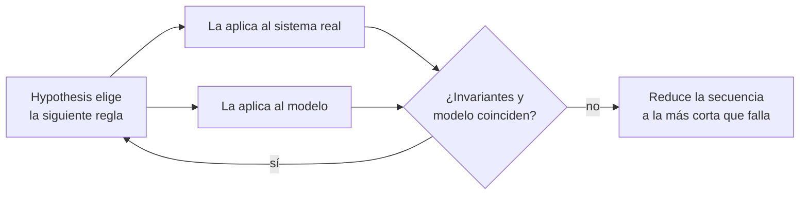

# 🧪 qa05 — Propiedades y modelos con Hypothesis

> Python para desarrolladores Java senior · **Carta** · Track `qa` — Calidad, pruebas y
> mantenimiento · sección 5 de 10
> Se lee suelta: no hace falta ninguna otra sección de la carta. **Empieza donde termina la
> [Fase 08](08-el-contrato-del-codigo.md)**, que presenta Hypothesis con la prueba que encuentra sola
> el `float`.
> Versiones verificadas contra PyPI el 05/10/2026 · Código probado el 05/10/2026 con Python 3.14.7,
> en contenedor: el error sembrado, y la máquina en verde con el arreglo.

---

## 🎯 1. Qué problema resuelve

El problema más caro de AgendaAPI no es una función con una entrada mala: es una **secuencia**. Yuli
reserva el espacio de las 3:40 en el Centro; la auxiliar de Suba cancela una cita; alguien reagenda; Yuli
reserva otra vez. Después de cinco operaciones en un orden concreto, dos pacientes quedan en el mismo
espacio. Ninguna operación sola está mal; la combinación sí, y nadie escribe a mano la prueba de *esa*
combinación porque nadie la imaginó.

Las pruebas basadas en propiedades de la Fase 08 generan **entradas**. Las pruebas con estado de
Hypothesis generan **secuencias de operaciones**, las corren contra el sistema y contra un modelo simple de
lo que debería pasar, y cuando encuentran una secuencia que rompe un invariante, la **reducen** a la más
corta que todavía lo rompe. Esta sección escribe las dos cosas que eso necesita —estrategias propias y una
máquina de reglas— y deja que Hypothesis encuentre un error que está sembrado en el código.

---

## 🧠 2. El modelo

**Una estrategia** describe cómo generar valores. Las básicas (`st.integers`, `st.text`) se combinan en
estrategias de dominio: `st.builds(Appointment, …)` arma objetos; `@st.composite` arma valores que dependen
unos de otros (la hora de fin después de la de inicio).

**Una máquina de reglas** (`RuleBasedStateMachine`) tiene:

| Pieza | Qué es | En la agenda |
|---|---|---|
| **Reglas** (`@rule`) | Operaciones que Hypothesis puede llamar en cualquier orden | reservar, cancelar, reagendar |
| **Paquetes** (`Bundle`) | Valores que una regla produce y otra consume | las reservas hechas, para cancelarlas después |
| **Invariantes** (`@invariant`) | Lo que tiene que ser cierto **después de cada paso** | ningún espacio con dos pacientes |
| **El modelo** | Una versión ingenua y obviamente correcta del sistema | un diccionario de espacio a paciente |



**El invariante es la parte difícil**, y la que vale la sección: no es "la función devuelve tal cosa"
sino "en cualquier estado al que se llegue, esto se cumple". Encontrarlo obliga a decir qué significa que
la agenda esté bien.

### 🪞 Tu instinto de Java dice… y esta vez se equivoca

Si viniste de jqwik en Java, el modelo es el mismo y sus *stateful properties* también existen. El
reflejo, en cambio, suele ser el de JUnit: escribir los escenarios que se te ocurren —"reservar y
cancelar", "reservar dos veces"— y darlos por cubiertos. Los escenarios que se te ocurren son justamente
los que ya funcionan. La máquina de reglas encuentra los que no se te ocurrieron, que es donde están los
errores.

---

## 💻 3. El ejemplo que corre

```bash
uv add --dev pytest hypothesis
```

`agenda.py`, con un error sembrado al reagendar:

```python
"""La agenda de un odontólogo: reservar, cancelar y reagendar espacios. Tiene un error sembrado."""

from dataclasses import dataclass, field


class SlotTaken(Exception):
    pass


@dataclass
class Agenda:
    slots: set[str]
    bookings: dict[str, str] = field(default_factory=dict)   # id de reserva → espacio
    taken: dict[str, str] = field(default_factory=dict)      # espacio → paciente
    _next: int = 0

    def book(self, slot: str, patient: str) -> str:
        if slot not in self.slots:
            raise ValueError(f"no existe el espacio {slot}")
        if slot in self.taken:
            raise SlotTaken(slot)
        self._next += 1
        booking_id = f"R{self._next}"
        self.bookings[booking_id] = slot
        self.taken[slot] = patient
        return booking_id

    def cancel(self, booking_id: str) -> None:
        slot = self.bookings.pop(booking_id)
        del self.taken[slot]

    def reschedule(self, booking_id: str, new_slot: str) -> None:
        old_slot = self.bookings[booking_id]
        patient = self.taken[old_slot]
        if new_slot in self.taken and new_slot != old_slot:
            raise SlotTaken(new_slot)
        self.taken[new_slot] = patient
        self.bookings[booking_id] = new_slot
        # El error sembrado: el espacio viejo nunca se libera. Lo encuentra la máquina de abajo.
```

`test_agenda_estado.py`:

```python
"""La agenda contra un modelo ingenuo, con secuencias que genera Hypothesis."""

from hypothesis import settings
from hypothesis import strategies as st
from hypothesis.stateful import Bundle, RuleBasedStateMachine, consumes, invariant, rule

from agenda import Agenda, SlotTaken

SLOTS = ["08:00", "08:40", "09:20", "15:00", "15:40"]
slots = st.sampled_from(SLOTS)
patients = st.sampled_from(["PAC-1", "PAC-2", "PAC-3"])


class AgendaMachine(RuleBasedStateMachine):
    bookings = Bundle("bookings")

    def __init__(self):
        super().__init__()
        self.agenda = Agenda(set(SLOTS))
        self.model: dict[str, str] = {}               # el modelo: espacio → paciente, y nada más
        self.where: dict[str, str] = {}               # reserva → espacio, en el modelo

    @rule(target=bookings, slot=slots, patient=patients)
    def book(self, slot, patient):
        if slot in self.model:
            try:
                self.agenda.book(slot, patient)
            except SlotTaken:
                return None                           # rechazar está bien: el modelo dice que está ocupado
            raise AssertionError(f"reservó {slot}, que estaba ocupado")
        booking_id = self.agenda.book(slot, patient)
        self.model[slot], self.where[booking_id] = patient, slot
        return booking_id

    @rule(booking=consumes(bookings))
    def cancel(self, booking):
        if booking is None:
            return
        self.agenda.cancel(booking)
        del self.model[self.where.pop(booking)]

    @rule(booking=bookings, new_slot=slots)
    def reschedule(self, booking, new_slot):
        if booking is None or booking not in self.where:
            return
        old = self.where[booking]
        if new_slot in self.model and new_slot != old:
            return                                     # el modelo no lo permite: no se intenta
        self.agenda.reschedule(booking, new_slot)
        self.model[new_slot] = self.model.pop(old)
        self.where[booking] = new_slot

    @invariant()
    def agenda_matches_model(self):
        assert self.agenda.taken == self.model


AgendaMachine.TestCase.settings = settings(max_examples=200, stateful_step_count=20)
TestAgenda = AgendaMachine.TestCase
```

```bash
pytest -q test_agenda_estado.py
```

Salida (Python 3.14.7, 05/10/2026), recortada a lo que imprime Hypothesis:

```text
E       AssertionError: assert {'08:40': 'PA...:00': 'PAC-1'} == {'08:00': 'PAC-1'}
E         Left contains 1 more item:
E         {'08:40': 'PAC-1'}
E       Failing test case:
E       state = AgendaMachine()
E       state.agenda_matches_model()
E       bookings_0 = state.book(patient='PAC-1', slot='08:40')
E       state.agenda_matches_model()
E       state.reschedule(booking=bookings_0, new_slot='08:00')
E       state.agenda_matches_model()
E       state.teardown()
FAILED test_agenda_estado.py::TestAgenda::runTest - AssertionError: …
1 failed in 0.59s
```

Dos pasos. Entre todas las secuencias de hasta veinte operaciones que probó, Hypothesis redujo el fallo a
la más corta posible: **reservar y reagendar**. La agenda dice que el espacio de las 8:40 sigue ocupado
por un paciente que ya se mudó a las 8:00, y nadie más puede reservarlo. Arreglar el error es una línea
en `reschedule` —liberar el espacio viejo cuando cambia (`del self.taken[old_slot]`)—, y con ella la misma
máquina pasa (`1 passed in 0.62s` en la misma corrida).

**Detalles con intención**

- **El modelo es ingenuo a propósito**: un diccionario. Si el modelo fuera tan complicado como la agenda,
  tendría sus propios errores.
- **`consumes(bookings)`** saca la reserva del paquete al cancelarla: Hypothesis no intenta cancelar dos
  veces la misma, que sería otra prueba.
- **El invariante compara todo el estado** después de cada paso. Comparar solo el resultado final dejaría
  pasar estados intermedios rotos que se arreglan por casualidad.
- **`stateful_step_count=20`** limita el largo de cada secuencia. Más largo encuentra más, y tarda más:
  es el mismo presupuesto de tiempo de `qa01`.

---

## ⚠️ 4. Lo que se rompe

**Un modelo que copia la implementación.** Si el modelo reagenda igual que la agenda, comete el mismo
error y la prueba pasa. El modelo describe **qué** debe pasar de la forma más tonta posible, no **cómo**.

**Reglas que siempre fallan por precondición.** Si casi todas las secuencias intentan cancelar algo que
no existe y la regla retorna sin hacer nada, Hypothesis gasta su presupuesto en pasos vacíos.
`@precondition` le dice cuándo una regla tiene sentido, y el reporte de estadísticas
(`--hypothesis-show-statistics`) muestra cuántos pasos se desperdiciaron.

**El ejemplo que no se reproduce.** Hypothesis guarda los ejemplos que fallaron en `.hypothesis/` y los
vuelve a probar primero la vez siguiente. Si borras ese directorio o corres en un CI que no lo conserva,
el fallo de hoy puede no aparecer mañana. `@reproduce_failure` y la base de ejemplos en el CI lo
resuelven.

---

## ⚖️ 5. Cuándo NO usarla

**Para lógica sin estado.** Una función pura se prueba con `@given` sobre sus entradas, como en la Fase 08;
la máquina de reglas es para lo que acumula estado entre operaciones.

**Cuando no puedes decir el invariante.** Si no sabes escribir qué significa que el sistema esté bien
—más allá de "que no falle"—, la máquina solo encuentra excepciones. Escribir el invariante es la mitad
del trabajo, y a veces la parte que más enseña sobre el dominio.

**Contra sistemas lentos.** Doscientas secuencias de veinte pasos son cuatro mil operaciones. Contra una
base de datos real, eso es minutos; la máquina corre contra el dominio en memoria, y la base se prueba con
`qa04`.

---

## 🧪 6. Ejercicios (10)

**🟢 Fácil (1–3)**

1. Arregla el error de `reschedule`. **Criterio:** la máquina pasa con `max_examples=500`.
2. Corre con `--hypothesis-show-statistics`. **Criterio:** reportas cuántos pasos se desperdiciaron en
   reglas que no hicieron nada.
3. Escribe con `@st.composite` una estrategia de citas donde la hora de fin es siempre posterior a la de
   inicio. **Criterio:** una prueba con `@given` verifica que nunca genera una cita al revés.

**🟡 Intermedio (4–6)**

4. Agrega `@precondition` a `cancel` y `reschedule` para que solo corran si hay reservas. **Criterio:** las
   estadísticas muestran menos pasos desperdiciados.
5. Busca en la documentación de Hypothesis qué hace `@reproduce_failure` y úsalo para fijar el fallo
   original en una prueba. **Criterio:** la prueba falla siempre, sin depender de `.hypothesis/`.
6. Agrega un segundo invariante: ningún paciente tiene más de dos citas el mismo día. **Criterio:** la
   máquina encuentra la secuencia que lo rompe, o explicas por qué la agenda ya lo impide.

**🟠 Difícil (7–9)**

7. Siembra otro error —cancelar libera el espacio equivocado cuando hay dos reservas del mismo paciente— y
   verifica que la máquina lo encuentra. **Criterio:** la secuencia mínima que reporta, y cuántos ejemplos
   tardó.
8. Lleva la máquina a la agenda de dos sedes con una sola auxiliar que reserva en las dos. **Criterio:** el
   invariante de "ningún espacio con dos pacientes" sigue en verde con la versión arreglada.
9. Mide cuánto tarda la máquina con 200, 1.000 y 5.000 ejemplos. **Criterio:** los tres tiempos y en cuál
   de los escalones del presupuesto de `qa01` la pondrías.

**🔴 Muy difícil (10)**

10. Escribe una máquina de reglas para una parte con estado de un sistema tuyo. **Criterio:** encuentra un
    error real o demuestra con 5.000 ejemplos que no lo hay. *Rúbrica:* (a) el modelo es más simple que el
    sistema; (b) el invariante dice qué significa "bien", no solo "no falla"; (c) la secuencia mínima del
    fallo, si lo hay, se convierte en una prueba de regresión; (d) explicas qué escenario no se te habría
    ocurrido escribir a mano.

---

## 📚 7. Referencias

**Documentación oficial**

- Hypothesis, pruebas con estado: https://hypothesis.readthedocs.io/en/latest/stateful.html
- Hypothesis, estrategias y `@composite`: https://hypothesis.readthedocs.io/en/latest/data.html
- Hypothesis, la base de ejemplos: https://hypothesis.readthedocs.io/en/latest/database.html

**Orden de lectura sugerido:** la página de pruebas con estado, con su ejemplo completo; después la de
estrategias para `@composite`; y la de la base de ejemplos antes de llevar esto al CI.

---

## 🚀 8. Cierre

Las pruebas con estado generan secuencias de operaciones, las comparan contra un modelo ingenuo después
de cada paso, y reducen cualquier fallo a la secuencia más corta que lo produce. Lo difícil no es la
herramienta: es escribir el invariante, que es decir qué significa que el sistema esté bien.

**La señal de que quedó bien:** *"Hypothesis encontró en dos pasos el error de reagendar que habría dejado
un espacio bloqueado para siempre."*

> 🏷️ **Cierra la sección con su tag**, cuando los ejercicios que elegiste estén hechos:
>
> ```bash
> git tag -a op-qa-fase-05 -m "op qa05 cerrada: la agenda contra un modelo, con RuleBasedStateMachine"
> ```
>
> Los commits llevan su prefijo (`op qa05: …`) y los de ejercicio su número
> (`op qa05 ej07: …`).
