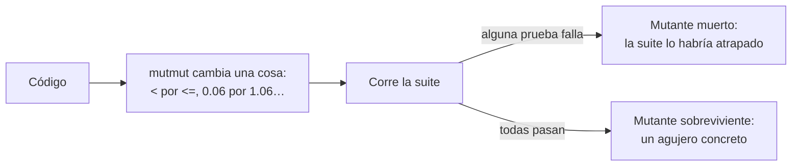

# 🧪 qa06 — Medir la suite: cobertura y mutación

> Python para desarrolladores Java senior · **Carta** · Track `qa` — Calidad, pruebas y
> mantenimiento · sección 6 de 10
> Se lee suelta: no hace falta ninguna otra sección de la carta. Conviene haber leído la
> [Fase 08](08-el-contrato-del-codigo.md) §5.6, que presenta la cobertura como diagnóstico y no como meta.
> Versiones verificadas contra PyPI el 05/10/2026 · Código probado el 05/10/2026 con Python 3.14.7,
> en contenedor: la cobertura y las dos corridas de `mutmut` (siete sobrevivientes y cinco).

---

## 🎯 1. Qué problema resuelve

La cobertura dice qué líneas **ejecutó** la suite. No dice si alguna prueba habría **fallado** si esas
líneas estuvieran mal. Una suite puede tener 100% de cobertura y no verificar nada: basta con llamar a las
funciones y no mirar el resultado, o mirarlo con aserciones tan débiles (`assert result is not None`) que
cualquier valor pasa. Es el ritual más extendido del oficio, y el más vacío.

La forma honesta de medir una suite es preguntarle directamente: *¿me avisarías si el código estuviera
mal?* Eso es **la prueba de mutación**: una herramienta introduce un error pequeño en el código —cambia un
`<` por un `<=`, un `+` por un `-`, un número por otro—, corre la suite, y mira si alguna prueba falla. Si
ninguna falla, la mutación **sobrevivió**, y eso es un agujero concreto en la suite, con su línea y su
cambio. En Python, la herramienta más usada es **`mutmut`** (3.8.0, del 2026-09-12).

---

## 🧠 2. El modelo

| Métrica | Qué mide | Qué no mide |
|---|---|---|
| **Cobertura de líneas** | Qué líneas se ejecutaron | Si alguien verificó lo que hicieron |
| **Cobertura de ramas** | Qué caminos de cada `if` se tomaron | Lo mismo, con más detalle |
| **Mutantes muertos** | Qué errores habría atrapado la suite | Los errores que nadie pensó como mutación |



El costo es el tiempo: cada mutante es una corrida de la suite (o de las pruebas que tocan esa línea).
Con cien mutantes y una suite de un segundo, son dos minutos; con una suite de un minuto, una hora y
media. Por eso la mutación se corre **sobre lo que el mapa de riesgo de `qa01` marca en rojo**, no sobre
todo el sistema.

### 🪞 Tu instinto de Java dice… y esta vez se equivoca

En Java, si alguna vez mediste mutación fue con PIT, y probablemente en un pipeline que reportaba un
porcentaje. El reflejo es traer el porcentaje como meta, igual que la cobertura. El valor de la mutación
no está en el número sino en **la lista de sobrevivientes**: cada uno dice "esta línea puede estar mal y
nadie se entera", y se arregla escribiendo la aserción que falta o aceptando, por escrito, que ese caso no
importa.

---

## 💻 3. El ejemplo que corre

```bash
uv add --dev pytest pytest-cov mutmut
```

`regalias.py`:

```python
"""La regalía trimestral: tasa, piso cero y redondeo al peso."""

from decimal import ROUND_HALF_EVEN, Decimal

RATE = Decimal("0.06")


def royalty(billed: Decimal, refunds: Decimal) -> Decimal:
    base = billed - refunds
    if base < 0:
        base = Decimal(0)
    return (base * RATE).quantize(Decimal("1"), rounding=ROUND_HALF_EVEN)
```

`tests/test_regalias.py`, una suite que llega al 100% de cobertura y casi no verifica:

```python
from decimal import Decimal

from regalias import royalty


def test_royalty_runs():
    assert royalty(Decimal("18420000"), Decimal("0")) is not None


def test_royalty_with_big_refunds():
    assert royalty(Decimal("100"), Decimal("500")) >= 0
```

`pyproject.toml`:

```toml
[tool.pytest.ini_options]
pythonpath = ["."]          # sin esto, pytest no encuentra regalias.py desde tests/

[tool.mutmut]
source_paths = ["regalias.py"]
pytest_add_cli_args_test_selection = ["tests/"]
```

`mutmut` 3.8 renombró sus claves: `paths_to_mutate` y `tests_dir` siguen funcionando, con un aviso de
deprecación, y casi todos los ejemplos de internet todavía las usan.

```bash
pytest -q --cov=regalias --cov-branch --cov-report=term-missing
mutmut run
mutmut results
```

Salida (Python 3.14.7, 05/10/2026), recortada:

```text
Name          Stmts   Miss Branch BrPart  Cover   Missing
---------------------------------------------------------
regalias.py       7      0      2      0   100%
...
    regalias.x_royalty__mutmut_2: survived
    regalias.x_royalty__mutmut_3: survived
    regalias.x_royalty__mutmut_4: survived
    regalias.x_royalty__mutmut_7: survived
    regalias.x_royalty__mutmut_9: survived
    regalias.x_royalty__mutmut_11: survived
    regalias.x_royalty__mutmut_12: survived
```

Cien por ciento de líneas y de ramas, y **siete mutantes vivos**. `mutmut show` muestra el cambio exacto
de cada uno —la tasa alterada, las devoluciones sumadas en vez de restadas, el piso movido— y cada uno es
una pregunta: *¿por qué ninguna prueba se dio cuenta?* La respuesta es la misma en todos: las aserciones
no miran el número.

La suite que los mata no es más larga, es más **precisa**:

```python
@pytest.mark.parametrize(("billed", "refunds", "expected"), [
    ("18420000", "0", "1105200"),       # la tasa: cualquier cambio a 0.06 falla aquí
    ("18420000", "420000", "1080000"),  # las devoluciones se restan, no se suman
    ("100", "500", "0"),                # el piso: negativo se vuelve cero
    ("100", "100", "0"),                # el borde del piso: exactamente cero
    ("75", "0", "4"),                   # 4,50 → 4 con redondeo bancario (y 5 hacia arriba)
])
def test_royalty_exact(billed, refunds, expected):
    assert royalty(Decimal(billed), Decimal(refunds)) == Decimal(expected)
```

Con esta suite sobreviven **cinco** mutantes, y la parte instructiva es que **los cinco son
equivalentes**: cambian el código sin cambiar ningún resultado posible.

```text
-    if base < 0:                    +    if base <= 0:              con base 0, el resultado es 0 igual
-    if base < 0:                    +    if base < 1:               toda base menor que 1 da menos de 0,06: redondea a 0
-        base = Decimal(0)           +        base = Decimal(1)      1 × 0,06 = 0,06: redondea a 0
-    ….quantize(…, rounding=ROUND_HALF_EVEN)  +  rounding=None        None usa el contexto, que ya es HALF_EVEN
-    ….quantize(…, rounding=ROUND_HALF_EVEN)  +  (sin el argumento)   lo mismo
```

Dos lecturas útiles salen de ahí. La primera: el redondeo explícito **coincide con el que trae el
contexto por defecto de `decimal`**, así que quitarlo no cambia nada… hasta el día que alguien cambie el
contexto en otro lado del programa. El argumento explícito sigue valiendo; la mutación no lo puede
defender, y eso se acepta por escrito. La segunda: el caso `75 → 4` sí mata a un mutante que cambiara el
modo a `ROUND_HALF_UP` (4,50 daría 5); el `25 → 2` que tenía el primer borrador de esta sección no
distinguía los dos modos, porque 1,50 da 2 en ambos.

**Detalles con intención**

- **`--cov-branch`**: la cobertura de líneas sola diría 100% aunque un `if` nunca hubiera tomado su
  camino falso. Con ramas, al menos sabes que se recorrieron los dos.
- **Cada caso de la tabla mata a un mutante concreto**, y el comentario dice cuál. Así, el día que alguien
  borre un caso "porque sobra", sabe qué deja de proteger.
- **`75 → 4`** es el caso del redondeo: 75 × 0,06 = 4,50, y el redondeo bancario lleva al par más
  cercano, 4; hacia arriba daría 5. Un caso que termine en ,50 con parte entera impar no distingue los
  dos modos.
- **`source_paths` apunta a un solo módulo**: el de las regalías, que es rojo en el mapa de riesgo. Mutar
  todo el proyecto es pagar horas por mutantes en código que no importa.

---

## ⚠️ 4. Lo que se rompe

**Los mutantes equivalentes.** En el ejemplo son cinco de catorce: mutaciones que no cambian ningún
resultado posible. Ninguna prueba puede matarlas, porque no hay diferencia observable. Se revisan una vez,
se marcan como aceptadas con su razón, y perseguirlas es tiempo perdido. Lo que no se hace es
"arreglarlas" quitando del código el redondeo explícito para que la herramienta quede contenta.

**La suite lenta.** `mutmut` corre las pruebas una vez por mutante. Si la suite tiene pruebas de
integración que tardan, la mutación tarda horas. Se corre con la suite rápida (`qa01`) y solo sobre los
módulos rojos.

**Las pruebas que dependen del orden o del azar.** Un mutante "muerto" porque una prueba es inestable no
dice nada. Antes de medir con mutación, la suite tiene que ser determinista: semillas fijas, reloj
congelado (`qa03`), y `pytest-randomly` en verde.

**Mutar el código generado o el de terceros.** Se excluye: no es tuyo y sus sobrevivientes no se arreglan.

---

## ⚖️ 5. Cuándo NO usarla

**En todo el sistema, en cada cambio.** Es demasiado lenta para eso. Se corre sobre los módulos críticos,
cuando cambian, o una vez por semana en el CI.

**Como meta numérica.** "90% de mutantes muertos" se convierte en el mismo ritual que la cobertura, con
más horas de máquina. La lista de sobrevivientes es el producto; el porcentaje, un resumen.

**Cosmic Ray** (8.7.0) es la alternativa, más configurable y pensada para correr distribuida; para un
equipo de uno, `mutmut` es más directo.

---

## 🧪 6. Ejercicios (10)

**🟢 Fácil (1–3)**

1. Corre `mutmut run` con la suite débil y anota cuántos mutantes sobreviven. **Criterio:** el número y
   el cambio de tres de ellos, con `mutmut show`.
2. Reemplaza la suite por la precisa y vuelve a correr. **Criterio:** reportas cuántos sobreviven ahora y
   cuáles.
3. Quita `--cov-branch` y compara el reporte. **Criterio:** explicas qué información se perdió.

**🟡 Intermedio (4–6)**

4. Identifica un mutante equivalente entre los sobrevivientes. **Criterio:** explicas por qué ninguna
   prueba puede matarlo, con el valor de entrada que lo demuestra.
5. Busca en la documentación de `mutmut` cómo se excluye una línea de la mutación. **Criterio:** excluyes
   una línea de registro (*logging*) y el número de mutantes baja.
6. Mide cuánto tarda `mutmut run` con la suite precisa. **Criterio:** reportas el tiempo y calculas
   cuánto tardaría con una suite de un minuto.

**🟠 Difícil (7–9)**

7. Corre `mutmut` sobre un módulo rojo de un proyecto tuyo. **Criterio:** la lista de sobrevivientes y,
   para cada uno, la prueba que lo mata o la razón escrita para aceptarlo.
8. Compara `mutmut` con Cosmic Ray sobre `regalias.py`. **Criterio:** cuántos mutantes genera cada uno, qué
   operadores usa y cuánto tarda.
9. Lleva la mutación al CI como tarea semanal que solo corre sobre los archivos que cambiaron en la
   semana. **Criterio:** una semana sin cambios en módulos rojos no corre nada.

**🔴 Muy difícil (10)**

10. Escribe el informe "¿cuánto protege nuestra suite?" para el módulo de liquidaciones. **Criterio:** un
    documento de una página. *Rúbrica:* (a) cobertura de ramas y mutantes muertos, con su fecha y versión;
    (b) cada sobreviviente con su decisión: prueba nueva o aceptado con razón; (c) el tiempo que cuesta
    medirlo y cada cuánto se repite; (d) una frase para Julián que no use la palabra "cobertura".

---

## 📚 7. Referencias

**Documentación oficial**

- `mutmut`: https://mutmut.readthedocs.io/en/latest/
- `coverage.py`, cobertura de ramas: https://coverage.readthedocs.io/en/latest/branch.html
- `pytest-cov`: https://pytest-cov.readthedocs.io/en/latest/
- Cosmic Ray: https://cosmic-ray.readthedocs.io/en/latest/

**Orden de lectura sugerido:** la página de cobertura de ramas, que explica qué significa "parcial";
después `mutmut`, en especial la parte de mutantes equivalentes.

---

## 🚀 8. Cierre

La cobertura dice qué se ejecutó; la mutación dice qué se habría atrapado. Se corre sobre lo que el mapa
de riesgo marca en rojo, y su producto no es un porcentaje sino una lista: cada sobreviviente es una
aserción que falta o una decisión de aceptarlo por escrito.

**La señal de que quedó bien:** *"El módulo de regalías tenía 100% de cobertura y siete mutantes vivos;
ahora tiene el mismo 100% y cinco vivos, los cinco equivalentes y explicados por escrito."*

> 🏷️ **Cierra la sección con su tag**, cuando los ejercicios que elegiste estén hechos:
>
> ```bash
> git tag -a op-qa-fase-06 -m "op qa06 cerrada: cobertura de ramas y mutantes sobrevivientes"
> ```
>
> Los commits llevan su prefijo (`op qa06: …`) y los de ejercicio su número
> (`op qa06 ej07: …`).
