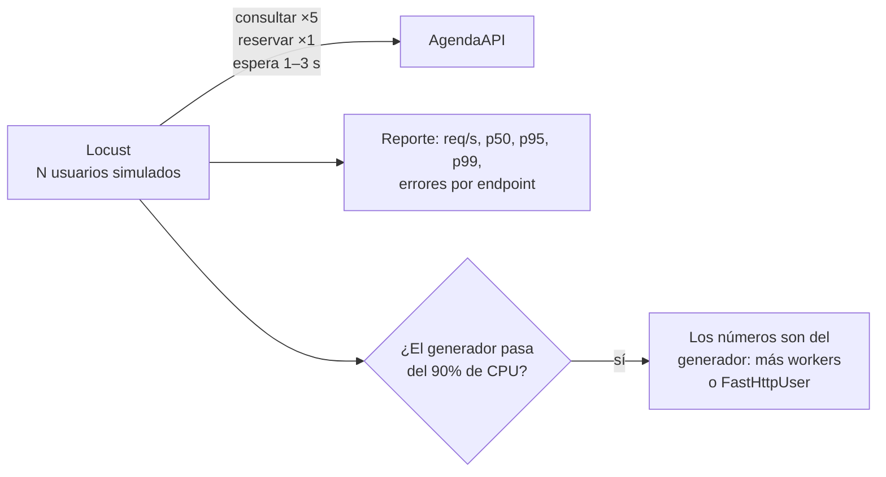

# 🧪 qa07 — Carga y rendimiento

> Python para desarrolladores Java senior · **Carta** · Track `qa` — Calidad, pruebas y
> mantenimiento · sección 7 de 10
> Se lee suelta: no hace falta ninguna otra sección de la carta. Conviene haber leído la
> [Fase 17](17-el-duelo-y-el-veredicto.md), cuya confesión de método es la regla de esta sección: un
> generador de carga que no puede superar al servidor mide al generador.
> Versiones verificadas contra PyPI el 05/10/2026 · Código probado el 05/10/2026 con Python 3.14.7,
> en contenedor: los comandos corren; las cifras de carga van en `⏳` porque no son una medición con
> condiciones declaradas, y la salida rotulada «Salida esperada, sin correr» muestra su forma.

---

## 🎯 1. Qué problema resuelve

Dos preguntas distintas que suelen mezclarse:

- **Carga**: ¿AgendaAPI aguanta el lunes a las 8:00, cuando las diez sedes abren a la vez y las
  auxiliares consultan disponibilidad y reservan durante veinte minutos seguidos? Eso se responde
  **simulando usuarios** contra el servicio corriendo, y mirando latencias y errores.
- **Rendimiento de una función**: ¿el cálculo de vencimientos de glosas se volvió más lento con el último
  cambio? Eso se responde con un **microbenchmark** repetible, dentro de la suite.

Para la primera, **Locust** (2.46.7, del 2026-10-04): describes en Python lo que hace un usuario, y Locust
lanza cientos a la vez y reporta. Para la segunda, **`pytest-benchmark`** (5.3.0): una fixture que repite
la función, calcula estadísticas y compara contra la corrida anterior.

Y una regla que el camino base aprendió midiendo, y que esta sección hereda tal cual: **el generador de
carga no puede ser el cuello de botella**. Locust está escrito en Python; si la máquina que lo corre se
satura antes que el servidor, los números son del generador.

---

## 🧠 2. El modelo

**Un usuario de Locust** es una clase con tareas ponderadas y un tiempo de espera entre ellas. No describe
peticiones por segundo sino **comportamiento**: "una auxiliar consulta disponibilidad cinco veces por cada
reserva, y espera entre uno y tres segundos entre una cosa y otra". Las peticiones por segundo salen de
cuántos usuarios hay y de cómo se comportan.



**Tres números** importan, y el promedio no es uno de ellos: el **p95** y el **p99** de latencia (lo que
sufre la auxiliar más desafortunada de cada cien), las **peticiones por segundo sostenidas**, y la
**tasa de errores**. Un servicio con p50 de 20 ms y p99 de 4 segundos tiene un problema que el promedio
esconde.

### 🪞 Tu instinto de Java dice… y esta vez se equivoca

En el mundo Java el reflejo es JMeter o Gatling, con escenarios en XML o en un DSL de Scala, ejecutados en
la JVM, que no se satura fácil. El instinto es suponer que la herramienta de carga siempre puede más que el
servidor. Con Locust, por defecto, **no siempre**: cada proceso de Locust usa un núcleo, y con el usuario
HTTP estándar llega a algunos cientos de peticiones por segundo por núcleo. Para el volumen de Áurea sobra;
para medir un servicio que da miles, hace falta `FastHttpUser`, varios procesos *worker*, o una herramienta
compilada.

---

## 💻 3. El ejemplo que corre

```bash
uv add fastapi uvicorn
uv add --dev locust pytest pytest-benchmark
```

`agenda_api.py`, un AgendaAPI mínimo para tener contra qué medir:

```python
"""AgendaAPI mínima: disponibilidad por sede y reserva, con una latencia simulada de base de datos."""

import asyncio
import random

from fastapi import FastAPI, HTTPException

app = FastAPI()
SEDES = {"centro", "suba", "zipaquira"}


@app.get("/disponibilidad/{sede}")
async def availability(sede: str) -> dict:
    if sede not in SEDES:
        raise HTTPException(404, f"no existe la sede {sede}")
    await asyncio.sleep(random.uniform(0.005, 0.020))     # la consulta a la base
    return {"sede": sede, "libres": ["08:00", "08:40", "15:40"]}


@app.post("/reservas/{sede}")
async def book(sede: str) -> dict:
    await asyncio.sleep(random.uniform(0.010, 0.040))
    return {"reserva": "R1"}
```

`locustfile.py`, el comportamiento de una auxiliar el lunes a las 8:00:

```python
"""Una auxiliar de recepción: consulta mucho, reserva poco, y espera entre una cosa y otra."""

import random

from locust import HttpUser, between, task


class Receptionist(HttpUser):
    wait_time = between(1, 3)

    @task(5)
    def check_availability(self):
        sede = random.choice(["centro", "suba", "zipaquira"])
        # name= agrupa las URL con parámetro en una sola fila del reporte.
        self.client.get(f"/disponibilidad/{sede}", name="/disponibilidad/[sede]")

    @task(1)
    def book(self):
        self.client.post("/reservas/centro", name="/reservas/[sede]")
```

```bash
uvicorn agenda_api:app --port 8000 --workers 2 &
locust -f locustfile.py --headless -u 60 -r 20 -t 30s --host http://127.0.0.1:8000 --only-summary
```

Sesenta usuarios son unas seis auxiliares por sede con margen; con su tiempo de espera, producen unas
treinta peticiones por segundo, que es lo que importa simular: **el pico real de Áurea**, no el máximo
teórico del servidor. En la prueba de esta sección, el agregado dio **29,3 req/s** con cero errores, que
confirma la cuenta. Las latencias de esa corrida no se publican como medición: salieron de un contenedor
en un portátil, con generador y servidor en la misma máquina, que es justo lo que §4 pide declarar.

Salida esperada, sin correr (las cifras dependen de la máquina; la forma, no):

```text
Type     Name                    # reqs   # fails |   Avg   Min   Max   Med |  req/s
--------|-----------------------|--------|---------|------|-----|------|------|-------
GET      /disponibilidad/[sede]     ⏳     0(0.00%) |   ⏳    ⏳    ⏳    ⏳  |   ⏳
POST     /reservas/[sede]           ⏳     0(0.00%) |   ⏳    ⏳    ⏳    ⏳  |   ⏳
...
Response time percentiles (approximated)
Type     Name                      50%    66%    75%    80%    90%    95%    98%    99%  99.9%
```

### El microbenchmark, dentro de la suite

`test_rendimiento.py`:

```python
"""El cálculo de vencimientos, medido con pytest-benchmark."""

import datetime as dt


def due_date(notified_on: dt.date, business_days: int = 15) -> dt.date:
    day, remaining = notified_on, business_days
    while remaining:
        day += dt.timedelta(days=1)
        if day.weekday() < 5:
            remaining -= 1
    return day


def test_due_date_speed(benchmark):
    result = benchmark(due_date, dt.date(2026, 9, 18))
    assert result == dt.date(2026, 10, 9)
```

```bash
pytest test_rendimiento.py --benchmark-autosave
pytest test_rendimiento.py --benchmark-compare --benchmark-compare-fail=mean:20%
```

La segunda línea compara contra la corrida guardada y **falla si el promedio empeoró más de un 20%**:
así, una regresión de rendimiento en una función crítica se convierte en una prueba roja.

**Detalles con intención**

- **`name=`** en las peticiones con parámetros: sin él, el reporte tiene una fila por sede y por
  identificador, y con mil reservas el reporte es ilegible.
- **El tiempo de espera es parte del modelo.** Sin `wait_time`, cada usuario dispara peticiones sin parar
  y la prueba mide "cuánto aguanta", no "cómo se comporta con la gente real".
- **`--only-summary`** evita la tabla que se refresca cada pocos segundos en la consola; para guardar los
  números, `--csv resultados` escribe los archivos de estadísticas.
- **`--benchmark-compare-fail`** es lo que convierte el benchmark en una prueba. Sin él, es un número que
  nadie mira.

---

## ⚠️ 4. Lo que se rompe

**El generador saturado.** Locust avisa en su registro cuando un proceso pasa del 90% de CPU. Si aparece ese
aviso, los números de latencia y de peticiones por segundo no son del servidor. Las salidas: `FastHttpUser`
(un cliente más rápido), varios procesos con `--processes`, o correr el generador en otra máquina.

**Medir en la misma máquina sin decirlo.** Generador y servidor compitiendo por los mismos núcleos producen
números peores que los reales, y el reporte no lo dice. La regla de `BENCHMARKS.md` del curso aplica igual:
la máquina y la topología se declaran con el número.

**El benchmark en una máquina con otras cosas corriendo.** `pytest-benchmark` repite y calcula
estadísticas, pero un navegador compilando JavaScript en otro núcleo mueve el promedio un 30%. Las
comparaciones se hacen en la misma máquina, en las mismas condiciones, y con un margen como el 20% del
ejemplo.

**Probar la carga contra producción.** Una prueba de carga contra la base de datos real de las diez sedes,
un lunes, es un incidente. Se prueba contra un entorno igual al de producción y con datos fabricados.

---

## ⚖️ 5. Cuándo NO usarla

**Para Áurea, a diario.** Con treinta peticiones por segundo en el pico, AgendaAPI está, como dice la Fase 17,
órdenes de magnitud por debajo de cualquier límite. Una prueba de carga antes de un cambio grande de
arquitectura vale; una en cada entrega, no.

**Para comparar lenguajes o *frameworks*.** Eso es un duelo, con sus propias reglas, y la Fase 17 lo hace
con un generador compilado justamente porque Locust no basta para esos volúmenes.

**`pytest-benchmark` para funciones de microsegundos sin contexto.** Mejorar de 3 a 2 microsegundos una
función que se llama cien veces al día no cambia nada. El microbenchmark es para lo que está en el camino
caliente.

---

## 🧪 6. Ejercicios (10)

**🟢 Fácil (1–3)**

1. Corre la carga con 60 usuarios y guarda los resultados con `--csv`. **Criterio:** reportas p50, p95 y
   p99 de cada endpoint con la máquina y la topología declaradas.
2. Quita el `name=` de la consulta de disponibilidad. **Criterio:** describes cómo cambia el reporte.
3. Corre `pytest-benchmark` dos veces y compara. **Criterio:** explicas por qué el promedio no es idéntico
   entre corridas.

**🟡 Intermedio (4–6)**

4. Busca en la documentación de Locust cómo funciona `FastHttpUser` y cámbialo. **Criterio:** con 1.000
   usuarios sin tiempo de espera, comparas las peticiones por segundo que alcanza cada tipo de usuario
   y el uso de CPU del generador.
5. Haz que el 5% de las reservas falle con 409 (espacio ocupado) y que Locust no lo cuente como error.
   **Criterio:** `catch_response=True` y una regla que marque como éxito el 409 esperado.
6. Introduce una regresión en `due_date` (recorrer día por día hasta un año) y corre la comparación.
   **Criterio:** la prueba falla con el porcentaje de empeoramiento.

**🟠 Difícil (7–9)**

7. Satura el generador a propósito: un solo proceso de Locust contra un servidor con cuatro *workers*.
   **Criterio:** encuentras el aviso de CPU del generador y demuestras, con `--processes 4`, que el
   número subió sin tocar el servidor.
8. Describe en Locust el pico real del lunes con una forma de carga (*load shape*): sube durante cinco
   minutos, se mantiene veinte, baja. **Criterio:** la forma es una clase y el reporte muestra las tres
   fases.
9. Lleva el microbenchmark al CI con su comparación guardada. **Criterio:** un cambio que empeora la
   función más de un 20% pone el CI en rojo.

**🔴 Muy difícil (10)**

10. Diseña la prueba de capacidad de AgendaAPI para el día en que Áurea tenga veinte sedes. **Criterio:**
    una especificación con hipótesis, condiciones, comando y umbral. *Rúbrica:* (a) el comportamiento de
    los usuarios sale de datos reales de uso, no de un número inventado; (b) la topología separa generador
    y servidor y se declara; (c) se comprueba que el generador no es el cuello de botella; (d) el umbral de
    éxito está en p99 y errores, no en promedio.

---

## 📚 7. Referencias

**Documentación oficial**

- Locust: https://docs.locust.io/en/stable/
- Locust, `FastHttpUser` y el aviso de CPU: https://docs.locust.io/en/stable/increase-performance.html
- `pytest-benchmark`: https://pytest-benchmark.readthedocs.io/en/latest/

**Orden de lectura sugerido:** la página de rendimiento de Locust primero —es la que evita medir al
generador—; después el inicio rápido; y `pytest-benchmark` cuando tengas una función en el camino caliente.

---

## 🚀 8. Cierre

La carga se simula como comportamiento —tareas ponderadas y esperas—, se lee en percentiles y errores, y se
mide con un generador que no se satura antes que el servidor. El rendimiento de una función crítica vive
dentro de la suite, con una comparación que falla cuando empeora.

**La señal de que quedó bien:** *"La prueba del pico del lunes da p99 por debajo del umbral, el generador no
pasó del 50% de CPU, y la regresión de la semana pasada la atrapó el benchmark."*

> 🏷️ **Cierra la sección con su tag**, cuando los ejercicios que elegiste estén hechos:
>
> ```bash
> git tag -a op-qa-fase-07 -m "op qa07 cerrada: el pico del lunes con Locust y un benchmark en la suite"
> ```
>
> Los commits llevan su prefijo (`op qa07: …`) y los de ejercicio su número
> (`op qa07 ej07: …`).
