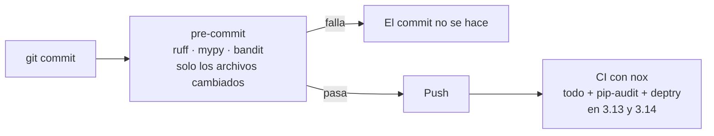

# 🧪 qa08 — La cadena de calidad

> Python para desarrolladores Java senior · **Carta** · Track `qa` — Calidad, pruebas y
> mantenimiento · sección 8 de 10
> Se lee suelta: no hace falta ninguna otra sección de la carta. Conviene haber leído la
> [Fase 08](08-el-contrato-del-codigo.md), que enciende `mypy`, y la
> [Fase 00](00-instalacion-ambiente-editores-y-ecosistema.md), que deja `ruff` configurado.
> Versiones verificadas contra PyPI el 05/10/2026 · Código probado el 05/10/2026 con Python 3.14.7,
> en contenedor: las cinco herramientas sobre el módulo de ejemplo; el `pre-commit` y el `noxfile.py`,
> el 07/10/2026 (`nox` 2026.8.17, `pre-commit` 4.6.2), en la verificación final de la carta.

---

## 🎯 1. Qué problema resuelve

Las pruebas atrapan lo que alguien pensó probar. Una familia entera de defectos no la atrapa ninguna
prueba, porque no es de comportamiento: el `import` que sobra, el tipo que no cuadra en una rama que nadie
ejerce, el `subprocess` con `shell=True` que abre una inyección, la dependencia con una vulnerabilidad
publicada la semana pasada, la función que nadie llama desde hace un año, el paquete que se importa y no
está declarado en `pyproject.toml`.

Para un equipo de uno, esos defectos los tiene que encontrar **una máquina**, siempre, antes de cada
commit, sin que nadie se acuerde de correr nada. Esta sección arma esa cadena con las herramientas que
valen la pena, cada una con su pregunta, y la conecta en dos puntos: `pre-commit` en la máquina y `nox` en
el CI.

---

## 🧠 2. El modelo

Cada herramienta contesta una pregunta, y ninguna contesta la de otra:

| Herramienta | Versión | Pregunta | Velocidad |
|---|---|---|---|
| **`ruff`** | 0.16.10 | ¿El código tiene errores evidentes y el formato acordado? | Milisegundos |
| **`mypy`** (o `pyright`) | 2.4.0 (1.1.414) | ¿Los tipos cuadran en todas las ramas? | Segundos |
| **`bandit`** | 1.9.4 | ¿Hay patrones conocidos de inseguridad? | Segundos |
| **`pip-audit`** | 2.10.1 | ¿Alguna dependencia tiene una vulnerabilidad publicada? | Segundos (consulta una base) |
| **`deptry`** | 0.25.1 | ¿Lo que se importa coincide con lo que se declara? | Segundos |
| **`vulture`** | 2.16 | ¿Hay código que nadie usa? | Segundos, con falsos positivos |
| **`pre-commit`** | 4.6.2 | ¿Corre todo esto antes de cada commit? | — |
| **`nox`** (o `tox`) | 2026.8.17 (4.64.9) | ¿Corre todo esto igual en el CI y en varias versiones de Python? | — |



### 🪞 Tu instinto de Java dice… y esta vez se equivoca

En Java, buena parte de esta cadena la hace el **compilador** —tipos, imports que sobran, código
inalcanzable— y el resto vive en el *build* (SpotBugs, OWASP Dependency-Check, Checkstyle) con Maven o
Gradle. El reflejo en Python es sentir que sin compilador no hay red. La hay, pero es **opt-in**: nadie te
avisa de un tipo mal puesto si no corres `mypy`, y nadie lo corre si no está en la cadena. La diferencia
con Java no es que falten herramientas, es que hay que encenderlas.

---

## 💻 3. El ejemplo que corre

```bash
uv add --dev ruff mypy bandit pip-audit deptry vulture pre-commit nox
```

`cartera/reporte.py`, con un defecto distinto para cada herramienta:

```python
"""Un módulo con un defecto para cada herramienta de la cadena."""

import json
import os                                   # ruff: importado y no usado
import subprocess
from decimal import Decimal

import requests                             # deptry: importado y no declarado en pyproject.toml


def total(amounts: list[Decimal]) -> Decimal:
    return sum(amounts)                     # mypy: sum de una lista vacía es int, no Decimal


def export(path: str, rows: list[dict]) -> None:
    subprocess.run(f"gzip {path}", shell=True)   # bandit: shell=True con un valor de afuera
    with open(path, "w") as f:
        json.dump(rows, f)


def old_report() -> None:                   # vulture: nadie la llama
    print(requests.__version__)
```

`pyproject.toml`:

```toml
[project]
name = "cartera"
version = "0.1.0"
requires-python = ">=3.13"
dependencies = []

[tool.ruff]
line-length = 100

[tool.ruff.lint]
select = ["E", "F", "I", "UP", "B", "S"]       # S: las reglas de seguridad de bandit, dentro de ruff

[tool.mypy]
strict = true
```

```bash
ruff check cartera/ --output-format concise
mypy cartera/
bandit -q -r cartera/
deptry .
vulture cartera/
```

Salida (Python 3.14.7, 05/10/2026), con una línea en blanco entre herramientas:

```text
cartera/reporte.py:3:1: I001 [*] Import block is un-sorted or un-formatted
cartera/reporte.py:4:8: F401 [*] `os` imported but unused
cartera/reporte.py:16:5: S602 `subprocess` call with `shell=True` identified, security issue

cartera/reporte.py:12: error: Incompatible return value type (got "Decimal | Literal[0]", expected "Decimal")  [return-value]
cartera/reporte.py:15: error: Missing type arguments for generic type "dict"  [type-arg]
cartera/reporte.py:22: error: Module "requests" does not explicitly export attribute "__version__"  [attr-defined]

>> Issue: [B404:blacklist] Consider possible security implications associated with the subprocess module.
>> Issue: [B602:subprocess_popen_with_shell_equals_true] subprocess call with shell=True identified, security issue.

cartera/reporte.py:8:8: DEP003 'requests' imported but it is a transitive dependency

cartera/reporte.py:4: unused import 'os' (90% confidence)
cartera/reporte.py:11: unused function 'total' (60% confidence)
cartera/reporte.py:15: unused function 'export' (60% confidence)
cartera/reporte.py:21: unused function 'old_report' (60% confidence)
```

Cada herramienta encontró el defecto sembrado para ella, y casi todas encontraron algo más. Tres de esos
extras valen la pena:

- **El `return-value` de `mypy` es el más sutil**: `sum([])` devuelve el entero `0`, no un `Decimal`, y el
  día que una sede no tenga facturas, `total` devuelve un tipo distinto del que promete. El arreglo es
  `sum(amounts, Decimal(0))`. El modo estricto agregó además el `dict` sin parámetros, que es lo que pide.
- **`deptry` dijo `DEP003`, no `DEP001`**: en el entorno de la prueba `requests` estaba instalado aunque el
  proyecto no lo declara, así que lo vio como dependencia que llega por otra (transitiva). En un entorno
  sin `requests` habría dicho `DEP001`, "no declarada". Las dos son el mismo problema: el día que la
  dependencia intermedia lo suelte, el `import` revienta.
- **`vulture` marcó `total` y `export`**, que sí se usan, solo que desde otro módulo que este ejemplo no
  tiene. Es el falso positivo del que habla el detalle de abajo: el 60% de confianza es una pregunta, no
  una orden de borrar.

`.pre-commit-config.yaml`, para que todo esto corra antes de cada commit:

```yaml
repos:
  - repo: https://github.com/astral-sh/ruff-pre-commit
    rev: v0.16.10
    hooks:
      - id: ruff-check
        args: [--fix]
      - id: ruff-format
  - repo: https://github.com/pre-commit/mirrors-mypy
    rev: v2.4.0
    hooks:
      - id: mypy
        args: [--strict]
```

`noxfile.py`, la misma cadena en el CI, en dos versiones de Python:

```python
"""La cadena completa: en el CI y en la máquina, igual."""

import nox

nox.options.default_venv_backend = "uv"


@nox.session(python=["3.13", "3.14"])
def tests(session: nox.Session) -> None:
    session.install("-e", ".", "pytest")
    session.run("pytest", "-q")


@nox.session
def lint(session: nox.Session) -> None:
    session.install("ruff", "mypy", "bandit", "deptry", "pip-audit")
    session.run("ruff", "check", ".")
    session.run("mypy", "cartera/")
    session.run("deptry", ".")
    session.run("pip-audit")                     # consulta una base externa: necesita red
```

```bash
pre-commit install            # una vez por clon
nox                           # todo, como en el CI
```

Salida (Python 3.14.7, 07/10/2026), sobre el módulo de ejemplo y en un repositorio recién creado (`git init`):

```text
$ nox -l
* tests-3.13
* tests-3.14
* lint
$ nox -s lint
I001 [*] Import block is un-sorted or un-formatted
F401 [*] `os` imported but unused
S602 `subprocess` call with `shell=True` identified, security issue
Found 3 errors.
nox > Command ruff check . failed with exit code 1
nox > Session lint failed.
$ nox -s tests-3.14
no tests ran in 0.01s
nox > Command pytest -q failed with exit code 5
nox > Session tests-3.14 failed.
$ pre-commit run --all-files
ruff check...............................................................Failed
Found 3 errors (2 fixed, 1 remaining).
ruff format..............................................................Failed
mypy.....................................................................Failed
noxfile.py:3: error: Cannot find implementation or library stub for module named "nox"  [import-not-found]
noxfile.py:8: error: Untyped decorator makes function "tests" untyped  [untyped-decorator]
noxfile.py:14: error: Untyped decorator makes function "lint" untyped  [untyped-decorator]
cartera/reporte.py:7: error: Library stubs not installed for "requests"  [import-untyped]
cartera/reporte.py:11: error: Incompatible return value type (got "Decimal | Literal[0]", expected "Decimal")  [return-value]
cartera/reporte.py:14: error: Missing type arguments for generic type "dict"  [type-arg]
Found 6 errors in 2 files (checked 3 source files)
```

Lo que contesta la corrida:

- **`nox -s lint` se detiene en la primera herramienta que falla**: `ruff` encuentra tres defectos y `mypy`, `deptry` y
  `pip-audit` no llegan a correr: dentro de una sesión, el primer comando que falla la termina. Es lo que se quiere en
  el CI —el primer rojo basta para no publicar—; para el informe completo, cada herramienta va en su propia sesión,
  porque `nox` sí corre todas las sesiones aunque una falle.
- **`nox -s tests` falla con el código 5 de pytest**, *no tests ran*: el ejemplo no trae pruebas, y pytest considera
  que una suite vacía es un error. En un proyecto real es una virtud: si alguien rompe el descubrimiento de pruebas, el
  CI no pasa en verde con cero pruebas.
- **El *hook* de `mypy` no ve `nox` ni los *stubs* de `requests`**: corre en su entorno aislado, exactamente lo que
  advierte §4. Con `additional_dependencies: [nox, types-requests]` esos tres errores desaparecen y quedan los dos del
  módulo.
- **`ruff --fix` en el *hook* corrige dos defectos solo** (el `import` sobrante y el orden) y deja el de seguridad: el
  commit igual se rechaza, y el archivo queda modificado para revisar.
- **Un defecto propio que la corrida encontró**: el comentario de `pip-audit` en el `noxfile.py` pasaba de las 100
  columnas que el propio `pyproject.toml` fija, y `ruff` lo marcaba (`E501`). Se acortó.

**Detalles con intención**

- **`S` en `ruff`** trae las reglas de `bandit` dentro de `ruff`, en milisegundos. `bandit` aparte sigue
  valiendo para el informe completo y su configuración propia; la primera barrera es la de `ruff`.
- **`mypy --strict`** desde el primer día de un proyecto nuevo. Encenderlo en un proyecto de dos años
  produce cientos de errores y la tentación de apagarlo; la Fase 08 lo enciende módulo por módulo.
- **`pip-audit` va en el CI, no en el `pre-commit`**: consulta una base externa y tarda; frena cada commit
  por algo que casi nunca cambia entre commits.
- **`vulture` reporta con un porcentaje de confianza.** Un 60% es "puede que nadie la use": se revisa, no
  se borra a ciegas, porque las funciones que llama un *framework* por nombre parecen muertas.

---

## ⚠️ 4. Lo que se rompe

**Las versiones que no coinciden.** El `ruff` del `pre-commit` (fijado en `rev:`) y el del entorno (fijado
en el *lock*) pueden ser versiones distintas, con reglas distintas: el commit pasa y el CI falla, o al revés.
Se actualizan juntos, y `pre-commit autoupdate` lo hace para los *hooks*.

**`mypy` en el `pre-commit` sin las dependencias.** El *hook* de `mypy` corre en un entorno propio, aislado:
no ve las bibliotecas del proyecto, y reporta que no encuentra sus tipos. Se le pasan con
`additional_dependencies`, o se corre `mypy` como *hook* local del entorno del proyecto.

**La cadena que nadie puede pasar.** Si el primer `pre-commit` de un proyecto viejo marca cuatrocientos
errores, la gente usa `--no-verify` y la cadena muere el primer día. Se enciende por partes: `ruff` con las
reglas básicas, después `mypy` en un módulo, y se amplía cuando el anterior queda en verde.

**Los falsos positivos sin registro.** Un `# noqa` o un `# nosec` sin la razón al lado es un agujero que
nadie va a revisar. La convención: siempre con el código de la regla y la razón (`# nosec B602: el path
viene de una constante`).

---

## ⚖️ 5. Cuándo NO usarla

**Todas a la vez en un proyecto heredado.** La cadena completa en un sistema que nunca la tuvo es un
proyecto en sí mismo. Se empieza por `ruff` y `pip-audit`, que son las de mejor relación entre lo que
encuentran y lo que cuestan.

**`tox` y `nox` a la vez.** Hacen lo mismo con distinto estilo: `tox` se configura en un archivo
declarativo; `nox`, en Python. Se elige uno.

**Como sustituto de las pruebas.** La cadena atrapa lo que es evidente sin ejecutar el código. Que la
liquidación de regalías dé el número correcto no lo sabe ninguna de estas herramientas.

---

## 🧪 6. Ejercicios (10)

**🟢 Fácil (1–3)**

1. Arregla los defectos de `reporte.py`. **Criterio:** las cinco herramientas pasan, con a lo sumo un
   `# nosec B404` justificado por escrito.
2. Instala el `pre-commit` y haz un commit con un import que sobra. **Criterio:** el commit no se hace y
   `ruff --fix` lo corrige solo; el segundo intento pasa.
3. Corre `pip-audit` sobre un proyecto tuyo. **Criterio:** reportas qué encontró, o que no encontró nada,
   con la fecha.

**🟡 Intermedio (4–6)**

4. Busca en la documentación de `ruff` qué reglas de `bandit` cubre el prefijo `S` y cuáles no.
   **Criterio:** una lista de tres reglas de `bandit` que `ruff` no implementa.
5. Agrega `requests` a las dependencias y vuelve a correr `deptry`. **Criterio:** pasa; después declara una
   dependencia que no se importa y explica qué código de error da.
6. Prueba `pyright` en modo estricto sobre el mismo archivo. **Criterio:** comparas qué encuentra `pyright`
   que `mypy` no, y al revés.

**🟠 Difícil (7–9)**

7. Configura el *hook* de `mypy` con `additional_dependencies` para un proyecto que usa Pydantic.
   **Criterio:** `mypy` en el `pre-commit` y en el entorno dan los mismos resultados.
8. Haz que el CI corra `nox -s tests` en 3.13 y 3.14 en paralelo. **Criterio:** una matriz de dos trabajos
   y los dos en verde.
9. Mide cuánto tarda el `pre-commit` completo sobre un cambio de un archivo y sobre todo el repositorio
   (`--all-files`). **Criterio:** los dos tiempos, y la decisión de qué *hooks* van en el `pre-commit` y
   cuáles solo en el CI.

**🔴 Muy difícil (10)**

10. Enciende la cadena en un proyecto heredado tuyo sin que nadie use `--no-verify`. **Criterio:** un plan
    por etapas y la primera etapa aplicada. *Rúbrica:* (a) cuentas los hallazgos de cada herramienta antes
    de empezar; (b) cada etapa deja el proyecto en verde antes de la siguiente; (c) los `noqa` que quedan
    tienen razón escrita; (d) dices cuánto tiempo agrega la cadena a cada commit.

---

## 📚 7. Referencias

**Documentación oficial**

- `ruff`, reglas: https://docs.astral.sh/ruff/rules/
- `mypy`, modo estricto: https://mypy.readthedocs.io/en/stable/command_line.html#cmdoption-mypy-strict
- `pre-commit`: https://pre-commit.com/
- `nox`: https://nox.thea.codes/en/stable/
- `pip-audit`: https://github.com/pypa/pip-audit
- `deptry`: https://deptry.com/

**Orden de lectura sugerido:** la página de `pre-commit`, que es corta y cambia tu forma de trabajar;
después la lista de reglas de `ruff`; y las demás cuando enciendas cada herramienta.

---

## 🚀 8. Cierre

La cadena de calidad es lo que en Java hace el compilador más lo que hace el *build*, encendido a mano:
`ruff` y `mypy` en cada commit, el resto en el CI, y todo con las mismas versiones en los dos lugares. Se
enciende por partes, y cada excepción lleva su razón escrita.

**La señal de que quedó bien:** *"Una sede sin facturas habría devuelto un entero en vez de un Decimal, y
lo atrapó `mypy` antes del commit, no el cierre."*

> 🏷️ **Cierra la sección con su tag**, cuando los ejercicios que elegiste estén hechos:
>
> ```bash
> git tag -a op-qa-fase-08 -m "op qa08 cerrada: ruff, mypy, bandit, deptry, vulture, pre-commit y nox"
> ```
>
> Los commits llevan su prefijo (`op qa08: …`) y los de ejercicio su número
> (`op qa08 ej07: …`).
