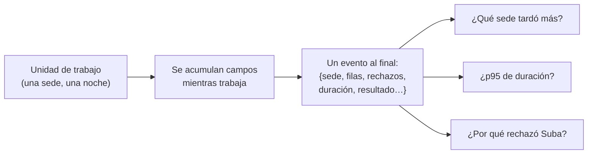

# 🔭 ob01 — Las señales y los eventos anchos

> Python para desarrolladores Java senior · **Carta** · Track `ob` — Observar el sistema propio ·
> sección 1 de 7
> Se lee suelta: no hace falta ninguna otra sección de la carta. Conviene haber leído la
> [Fase 16](16-operacion-y-rendimiento.md), que deja el registro estructurado, las métricas y las trazas
> básicas del cierre.
> Versiones verificadas contra PyPI el 05/10/2026 · Código probado el 05/10/2026 con Python 3.14.7,
> en contenedor: las salidas son las de esa corrida.

---

## 🎯 1. Qué problema resuelve

Son las 9:15 del martes y Patricia escribe: *"¿El cierre de anoche estuvo raro? Suba no me cuadra"*. Para
contestar, hay que saber cuánto tardó cada sede, cuántas filas procesó, cuántas rechazó y por qué. La Fase
16 dejó el cierre con registro estructurado, métricas y trazas, que son las **tres señales** clásicas. Y
aun así, contestar a Patricia exige cruzar tres herramientas: el registro tiene los mensajes, las métricas
tienen totales agregados que ya perdieron el detalle de Suba, y las trazas tienen los tiempos pero no el
número de filas.

Esta sección presenta una cuarta forma de observar, que para un sistema pequeño importa más que las otras
tres: **el evento ancho** —un único registro por unidad de trabajo, con todos los campos que la describen—.
Un evento por sede y por noche, con veinte campos, contesta preguntas que nadie previó cuando definió las
métricas, porque el detalle sigue ahí.

---

## 🧠 2. El modelo

| Señal | Qué es | Qué contesta bien | Qué pierde |
|---|---|---|---|
| **Registro** (*log*) | Mensajes sueltos con contexto | "¿Qué pasó en esta ejecución?" | Agregar: contar, comparar, percentiles |
| **Métrica** | Números agregados en el tiempo | "¿Cómo va el sistema?" en un panel | El detalle: qué sede, qué lote |
| **Traza** | El recorrido de una operación, con tiempos | "¿Dónde se fue el tiempo?" | Lo que no es tiempo |
| **Evento ancho** | **Un registro por unidad de trabajo**, con todos sus campos | Preguntas que nadie previó | Nada que importe a esta escala |

El evento ancho es una disciplina, no una herramienta: **en vez de escribir diez líneas de registro a lo
largo del trabajo, se acumulan los datos y se escribe una sola línea al final**, con todo: sede, lote,
filas leídas, filas rechazadas, motivos, duración, resultado, versión del código. Las métricas salen de
agregar esos eventos; muchas preguntas de "¿por qué?" se contestan filtrándolos.



### 🪞 Tu instinto de Java dice… y esta vez se equivoca

En Java el reflejo es registrar a cada paso —"empezó", "leyó el archivo", "validó", "terminó"— con niveles
`INFO` y `DEBUG`, y definir las métricas de Micrometer por adelantado. Cuando llega una pregunta que nadie
previó, la respuesta está repartida en mil líneas que hay que reconstruir con `grep`. **Una línea por unidad
de trabajo, con todo**, se consulta como una tabla.

---

## 💻 3. El ejemplo que corre

Sin dependencias. `eventos.py` acumula los campos de cada sede durante el cierre y escribe un evento al
final, aunque el trabajo falle; después contesta la pregunta de Patricia leyendo los eventos.

```python
"""Un evento ancho por sede y por noche, y las preguntas que contesta sin haberlas previsto."""

import json
import statistics
import time
from collections import Counter
from contextlib import contextmanager
from pathlib import Path

EVENTS = Path("eventos-cierre.jsonl")


@contextmanager
def wide_event(**fields):
    """Acumula campos durante el trabajo y escribe UNA línea al final, pase lo que pase."""
    event = dict(fields, started_at=time.time())
    try:
        yield event
        event["outcome"] = "ok"
    except Exception as error:
        event["outcome"] = "error"
        event["error"] = f"{type(error).__name__}: {error}"
        raise
    finally:
        event["duration_ms"] = round((time.time() - event.pop("started_at")) * 1000)
        with EVENTS.open("a", encoding="utf-8") as out:
            out.write(json.dumps(event, ensure_ascii=False) + "\n")


def close_branch(branch: str, rows: list[dict]) -> None:
    with wide_event(job="cierre", night="2026-10-05", branch=branch, code_version="a3f9c1") as ev:
        ev["rows_read"] = len(rows)
        rejected = [r for r in rows if r["valor"] <= 0]
        ev["rows_rejected"] = len(rejected)
        ev["reject_reasons"] = dict(Counter(r["motivo"] for r in rejected))
        time.sleep(0.01 * len(rows) / 100)            # el trabajo de verdad
        if branch == "Kennedy":
            raise TimeoutError("la base no respondió")


if __name__ == "__main__":
    EVENTS.unlink(missing_ok=True)
    nights = {
        "Centro": [{"valor": 1, "motivo": ""}] * 900,
        "Suba": [{"valor": 1, "motivo": ""}] * 400 + [{"valor": 0, "motivo": "sin código"}] * 35
                + [{"valor": -1, "motivo": "fecha futura"}] * 5,
        "Kennedy": [{"valor": 1, "motivo": ""}] * 300,
    }
    for branch, rows in nights.items():
        try:
            close_branch(branch, rows)
        except TimeoutError:
            pass                                         # el cierre sigue con las demás sedes

    events = [json.loads(line) for line in EVENTS.read_text(encoding="utf-8").splitlines()]
    print("una línea por sede:", len(events))
    suba = next(e for e in events if e["branch"] == "Suba")
    print("¿por qué no cuadra Suba?", suba["rows_rejected"], "rechazadas:", suba["reject_reasons"])
    print("¿qué falló?", [(e["branch"], e["error"]) for e in events if e["outcome"] == "error"])
    durations = [e["duration_ms"] for e in events]
    print("¿qué sede tardó más?", max(events, key=lambda e: e["duration_ms"])["branch"],
          "· mediana", statistics.median(durations), "ms")
```

```bash
python3 eventos.py
```

Salida (Python 3.14.7, 05/10/2026); las duraciones dependen de la máquina:

```text
una línea por sede: 3
¿por qué no cuadra Suba? 40 rechazadas: {'sin código': 35, 'fecha futura': 5}
¿qué falló? [('Kennedy', 'TimeoutError: la base no respondió')]
¿qué sede tardó más? Centro · mediana 52 ms
```

Tres eventos, tres preguntas contestadas, y ninguna estaba prevista cuando se escribió el código: nadie
definió una métrica de "motivos de rechazo por sede". El evento lo tenía porque el código guardó lo que
sabía.

**Detalles con intención**

- **El evento se escribe en el `finally`**: también cuando el trabajo falla. El evento de Kennedy existe, con
  su error y su duración, que es justo lo que hace falta cuando algo sale mal.
- **`code_version`** en cada evento: cuando una noche se comporta distinto, la primera pregunta es si cambió
  el código.
- **JSON por línea** (`.jsonl`): cualquier herramienta lo lee —`jq`, DuckDB, `pandas`, un servicio de
  registros— y se le agregan campos sin romper a nadie.
- **Sin datos de pacientes en el evento**: cuentas y motivos, no filas. El evento ancho se lee en una
  consola, y la historia clínica no entra ahí (historia §5).

---

## ⚠️ 4. Lo que se rompe

**El evento que nunca se escribe.** Si el proceso muere con `kill -9` o se queda sin memoria, ni el
`finally` corre. Para trabajos largos, un evento de inicio (pequeño) más el evento final permite detectar los
que empezaron y nunca terminaron.

**Meter todo en el evento.** Un campo con la lista de las cuarenta filas rechazadas, con sus datos, convierte
el evento en un volcado y lo llena de datos personales. Se guardan cuentas, motivos e identificadores; el
detalle vive en la cuarentena del proceso, con su propio acceso.

**Campos con nombres que cambian.** Si una noche el campo se llama `rows_rejected` y otra `rejected_rows`,
las consultas fallan en silencio. Los nombres se fijan como un contrato, igual que una columna.

---

## ⚖️ 5. Cuándo NO usarla

**Como reemplazo de las métricas en un panel.** Un panel que se actualiza cada diez segundos con miles de
eventos por minuto se alimenta mejor de métricas agregadas. A la escala del cierre de Áurea, diez eventos por
noche, el problema no existe.

**Para el detalle de una operación lenta.** "¿En qué parte de la sede se fue el tiempo?" lo contesta una
traza o un perfilador, no un evento con la duración total (`ob04`, `ob05`).

---

## 🧪 6. Ejercicios (10)

**🟢 Fácil (1–3)**

1. Agrega al evento la cantidad de filas escritas en la base. **Criterio:** la consulta "¿cuántas filas
   escribió cada sede?" se contesta sin tocar `close_branch` otra vez.
2. Haz que una sede falle con `ValueError` en vez de `TimeoutError` y que el cierre siga. **Criterio:** el
   evento existe con el error y las demás sedes tienen el suyo.
3. Consulta el archivo con `jq` para listar las sedes con rechazos. **Criterio:** una línea de `jq` y su
   salida.

**🟡 Intermedio (4–6)**

4. Corre el cierre tres noches con datos distintos y calcula, por sede, la mediana y el máximo de la
   duración. **Criterio:** una tabla de tres sedes con los dos números.
5. Busca en la documentación de `structlog` cómo se arma un evento con `bind` a lo largo del trabajo y se
   emite al final, y reescribe `wide_event` con él. **Criterio:** la misma salida, con el procesador de JSON
   de `structlog`.
6. Agrega un evento de inicio y detecta los trabajos que empezaron y no tienen evento final. **Criterio:** un
   proceso matado con `kill -9` aparece en la lista de "sin terminar".

**🟠 Difícil (7–9)**

7. Consulta un mes de eventos con DuckDB directamente sobre el archivo `.jsonl`. **Criterio:** una consulta
   SQL que devuelve el p95 de duración por sede.
8. Calcula a partir de los eventos las tres métricas que pondrías en un panel. **Criterio:** las tres, cada
   una como una consulta sobre los eventos, sin instrumentación nueva.
9. Mide cuánto ocupan los eventos de un año del cierre de Áurea. **Criterio:** el tamaño estimado con diez
   sedes por noche, y si hace falta rotarlos.

**🔴 Muy difícil (10)**

10. Rediseña el registro de un proceso tuyo como eventos anchos. **Criterio:** un evento por unidad de
    trabajo y tres preguntas que antes no podías contestar. *Rúbrica:* (a) la unidad de trabajo está bien
    elegida y justificada; (b) los campos tienen nombres fijos y documentados; (c) ningún dato personal o
    clínico entra en el evento; (d) dices qué líneas del registro viejo se pueden borrar.

---

## 📚 7. Referencias

- `structlog`, contexto acumulado y procesadores: https://www.structlog.org/en/stable/
- Charity Majors y otros, *Observability Engineering* (O'Reilly, 2022), capítulo sobre eventos
  estructurados; la página del libro: https://www.oreilly.com/library/view/observability-engineering/9781492076438/
- `jq`, para consultar JSON por línea: https://jqlang.org/manual/

**Orden de lectura sugerido:** el capítulo de eventos estructurados del libro, que es la mejor defensa de la
idea; después la documentación de `structlog`, para hacerlo con la biblioteca que ya usa el curso.

---

## 🚀 8. Cierre

Las tres señales clásicas contestan las preguntas que se previeron. El evento ancho —una línea por unidad de
trabajo, con todo lo que se sabía— contesta las que no, y en un sistema pequeño es la señal que más rinde.
Se escribe al final, también cuando falla, y no lleva datos de pacientes.

**La señal de que quedó bien:** *"Patricia preguntó por Suba a las 9:15 y a las 9:16 le dijimos que fueron 35
filas sin código y 5 con fecha futura."*

> 🏷️ **Cierra la sección con su tag**, cuando los ejercicios que elegiste estén hechos:
>
> ```bash
> git tag -a op-ob-fase-01 -m "op ob01 cerrada: un evento ancho por sede y por noche"
> ```
>
> Los commits llevan su prefijo (`op ob01: …`) y los de ejercicio su número
> (`op ob01 ej07: …`).
