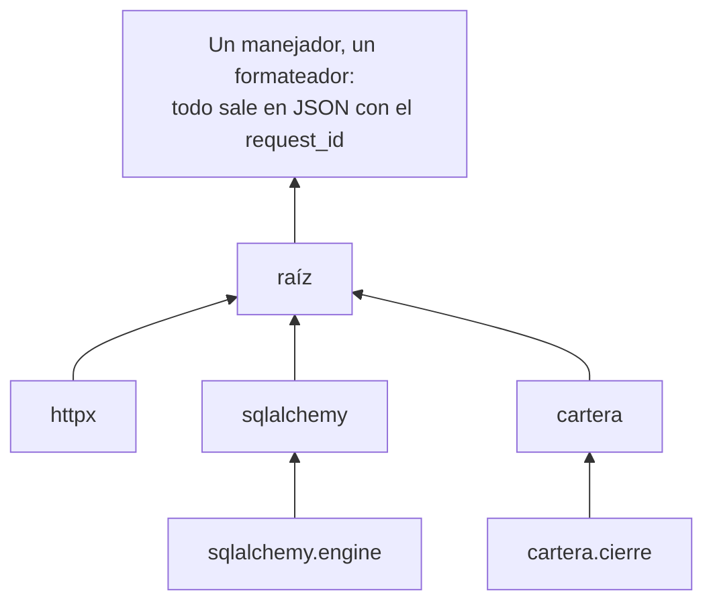

# 🔭 ob02 — Bitácoras

> Python para desarrolladores Java senior · **Carta** · Track `ob` — Observar el sistema propio ·
> sección 2 de 7
> Se lee suelta: no hace falta ninguna otra sección de la carta. Conviene haber leído la
> [Fase 16](16-operacion-y-rendimiento.md) §5.1, que configura `structlog` para el código propio.
> Versiones verificadas contra PyPI el 05/10/2026 · Código probado el 05/10/2026 con Python 3.14.7,
> en contenedor: las salidas son las de esa corrida.

---

## 🎯 1. Qué problema resuelve

La Fase 16 dejó el código de Cartera escribiendo JSON con `structlog`, con el identificador de cada
petición en cada línea. Y en producción el registro tiene **dos formatos**: las líneas de Cartera en JSON,
y en medio, en texto plano y sin identificador, las de `httpx`, SQLAlchemy y Uvicorn. Justo las líneas que
explican un fallo —"la conexión al portal se cerró", "el *pool* de la base se agotó"— son las que no se
pueden filtrar por petición.

El problema no es `structlog`: es que **`logging` de la biblioteca estándar es la columna vertebral** de todo
el registro de Python —las bibliotecas escriben ahí— y casi nadie lo configura más allá de `basicConfig`.
Esta sección lo configura de verdad: una jerarquía de *loggers*, un formateador que pasa todo por la misma
cadena de `structlog`, el contexto de la petición en todas las líneas, y un manejador que no bloquea.

---

## 🧠 2. El modelo

`logging` tiene cuatro piezas, y su relación es lo que casi nadie conoce:

| Pieza | Qué es | La regla |
|---|---|---|
| **Logger** | Un nombre con jerarquía por puntos: `cartera.cierre` es hijo de `cartera` | Cada módulo: `logging.getLogger(__name__)` |
| **Handler** | Adónde va el registro: consola, archivo, cola | Se configuran **en la aplicación**, nunca en una biblioteca |
| **Formatter** | Cómo se escribe cada línea | Uno solo para todo, o el registro tiene dos formatos |
| **Propagación** | Un registro sube por la jerarquía hasta la raíz | Por eso basta con configurar la raíz |



La pieza que une `logging` y `structlog` es `structlog.stdlib.ProcessorFormatter`: un formateador de
`logging` que pasa **cualquier** registro —el tuyo y el de `httpx`— por la misma cadena de procesadores de
`structlog`, incluido el que agrega el contexto de la petición.

### 🪞 Tu instinto de Java dice… y esta vez se equivoca

En Java, SLF4J es la fachada y Logback la implementación, y todas las bibliotecas escriben en SLF4J; con un
`logback.xml` todo sale con el mismo formato. El reflejo es pensar que `structlog` es "el Logback de
Python" y configurar solo eso. No: **`logging` es SLF4J y Logback a la vez**, y `structlog` es una capa
**encima** (lo dice el diccionario de la Fase 16). Si configuras `structlog` y no `logging`, configuraste la
mitad.

---

## 💻 3. El ejemplo que corre

```bash
uv add structlog httpx
```

`registro.py`:

```python
"""logging configurado de verdad: todo en JSON, con el request_id, también lo de las bibliotecas."""

import logging
import logging.config
import uuid

import httpx
import structlog

# La cadena compartida: la usan los registros propios y los de logging por igual.
SHARED = [
    structlog.contextvars.merge_contextvars,          # el contexto de la petición, en todas las líneas
    structlog.stdlib.add_logger_name,
    structlog.stdlib.add_log_level,
    structlog.processors.TimeStamper(fmt="iso", utc=True),
]


def configure(level: str = "INFO") -> None:
    logging.config.dictConfig({
        "version": 1,
        "disable_existing_loggers": False,            # no apagar los loggers que las bibliotecas ya crearon
        "formatters": {
            "json": {
                "()": structlog.stdlib.ProcessorFormatter,
                "foreign_pre_chain": SHARED,          # lo que viene de logging pasa por la misma cadena
                "processors": [
                    structlog.stdlib.ProcessorFormatter.remove_processors_meta,
                    structlog.processors.JSONRenderer(ensure_ascii=False),
                ],
            },
        },
        "handlers": {"console": {"class": "logging.StreamHandler", "formatter": "json"}},
        "root": {"handlers": ["console"], "level": level},
        "loggers": {
            "httpx": {"level": "INFO"},
            "httpcore": {"level": "WARNING"},         # el detalle de las conexiones, solo si algo falla
        },
    })
    structlog.configure(
        processors=[*SHARED, structlog.stdlib.ProcessorFormatter.wrap_for_formatter],
        logger_factory=structlog.stdlib.LoggerFactory(),
        wrapper_class=structlog.stdlib.BoundLogger,
        cache_logger_on_first_use=True,
    )


def handle_request(client: httpx.Client) -> None:
    structlog.contextvars.clear_contextvars()
    structlog.contextvars.bind_contextvars(request_id=uuid.uuid4().hex[:8], branch="Suba")
    log = structlog.get_logger("cartera.radicacion")
    log.info("radicación iniciada", invoices=12)
    client.get("https://api.prepagada.example/v2/glosas")        # httpx registra la petición
    logging.getLogger("cartera.legacy").warning("código viejo que usa logging directo")


if __name__ == "__main__":
    configure()
    transport = httpx.MockTransport(lambda request: httpx.Response(200, json=[]))
    with httpx.Client(transport=transport) as client:
        handle_request(client)
```

```bash
python3 registro.py
```

Salida (Python 3.14.7, 05/10/2026); el `request_id` y la hora cambian en cada corrida:

```text
{"invoices": 12, "event": "radicación iniciada", "branch": "Suba", "request_id": "846709c3", "logger": "cartera.radicacion", "level": "info", "timestamp": "2026-10-05T17:07:04.971079Z"}
{"event": "HTTP Request: GET https://api.prepagada.example/v2/glosas \"HTTP/1.1 200 OK\"", "branch": "Suba", "request_id": "846709c3", "logger": "httpx", "level": "info", "timestamp": "2026-10-05T17:07:04.971527Z"}
{"event": "código viejo que usa logging directo", "branch": "Suba", "request_id": "846709c3", "logger": "cartera.legacy", "level": "warning", "timestamp": "2026-10-05T17:07:04.971610Z"}
```

Las tres líneas tienen el mismo formato y el mismo `request_id`: la propia, la de `httpx` y la del código
viejo que usa `logging` directo. Filtrar por petición trae las tres.

**Detalles con intención**

- **`foreign_pre_chain`** es lo que hace que los registros de `logging` —los de las bibliotecas— pasen por
  `merge_contextvars` y reciban el `request_id`. Sin él, salen en JSON pero sin contexto.
- **`disable_existing_loggers: False`**: el valor por defecto de `dictConfig` es `True`, y apaga los
  *loggers* que las bibliotecas crearon al importarse. Es la causa más común de "las bibliotecas no
  registran nada".
- **`clear_contextvars` al empezar cada petición**: sin él, el contexto de la petición anterior se filtra a
  la siguiente en el mismo hilo o tarea.
- **Niveles por biblioteca**: `httpcore` en `WARNING` evita decenas de líneas por petición que solo sirven
  para depurar conexiones.

---

## ⚠️ 4. Lo que se rompe

**Configurar el registro dentro de una biblioteca.** Una biblioteca que llama a `basicConfig` o agrega un
manejador a la raíz pisa la configuración de la aplicación que la usa. Las bibliotecas solo hacen
`getLogger(__name__)`; la configuración es de la aplicación. Si escribes una biblioteca, a lo sumo un
`NullHandler`.

**El registro que bloquea.** Un manejador que escribe a un archivo en un disco lento, o a la red, hace que
cada `log.info` espere. `logging.handlers.QueueHandler` con un `QueueListener` mueve la escritura a otro
hilo; es el ejercicio 7.

**La cardinalidad que cuesta dinero.** En un servicio de registros que cobra por volumen o por índice, un
campo con valores únicos por línea (un identificador de paciente, una URL con parámetros) multiplica el
costo. A la escala de Áurea no importa; en un servicio de pago, es la factura.

**Los datos personales.** La línea de `httpx` incluye la URL completa: si la URL lleva un documento de
identidad como parámetro, el documento termina en el registro. Las URL con datos se arman con parámetros en
el cuerpo, o un procesador los oculta antes de escribir.

---

## ⚖️ 5. Cuándo NO usarla

**`loguru` en vez de todo esto.** `loguru` (0.7.3) es una biblioteca de registro con buenos valores por
defecto y una API más simple, y para un script personal es más cómoda. Para una aplicación con bibliotecas
que usan `logging`, hay que interceptar `logging` hacia `loguru` de todas formas, y la ventaja se diluye. Su
última versión es de diciembre de 2024.

**JSON en la terminal del desarrollo.** Leer JSON en la consola mientras programas es incómodo. En desarrollo,
`structlog.dev.ConsoleRenderer` en lugar de `JSONRenderer` muestra el mismo contenido en color y alineado; se
elige por entorno.

---

## 🧪 6. Ejercicios (10)

**🟢 Fácil (1–3)**

1. Cambia `disable_existing_loggers` a `True`. **Criterio:** describes qué línea desaparece y por qué.
2. Quita `foreign_pre_chain`. **Criterio:** la línea de `httpx` sale sin `request_id`, y lo explicas.
3. Usa `ConsoleRenderer` cuando una variable de entorno diga `desarrollo`. **Criterio:** la misma corrida
   sale en JSON o en color según la variable.

**🟡 Intermedio (4–6)**

4. Busca en la documentación de `structlog` el procesador que oculta campos sensibles y escribe uno propio
   que reemplace cualquier número de documento en `event`. **Criterio:** una URL con documento sale con el
   documento oculto.
5. Corre dos peticiones en paralelo con `asyncio` y verifica que cada línea lleva su propio `request_id`.
   **Criterio:** ninguna línea mezcla los identificadores.
6. Activa el registro de SQLAlchemy (`sqlalchemy.engine` en `INFO`) y verifica que sus líneas salen en
   JSON con el contexto. **Criterio:** una consulta registrada con el `request_id` de la petición.

**🟠 Difícil (7–9)**

7. Mueve la escritura a un hilo con `QueueHandler` y `QueueListener`. **Criterio:** con un manejador que
   tarda 50 ms por línea, la petición no se vuelve más lenta.
8. Escribe una biblioteca mínima que registre bien: `getLogger(__name__)` y `NullHandler`. **Criterio:** la
   aplicación decide su nivel y formato sin tocar la biblioteca.
9. Mide cuánto cuesta registrar una línea en JSON contra no registrarla, en un bucle de 100.000.
   **Criterio:** el costo por línea en microsegundos, con la máquina, y si importa para el cierre.

**🔴 Muy difícil (10)**

10. Audita el registro de un servicio tuyo. **Criterio:** un informe de una página y los cambios aplicados.
    *Rúbrica:* (a) todas las líneas salen en el mismo formato, incluidas las de las bibliotecas; (b) todas
    llevan el identificador de la petición; (c) ningún dato personal llega al registro, con una prueba que lo
    demuestra; (d) dices cuántas líneas por petición quedan y por qué cada una.

---

## 📚 7. Referencias

**Documentación oficial**

- `logging`, guía avanzada: https://docs.python.org/3/howto/logging.html
- `logging.config.dictConfig`: https://docs.python.org/3/library/logging.config.html
- `structlog` con `logging` de la biblioteca estándar: https://www.structlog.org/en/stable/standard-library.html
- `loguru`: https://github.com/Delgan/loguru

**Orden de lectura sugerido:** el *HOWTO* de `logging`, en especial la parte de jerarquía y propagación;
después la página de `structlog` sobre la biblioteca estándar, que tiene el patrón de esta sección.

---

## 🚀 8. Cierre

`logging` es la columna vertebral: se configura una vez en la aplicación, con un solo formateador que pasa
todo —lo propio y lo de las bibliotecas— por la misma cadena de `structlog`. Con eso, cada línea sale en el
mismo formato y con el mismo identificador de petición, y el fallo que explicó `httpx` se encuentra con un
filtro.

**La señal de que quedó bien:** *"Filtramos por el request_id de la radicación que falló y apareció la línea
de httpx que decía por qué."*

> 🏷️ **Cierra la sección con su tag**, cuando los ejercicios que elegiste estén hechos:
>
> ```bash
> git tag -a op-ob-fase-02 -m "op ob02 cerrada: logging y structlog en un solo formato, con contexto"
> ```
>
> Los commits llevan su prefijo (`op ob02: …`) y los de ejercicio su número
> (`op ob02 ej07: …`).
