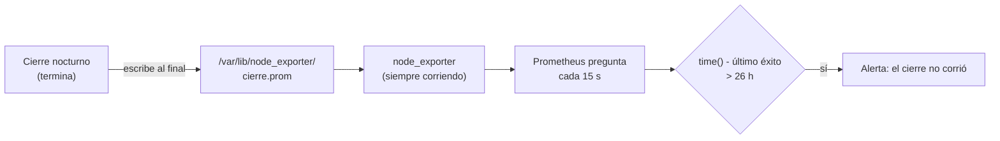

# 🔭 ob03 — Métricas

> Python para desarrolladores Java senior · **Carta** · Track `ob` — Observar el sistema propio ·
> sección 3 de 7
> Se lee suelta: no hace falta ninguna otra sección de la carta. Conviene haber leído la
> [Fase 16](16-operacion-y-rendimiento.md) §5.2, que presenta `prometheus_client` en un servicio.
> Versiones verificadas contra PyPI el 05/10/2026 · Código probado el 05/10/2026 con Python 3.14.7,
> en contenedor: las salidas son las de esa corrida.

---

## 🎯 1. Qué problema resuelve

La Fase 16 expone métricas desde un servicio que está corriendo: Prometheus pregunta cada quince segundos
y el servicio contesta. El cierre nocturno no es un servicio: arranca a las 2:00, trabaja cuarenta minutos y
**termina**. Si Prometheus pregunta a las 3:00, no hay nadie que conteste, y las métricas del cierre se
perdieron con el proceso.

Y hay una pregunta que importa más que cualquier otra para un proceso por lotes, y que casi nadie mide:
**¿cuándo terminó bien por última vez?** Un cierre que falla escribe un error; un cierre que no arranca no
escribe nada. La métrica "hora del último éxito", con una alerta cuando tiene más de 26 horas, atrapa los
dos casos con una sola regla.

Esta sección enseña los tipos de métrica de `prometheus-client` (0.26.0, del 2026-07-24), cuál usar para
qué, por qué el promedio miente, y cómo se publican las métricas de un proceso que termina.

---

## 🧠 2. El modelo

| Tipo | Qué es | Para qué | Ejemplo en el cierre |
|---|---|---|---|
| **Counter** | Un número que solo sube | Cosas que pasan | Filas rechazadas, por motivo |
| **Gauge** | Un número que sube y baja | Un estado actual | Hora del último éxito |
| **Histogram** | Cuántas observaciones cayeron en cada rango (*bucket*) | Distribuciones: latencias, duraciones | Duración de cada sede |
| **Summary** | Cuantiles calculados en el proceso | Lo mismo, sin poder agregar entre procesos | Casi nunca: se prefiere el histograma |

**El promedio miente** porque esconde la cola. Si nueve sedes tardan 2 minutos y una tarda 30, el promedio es
4,8 minutos —un número que no describe a ninguna sede—, y la sede de 30 minutos, que es el problema, no
aparece. El histograma guarda la forma de la distribución, y de él salen los percentiles: el p95 dice "el
95% de las sedes tardó menos de esto".

**Para un proceso que termina** hay dos caminos: empujar las métricas a un *Pushgateway* antes de terminar, o
escribirlas en un **archivo de texto** que el `node_exporter` de la máquina lee y expone. El segundo es más
simple y no agrega un servicio: el archivo queda ahí hasta el día siguiente.



### 🪞 Tu instinto de Java dice… y esta vez se equivoca

Con Micrometer, el reflejo es instrumentar el *job* de Spring Batch y dejar que el *endpoint* de Actuator
exponga las métricas, como en cualquier servicio. Funciona porque el proceso de Spring suele quedar vivo. Un
script de Python que termina no tiene *endpoint* que consultar cuando Prometheus llega; las métricas de un
lote se **entregan**, no se exponen.

---

## 💻 3. El ejemplo que corre

```bash
uv add prometheus-client
```

`metricas_cierre.py`:

```python
"""Métricas de un proceso por lotes: histograma, contador por motivo y la hora del último éxito."""

import random
import time

from prometheus_client import CollectorRegistry, Counter, Gauge, Histogram, write_to_textfile

registry = CollectorRegistry()      # un registro propio: no se mezcla con las métricas del proceso

DURATION = Histogram(
    "cierre_sede_duration_seconds", "Duración del cierre de cada sede",
    buckets=(30, 60, 120, 300, 600, 1200, 1800), registry=registry,
)
REJECTED = Counter(
    "cierre_filas_rechazadas_total", "Filas rechazadas en el cierre",
    ["motivo"], registry=registry,                   # la etiqueta es el motivo, nunca el paciente
)
LAST_SUCCESS = Gauge(
    "cierre_ultimo_exito_timestamp_seconds", "Hora del último cierre completo",
    registry=registry,
)


def close_night(durations: dict[str, float], rejected: dict[str, int]) -> None:
    for branch, seconds in durations.items():
        DURATION.observe(seconds)
    for reason, count in rejected.items():
        REJECTED.labels(motivo=reason).inc(count)
    LAST_SUCCESS.set(time.time())                     # solo si llegó hasta aquí


def percentile_from_buckets(histogram: Histogram, q: float) -> float:
    """Lo que hace histogram_quantile de PromQL: interpolar dentro del bucket."""
    buckets = [(float(s.labels["le"]), s.value) for s in histogram.collect()[0].samples
               if s.name.endswith("_bucket")]
    total = buckets[-1][1]
    target, prev_bound, prev_count = q * total, 0.0, 0.0
    for bound, count in buckets:
        if count >= target:
            if bound == float("inf"):
                return prev_bound
            return prev_bound + (bound - prev_bound) * (target - prev_count) / (count - prev_count)
        prev_bound, prev_count = bound, count
    return prev_bound


if __name__ == "__main__":
    random.seed(7)
    sedes = {f"sede-{i}": random.uniform(90, 150) for i in range(9)} | {"Kennedy": 1700.0}
    close_night(sedes, {"sin_codigo": 35, "fecha_futura": 5})
    average = sum(sedes.values()) / len(sedes)
    print(f"promedio: {average:.0f} s · p50 ≈ {percentile_from_buckets(DURATION, 0.5):.0f} s"
          f" · p95 ≈ {percentile_from_buckets(DURATION, 0.95):.0f} s · máximo real: {max(sedes.values()):.0f} s")
    write_to_textfile("cierre.prom", registry)       # en producción: /var/lib/node_exporter/textfile/
    print(open("cierre.prom").read())
```

```bash
python3 metricas_cierre.py
```

Salida (Python 3.14.7, 05/10/2026), sin las líneas `# HELP` ni las `_created`:

```text
promedio: 267 s · p50 ≈ 110 s · p95 ≈ 1500 s · máximo real: 1700 s
# TYPE cierre_sede_duration_seconds histogram
cierre_sede_duration_seconds_bucket{le="30.0"} 0.0
cierre_sede_duration_seconds_bucket{le="60.0"} 0.0
cierre_sede_duration_seconds_bucket{le="120.0"} 6.0
cierre_sede_duration_seconds_bucket{le="300.0"} 9.0
cierre_sede_duration_seconds_bucket{le="600.0"} 9.0
cierre_sede_duration_seconds_bucket{le="1200.0"} 9.0
cierre_sede_duration_seconds_bucket{le="1800.0"} 10.0
cierre_sede_duration_seconds_bucket{le="+Inf"} 10.0
cierre_sede_duration_seconds_count 10.0
cierre_sede_duration_seconds_sum 2672.153236165427
# TYPE cierre_filas_rechazadas_total counter
cierre_filas_rechazadas_total{motivo="sin_codigo"} 35.0
cierre_filas_rechazadas_total{motivo="fecha_futura"} 5.0
# TYPE cierre_ultimo_exito_timestamp_seconds gauge
cierre_ultimo_exito_timestamp_seconds 1.7912200979857388e+09
```

La primera línea es la sección entera. El promedio, **267 segundos**, no describe a ninguna sede: nueve
tardaron entre 90 y 150 y una tardó 1.700. La mediana, unos 110, describe a las nueve normales; el p95,
unos 1.500 —interpolado dentro del *bucket* de 1.200 a 1.800—, apunta a la que hay que mirar. Y los
*buckets* cuentan la misma historia sin calcular nada: seis sedes hasta 2 minutos, tres hasta 5, y una sola
entre 20 y 30.

Las líneas `_created` que la salida omite las agrega la biblioteca por cada contador e histograma (la hora en
que se creó la serie); se desactivan con la variable de entorno `PROMETHEUS_DISABLE_CREATED_SERIES=True`.

Y la regla de alerta que convierte la última línea en "el cierre no corrió", en PromQL:

```text
time() - cierre_ultimo_exito_timestamp_seconds > 26 * 3600
```

**Detalles con intención**

- **Un `CollectorRegistry` propio**: el registro por defecto trae las métricas del proceso Python (memoria,
  descriptores), que en un archivo de un lote que ya terminó no significan nada.
- **Los *buckets* se eligen para el dominio**: duraciones de una sede entre medio minuto y media hora. Los
  *buckets* por defecto de la biblioteca están pensados para latencias de milisegundos y meterían todas las
  sedes en el último.
- **La etiqueta `motivo` tiene pocos valores posibles.** Una etiqueta con el documento del paciente crearía una
  serie por paciente: miles de series para Prometheus y datos personales en un sistema que no es para eso.
- **`LAST_SUCCESS` se fija al final**: si el cierre falla a la mitad, la hora no avanza, y la alerta llega al
  día siguiente aunque nadie haya visto el error.

---

## ⚠️ 4. Lo que se rompe

**`write_to_textfile` a medias.** Si el `node_exporter` lee el archivo mientras se escribe, ve métricas
cortadas. `write_to_textfile` escribe a un temporal y lo renombra, que es atómico; escribir el archivo a mano
con `open(...).write` no lo es.

**El percentil exacto que no es.** El p95 que sale de un histograma es una **interpolación** dentro del
*bucket*: si el 95% cae en el *bucket* de 600 a 1200 segundos, el p95 está "en algún lugar" de ese rango. Con
*buckets* mal elegidos, el número es casi inventado.

**La cardinalidad.** Cada combinación de valores de etiquetas es una serie temporal. `motivo` × `sede` × `día`
son 3 × 10 × 365 series al año, y el día es lo que nunca se pone como etiqueta: el tiempo ya es el eje.

**El reinicio de los contadores.** Un *Counter* empieza en cero en cada proceso. Prometheus lo sabe y
`rate()`/`increase()` lo manejan; sumar los valores crudos de dos días seguidos, no.

---

## ⚖️ 5. Cuándo NO usarla

**Sin Prometheus.** Montar Prometheus, `node_exporter` y un sistema de alertas solo para el cierre de Áurea es
más infraestructura que el propio cierre. Con los eventos anchos de `ob01` y un latido a un monitor externo
(el de `au06`), la alerta de "no corrió" se resuelve sin servidores.

**Para preguntas que no se previeron.** Las métricas contestan bien lo que se definió de antemano. "¿Por qué
Kennedy tardó media hora?" no está en ningún histograma: está en el evento ancho o en una traza.

---

## 🧪 6. Ejercicios (10)

**🟢 Fácil (1–3)**

1. Haz que el cierre falle antes de `LAST_SUCCESS.set`. **Criterio:** el archivo se escribe sin actualizar la
   hora, y explicas cómo lo verá la alerta.
2. Cambia los *buckets* por los de por defecto de `Histogram`. **Criterio:** describes en qué *bucket* cae
   cada sede y qué pasa con el p95.
3. Agrega la etiqueta `sede` al histograma. **Criterio:** cuentas cuántas series nuevas aparecen en el
   archivo.

**🟡 Intermedio (4–6)**

4. Busca en la documentación de `prometheus-client` cómo se usa un *Pushgateway* y reescribe la entrega con
   `push_to_gateway`. **Criterio:** explicas qué pasa con las métricas si el *Pushgateway* se reinicia.
5. Levanta `node_exporter` en un contenedor con el directorio del archivo de texto montado. **Criterio:** `curl`
   a su puerto devuelve las métricas del cierre.
6. Escribe la regla de alerta completa en el formato de Prometheus, con `for:` y una anotación legible.
   **Criterio:** un archivo de reglas que `promtool check rules` acepta.

**🟠 Difícil (7–9)**

7. Levanta Prometheus y `node_exporter` con Compose y verifica la alerta: ajusta la hora del último éxito al
   pasado. **Criterio:** la alerta pasa a `firing` en la interfaz de Prometheus.
8. Compara el p95 interpolado con el p95 exacto de las duraciones, con 1.000 sedes simuladas. **Criterio:**
   el error de la interpolación con tus *buckets* y con unos más finos.
9. Instrumenta AgendaAPI (un servicio que sí vive) con un histograma de latencia por *endpoint*. **Criterio:**
   el *endpoint* `/metrics` y una consulta de `histogram_quantile` en PromQL.

**🔴 Muy difícil (10)**

10. Define las cinco métricas que pondrías en el cierre de Áurea y su presupuesto de series. **Criterio:** un
    documento de una página. *Rúbrica:* (a) cada métrica contesta una pregunta escrita; (b) el número total
    de series está calculado; (c) ninguna etiqueta tiene datos personales ni valores ilimitados; (d) dices
    qué alerta se dispara con cada una y quién la recibe.

---

## 📚 7. Referencias

**Documentación oficial**

- `prometheus-client` para Python: https://prometheus.github.io/client_python/
- Prometheus, tipos de métrica: https://prometheus.io/docs/concepts/metric_types/
- Prometheus, histogramas y resúmenes: https://prometheus.io/docs/practices/histograms/
- El recolector de archivos de texto de `node_exporter`: https://github.com/prometheus/node_exporter#textfile-collector

**Orden de lectura sugerido:** la página de histogramas y resúmenes de Prometheus, que explica la
interpolación y por qué se prefiere el histograma; después la del cliente de Python.

---

## 🚀 8. Cierre

Las métricas de un lote se entregan al terminar, en un archivo que otro proceso expone; las duraciones van en
histogramas con *buckets* del dominio, los motivos en contadores con pocas etiquetas, y la métrica que más
vale es la hora del último éxito, porque atrapa el fallo que no escribe errores.

**La señal de que quedó bien:** *"El cierre no arrancó un domingo, y la alerta de las 26 horas llegó el lunes
a las 4:00, sin que nadie revisara nada."*

> 🏷️ **Cierra la sección con su tag**, cuando los ejercicios que elegiste estén hechos:
>
> ```bash
> git tag -a op-ob-fase-03 -m "op ob03 cerrada: métricas de un lote y la alerta del último éxito"
> ```
>
> Los commits llevan su prefijo (`op ob03: …`) y los de ejercicio su número
> (`op ob03 ej07: …`).
