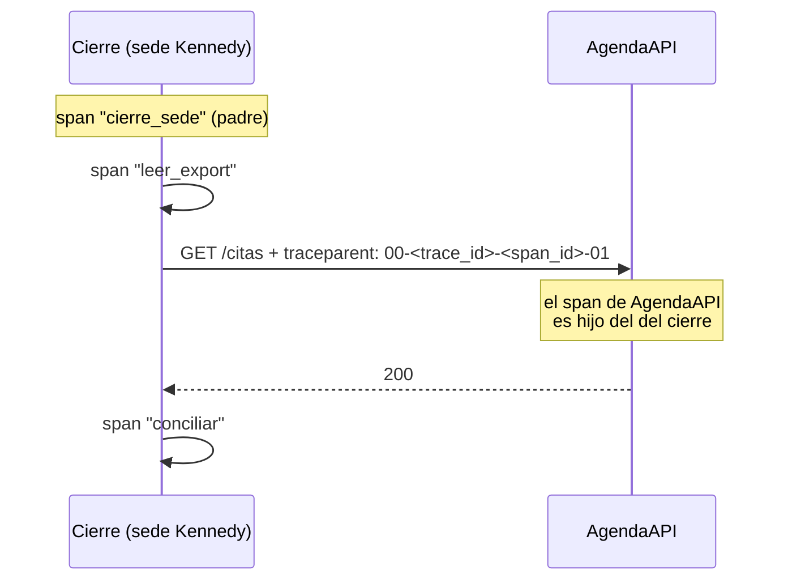

# 🔭 ob04 — Trazas con OpenTelemetry

> Python para desarrolladores Java senior · **Carta** · Track `ob` — Observar el sistema propio ·
> sección 4 de 7
> Se lee suelta: no hace falta ninguna otra sección de la carta. Conviene haber leído la
> [Fase 16](16-operacion-y-rendimiento.md) §5.3, que pone "trazas, con lo justo".
> Versiones verificadas contra PyPI el 05/10/2026 · Código probado el 05/10/2026 con Python 3.14.7,
> en contenedor: las salidas son las de esa corrida.

---

## 🎯 1. Qué problema resuelve

Kennedy tardó media hora en el cierre de anoche, y el evento ancho de `ob01` lo dice; lo que no dice es
**dónde**. ¿Fue la lectura del export de Odontovía, la consulta a la base, la llamada al portal de la
aseguradora? Para eso está la traza: el recorrido de una operación como un árbol de tramos (*spans*), cada uno
con su duración, sus atributos y su relación con los demás, incluso cuando el recorrido cruza de un proceso a
otro por HTTP.

OpenTelemetry es el estándar abierto para esto, y su SDK de Python (1.45.0, del 2026-09-25) tiene dos
formas de crear tramos: **a mano**, en el código del dominio, y **automáticamente**, con paquetes de
instrumentación por biblioteca —`opentelemetry-instrumentation-httpx`, `-fastapi`, `-sqlalchemy`— que crean
los tramos de cada petición sin tocar tu código. Esta sección usa las dos y muestra la pieza que hace que
una traza cruce servicios: el encabezado `traceparent`.

---

## 🧠 2. El modelo

| Concepto | Qué es | En el cierre |
|---|---|---|
| **Traza** | Un árbol de tramos con un mismo `trace_id` | La noche entera de una sede |
| **Tramo** (*span*) | Una operación con inicio, fin, atributos y padre | "leer el export", "consultar la base" |
| **Atributos** | Pares clave-valor del tramo | `sede`, `filas`, `http.status_code` |
| **Propagación** | Llevar el contexto de la traza en la petición | El encabezado `traceparent` del estándar W3C |
| **Exportador** | Adónde se mandan los tramos terminados | La consola, o un colector OTLP (Jaeger, Tempo…) |
| **Muestreo** | Qué fracción de trazas se guarda | Todas, para un cierre por noche |



### 🩻 Esto sí funciona igual

OpenTelemetry es OpenTelemetry, y un *span* es un *span*: lo dice la Fase 16. Lo que conoces del agente de
Java —tramos, atributos, propagadores, exportadores OTLP— se traslada entero. La diferencia es que en Python
**no hay agente mágico** que instrumente todo al arrancar: se instala un paquete por biblioteca y se activa
(existe `opentelemetry-instrument` para arrancar con instrumentación automática, pero sigue dependiendo de
qué paquetes instalaste).

---

## 💻 3. El ejemplo que corre

```bash
uv add opentelemetry-sdk opentelemetry-instrumentation-httpx httpx
```

`trazas_cierre.py`, con un exportador en memoria para ver el árbol al terminar:

```python
"""Trazas del cierre: tramos a mano, httpx instrumentado y el traceparent que viaja en la petición."""

import time

import httpx
from opentelemetry import trace
from opentelemetry.instrumentation.httpx import HTTPXClientInstrumentor
from opentelemetry.sdk.resources import Resource
from opentelemetry.sdk.trace import TracerProvider
from opentelemetry.sdk.trace.export import SimpleSpanProcessor
from opentelemetry.sdk.trace.export.in_memory_span_exporter import InMemorySpanExporter

exporter = InMemorySpanExporter()           # en producción: OTLPSpanExporter hacia un colector
provider = TracerProvider(resource=Resource.create({"service.name": "cartera-cierre"}))
provider.add_span_processor(SimpleSpanProcessor(exporter))
trace.set_tracer_provider(provider)
tracer = trace.get_tracer("cartera.cierre")

seen_headers: list[str] = []


def agenda_api(request: httpx.Request) -> httpx.Response:
    seen_headers.append(request.headers.get("traceparent", "—"))   # lo que recibe el otro servicio
    time.sleep(0.05)
    return httpx.Response(200, json={"citas": 812})


def close_branch(branch: str, client: httpx.Client) -> None:
    with tracer.start_as_current_span("cierre_sede", attributes={"sede": branch}) as root:
        with tracer.start_as_current_span("leer_export") as span:
            time.sleep(0.02)
            span.set_attribute("filas", 4210)
        with tracer.start_as_current_span("consultar_agenda"):
            appointments = client.get("https://agenda.aurea.example/citas").json()["citas"]
        with tracer.start_as_current_span("conciliar"):
            time.sleep(0.01)
        root.set_attribute("citas", appointments)


if __name__ == "__main__":
    with httpx.Client(transport=httpx.MockTransport(agenda_api)) as client:
        # Este cliente en concreto: instrument() global no cubre MockTransport (ver los detalles).
        HTTPXClientInstrumentor.instrument_client(client)
        close_branch("Kennedy", client)
    spans = exporter.get_finished_spans()
    by_id = {s.context.span_id: s for s in spans}
    for span in sorted(spans, key=lambda s: s.start_time):
        depth, parent = 0, span.parent
        while parent is not None:
            depth, parent = depth + 1, by_id[parent.span_id].parent
        ms = (span.end_time - span.start_time) / 1e6
        print(f"{'  ' * depth}{span.name:<22} {ms:6.1f} ms  {dict(span.attributes)}")
    print("traceparent recibido por AgendaAPI:", seen_headers[0])
    print("trace_id del cierre:              ", f"{spans[-1].context.trace_id:032x}")
```

```bash
python3 trazas_cierre.py
```

Salida (Python 3.14.7, 05/10/2026); los identificadores y los tiempos cambian en cada corrida:

```text
cierre_sede             104.8 ms  {'sede': 'Kennedy', 'citas': 812}
  leer_export              29.1 ms  {'filas': 4210}
  consultar_agenda         60.8 ms  {}
    GET                      60.3 ms  {'http.method': 'GET', 'http.url': 'https://agenda.aurea.example/citas', 'http.status_code': 200}
  conciliar                14.7 ms  {}
traceparent recibido por AgendaAPI: 00-9bec3891ea5a998208d38f82ab864514-9417778281774b2f-03
trace_id del cierre:               9bec3891ea5a998208d38f82ab864514
```

Dos cosas que solo una traza dice: **dónde** se fue el tiempo de Kennedy —en este ejemplo, en la consulta a
AgendaAPI—, y que la petición a AgendaAPI llevó el `traceparent` con el **mismo** `trace_id` del cierre. Si
AgendaAPI está instrumentado, su tramo aparece como hijo del `consultar_agenda` en el mismo árbol, aunque
corra en otra máquina.

**Detalles con intención**

- **`instrument_client(client)` y no `instrument()`.** La forma global, `HTTPXClientInstrumentor().instrument()`,
  envuelve los transportes **reales** de `httpx`; un cliente con `MockTransport` no pasa por ellos, y en la
  prueba de esta sección no apareció ni el tramo `GET` ni el `traceparent`. En producción, con transporte
  real, la forma global alcanza; en las pruebas, se instrumenta el cliente. Del lado del servidor, la
  instrumentación de FastAPI lee el encabezado y continúa la traza.
- **`service.name`** en el `Resource` es lo que identifica al servicio en cualquier visor de trazas. Sin él,
  todos los tramos aparecen como `unknown_service`.
- **Los atributos son pocos y sin datos de pacientes**: sede, filas, citas. Una traza se mira en un visor que
  puede tener otro control de acceso que la base clínica.
- **`SimpleSpanProcessor` exporta cada tramo al terminar**; en producción se usa `BatchSpanProcessor`, que los
  agrupa y no bloquea, y hay que llamar a `provider.shutdown()` antes de que el proceso termine para no
  perder los últimos.

---

## ⚠️ 4. Lo que se rompe

**El proceso que termina antes de exportar.** Un lote que termina sin `shutdown()` del proveedor pierde los
tramos que el `BatchSpanProcessor` tenía en memoria, que son justamente los últimos: los del final del
cierre.

**Los nombres de atributos que cambian entre versiones.** Las convenciones semánticas de OpenTelemetry
renombraron los atributos HTTP —`http.method` a `http.request.method`, `http.url` a `url.full`—, y la
instrumentación de `httpx` de esta versión todavía emite **los viejos por defecto**, como muestra la salida;
los nuevos se activan con la variable `OTEL_SEMCONV_STABILITY_OPT_IN`. El día que el valor por defecto
cambie, un panel construido con los nombres viejos queda vacío. Las versiones de los paquetes de
instrumentación se actualizan juntas y se revisan los paneles.

**Instrumentar todo.** Un tramo por fila del cierre son cuatro mil tramos por sede: el visor se vuelve
inútil y el exportador, lento. Los tramos van en operaciones con sentido —leer, consultar, conciliar—; el
detalle por fila, si hace falta, en eventos dentro del tramo o en el evento ancho.

**La versión `0.x` de la instrumentación.** Los paquetes de instrumentación siguen en `0.66b0` —beta—,
aunque el SDK esté en 1.45. Su API cambia más seguido, y fijar las versiones exactas evita sorpresas.

---

## ⚖️ 5. Cuándo NO usarla

**Para un proceso sin llamadas a otros servicios.** Si el cierre fuera un solo proceso que lee un archivo y
escribe en una base, un perfilador (`ob05`) dice dónde se va el tiempo con más detalle y sin instrumentar
nada. La traza paga cuando la operación **cruza procesos**.

**Sin visor.** Una traza sin Jaeger, Tempo o un servicio que la muestre es un JSON difícil de leer. Si no hay
dónde verlas, el evento ancho con duraciones por etapa da el 80% del valor.

---

## 🧪 6. Ejercicios (10)

**🟢 Fácil (1–3)**

1. Agrega un tramo `escribir_base` con el atributo `filas_escritas`. **Criterio:** aparece en el árbol como
   hijo de `cierre_sede`.
2. Haz que `conciliar` lance una excepción y captúrala fuera del tramo. **Criterio:** el tramo queda con
   estado de error y el evento de la excepción; explicas dónde lo ves.
3. Quita el `Resource` con `service.name`. **Criterio:** describes qué nombre de servicio queda.

**🟡 Intermedio (4–6)**

4. Cambia el exportador por `ConsoleSpanExporter` y lee un tramo completo. **Criterio:** identificas su
   `trace_id`, su `parent_id` y sus atributos en el JSON.
5. Busca en la documentación de OpenTelemetry cómo se configura el muestreo `ParentBased` con
   `TraceIdRatioBased(0.1)`. **Criterio:** con 100 cierres simulados, se guardan unos diez, y los hijos siguen
   la decisión del padre.
6. Instrumenta una AgendaAPI de FastAPI con `opentelemetry-instrumentation-fastapi` y verifica que su tramo
   continúa la traza del cierre. **Criterio:** los dos tramos tienen el mismo `trace_id`.

**🟠 Difícil (7–9)**

7. Levanta Jaeger en un contenedor y exporta por OTLP. **Criterio:** la traza del cierre aparece en su
   interfaz con el árbol completo.
8. Cambia a `BatchSpanProcessor` y quita el `shutdown()`. **Criterio:** demuestras qué tramos se pierden y lo
   arreglas.
9. Mide cuánto agrega la instrumentación de `httpx` a cada petición. **Criterio:** el costo por petición con
   y sin instrumentar, con la máquina, sobre 10.000 peticiones a un transporte simulado.

**🔴 Muy difícil (10)**

10. Diseña las trazas del cierre de Áurea de punta a punta. **Criterio:** un documento de una página y un
    prototipo con Jaeger. *Rúbrica:* (a) los tramos están en operaciones con sentido, no por fila; (b) la traza
    cruza a AgendaAPI y al portal simulado; (c) ningún atributo lleva datos de pacientes; (d) dices cuánto
    cuesta guardar las trazas de un año y qué fracción muestrearías.

---

## 📚 7. Referencias

**Documentación oficial**

- OpenTelemetry para Python: https://opentelemetry.io/docs/languages/python/
- Instrumentación de `httpx`: https://opentelemetry-python-contrib.readthedocs.io/en/latest/instrumentation/httpx/httpx.html
- El estándar W3C Trace Context (`traceparent`): https://www.w3.org/TR/trace-context/
- Jaeger: https://www.jaegertracing.io/docs/latest/getting-started/

**Orden de lectura sugerido:** el inicio de OpenTelemetry para Python; después el estándar de Trace Context,
que es corto y explica exactamente qué viaja en el encabezado.

---

## 🚀 8. Cierre

Una traza es un árbol de tramos que dice dónde se fue el tiempo, también cuando la operación cruza servicios.
Se arma con tramos a mano en el dominio, instrumentación automática en las bibliotecas, el `traceparent` en
cada petición, y un `shutdown()` antes de que el lote termine.

**La señal de que quedó bien:** *"Kennedy tardó media hora, y la traza mostró que veintiséis minutos fueron la
consulta a AgendaAPI, no el cierre."*

> 🏷️ **Cierra la sección con su tag**, cuando los ejercicios que elegiste estén hechos:
>
> ```bash
> git tag -a op-ob-fase-04 -m "op ob04 cerrada: trazas del cierre con OpenTelemetry y traceparent"
> ```
>
> Los commits llevan su prefijo (`op ob04: …`) y los de ejercicio su número
> (`op ob04 ej07: …`).
