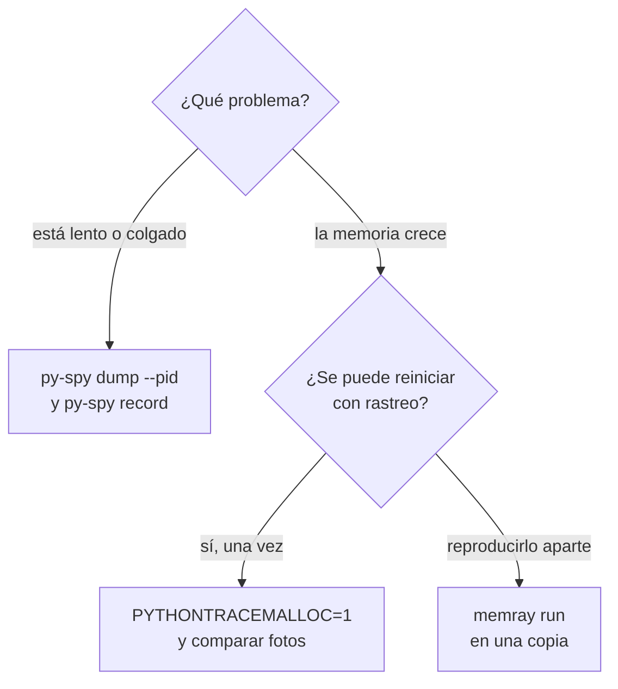

# 🔭 ob05 — Perfilado en producción

> Python para desarrolladores Java senior · **Carta** · Track `ob` — Observar el sistema propio ·
> sección 5 de 7
> Se lee suelta: no hace falta ninguna otra sección de la carta. Conviene haber leído la
> [Fase 16](16-operacion-y-rendimiento.md) §5.5, que perfila el cierre antes de tocarlo.
> Versiones verificadas contra PyPI el 05/10/2026 · Código probado el 05/10/2026 con Python 3.14.7,
> en un contenedor con `--cap-add SYS_PTRACE`: `py-spy` 0.4.2 adjuntado al proceso vivo y las dos fotos de
> `tracemalloc`.

---

## 🎯 1. Qué problema resuelve

AgendaAPI lleva seis horas corriendo y ocupa el doble de memoria que al arrancar. Cada día pasa lo mismo, y
el reinicio nocturno lo esconde. En otra ocasión, el cierre se queda "pensando" en Kennedy durante veinte
minutos, sin escribir nada, y nadie sabe en qué línea está. Los dos problemas tienen algo en común: **solo
aparecen en el proceso de producción, después de horas**, y reiniciarlo con un perfilador activado borra
justamente lo que había que mirar.

En la JVM, este perfil de ingeniero tiene JFR, async-profiler y volcados de memoria, y su reflejo es pensar
que en Python no hay equivalente. Lo hay, y sorprende: **`py-spy`** (0.4.2) se adjunta a un proceso de Python
que ya está corriendo y muestra qué está haciendo cada hilo, **sin reiniciarlo ni modificarlo**. Para la
memoria, **`tracemalloc`** de la biblioteca estándar compara fotos de lo que se asignó, y **`memray`**
(1.20.0) da el detalle completo cuando se puede arrancar el proceso con él.

---

## 🧠 2. El modelo

| Herramienta | Qué mide | Cómo | Costo en producción |
|---|---|---|---|
| **`py-spy dump`** | Qué está haciendo cada hilo **ahora** | Lee la memoria del proceso desde afuera | Casi nulo; una foto |
| **`py-spy top` / `record`** | Dónde se va el tiempo de CPU | Muestreo desde afuera, cien veces por segundo | Bajo; no toca el proceso |
| **`tracemalloc`** | Qué líneas asignaron la memoria que sigue viva | Rastreo dentro del proceso, activado al arrancar | Medio: más memoria y CPU mientras está activo |
| **`memray`** | Todas las asignaciones, incluidas las de C | El proceso arranca con `memray run` | Alto; para reproducir, no para siempre |
| `scalene`, `pyinstrument`, `cProfile` | CPU y memoria por línea, en desarrollo | El proceso arranca con ellos | Para el portátil, no para producción |

La diferencia que importa: **`py-spy` muestrea desde afuera** (como async-profiler), así que se usa en
producción sin preparar nada; **`tracemalloc` rastrea desde adentro**, así que hay que haberlo activado al
arrancar, y por eso se deja encendido solo cuando se sospecha una fuga.



### 🩻 Esto sí funciona igual

El modelo del muestreo es el de async-profiler: no instrumenta, mira la pila cada pocos milisegundos y
cuenta. Las gráficas de llamas (*flame graphs*) que produce `py-spy record` se leen exactamente igual que
las de la JVM: el ancho es tiempo, la altura es profundidad de la pila.

---

## 💻 3. El ejemplo que corre

```bash
uv add --dev py-spy
```

`agenda_con_fuga.py` simula un servicio con los dos problemas: una caché que nunca libera y una función
caliente. Deja que se le pidan fotos de memoria con una señal, sin reiniciarlo.

```python
"""Un servicio con una fuga lenta y un punto caliente, que se deja observar sin reiniciarlo."""

import os
import signal
import time
import tracemalloc

_cache: dict[str, bytes] = {}     # la fuga: se agrega y nunca se quita
_baseline = None


def remember_availability(request_id: str) -> None:
    _cache[request_id] = bytes(2048)          # 2 KB nuevos por petición, para siempre


def compute_slots() -> int:
    total = 0
    for minute in range(200_000):               # el punto caliente
        total += minute % 40
    return total


def on_sigusr1(signum, frame) -> None:
    """kill -USR1 <pid>: la primera foto es la base; las siguientes muestran qué creció."""
    global _baseline
    snapshot = tracemalloc.take_snapshot()
    if _baseline is None:
        _baseline = snapshot
        print("foto base tomada", flush=True)
        return
    for stat in snapshot.compare_to(_baseline, "lineno")[:2]:
        print("creció:", stat, flush=True)


if __name__ == "__main__":
    if not tracemalloc.is_tracing():
        tracemalloc.start()                     # o PYTHONTRACEMALLOC=1 al arrancar
    signal.signal(signal.SIGUSR1, on_sigusr1)
    print("pid", os.getpid(), flush=True)
    n = 0
    while True:
        n += 1
        remember_availability(f"req-{n}")
        compute_slots()
        time.sleep(0.001)
```

En una terminal se arranca el servicio; en otra, se lo observa desde afuera mientras corre:

```bash
python3 agenda_con_fuga.py &                 # imprime su pid
py-spy dump --pid <pid>                       # qué está haciendo ahora mismo
kill -USR1 <pid>; sleep 5; kill -USR1 <pid>   # dos fotos de memoria, cinco segundos aparte
py-spy record --pid <pid> --duration 10 -o perfil.svg   # gráfica de llamas de diez segundos
```

Salida (Python 3.14.7, 05/10/2026), recortada; el `pid` y los tamaños cambian:

```text
Thread 10 (active+gil)
    compute_slots (agenda_con_fuga.py:19)
    <module> (agenda_con_fuga.py:44)
foto base tomada
creció: /w/agenda_con_fuga.py:13: size=876 KiB (+510 KiB), count=426 (+248), average=2107 B
creció: /w/agenda_con_fuga.py:43: size=19.8 KiB (+11.6 KiB), count=425 (+248), average=48 B
```

Dos respuestas sin haber reiniciado nada. `py-spy dump` dice que el hilo principal está en
`compute_slots`, línea 19: es el punto caliente. Y la comparación de fotos dice que la memoria que creció
viene de la línea 13 —`_cache[request_id] = bytes(2048)`—, en bloques de unos 2 KB: es la fuga, con su
línea. La segunda línea que crece, la 43, son las claves `f"req-{n}"` de esa misma caché: 48 bytes cada una,
tan perdidas como los valores.

> ⚠️ **La primera versión de este ejemplo no tenía fuga.** Usaba `b"x" * 2048` como valor, y `tracemalloc`
> mostró que lo único que crecía eran las claves. La razón: `b"x" * 2048` es una expresión con constantes, y
> el compilador de Python la **pliega** en una sola constante (`dis` la muestra como un único `LOAD_CONST`):
> todas las entradas de la caché apuntaban al mismo objeto. Es una lección que sirve fuera del ejemplo: antes
> de culpar a una línea, mira qué objetos crea de verdad; `bytes(2048)` crea uno nuevo en cada llamada.

**Detalles con intención**

- **`py-spy` no necesita nada en el código.** Ni un import, ni una bandera: se adjunta al PID. Es lo que lo
  hace usable en producción la primera vez que algo se cuelga.
- **La señal `SIGUSR1` para las fotos**: el servicio no se reinicia para diagnosticar su memoria. La primera
  foto es la base, la segunda muestra la diferencia, que es lo que importa (lo que **sigue creciendo**).
- **`compare_to(…, "lineno")`** agrupa por línea de código. Con `"traceback"` y `tracemalloc.start(25)` se ve
  la pila completa de quién asignó, a cambio de más costo.
- **`flush=True`** en cada `print`: un servicio con la salida redirigida guarda lo impreso en un búfer, y la
  foto que pediste no aparece hasta que el búfer se llena.

---

## ⚠️ 4. Lo que se rompe

**Los permisos para adjuntarse.** `py-spy dump --pid` necesita poder leer la memoria de otro proceso. En
Linux eso es `ptrace`, que los contenedores bloquean por defecto: hace falta `--cap-add SYS_PTRACE` en el
contenedor donde corre `py-spy`, o correrlo como `root` en el host. En macOS, `py-spy` pide `sudo`.

**`tracemalloc` siempre encendido.** Rastrear cada asignación cuesta memoria y CPU de forma permanente. Se
activa cuando se sospecha una fuga, se toman las fotos, y se vuelve a apagar en el siguiente despliegue.

**La memoria que `tracemalloc` no ve.** Mide lo que asigna el intérprete de Python. Una fuga en una extensión
en C —un *driver* de base de datos, una biblioteca de imágenes— no aparece en sus fotos aunque la memoria del
proceso crezca. Si el RSS crece y `tracemalloc` no, la fuga está en C, y la herramienta es `memray`.

**Perfilar en el portátil lo que pasa en producción.** El cierre de Kennedy tarda veinte minutos con los datos
de Kennedy, la red de la sede y la carga de las 2:00. El mismo código en el portátil con datos de prueba tarda
diez segundos y no tiene el problema. Por eso las herramientas que se adjuntan valen tanto.

---

## ⚖️ 5. Cuándo NO usarla

**Para optimizar sin una pregunta.** Perfilar "a ver qué sale" produce gráficas bonitas y ninguna decisión. Se
perfila porque algo concreto es lento o crece, y se compara antes y después del cambio.

**`memray` o `scalene` en producción, todo el tiempo.** Son herramientas de reproducción: se arranca una copia
del proceso con ellas, se reproduce el problema y se mira. Su costo es alto para dejarlas encendidas.

---

## 🧪 6. Ejercicios (10)

**🟢 Fácil (1–3)**

1. Corre `py-spy top --pid <pid>` durante diez segundos. **Criterio:** reportas qué porcentaje del tiempo
   está en `compute_slots`.
2. Arregla la fuga con una caché acotada (`functools.lru_cache` o un diccionario con tope). **Criterio:** la
   comparación de fotos deja de mostrar crecimiento en esa línea.
3. Abre `perfil.svg` en el navegador. **Criterio:** explicas qué representa el ancho de la barra de
   `compute_slots`.

**🟡 Intermedio (4–6)**

4. Busca en la documentación de `py-spy` qué hace `--native` y cuándo hace falta. **Criterio:** una frase con el
   caso en que lo usarías.
5. Usa `tracemalloc.start(25)` y compara con `"traceback"`. **Criterio:** la pila completa de la asignación que
   crece, y cuánto más tarda la foto.
6. Corre el servicio dentro de un contenedor y adjúntale `py-spy` desde otro contenedor que comparta el
   espacio de procesos (`--pid container:<nombre>`). **Criterio:** el comando completo y su salida.

**🟠 Difícil (7–9)**

7. Reproduce la fuga con `memray run` y genera su informe de llamas. **Criterio:** `memray` muestra la misma
   línea que `tracemalloc` y explicas qué más muestra.
8. Escribe una fuga en una extensión (por ejemplo, objetos de `lxml` retenidos) y demuestra que `tracemalloc`
   no la ve y el RSS sí. **Criterio:** dos gráficas: RSS creciendo y `tracemalloc` plano.
9. Mide el costo de tener `tracemalloc` encendido en AgendaAPI. **Criterio:** latencia p95 y memoria con y sin
   rastreo, con la máquina declarada.

**🔴 Muy difícil (10)**

10. Escribe el procedimiento de "AgendaAPI crece en memoria" para quien esté de turno. **Criterio:** un
    documento de una página. *Rúbrica:* (a) pasos en orden, empezando por lo que no requiere reiniciar; (b) los
    comandos exactos, con los permisos que necesitan; (c) cómo distinguir una fuga de Python de una de C; (d) qué
    se guarda como evidencia antes de reiniciar.

---

## 📚 7. Referencias

**Documentación oficial**

- `py-spy`: https://github.com/benfred/py-spy
- `tracemalloc`: https://docs.python.org/3/library/tracemalloc.html
- `memray`: https://bloomberg.github.io/memray/
- `scalene`: https://github.com/plasma-umass/scalene

**Orden de lectura sugerido:** el README de `py-spy`, que se lee en cinco minutos y tiene la sección de
permisos en contenedores; después `tracemalloc`, en especial `compare_to`.

---

## 🚀 8. Cierre

En producción se perfila desde afuera: `py-spy` se adjunta a un proceso vivo y dice qué hace cada hilo, sin
reiniciar nada. La memoria se diagnostica comparando fotos de `tracemalloc` —activado a propósito, pedido con
una señal— y, cuando la fuga está en C, reproduciendo con `memray`.

**La señal de que quedó bien:** *"AgendaAPI llevaba seis horas creciendo; dos fotos con `kill -USR1` dijeron la
línea de la caché, y no hubo que esperar al reinicio de la noche para saberlo."*

> 🏷️ **Cierra la sección con su tag**, cuando los ejercicios que elegiste estén hechos:
>
> ```bash
> git tag -a op-ob-fase-05 -m "op ob05 cerrada: py-spy sobre el proceso vivo y fotos de tracemalloc"
> ```
>
> Los commits llevan su prefijo (`op ob05: …`) y los de ejercicio su número
> (`op ob05 ej07: …`).
