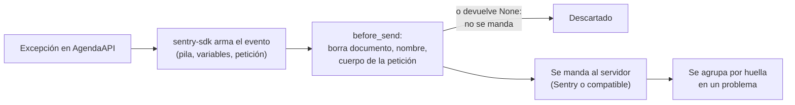

# 🔭 ob06 — Errores como producto

> Python para desarrolladores Java senior · **Carta** · Track `ob` — Observar el sistema propio ·
> sección 6 de 7
> Se lee suelta: no hace falta ninguna otra sección de la carta. Conviene tener presente la frontera
> de datos de [la historia de Áurea](00-historia-de-aurea.md) §5.
> Versiones verificadas contra PyPI el 05/10/2026 · Código probado el 05/10/2026 con Python 3.14.7,
> en contenedor, con el transporte de captura (sin mandar nada a ningún servidor).

---

## 🎯 1. Qué problema resuelve

AgendaAPI lanza una excepción cada vez que un paciente tiene una cita sin sede asignada. Pasa unas cuarenta
veces al día, cada vez con un traceback de treinta líneas en el registro, y nadie lo mira porque el registro
tiene diez mil líneas. Un día aparece un error nuevo —el que importa— y se pierde entre los cuarenta de
siempre.

Un **rastreador de errores** como Sentry convierte esas excepciones en **problemas** (*issues*): agrupa las
cuarenta apariciones del mismo error en uno solo, con su conteo, la primera y la última vez que pasó, y la
versión del código en que empezó. El error nuevo aparece como un problema nuevo, y avisa. Es la diferencia
entre leer un registro y revisar una lista corta de cosas que fallan.

Y un rastreador de errores tiene un peligro que en Áurea no es teórico: **manda afuera el contexto del
error**, que puede incluir variables locales, encabezados y el cuerpo de la petición. Si una de esas
variables es el documento de un paciente, el dato clínico salió de la frontera. Esta sección enseña a usar
**`sentry-sdk`** (2.71.0) y, sobre todo, a controlar qué sale.

---

## 🧠 2. El modelo

| Concepto | Qué es | La decisión |
|---|---|---|
| **Evento** | Una excepción capturada, con su contexto | Qué contexto viaja |
| **Huella** (*fingerprint*) | Cómo se decide que dos eventos son el mismo problema | Por defecto, por la pila; a veces hay que ajustarla |
| **Problema** (*issue*) | Un grupo de eventos con la misma huella | Lo que se revisa, se asigna y se cierra |
| **`before_send`** | Una función que ve cada evento antes de salir | **Aquí se borra lo que no puede salir** |
| **Muestreo** | Qué fracción de eventos se manda | Todos los errores; una fracción de las trazas |



**La alerta que todo el mundo silenció** es el fracaso típico de estas herramientas: si cada evento avisa,
en una semana el canal de alertas tiene doscientos avisos y alguien lo silencia. Las alertas van por
**problema nuevo** o por **regresión** (un problema cerrado que vuelve), no por evento.

### 🪞 Tu instinto de Java dice… y esta vez se equivoca

Si integraste Sentry en Java, configuraste el `SentryAppender` de Logback y listo. El reflejo es hacer lo
mismo en Python con `sentry_sdk.init(dsn=...)` y nada más. La diferencia que importa es un valor por defecto
y una función: el SDK de Python **puede** adjuntar las variables locales de cada marco de la pila, y en un
sistema de salud eso es un incidente. `send_default_pii=False` (el valor por defecto) no basta para las
variables locales; `before_send` es obligatoria.

---

## 💻 3. El ejemplo que corre

```bash
uv add sentry-sdk
```

`errores.py` usa un transporte propio que **no manda nada**: guarda los eventos para poder ver qué saldría.
En producción, el transporte es el del SDK y el DSN es el de tu proyecto.

```python
"""Captura de errores con sentry-sdk: agrupación, versión y la frontera de datos en before_send."""

import re

import sentry_sdk
from sentry_sdk.transport import Transport

SENT: list[dict] = []
DOCUMENT = re.compile(r"\b\d{6,10}\b")          # cédulas: 6 a 10 dígitos


class CaptureTransport(Transport):
    """Transporte de prueba: guarda lo que se mandaría, en vez de mandarlo."""

    def capture_envelope(self, envelope):
        for item in envelope.items:
            if item.headers.get("type") == "event":
                SENT.append(item.payload.json)


def scrub(value):
    if isinstance(value, str):
        return DOCUMENT.sub("[documento]", value)
    if isinstance(value, dict):
        return {k: scrub(v) for k, v in value.items()}
    if isinstance(value, list):
        return [scrub(v) for v in value]
    return value


def before_send(event, hint):
    # La frontera de la historia clínica: nada de variables locales, y ningún documento en ningún texto.
    for exception in event.get("exception", {}).get("values", []):
        for frame in exception.get("stacktrace", {}).get("frames", []):
            frame.pop("vars", None)
    event.pop("request", None)
    return scrub(event)


sentry_sdk.init(
    dsn="https://clave-publica@sentry.aurea.example/3",
    transport=CaptureTransport,
    release="agenda-api@2026.10.05",     # cuándo empezó cada problema
    environment="produccion",
    send_default_pii=False,
    include_local_variables=True,        # útil para depurar… y por eso before_send las quita
    before_send=before_send,
)


def book(patient_document: str, branch: str | None) -> None:
    if branch is None:
        raise ValueError(f"la cita del paciente {patient_document} no tiene sede")


if __name__ == "__main__":
    for document in ("1023456789", "52987654"):
        try:
            book(document, None)
        except ValueError as error:
            sentry_sdk.capture_exception(error)
    sentry_sdk.flush()

    for event in SENT:
        exception = event["exception"]["values"][0]
        frames = exception["stacktrace"]["frames"]
        print(exception["type"], "·", exception["value"], "·", event["release"],
              "· variables locales:", any("vars" in f for f in frames))
```

```bash
python3 errores.py
```

Salida (Python 3.14.7, 05/10/2026):

```text
ValueError · la cita del paciente [documento] no tiene sede · agenda-api@2026.10.05 · variables locales: False
ValueError · la cita del paciente [documento] no tiene sede · agenda-api@2026.10.05 · variables locales: False
```

Los dos eventos salen con el mismo mensaje —sin documento—, la misma pila y la misma versión: el servidor
los agrupa en **un** problema con dos apariciones. Y lo que habría salido sin `before_send`, con
`send_default_pii=False` puesto, es esto —comprobado en la misma corrida, cambiando solo esa línea—:

```text
mensaje: la cita del paciente 1023456789 no tiene sede
vars del marco de book: [{'patient_document': "'1023456789'", 'branch': 'None'}]
```

La cédula, dos veces: en el mensaje y en la variable local. `send_default_pii=False` controla otras cosas
—direcciones IP, cookies, usuarios—; las variables locales y el texto del mensaje son tuyos.

**Detalles con intención**

- **`release`** en cada evento: el problema dice en qué versión apareció, y una regresión —un problema
  cerrado que vuelve en una versión nueva— se detecta sola.
- **`before_send` borra las variables locales** en vez de confiar en una lista de nombres prohibidos: un
  nombre que nadie previó (`doc`, `cc`, `id_paciente`) se escapa de cualquier lista.
- **El documento sale del mensaje** con una expresión regular sobre todo el evento. El mensaje de una
  excepción lo escribe un programador, y los programadores ponen datos en los mensajes.
- **El transporte de captura** es la prueba de la frontera: se puede escribir una prueba de `pytest` que
  falle si algún evento sale con un número de documento.

---

## ⚠️ 4. Lo que se rompe

**Las agrupaciones que no agrupan.** Si el mensaje de la excepción lleva un dato variable (un documento, una
fecha, un identificador), algunos servidores lo usan para agrupar y crean un problema por paciente. Los
mensajes se escriben sin datos variables, o la huella se fija a mano con `fingerprint`.

**La cuota que se acaba un lunes.** Un error en un bucle que se repite diez mil veces en una hora agota la
cuota mensual de un servicio de pago en una mañana, y el resto del mes no se ve ningún error nuevo. El
muestreo, los límites del lado del servidor y `ignore_errors` para lo conocido existen por eso.

**El DSN en el repositorio.** El DSN no es un secreto fuerte —permite mandar eventos, no leerlos—, pero quien
lo tiene puede llenar tu proyecto de basura. Va en la configuración del entorno.

**Mandar eventos a un servicio fuera del país.** Un servicio de errores alojado en otra jurisdicción, con
datos de pacientes adentro, es una transferencia internacional de datos personales. Con `before_send` bien
escrito no sale nada personal; sin él, la decisión de dónde alojar el servidor no es técnica.

---

## ⚖️ 5. Cuándo NO usarla

**Con dos errores al mes.** Si el sistema falla tan poco que un correo por error alcanza, un rastreador es otra
pieza más. El evento ancho de `ob01` con su resultado `error` y una alerta sobre él cubren ese caso.

**Para lo que es una métrica.** "El portal de la aseguradora no respondió" cuarenta veces al día no es un
error a investigar, es una tasa a vigilar: va en una métrica (`ob03`) y se excluye del rastreador.

**Un servicio externo cuando la frontera no lo permite.** Hay servidores compatibles con el SDK que se alojan
en la propia infraestructura; si los datos no pueden salir, esa es la opción, con su costo de operación.

---

## 🧪 6. Ejercicios (10)

**🟢 Fácil (1–3)**

1. Quita `before_send` y mira qué sale. **Criterio:** encuentras el documento en el mensaje y en las variables
   locales, y dices en qué campos del evento.
2. Agrega `ignore_errors=[TimeoutError]` y lanza un `TimeoutError`. **Criterio:** no se captura nada.
3. Cambia `release` y lanza el mismo error. **Criterio:** explicas cómo vería el servidor la regresión.

**🟡 Intermedio (4–6)**

4. Escribe la prueba de `pytest` de la frontera: ningún evento capturado contiene seis o más dígitos seguidos.
   **Criterio:** la prueba falla si quitas `before_send`.
5. Busca en la documentación del SDK cómo se fija la huella con `fingerprint` y úsala para agrupar por tipo de
   error y sede. **Criterio:** dos errores de sedes distintas generan dos huellas.
6. Integra el SDK en una AgendaAPI de FastAPI. **Criterio:** una excepción en un *endpoint* se captura sola, sin
   `capture_exception`, y sale sin el cuerpo de la petición.

**🟠 Difícil (7–9)**

7. Levanta un servidor compatible con Sentry en un contenedor y manda los eventos reales. **Criterio:** los dos
   eventos aparecen como un solo problema con dos apariciones.
8. Simula un bucle que lanza el mismo error 10.000 veces y aplica muestreo y límites. **Criterio:** se mandan
   menos de cien eventos y el problema sigue visible.
9. Mide cuánto agrega `before_send` al costo de capturar un error. **Criterio:** el tiempo por evento con y sin
   `before_send`, sobre 1.000 eventos con el transporte de captura.

**🔴 Muy difícil (10)**

10. Escribe la política de errores de AgendaAPI. **Criterio:** un documento de una página y la configuración que
    la aplica. *Rúbrica:* (a) qué se captura, qué se ignora y por qué; (b) cómo se garantiza que ningún dato
    clínico sale, con la prueba que lo demuestra; (c) qué avisa y a quién, por problema nuevo o regresión,
    nunca por evento; (d) dónde se aloja el servidor y la razón.

---

## 📚 7. Referencias

**Documentación oficial**

- `sentry-sdk` para Python: https://docs.sentry.io/platforms/python/
- Filtrar y limpiar eventos (`before_send`): https://docs.sentry.io/platforms/python/configuration/filtering/
- Datos sensibles: https://docs.sentry.io/platforms/python/data-management/sensitive-data/

**Orden de lectura sugerido:** la página de datos sensibles primero —es la que importa en un sistema de
salud—; después la de filtrado.

---

## 🚀 8. Cierre

Un rastreador de errores convierte miles de líneas de registro en una lista corta de problemas agrupados, con
su versión y su historia, y avisa por lo nuevo, no por lo repetido. En un sistema de salud, su configuración
empieza por `before_send`: lo que no puede salir se borra antes de salir, y una prueba lo demuestra.

**La señal de que quedó bien:** *"Apareció un error nuevo entre los cuarenta de siempre, nos avisó el mismo día,
y en el evento no había ni una cédula."*

> 🏷️ **Cierra la sección con su tag**, cuando los ejercicios que elegiste estén hechos:
>
> ```bash
> git tag -a op-ob-fase-06 -m "op ob06 cerrada: errores agrupados y la frontera de datos en before_send"
> ```
>
> Los commits llevan su prefijo (`op ob06: …`) y los de ejercicio su número
> (`op ob06 ej07: …`).
