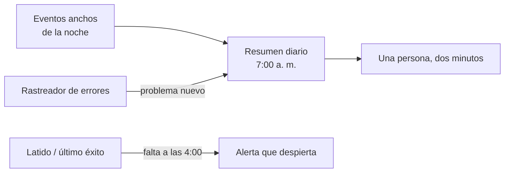

# ⚖️ ob07 — Veredicto: el presupuesto de observabilidad

> Python para desarrolladores Java senior · **Carta** · Track `ob` — Observar el sistema propio ·
> sección 7 de 7
> Se lee suelta: no hace falta ninguna otra sección de la carta, aunque esta cierra el track y
> enlaza a las seis anteriores.
> Versiones verificadas contra PyPI el 05/10/2026 · Código probado el 05/10/2026 con Python 3.14.7,
> en contenedor: las salidas son las de esa corrida.

---

## 🎯 1. Qué problema resuelve

El track recorrió las señales: eventos anchos ([`ob01`](op040-ob01-las-senales.md)), bitácoras
([`ob02`](op041-ob02-bitacoras.md)), métricas ([`ob03`](op042-ob03-metricas.md)), trazas
([`ob04`](op043-ob04-trazas.md)), perfilado ([`ob05`](op044-ob05-perfilado-en-produccion.md)) y errores
([`ob06`](op045-ob06-errores-como-producto.md)). Cada una tiene su herramienta, y todas juntas son una
plataforma de observabilidad que una empresa grande opera con un equipo.

La tesis del track es la contraria: **en un equipo de uno, la observabilidad no es para depurar — es para
no tener que estar mirando.** El ingeniero de Áurea no puede pasar la mañana revisando paneles. Lo que
necesita es que el sistema le diga, una vez al día y en dos minutos de lectura, qué corrió, qué falló y qué
se está degradando; y que lo despierte solo si algo no puede esperar.

Esta sección cierra con el presupuesto: qué se queda, qué se tira, y el resumen diario que reemplaza al
panel.

---

## 🧠 2. El modelo

| Pieza | Costo de operar | Lo que da | Veredicto para Áurea |
|---|---|---|---|
| Eventos anchos en JSON (`ob01`) | Casi cero: un archivo | Contesta las preguntas que nadie previó | **Sí**, la base de todo |
| `logging` + `structlog` bien configurados (`ob02`) | Casi cero | El detalle de una ejecución, filtrable | **Sí** |
| Latido + "último éxito" (`au06`, `ob03`) | Casi cero con un servicio de latidos | La alerta del fallo silencioso | **Sí**, la única alerta que despierta |
| Rastreador de errores con `before_send` (`ob06`) | Bajo con servicio; medio si se aloja | Errores agrupados, aviso por problema nuevo | **Sí** |
| `py-spy` y `tracemalloc` a mano (`ob05`) | Cero hasta que se necesitan | El diagnóstico de lo lento y lo que crece | **Sí**, como herramienta, no como servicio |
| Prometheus + paneles (`ob03`) | Medio: dos servicios y sus alertas | Tendencias de un servicio vivo | **No** por ahora: el resumen diario cubre lo mismo |
| Trazas con colector y visor (`ob04`) | Medio: colector, visor, almacenamiento | Dónde se va el tiempo entre servicios | **No** por ahora: dos servicios no lo justifican |

Y la regla de alertas, que vale más que la tabla: **solo despierta a alguien lo que no puede esperar a la
mañana** —el cierre que no corrió y que hay que relanzar antes de que abran las sedes—. Todo lo demás va al
resumen diario.



---

## 💻 3. El ejemplo que corre

Sin dependencias. `resumen_diario.py` lee los eventos anchos de la última semana del cierre y escribe el
mensaje de las 7:00: qué falló anoche y qué sede se está volviendo lenta respecto de su propia semana.

```python
"""El resumen de las 7:00: qué corrió, qué falló y qué se está degradando, en un mensaje."""

import json
import random
import statistics
from collections import defaultdict
from datetime import date, timedelta

SEDES = ["Centro", "Chapinero", "Suba", "Kennedy", "Usaquén", "Engativá", "Fontibón", "Restrepo",
         "Soacha", "Zipaquirá"]


def fake_week(today: date) -> list[dict]:
    """Siete noches de eventos: Kennedy se va volviendo lenta y anoche Soacha falló."""
    random.seed(5)
    events = []
    for days_ago in range(7, 0, -1):
        night = (today - timedelta(days=days_ago)).isoformat()
        for sede in SEDES:
            base = 120 + random.uniform(-15, 15)
            if sede == "Kennedy":
                base *= 1 + (7 - days_ago) * 0.25          # 25% más lenta cada noche
            failed = sede == "Soacha" and days_ago == 1
            events.append({"night": night, "branch": sede, "duration_s": round(base),
                           "outcome": "error" if failed else "ok",
                           "error": "TimeoutError: el export no llegó" if failed else None})
    return events


def digest(events: list[dict], last_night: str) -> str:
    history = defaultdict(list)
    for e in events:
        if e["night"] < last_night and e["outcome"] == "ok":
            history[e["branch"]].append(e["duration_s"])
    tonight = [e for e in events if e["night"] == last_night]
    failed = [e for e in tonight if e["outcome"] == "error"]
    slow = [(e["branch"], e["duration_s"], statistics.median(history[e["branch"]]))
            for e in tonight if e["outcome"] == "ok"
            and e["duration_s"] > 1.5 * statistics.median(history[e["branch"]])]
    lines = [f"Cierre del {last_night}: {len(tonight) - len(failed)} de {len(tonight)} sedes bien."]
    lines += [f"❌ {e['branch']}: {e['error']}" for e in failed]
    lines += [f"🐢 {b}: {d} s, su mediana de la semana es {m:.0f} s" for b, d, m in slow]
    if not failed and not slow:
        lines.append("Nada que mirar hoy.")
    return "\n".join(lines)


if __name__ == "__main__":
    today = date(2026, 10, 6)
    events = fake_week(today)
    print(digest(events, (today - timedelta(days=1)).isoformat()))
```

```bash
python3 resumen_diario.py
```

Salida (Python 3.14.7, 05/10/2026):

```text
Cierre del 2026-10-05: 9 de 10 sedes bien.
❌ Soacha: TimeoutError: el export no llegó
🐢 Kennedy: 322 s, su mediana de la semana es 192 s
```

Tres líneas. Una persona las lee con el café y sabe qué hacer: pedir el export de Soacha y mirar por qué
Kennedy se va volviendo lenta, antes de que la lentitud se convierta en un cierre que no termina.

**Detalles con intención**

- **La comparación es de cada sede contra sí misma**: Kennedy contra la mediana de Kennedy. Un umbral fijo
  ("más de diez minutos") avisaría siempre de la sede grande y nunca de la pequeña que se degrada.
- **"Nada que mirar hoy"** es una línea a propósito: un resumen que llega vacío se confunde con uno que no
  llegó. El latido del propio resumen se vigila igual que el del cierre.
- **Sale de los eventos anchos**, no de una plataforma: el mismo archivo de `ob01`, leído con la biblioteca
  estándar.

---

## ⚠️ 4. Lo que se rompe

**Un resumen que crece hasta ser un panel.** Cada semana alguien agrega "una línea más". En un año, el
resumen tiene cuarenta líneas y nadie lo lee. Una línea entra si cambia lo que alguien hace esa mañana; si no,
va al evento ancho, donde se consulta cuando hace falta.

**La alerta que despierta por todo.** Si el cierre lento despierta a alguien, en un mes alguien silencia las
alertas, y el día que el cierre no corra, nadie se entera. Solo despierta lo que no puede esperar.

**Tirar lo que falta.** El presupuesto dice "no" a Prometheus y a las trazas **hoy**. Cuando Áurea tenga
veinte sedes y cinco servicios, la tabla cambia, y la señal para revisarla es concreta: la primera vez que el
resumen diario no alcance para explicar un problema.

---

## ⚖️ 5. Cuándo NO usar este veredicto

**Con un equipo de guardia.** Si hay personas cuyo trabajo es mirar paneles y atender alertas a cualquier
hora, la plataforma completa se paga sola.

**Con un sistema de cara al público con miles de usuarios por minuto.** Las tendencias en tiempo real
importan cuando un problema afecta a miles de personas en minutos; el cierre nocturno de diez sedes no es eso.

---

## 🧪 6. Ejercicios (8)

**🟢 Fácil (1–2)**

1. Cambia la semilla para que ninguna sede falle. **Criterio:** el resumen dice cuántas sedes salieron bien y,
   si nada se degradó, "Nada que mirar hoy".
2. Llena la tabla de §2 para un sistema tuyo. **Criterio:** al menos dos filas de "no" con su razón y la
   señal que las cambiaría.

**🟡 Intermedio (3–4)**

3. Manda el resumen por correo o por el canal del equipo con lo de `co01` o `co06`. **Criterio:** llega una vez
   al día, y llega aunque no haya nada que mirar.
4. Agrega al resumen los problemas nuevos del rastreador de errores de las últimas 24 horas. **Criterio:** una
   línea por problema nuevo, nunca por evento.

**🟠 Difícil (5–6)**

5. Lee los eventos reales de `ob01` en vez de los fabricados. **Criterio:** el resumen sale de un archivo
   `.jsonl` de una semana.
6. Detecta la tendencia en vez del salto: avisa si una sede empeora cuatro noches seguidas aunque ninguna pase
   del 50%. **Criterio:** con la Kennedy del ejemplo, el aviso llega antes que con el umbral del 50%.

**🔴 Muy difícil (7–8)**

7. Escribe el presupuesto de observabilidad de Áurea para los próximos dos años. **Criterio:** una página.
   *Rúbrica:* (a) qué se opera hoy y cuánto cuesta en horas y en dinero; (b) qué alerta despierta y por qué esa
   y ninguna otra; (c) la señal concreta que haría agregar Prometheus o trazas; (d) qué no se va a observar y
   el riesgo que se acepta.
8. Diseña la medición de si el resumen diario funciona: cuántos problemas detectó antes de que alguien se
   quejara. **Criterio:** una especificación con hipótesis, qué se cuenta y durante cuánto tiempo. *Rúbrica:*
   (a) define "detectado antes" sin ambigüedad; (b) cuenta también los que no detectó; (c) dice qué resultado
   haría cambiar el resumen; (d) declara qué no se puede medir.

---

## 📚 7. Referencias

- `statistics`: https://docs.python.org/3/library/statistics.html
- Google, *Site Reliability Engineering*, el capítulo sobre monitoreo de sistemas distribuidos (gratuito en
  línea): https://sre.google/sre-book/monitoring-distributed-systems/

**Orden de lectura sugerido:** el capítulo de monitoreo del libro de SRE, en especial la parte de qué merece
despertar a una persona; el resto del track tiene sus referencias en cada sección.

---

## 🚀 8. Cierre

Para un equipo de uno, observar es no tener que mirar: eventos anchos como base, una sola alerta que despierta
—el fallo silencioso—, errores agrupados que avisan por lo nuevo, y un resumen diario de tres líneas que
reemplaza al panel. Lo demás se adopta cuando el resumen deja de alcanzar, y no antes.

**La señal de que quedó bien:** *"Hace meses que nadie abre un panel, y la mañana en que Kennedy empezó a
degradarse, el resumen lo dijo antes que Patricia."*

> 🏷️ **Cierra la sección con su tag**, cuando los ejercicios que elegiste estén hechos:
>
> ```bash
> git tag -a op-ob-fase-07 -m "op ob07 cerrada: el presupuesto de observabilidad y el resumen diario"
> ```
>
> Los commits llevan su prefijo (`op ob07: …`) y los de ejercicio su número
> (`op ob07 ej07: …`).
