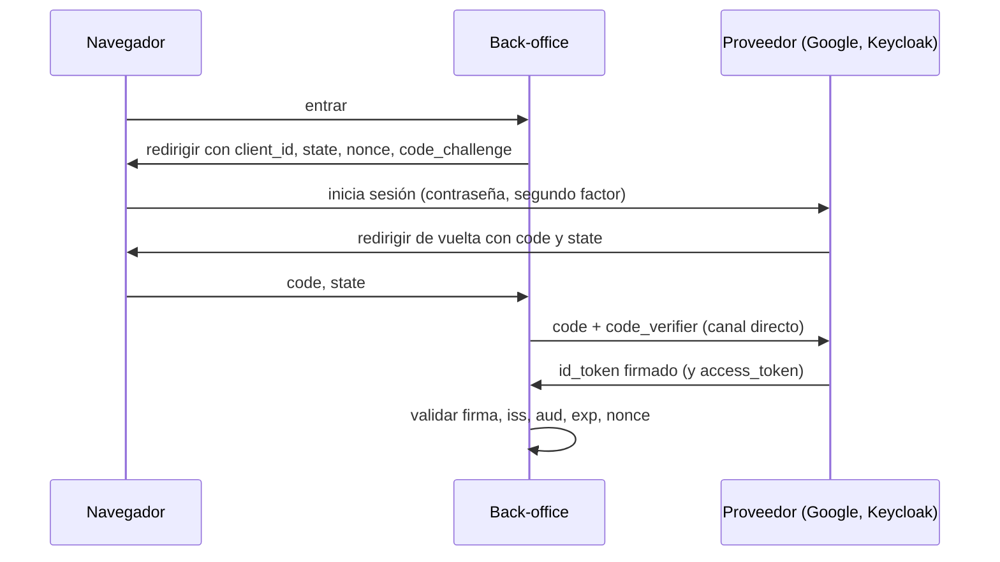

# 🪪 se04 — OAuth2 y OpenID Connect

> Python para desarrolladores Java senior · **Carta** · Track `se` — Seguridad aplicada y
> criptografía · sección 4 de 8
> Se lee suelta: no hace falta ninguna otra sección de la carta.
> Versiones verificadas contra PyPI el 05/10/2026 · Código probado el 05/10/2026 con Python 3.14.7,
> en contenedor: las salidas son las de esa corrida.

---

## 🎯 1. Qué problema resuelve

Áurea usa Google Workspace: cada auxiliar y cada administradora ya tiene una cuenta corporativa, con su
contraseña, su segundo factor y un administrador que la desactiva el día que la persona se va. Que el
back-office tenga **otra** contraseña por persona es duplicar todo eso, y peor: es la contraseña que nadie
desactiva cuando despiden a alguien.

La salida es delegar la autenticación: el back-office manda a la persona a iniciar sesión en Google (o en
Microsoft Entra, o en un Keycloak propio), y recibe de vuelta una prueba firmada de quién es. Esa prueba es el
**ID token** de OpenID Connect (OIDC), y el protocolo que la transporta es el flujo de código de autorización
de OAuth2 con PKCE.

El problema real no es entender el flujo —hay mil diagramas— sino **validar bien lo que vuelve**. Un ID token se
acepta solo si la firma es del proveedor, si fue emitido para esta aplicación y no para otra, si no venció y si
responde a la petición que esta sesión hizo. Saltarse una de las cuatro es un agujero, y las bibliotecas no
siempre las hacen todas por defecto.

---

## 🧠 2. El modelo



| Pieza | Para qué | Si falta |
|---|---|---|
| `state` | Que la respuesta corresponda a una petición de este navegador | Un atacante inyecta su propio inicio de sesión (CSRF de login) |
| `nonce` | Que el ID token corresponda a esta petición | Un ID token robado se reutiliza |
| PKCE (`code_verifier`) | Que solo quien empezó el flujo pueda canjear el código | Un código interceptado se canjea |
| Firma (JWKS del proveedor) | Que el token lo emitió el proveedor | Cualquiera fabrica uno |
| `iss` y `aud` | Que lo emitió **este** proveedor para **esta** aplicación | Un token de otra aplicación de Google entra al back-office |
| `exp` | Que no está vencido | Se acepta un token viejo |

La distinción que más se confunde: el **ID token** dice *quién es* la persona y es para el back-office; el
**access token** sirve para llamar a una API *en nombre de* la persona y es para esa API. El back-office no debe
autenticar a nadie con un access token.

### 🪞 Tu instinto de Java dice… y esta vez se equivoca

En Spring Security, `oauth2Login()` hace todo esto con tres líneas de configuración y valida el ID token por
dentro. En Python no hay un equivalente con ese nivel de opinión: `authlib` hace el flujo y valida lo
principal, pero el ejemplo de abajo hace la validación a mano para que veas cada paso, porque es lo que vas a
tener que auditar cuando un framework la haga "por ti".

---

## 💻 3. El ejemplo que corre

El ejemplo simula al proveedor con una clave RSA local —para correr sin Google ni Keycloak— y hace la parte
del back-office: PKCE, y la validación completa del ID token con `joserfc`, la biblioteca JOSE del mismo
autor de `authlib`.

```bash
uv add authlib joserfc
```

`oidc.py`:

```python
"""PKCE y validación completa de un ID token de OIDC, con un proveedor simulado."""

import secrets
import time

from authlib.oauth2.rfc7636 import create_s256_code_challenge
from joserfc import jwt
from joserfc.errors import JoseError
from joserfc.jwk import KeySet, RSAKey

ISSUER = "https://login.ejemplo.example"
CLIENT_ID = "backoffice-aurea"

# ---------------------------------------------------- el proveedor (simulado)
provider_key = RSAKey.generate_key(2048, parameters={"kid": "k-2026-10"})
jwks_public = {"keys": [provider_key.as_dict(private=False)]}   # lo que publica en /jwks


def provider_issues(nonce: str, audience: str = CLIENT_ID, issuer: str = ISSUER,
                    expires_in: int = 300) -> str:
    now = int(time.time())
    claims = {"iss": issuer, "aud": audience, "sub": "1093", "email": "yuli.chaparro@aurea.example",
              "iat": now, "exp": now + expires_in, "nonce": nonce}
    return jwt.encode({"alg": "RS256", "kid": "k-2026-10"}, claims, provider_key)


# ---------------------------------------------------- el back-office
code_verifier = secrets.token_urlsafe(48)
code_challenge = create_s256_code_challenge(code_verifier)
nonce = secrets.token_urlsafe(16)
print("code_challenge:", code_challenge[:16], "…  (va en la redirección; el verifier se queda aquí)")

keys = KeySet.import_key_set(jwks_public)
rules = jwt.JWTClaimsRegistry(
    iss={"essential": True, "value": ISSUER},
    aud={"essential": True, "value": CLIENT_ID},
    nonce={"essential": True, "value": nonce},
)


def validate(id_token: str) -> str:
    try:
        token = jwt.decode(id_token, keys, algorithms=["RS256"])
        rules.validate(token.claims)          # iss, aud, nonce, y exp / nbf / iat
        return f"aceptado: {token.claims['email']}"
    except JoseError as e:
        return f"rechazado: {type(e).__name__}"


print("token correcto:       ", validate(provider_issues(nonce)))
print("para otra aplicación: ", validate(provider_issues(nonce, audience="otra-app")))
print("de otro emisor:       ", validate(provider_issues(nonce, issuer="https://evil.example")))
print("nonce de otra sesión: ", validate(provider_issues("otro-nonce")))
print("vencido:              ", validate(provider_issues(nonce, expires_in=-60)))

attacker_key = RSAKey.generate_key(2048, parameters={"kid": "k-2026-10"})
forged = jwt.encode({"alg": "RS256", "kid": "k-2026-10"},
                    {"iss": ISSUER, "aud": CLIENT_ID, "sub": "1", "email": "patricia@aurea.example",
                     "exp": int(time.time()) + 300, "nonce": nonce}, attacker_key)
print("firmado por otro:     ", validate(forged))
```

```bash
python3 oidc.py
```

Salida (Python 3.14.7, 05/10/2026) (el `code_challenge` cambia en cada corrida):

```text
code_challenge: D5R-dq6X2Pt84cAP …  (va en la redirección; el verifier se queda aquí)
token correcto:        aceptado: yuli.chaparro@aurea.example
para otra aplicación:  rechazado: InvalidClaimError
de otro emisor:        rechazado: InvalidClaimError
nonce de otra sesión:  rechazado: InvalidClaimError
vencido:               rechazado: ExpiredTokenError
firmado por otro:      rechazado: BadSignatureError
```

Seis tokens, uno aceptado. Las cinco filas de rechazo son las cinco formas de que un ID token llegue al
back-office sin ser válido para él, y cada una necesita su comprobación: la firma sola no detecta las tres del
medio.

**Detalles con intención**

- **`decode` y `validate` son dos pasos en `joserfc`**: `decode` comprueba la firma; las reglas de los claims
  se aplican aparte. Un código que solo llama a `decode` acepta el token "para otra aplicación".
- **`algorithms=["RS256"]`** fijo, por la misma razón que en `se03`: el servidor decide el algoritmo, no el
  token.
- **El `kid` elige la clave** del JWKS del proveedor. Los proveedores rotan claves; en producción el JWKS se
  descarga de la URL del documento de descubrimiento (`/.well-known/openid-configuration`) y se cachea, y se
  vuelve a descargar cuando llega un `kid` desconocido.
- **`code_verifier` nunca sale del back-office** hasta el canje del código, por el canal directo. Por eso un
  código interceptado en la redirección no sirve.

Con un proveedor real, `authlib` hace el flujo completo —redirección, canje y validación— desde Flask, Django o
Starlette con su integración (`authlib.integrations.starlette_client`, por ejemplo); el ejemplo de arriba es
lo que esa integración hace por dentro.

---

## ⚠️ 4. Lo que se rompe

**Decodificar sin validar.** El error más común en código propio: `jwt.decode(token, options={"verify_signature":
False})` "para leer el email", y a partir de ahí se confía en el email. Un token se lee **después** de validarlo,
nunca antes.

**El `aud` que no se compara.** Google emite ID tokens para miles de aplicaciones con la misma clave. Si el
back-office no compara `aud` con su propio `client_id`, un ID token emitido para cualquier otra aplicación —por
ejemplo, una que controla el atacante— entra.

**El correo como identificador.** El `email` puede cambiar, y en algunos proveedores lo controla la persona. El
identificador estable es el par (`iss`, `sub`). Las cuentas del back-office se atan a ese par.

**El ID token como sesión.** Recibir el ID token es el inicio de sesión; después, el back-office crea su propia
sesión opaca (`se03`). Guardar el ID token en el navegador y mandarlo en cada petición es repetir el problema
del JWT que no se revoca.

**`python-jose`.** Aparece en muchos tutoriales de FastAPI. Tuvo vulnerabilidades y un largo periodo sin
mantenimiento; para un proyecto nuevo, `joserfc` o `pyjwt`.

---

## ⚖️ 5. Cuándo NO usarlo

**Si no hay proveedor de identidad.** Montar Keycloak solo para el back-office de diez sedes es operar un
servicio más —con su base de datos, sus actualizaciones y sus copias— para resolver un problema que una tabla de
usuarios con Argon2 (`se03`) resuelve. Keycloak se justifica cuando hay varias aplicaciones que comparten
usuarios.

**Entre servicios propios.** Para que un servicio de Áurea llame a otro no hace falta OIDC: el flujo de
credenciales de cliente de OAuth2, o una clave por servicio, son más simples.

**Para autorizar.** OIDC dice quién es la persona, no qué puede hacer. Que un franquiciado solo vea su sede es
una regla del back-office, no del proveedor.

---

## 🧪 6. Ejercicios (10)

**🟢 Fácil (1–3)**

1. Quita la regla de `aud` y vuelve a correr. **Criterio:** el token "para otra aplicación" se acepta, y
   explicas el ataque en dos oraciones.
2. Descarga el documento de descubrimiento de Google
   (`https://accounts.google.com/.well-known/openid-configuration`). **Criterio:** identificas la URL del JWKS y
   los algoritmos que declara.
3. Calcula a mano el `code_challenge` con `hashlib` y `base64`. **Criterio:** coincide con el de `authlib`.

**🟡 Intermedio (4–6)**

4. Agrega dos claves al JWKS simulado y rota: el proveedor firma con la nueva. **Criterio:** los tokens con
   cualquiera de las dos validan mientras ambas estén publicadas.
5. Implementa la caché del JWKS que se recarga ante un `kid` desconocido. **Criterio:** una sola descarga en
   cien validaciones, y una recarga cuando aparece una clave nueva.
6. Agrega una tolerancia de reloj de 30 segundos a la validación de `exp`. **Criterio:** un token vencido hace
   diez segundos se acepta; uno vencido hace un minuto, no.

**🟠 Difícil (7–9)**

7. Levanta Keycloak en un contenedor (sin puertos por defecto) con un realm y un cliente, y haz el flujo completo
   con `authlib` desde Starlette. **Criterio:** inicias sesión con un usuario de prueba y el back-office crea su
   sesión opaca.
8. Ata las cuentas del back-office al par (`iss`, `sub`) y simula un cambio de correo. **Criterio:** la persona
   sigue entrando a su cuenta, no a una nueva.
9. Implementa el cierre de sesión: local y en el proveedor (`end_session_endpoint`). **Criterio:** describes qué
   pasa con la sesión del proveedor en cada caso.

**🔴 Muy difícil (10)**

10. Decide si Áurea usa Google Workspace, Keycloak propio o contraseñas locales para el back-office y para el
    portal de franquiciados. **Criterio:** una página. *Rúbrica:* (a) quién da de alta y de baja a cada tipo de
    usuario; (b) qué pasa con los franquiciados, que no tienen cuenta de Workspace de Áurea; (c) cuánto cuesta
    operar cada opción; (d) cómo se revoca el acceso en cada una.

---

## 📚 7. Referencias

**Documentación oficial**

- OpenID Connect Core 1.0, validación del ID token: https://openid.net/specs/openid-connect-core-1_0.html#IDTokenValidation
- RFC 7636, PKCE: https://datatracker.ietf.org/doc/html/rfc7636
- `authlib`, cliente OAuth con Starlette: https://docs.authlib.org/en/latest/oauth2/client/web/starlette.html
- `joserfc`, JWT: https://jose.authlib.org/en/guide/jwt/
- Keycloak, primeros pasos con contenedor: https://www.keycloak.org/getting-started/getting-started-docker

**Orden de lectura sugerido:** la sección de validación del ID token de la especificación (es corta y es la
lista de comprobaciones); después la guía de JWT de `joserfc`.

---

## 🚀 8. Cierre

Delegar la autenticación quita las contraseñas del back-office y ata la baja de una persona a la baja de su cuenta
corporativa. A cambio, el ID token que vuelve se valida entero —firma, emisor, audiencia, vencimiento y nonce— y
se cambia enseguida por una sesión propia.

**La señal de que quedó bien:** *"El back-office no guarda ni una contraseña, y cuando alguien se va, desactivar
su cuenta de Workspace basta."*

> 🏷️ **Cierra la sección con su tag**, cuando los ejercicios que elegiste estén hechos:
>
> ```bash
> git tag -a op-se-fase-04 -m "op se04 cerrada: OIDC con PKCE y el ID token validado entero"
> ```
>
> Los commits llevan su prefijo (`op se04: …`) y los de ejercicio su número
> (`op se04 ej07: …`).
