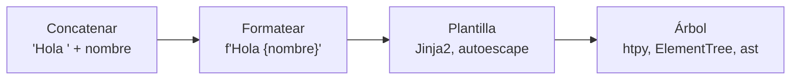

# 🧵 tx01 — El eje: concatenar, formatear, plantilla, árbol

> Python para desarrolladores Java senior · **Carta** · Track `tx` — Texto, plantillas y
> documentación · sección 1 de 9
> Se lee suelta: no hace falta ninguna otra sección de la carta.
> Versiones verificadas contra PyPI el 05/10/2026 · Código probado el 05/10/2026 con Python 3.14.7,
> en contenedor: las salidas son las de esa corrida.

---

## 🎯 1. Qué problema resuelve

Generar texto es la mitad del trabajo de un backend, y casi nunca se nombra como tal. En Áurea, el mismo proceso
nocturno escribe el correo de recordatorio de cita, el HTML del reporte de cartera para cada franquiciado, una
consulta SQL con los filtros que eligió el usuario, el comando que comprime los exportes y el JSON que se le manda
a la pasarela de pagos. Son cinco lenguajes distintos generados desde Python, y en cada uno hay un carácter que
cambia de significado: `<` en HTML, `'` en SQL, el espacio en la consola, `"` en JSON.

El recorrido habitual empieza concatenando cadenas, funciona con los datos de prueba y se rompe el día que llega
una paciente que se llama **María José D'Alessandro** y una recepcionista que escribió en la nota de la cita
`traer <b>radiografía</b>`. Esta sección es el mapa: cuatro formas de generar texto, de la más cruda a la más
estructurada, y cuál escapa sola lo que la anterior obliga a recordar.

---

## 🧠 2. El modelo



| Forma | Quién escapa | Se rompe con | Sirve para |
|---|---|---|---|
| Concatenar | Nadie | El primer carácter especial | Texto plano para una persona, sin ningún lenguaje debajo |
| Formatear (f-string) | Tú, cada vez (`html.escape`, `shlex.quote`) | El día que alguien se olvida | Mensajes de bitácora, texto plano |
| Plantilla | La plantilla, si tiene *autoescape* | Escapar dos veces, o marcar como seguro lo que no es | Documentos con mucho texto fijo y algo de dato: correos, reportes |
| Árbol | La estructura: el dato nunca se mezcla con la sintaxis | Casi nada; cuesta escribir mucho texto fijo | HTML con mucha lógica, XML, código, y todo lo que se pueda |

Y el mismo eje, fuera del HTML. Cada lenguaje tiene su "árbol", y casi siempre es la respuesta:

| Lenguaje generado | La forma cruda | La forma estructurada |
|---|---|---|
| SQL | f-string con el valor adentro | Consulta con parámetros (`%s`, `?`) |
| Consola | `subprocess.run(f"gzip {archivo}", shell=True)` | `subprocess.run(["gzip", archivo])` |
| JSON | `'{"nombre": "' + nombre + '"}'` | `json.dumps({"nombre": nombre})` |
| Python | Cadenas con código | `ast` y `ast.unparse` (`tx07`) |

### 🪞 Tu instinto de Java dice… y esta vez se equivoca

En Java, los *text blocks* y `String.formatted` son recientes y la plantilla (Thymeleaf, FreeMarker) es lo
normal en cuanto hay HTML. En Python, la f-string es tan cómoda que se usa para todo, incluido el HTML. El instinto
de Java acierta en sospechar del formateo libre; lo que no trae es que Python tiene una opción que Java casi no
usa para HTML: **el árbol**, con bibliotecas como `htpy`, donde el HTML se escribe como objetos de Python y el
escape no se puede olvidar.

---

## 💻 3. El ejemplo que corre

El mismo fragmento del recordatorio de cita, de cuatro formas, con los datos que rompen.

```bash
uv add jinja2 htpy
```

`eje.py`:

```python
"""El mismo recordatorio de cita, de cuatro formas, con datos que rompen el HTML."""

import html

from htpy import p, strong
from jinja2 import Environment, select_autoescape

name = "María José D'Alessandro"
note = "traer <b>radiografía</b> & orden"

# 1. Concatenar: nadie escapa.
concatenated = "<p>Hola <strong>" + name + "</strong>. Nota: " + note + "</p>"

# 2. Formatear: escapa quien se acuerde.
formatted = f"<p>Hola <strong>{html.escape(name)}</strong>. Nota: {html.escape(note)}</p>"

# 3. Plantilla con autoescape: escapa la plantilla.
env = Environment(autoescape=select_autoescape(default_for_string=True))
template = env.from_string("<p>Hola <strong>{{ name }}</strong>. Nota: {{ note }}</p>")
templated = template.render(name=name, note=note)

# 4. Árbol: el dato nunca toca la sintaxis.
tree = str(p["Hola ", strong[name], ". Nota: ", note])

for label, out in [("concatenar", concatenated), ("formatear", formatted),
                   ("plantilla", templated), ("árbol", tree)]:
    print(f"{label:<11} {'❌' if '<b>' in out else '✅'} {out}")

# La trampa del doble escape: escapar a mano y además con la plantilla.
twice = template.render(name=html.escape(name), note=note)
print("doble      ", twice.split("<strong>")[1].split("</strong>")[0])
```

```bash
python3 eje.py
```

Salida (Python 3.14.7, 05/10/2026):

```text
concatenar  ❌ <p>Hola <strong>María José D'Alessandro</strong>. Nota: traer <b>radiografía</b> & orden</p>
formatear   ✅ <p>Hola <strong>María José D&#x27;Alessandro</strong>. Nota: traer &lt;b&gt;radiografía&lt;/b&gt; &amp; orden</p>
plantilla   ✅ <p>Hola <strong>María José D&#39;Alessandro</strong>. Nota: traer &lt;b&gt;radiografía&lt;/b&gt; &amp; orden</p>
árbol       ✅ <p>Hola <strong>María José D&#39;Alessandro</strong>. Nota: traer &lt;b&gt;radiografía&lt;/b&gt; &amp; orden</p>
doble       María José D&amp;#x27;Alessandro
```

La primera línea es el correo que le llega a la paciente con "radiografía" en negrilla —inofensivo esta vez;
con un `<script>` o un `` hacia afuera, no—. Las tres siguientes son correctas y se ven distintas
(`&#x27;` es el de `html.escape` y `&#39;` el de MarkupSafe, que usan Jinja2 y `htpy`: el mismo apóstrofo): la diferencia no está en el resultado sino en **quién tuvo que
acordarse**. Y la última es el error del que escapa por las dudas: la paciente lee `D&#x27;Alessandro` en su
correo.

**Detalles con intención**

- **`select_autoescape(default_for_string=True)`** activa el escape en las plantillas creadas desde cadenas. Sin
  argumentos, `select_autoescape()` solo escapa archivos `.html` y `.xml`, y `Environment()` sin nada **no escapa
  nunca**: el valor por defecto de Jinja2 es el inseguro, por compatibilidad.
- **`htpy` escapa todo lo que no sea un elemento**: el nombre es texto porque es un `str`, y no hay forma de
  meterlo como HTML sin pedirlo explícitamente (`Markup`).
- **`html.escape`** escapa comillas por defecto (`quote=True`), y por eso sirve también dentro de atributos.

---

## ⚠️ 4. Lo que se rompe

**El escape del lenguaje equivocado.** `html.escape` sobre un valor que va a un SQL, o `shlex.quote` sobre uno que
va a HTML, da una sensación de seguridad sin ninguna. Cada lenguaje tiene su escape, y la forma estructurada
(parámetros, listas de argumentos, `json.dumps`) evita tener que elegirlo.

**`|safe` y `Markup` para "arreglar" un doble escape.** El doble escape se arregla quitando el escape manual, no
marcando el dato como seguro. Un `{{ note|safe }}` en la plantilla deshace el *autoescape* para ese dato, que es
precisamente el que escribe una persona.

**El correo de texto plano escapado como HTML.** La versión de texto del correo no lleva escape HTML: la paciente
leería `&amp;`. Dos plantillas con dos entornos, uno con *autoescape* y otro sin.

**La concatenación en un bucle.** `s += parte` en un bucle de miles de vueltas es cuadrático en el peor caso;
`"".join(partes)` es la forma de la casa. Es un problema de rendimiento, no de corrección, y solo con volúmenes que
un correo nunca tiene.

---

## ⚖️ 5. Cuándo NO usar el árbol

**Un correo con tres párrafos de texto fijo y dos datos.** Escribirlo como objetos de `htpy` es ilegible para quien
tiene que cambiar una coma; una plantilla de Jinja2 con *autoescape* es lo correcto, y la recepcionista puede leerla.

**Un mensaje de bitácora.** Nadie interpreta el mensaje como HTML: la f-string es la herramienta. (El argumento con
`%s` de `logging` tiene su razón, que no es el escape: es no formatear lo que no se va a registrar.)

**Plantillas que escribe un usuario.** Ni el árbol ni la plantilla común: el *sandbox* de `tx02`, o mejor,
marcadores fijos.

---

## 🧪 6. Ejercicios (10)

**🟢 Fácil (1–3)**

1. Cambia la nota por `` y abre el resultado de cada forma en un navegador.
   **Criterio:** reportas en cuáles se ejecuta el `alert`.
2. Crea `Environment()` sin argumentos y renderiza la plantilla. **Criterio:** muestras que no escapa, y citas la
   parte de la documentación que lo dice.
3. Genera el mismo recordatorio en texto plano con `string.Template`. **Criterio:** el apóstrofo y el `&` salen
   literales.

**🟡 Intermedio (4–6)**

4. Escribe la consulta "citas de una sede" con f-string y con parámetros contra SQLite, y pásale `Suba' OR '1'='1`.
   **Criterio:** la primera devuelve todas las sedes; la segunda, ninguna fila.
5. Escribe el comando de compresión con `shell=True` y con lista, con un archivo llamado `cierre; rm x.txt`.
   **Criterio:** describes qué hace cada uno (en un directorio de prueba).
6. Arma el reporte de cartera de una sede como tabla HTML con `htpy`, con los valores en pesos. **Criterio:** ninguna
   cadena con `<` en tu código Python.

**🟠 Difícil (7–9)**

7. Mide `+=` contra `"".join` para armar un texto de 100 000 líneas. **Criterio:** los dos tiempos, en tu máquina, y
   desde qué tamaño la diferencia importa.
8. Escribe una función `send_reminder` que reciba los datos y genere las dos versiones (HTML y texto) con dos
   entornos de Jinja2. **Criterio:** una prueba que verifica que la versión de texto no tiene entidades HTML.
9. Busca en un proyecto tuyo dónde se genera HTML, SQL o comandos con f-strings. **Criterio:** la lista y la forma
   estructurada para cada uno.

**🔴 Muy difícil (10)**

10. Haz el inventario de todo el texto que genera un sistema tuyo. **Criterio:** una tabla. *Rúbrica:* (a) cada
    salida con su lenguaje (HTML, SQL, consola, JSON, CSV…); (b) la forma que usa hoy en el eje; (c) quién escapa;
    (d) cuáles moverías hacia el árbol y cuáles no, con su razón.

---

## 📚 7. Referencias

**Documentación oficial**

- Jinja2, *autoescape*: https://jinja.palletsprojects.com/en/stable/api/#autoescaping
- `htpy`: https://htpy.dev/
- `html.escape`: https://docs.python.org/3/library/html.html
- OWASP, prevención de XSS: https://cheatsheetseries.owasp.org/cheatsheets/Cross_Site_Scripting_Prevention_Cheat_Sheet.html

**Orden de lectura sugerido:** la hoja de OWASP sobre XSS, que explica por qué el contexto (cuerpo, atributo,
JavaScript) decide el escape; después la página de *autoescape* de Jinja2.

---

## 🚀 8. Cierre

Todo texto generado es un lenguaje con caracteres que cambian de significado. En el eje concatenar → formatear →
plantilla → árbol, cada paso quita una cosa que hay que recordar: la f-string obliga a escapar a mano, la plantilla
escapa sola si se le pide, y el árbol no deja mezclar el dato con la sintaxis. Se elige el paso más estructurado que
siga siendo legible para quien lo mantiene.

**La señal de que quedó bien:** *"El correo de María José D'Alessandro llegó con su apellido bien escrito, y la
nota de la recepcionista salió como texto."*

> 🏷️ **Cierra la sección con su tag**, cuando los ejercicios que elegiste estén hechos:
>
> ```bash
> git tag -a op-tx-fase-01 -m "op tx01 cerrada: el eje de generar texto y quién escapa en cada forma"
> ```
>
> Los commits llevan su prefijo (`op tx01: …`) y los de ejercicio su número
> (`op tx01 ej07: …`).
