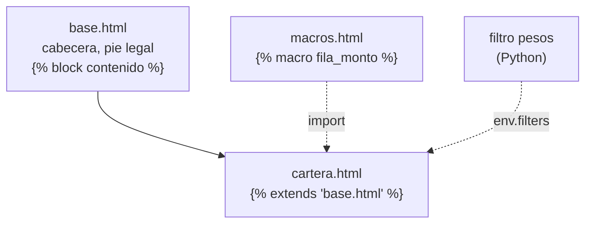

# 🧩 tx02 — Jinja2 a fondo

> Python para desarrolladores Java senior · **Carta** · Track `tx` — Texto, plantillas y
> documentación · sección 2 de 9
> Se lee suelta: no hace falta ninguna otra sección de la carta.
> Versiones verificadas contra PyPI el 05/10/2026 · Código probado el 05/10/2026 con Python 3.14.7,
> en contenedor: las salidas son las de esa corrida.

---

## 🎯 1. Qué problema resuelve

Cada mes, Áurea le manda a cada franquiciado el reporte de cartera de su sede: lo facturado, lo recaudado, lo que
está en mora por tramo de días. Son diez reportes con la misma cabecera, el mismo pie con el aviso legal, la misma
tabla de montos en pesos, y un bloque distinto según la sede sea propia o franquicia. Hoy son diez archivos HTML
copiados y pegados, y el mes en que cambió el aviso legal se corrigió en siete.

Jinja2 es el motor de plantillas de facto en Python —lo usan Flask, Ansible, dbt, Salt y MkDocs— y resuelve esto
con cuatro piezas que este perfil reconoce de Thymeleaf o FreeMarker: **herencia** (una base con bloques que cada
reporte llena), **macros** (la fila de monto, escrita una vez), **filtros propios** (`1234567 | pesos` →
`$1.234.567`) y **validación** de que la plantilla no use una variable que no existe. Esta sección las arma juntas
sobre el reporte real.

---

## 🧠 2. El modelo



| Pieza | En Jinja2 | En Thymeleaf | Para qué |
|---|---|---|---|
| Herencia | `` + `` | `th:replace` con *layout dialect* | Una base, muchos documentos |
| Macro | `` + `` | Fragmentos con parámetros | Un pedazo repetido con datos |
| Filtro | `env.filters["pesos"] = func` | *Dialect* o utilidades `#numbers` | Formatear un valor |
| Variable inexistente | `StrictUndefined`: error | Error por defecto | Atrapar errores de nombre |
| Cargador | `FileSystemLoader`, `PackageLoader`, `DictLoader` | *Template resolver* | De dónde salen las plantillas |

### 🪞 Tu instinto de Java dice… y esta vez se equivoca

Thymeleaf falla si la plantilla usa una variable que no existe. **Jinja2 no**: por defecto, una variable
inexistente es una cadena vacía, sin aviso. `{{ sede.nombr }}` con un error de tipeo produce un reporte con un
hueco donde iba el nombre de la sede, y llega así a diez franquiciados. `StrictUndefined` cambia eso y debería
estar siempre.

---

## 💻 3. El ejemplo que corre

```bash
uv add jinja2
```

`reporte.py`:

```python
"""El reporte mensual de cartera: herencia, macro, filtro propio y StrictUndefined."""

from jinja2 import DictLoader, Environment, StrictUndefined, UndefinedError, select_autoescape

TEMPLATES = {
    "base.html": """\
<html><body>
<h1>Áurea · </h1>

<footer>Información confidencial de la red Áurea. Ley 1581 de 2012.</footer>
</body></html>""",
    "macros.html": """\

<tr class="alerta"><td>{{ etiqueta }}</td><td>{{ valor | pesos }}</td></tr>
""",
    "cartera.html": """\


Cartera de {{ sede.nombre }}, {{ mes }}

<p>Franquiciado: {{ sede.titular }}</p>
<table>
{{ m.fila_monto("Facturado", cartera.facturado) }}
{{ m.fila_monto("Recaudado", cartera.recaudado) }}

{{ m.fila_monto("Mora " ~ tramo, valor, alerta=(tramo == "más de 90 días")) }}

</table>
""",
}


def pesos(value: int) -> str:
    """1234567 -> $1.234.567, el formato que leen los franquiciados."""
    return "$" + f"{value:,}".replace(",", ".")


env = Environment(loader=DictLoader(TEMPLATES), autoescape=select_autoescape(["html"]),
                  undefined=StrictUndefined, trim_blocks=True, lstrip_blocks=True)
env.filters["pesos"] = pesos

data = {
    "mes": "septiembre de 2026",
    "sede": {"nombre": "Suba", "franquicia": True, "titular": "Édgar Rojas"},
    "cartera": {"facturado": 187_450_000, "recaudado": 162_300_000,
                "mora": {"1 a 30 días": 14_200_000, "31 a 90 días": 7_850_000,
                         "más de 90 días": 3_100_000}},
}
print(env.get_template("cartera.html").render(**data))

# Un error de tipeo en una plantilla: con StrictUndefined, falla en vez de dejar un hueco.
broken = env.from_string("Cartera de {{ sede.nombr }}")
try:
    broken.render(**data)
except UndefinedError as e:
    print("\nplantilla rota:", e)
```

```bash
python3 reporte.py
```

Salida (Python 3.14.7, 05/10/2026):

```text
<html><body>
<h1>Áurea · Cartera de Suba, septiembre de 2026</h1>
<p>Franquiciado: Édgar Rojas</p><table>
<tr><td>Facturado</td><td>$187.450.000</td></tr>
<tr><td>Recaudado</td><td>$162.300.000</td></tr>
<tr><td>Mora 1 a 30 días</td><td>$14.200.000</td></tr>
<tr><td>Mora 31 a 90 días</td><td>$7.850.000</td></tr>
<tr class="alerta"><td>Mora más de 90 días</td><td>$3.100.000</td></tr>
</table>
<footer>Información confidencial de la red Áurea. Ley 1581 de 2012.</footer>
</body></html>

plantilla rota: 'dict object' has no attribute 'nombr'
```

Tres plantillas, un reporte. El aviso legal vive en `base.html` y se cambia en un solo lugar; la fila de monto vive
en la macro, con su clase de alerta para la mora de más de 90 días; el formato en pesos es una función de Python
de una línea que la plantilla usa como filtro. Y la última línea es la garantía que Jinja2 no da por defecto.

**Detalles con intención**

- **`trim_blocks` y `lstrip_blocks`** quitan las líneas en blanco que dejan las etiquetas ``. Sin ellas, el
  HTML sale con huecos —inofensivo en HTML, molesto en texto plano, y grave en formatos sensibles a los espacios
  como YAML—. También tienen su costo, visible en la salida: `<table>` quedó pegado al párrafo del
  franquiciado, porque `trim_blocks` se comió el salto de línea que seguía a ``. Cuando importa, se
  controla etiqueta por etiqueta con ``.
- **`DictLoader`** es para el ejemplo. En el proyecto, `PackageLoader("aurea", "templates")` carga las plantillas
  desde el paquete instalado, que es lo que funciona igual en desarrollo y en producción.
- **El filtro `pesos` es una función normal**, probable con `pytest` sin Jinja2. La lógica de formato va en Python,
  no en la plantilla.
- **La macro recibe `alerta` como parámetro**: la plantilla decide la presentación; qué tramo es alerta es una regla
  de negocio que, en un proyecto real, vendría ya calculada en los datos.

---

## ⚠️ 4. Lo que se rompe

**La lógica que se muda a la plantilla.** Jinja2 permite bucles, condiciones, asignaciones y llamadas a métodos. Un
reporte que calcula el total de mora, el porcentaje y el semáforo dentro de la plantilla funciona y no se puede
probar. La regla: la plantilla recibe los datos ya calculados y solo decide cómo se ven.

**El *autoescape* que se apaga para un archivo `.txt`.** `select_autoescape(["html"])` no escapa la versión de texto,
que está bien; pero si alguien genera HTML con extensión `.j2` o `.jinja`, tampoco lo escapa. Las extensiones
se listan explícitamente, o se usa `default=True`.

**`` con variables del padre.** Una plantilla incluida ve todas las variables del contexto, y por eso
funciona sin pasarle nada; también por eso, un cambio de nombre en el padre la rompe en silencio (o con
`StrictUndefined`, en voz alta). Las macros, que reciben sus parámetros, son más fáciles de mantener.

**Las plantillas que edita un usuario.** Si las sedes pudieran editar su reporte, es el caso de `se07`: ejecución de
código, y `SandboxedEnvironment` o marcadores fijos.

---

## ⚖️ 5. Cuándo NO usarlo

**Para generar código Python o SQL.** Jinja2 genera texto que parece código sin saber nada de él: una indentación mal
puesta en Python, una coma de más en SQL. Para Python, `ast.unparse` (`tx07`); para SQL, un constructor de consultas
o parámetros.

**Para una página con mucha interacción.** Si el reporte tiene filtros, ordenamiento y gráficos, la plantilla del
servidor termina siendo una aplicación escrita en un lenguaje de plantillas. Ahí conviene un árbol (`htpy`, `tx01`)
o una interfaz del lado del cliente.

**Para tres líneas.** Un correo de confirmación de una oración no necesita entorno, cargador ni herencia.

---

## 🧪 6. Ejercicios (10)

**🟢 Fácil (1–3)**

1. Quita `undefined=StrictUndefined` y renderiza la plantilla rota. **Criterio:** muestras la salida con el hueco.
2. Agrega un filtro `porcentaje` y úsalo para el recaudo sobre lo facturado. **Criterio:** `86,6 %` para Suba, con
   coma decimal.
3. Quita `trim_blocks` y `lstrip_blocks`. **Criterio:** cuentas las líneas en blanco nuevas y dices de dónde sale
   cada una.

**🟡 Intermedio (4–6)**

4. Haz el reporte de una sede propia (Centro) sin bloque de franquiciado. **Criterio:** la misma plantilla, sin
   `` nuevos.
5. Pasa las plantillas a archivos con `FileSystemLoader` y escribe una prueba que renderice cada una con datos
   mínimos. **Criterio:** la prueba falla si una plantilla usa una variable que los datos no traen.
6. Haz la versión de texto plano del reporte con un segundo entorno sin *autoescape*. **Criterio:** reutiliza el
   filtro `pesos`, y el texto no tiene ninguna etiqueta HTML.

**🟠 Difícil (7–9)**

7. Escribe una extensión de Jinja2 que agregue la etiqueta ``. **Criterio:** funciona en las dos
   versiones, HTML y texto.
8. Precompila las plantillas con `env.compile_templates` y mide el arranque. **Criterio:** los dos tiempos, con y sin
   precompilar, para cien plantillas.
9. Usa `jinja2.meta.find_undeclared_variables` para listar las variables que cada plantilla espera. **Criterio:** un
   comando que lo reporta para todas las plantillas del proyecto.

**🔴 Muy difícil (10)**

10. Diseña el sistema de reportes mensuales de Áurea. **Criterio:** una página. *Rúbrica:* (a) qué se calcula en
    Python y qué decide la plantilla; (b) cómo se prueban las plantillas; (c) cómo se agrega un reporte nuevo sin
    tocar los existentes; (d) qué pasa si un franquiciado pide su propio formato.

---

## 📚 7. Referencias

**Documentación oficial**

- Jinja2, diseño de plantillas: https://jinja.palletsprojects.com/en/stable/templates/
- Jinja2, la API (entornos, cargadores, `Undefined`): https://jinja.palletsprojects.com/en/stable/api/
- Jinja2, extensiones: https://jinja.palletsprojects.com/en/stable/extensions/

**Orden de lectura sugerido:** la página de diseño de plantillas completa (es el lenguaje); después, de la API, las
secciones de cargadores y de `Undefined`.

---

## 🚀 8. Cierre

Herencia para la base común, macros para los pedazos con datos, filtros en Python para el formato y
`StrictUndefined` para que un error de tipeo no llegue a diez franquiciados. La plantilla decide cómo se ve; lo
que se calcula, se calcula antes.

**La señal de que quedó bien:** *"Cambió el aviso legal y lo corregimos en un archivo; los diez reportes salieron
con el nuevo."*

> 🏷️ **Cierra la sección con su tag**, cuando los ejercicios que elegiste estén hechos:
>
> ```bash
> git tag -a op-tx-fase-02 -m "op tx02 cerrada: herencia, macros, filtros y StrictUndefined en el reporte de cartera"
> ```
>
> Los commits llevan su prefijo (`op tx02: …`) y los de ejercicio su número
> (`op tx02 ej07: …`).
