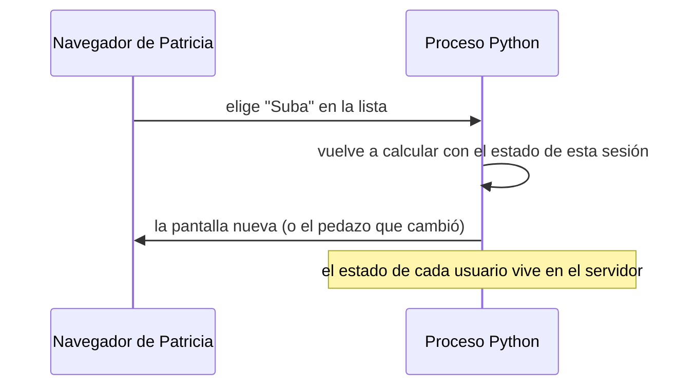

# 🖥️ ui01 — El modelo y su costo

> Python para desarrolladores Java senior · **Carta** · Track `ui` — Interfaces y entregables sin
> frontend · sección 1 de 13
> Se lee suelta: no hace falta ninguna otra sección de la carta.
> Versiones verificadas contra PyPI el 05/10/2026 · Código probado el 05/10/2026 con Python 3.14.7,
> en contenedor: las salidas son las de esa corrida.

---

## 🎯 1. Qué problema resuelve

**Patricia Guzmán** lleva la cartera, la facturación y las liquidaciones de franquicia de Áurea en hojas de Excel. Es la
usuaria real de casi todo lo que el ingeniero de Áurea escribe, y no programa. El día que el cálculo de mora por sede
esté listo en Python, la pregunta es cómo le llega: no hay equipo de frontend, y no lo va a haber.

Python tiene una industria entera para esto: Gradio, Streamlit, Dash, NiceGUI, marimo, una docena más. Todas prometen
"una aplicación web sin escribir frontend", y todas cumplen. Este track las recorre, pero empieza por las dos preguntas
que deciden antes que cualquier biblioteca:

- **¿Qué es exactamente una interfaz generada desde el backend, y qué cuesta?** El servidor guarda el estado y dibuja la
  pantalla; el navegador muestra. Eso tiene un precio en latencia, en memoria por usuario y en lo que no se puede
  personalizar.
- **¿Qué se le puede pedir de verdad a alguien que no programa?** Muchas veces, la mejor interfaz para Patricia no es
  una aplicación: es un archivo que ella ya sabe abrir.

---

## 🧠 2. El modelo

La escalera de entregas, de la más barata a la más cara. Cada escalón suma algo que Patricia puede hacer y algo que el
ingeniero tiene que operar:

| Escalón | Patricia puede | El ingeniero opera | Ejemplo en la carta |
|---|---|---|---|
| **Archivo** (CSV, Excel) | Abrir, filtrar, sumar en Excel | Nada: un correo diario | `ui08`, este ejemplo |
| **HTML estático** | Abrir en el navegador, buscar, imprimir | Nada: un archivo o una carpeta compartida | `ui08`, este ejemplo |
| **Aplicación de datos** (Streamlit, Gradio, Dash) | Elegir filtros, ver gráficos que cambian | Un servidor, su autenticación, sus actualizaciones | `ui02`–`ui06` |
| **Aplicación con frontend** | Todo | Dos códigos, dos despliegues, y alguien que sepa JavaScript | Fuera de este track |

Y el modelo de los escalones del medio, que es lo que tienen en común casi todas las bibliotecas del track:



Cada clic es un viaje al servidor; el estado de cada sesión ocupa memoria del proceso; y la pantalla es la que la
biblioteca sabe dibujar. Es lo que permite no escribir JavaScript, y es lo que se paga.

### 🧠 Qué se le puede pedir a alguien que no programa

Esta es la parte del track que no trata de bibliotecas. A Patricia se le puede pedir que **abra un enlace o un archivo,
elija de una lista, escriba un número, descargue un Excel y lea una tabla**. No se le puede pedir que instale Python,
que abra una terminal, que edite un YAML, que entienda un mensaje de error con un *traceback*, ni que recuerde un orden
de pasos que la herramienta no le muestra. La prueba es concreta: **si Patricia necesita al ingeniero para usarlo, no
está entregado**.

### 🪞 Tu instinto de Java dice… y esta vez se equivoca

Este perfil viene de proyectos con un frontend aparte —Angular, React— y una API. El instinto es que "una interfaz" es
eso, y que lo demás es un juguete. Para una usuaria interna, en una empresa sin equipo de frontend, el juguete suele ser
la respuesta correcta; y el escalón más bajo, un archivo bien hecho, gana con frecuencia a todos los demás.

---

## 💻 3. El ejemplo que corre

Sin dependencias. `entregas.py` produce los dos primeros escalones con los mismos datos: el CSV que Patricia abre en su
Excel en español, y un HTML que abre en el navegador sin servidor.

```python
"""Los dos escalones baratos: un CSV que el Excel en español abre bien, y un HTML sin servidor."""

import csv
import html
import pathlib

ROWS = [("Centro", 187_450_000, 3_100_000), ("Suba", 142_900_000, 9_800_000),
        ("Kennedy", 98_300_000, 1_200_000), ("Zipaquirá", 61_750_000, 4_450_000)]
HEADER = ("Sede", "Facturado", "Mora más de 90 días")

# ------------------------------------------------- 1. el CSV "normal", y el que Excel en español abre bien
with open("cartera_ingenuo.csv", "w", newline="", encoding="utf-8") as f:
    csv.writer(f).writerows([HEADER, *ROWS])

with open("cartera_excel.csv", "w", newline="", encoding="utf-8-sig") as f:      # con BOM
    csv.writer(f, delimiter=";").writerows([HEADER, *ROWS])                     # ; para Excel es-CO

# ------------------------------------------------- 2. un HTML que se abre sin servidor
def pesos(v: int) -> str:
    return "$" + f"{v:,}".replace(",", ".")


cells = "\n".join(
    f"<tr><td>{html.escape(s)}</td><td>{pesos(f)}</td>"
    f"<td{' class=alerta' if m > 4_000_000 else ''}>{pesos(m)}</td></tr>" for s, f, m in ROWS)
pathlib.Path("cartera.html").write_text(f"""<!doctype html><meta charset="utf-8">
<title>Cartera por sede</title>
<style>td{{padding:4px 12px}} .alerta{{color:#b00020;font-weight:bold}}</style>
<h1>Cartera por sede · septiembre de 2026</h1>
<table><tr>{''.join(f'<th>{h}</th>' for h in HEADER)}</tr>
{cells}
</table>""", encoding="utf-8")

for name in ("cartera_ingenuo.csv", "cartera_excel.csv", "cartera.html"):
    raw = pathlib.Path(name).read_bytes()
    print(f"{name:<20} {len(raw):>4} bytes  empieza con {raw[:12]!r}")
```

```bash
python3 entregas.py
```

Salida (Python 3.14.7, 05/10/2026):

```text
cartera_ingenuo.csv   143 bytes  empieza con b'Sede,Factura'
cartera_excel.csv     146 bytes  empieza con b'\xef\xbb\xbfSede;Fact'
cartera.html          567 bytes  empieza con b'<!doctype ht'
```

Los dos CSV tienen los mismos datos, y se ven distintos en el computador de Patricia. El primero, abierto con doble clic
en un Excel configurado en español de Colombia, sale con todo en la columna A —porque ese Excel espera `;`, ya que la coma
es el separador decimal— y con `Zipaquirá` convertido en `Zipaquirá`, porque sin la marca `\xef\xbb\xbf` (el BOM)
Excel asume otra codificación. El segundo abre bien con doble clic. Tres bytes y un separador son la diferencia entre
"no sirve" y "lo uso todos los días".

**Detalles con intención**

- **`encoding="utf-8-sig"`** escribe el BOM. Para cualquier otro consumidor —otro programa, una base— el BOM sobra y a
  veces estorba: es una concesión específica a Excel.
- **El separador `;`** depende de la configuración regional del Windows de Patricia, no del archivo. Si la sede de
  Zipaquirá tiene el Windows en inglés, espera coma. Por eso el escalón siguiente, el `.xlsx` (`ui08`), elimina el
  problema: no tiene separadores.
- **El HTML no tiene JavaScript ni servidor**: se adjunta a un correo o se deja en una carpeta compartida, y se abre en
  cualquier navegador. El color de alerta lo decide Python antes de escribir.

---

## ⚠️ 4. Lo que se rompe

**Subir de escalón sin que lo pidan.** El ingeniero arma una aplicación de Streamlit con filtros y gráficos, y Patricia
pide "¿me lo puedes mandar en Excel?". Antes de una aplicación, se le pregunta qué hace con el resultado: si lo pega en
otra hoja, el escalón correcto es el archivo.

**La aplicación que solo corre en la máquina del ingeniero.** Una aplicación de datos que se abre con `streamlit run` en
el portátil no está entregada: está demostrada. Entregarla es un servidor, una dirección, un inicio de sesión y alguien
que la reinicie cuando se caiga.

**El estado en la memoria del proceso.** En el modelo de la figura, cada sesión vive en el servidor. Diez personas con
diez filtros son diez copias de los datos en memoria; un reinicio las borra todas. Con Patricia sola no importa; con las
diez sedes, empieza a importar.

**La pantalla que la biblioteca no sabe dibujar.** Marcela Ocampo va a pedir que la barra de Suba sea del color de la
marca y que la tabla tenga el logo arriba a la izquierda. Algunas bibliotecas lo permiten, otras no, y ninguna con la
libertad de un frontend propio.

---

## ⚖️ 5. Cuándo NO usar este track

**Si hay un frontend en la casa.** Si Áurea contratara a alguien que escribe React, las aplicaciones de este track
pasarían a ser prototipos que se tiran: el modelo de la figura no escala a una aplicación de cara al público.

**Para los pacientes.** Nada de este track es una interfaz para el público: una aplicación de datos con la sesión en el
servidor, sin diseño propio y con la autenticación agregada después, no es lo que un paciente debería usar para agendar.

**Para alguien que vive en Excel y no quiere salir.** Hay usuarios para quienes la mejor interfaz es la hoja que ya
usan, con los datos actualizados. Eso es un archivo, o un complemento de Excel; no una página web.

---

## 🧪 6. Ejercicios (10)

**🟢 Fácil (1–3)**

1. Abre los dos CSV en un Excel (o LibreOffice) configurado en español. **Criterio:** describes lo que ves en cada uno.
2. Abre `cartera.html` en el navegador e imprímelo a PDF. **Criterio:** la tabla cabe en una página y se lee la alerta.
3. Haz la lista de lo que Patricia necesita hacer con el reporte de cartera, preguntándoselo a una persona real de tu
   trabajo que haga algo parecido. **Criterio:** cinco verbos ("compara", "suma", "reenvía"…).

**🟡 Intermedio (4–6)**

4. Genera el mismo CSV para un Excel en inglés y para uno en español con un argumento. **Criterio:** los dos abren bien
   con doble clic en su configuración.
5. Agrega al HTML una fila de totales calculada en Python. **Criterio:** la suma coincide con la del Excel.
6. Manda el HTML por correo con lo de `co01`. **Criterio:** llega como adjunto y se abre en el teléfono.

**🟠 Difícil (7–9)**

7. Mide cuánta memoria ocupa una sesión de una aplicación de datos de `ui03` con los datos de cartera cargados.
   **Criterio:** el número por sesión y la proyección a diez sedes.
8. Escribe la "prueba de Patricia" para una herramienta tuya: la lista de pasos que alguien que no programa tiene que
   poder hacer sola. **Criterio:** la prueba hecha con una persona, y lo que falló.
9. Convierte el CSV en un `.xlsx` con formato de moneda (adelanto de `ui08`). **Criterio:** se abre igual en Excel en
   español y en inglés.

**🔴 Muy difícil (10)**

10. Decide el escalón de cada entrega de Áurea. **Criterio:** una tabla y una página. *Rúbrica:* (a) cada entrega
    (cartera, liquidación de franquicia, agenda del día, regalías) con su usuario y lo que hace con ella; (b) el
    escalón elegido y por qué no el siguiente; (c) qué tiene que operar el ingeniero; (d) la señal que haría subir un
    escalón.

---

## 📚 7. Referencias

**Documentación oficial**

- `csv`: https://docs.python.org/3/library/csv.html
- Códecs de Python, `utf-8-sig`: https://docs.python.org/3/library/codecs.html#encodings-and-unicode

**Lectura**

- Steve Krug, *Don't Make Me Think, Revisited* (New Riders, 2014). Corto, y lo que dice sobre usuarios que no tienen
  tiempo vale para Patricia.

**Orden de lectura sugerido:** los capítulos 1 a 3 de Krug antes de construir nada para una usuaria como Patricia.

---

## 🚀 8. Cierre

Una interfaz generada desde el backend guarda el estado en el servidor y paga cada clic con un viaje; es lo que permite
no escribir frontend. Antes de elegir biblioteca se elige el escalón, y muchas veces el correcto es un archivo bien
hecho. La prueba de cualquier entrega es una sola: que Patricia la use sin llamar al ingeniero.

**La señal de que quedó bien:** *"Patricia abrió el CSV con doble clic, `Zipaquirá` salió con su tilde, y no preguntó
nada."*

> 🏷️ **Cierra la sección con su tag**, cuando los ejercicios que elegiste estén hechos:
>
> ```bash
> git tag -a op-ui-fase-01 -m "op ui01 cerrada: la escalera de entregas y la prueba de Patricia"
> ```
>
> Los commits llevan su prefijo (`op ui01: …`) y los de ejercicio su número
> (`op ui01 ej07: …`).
