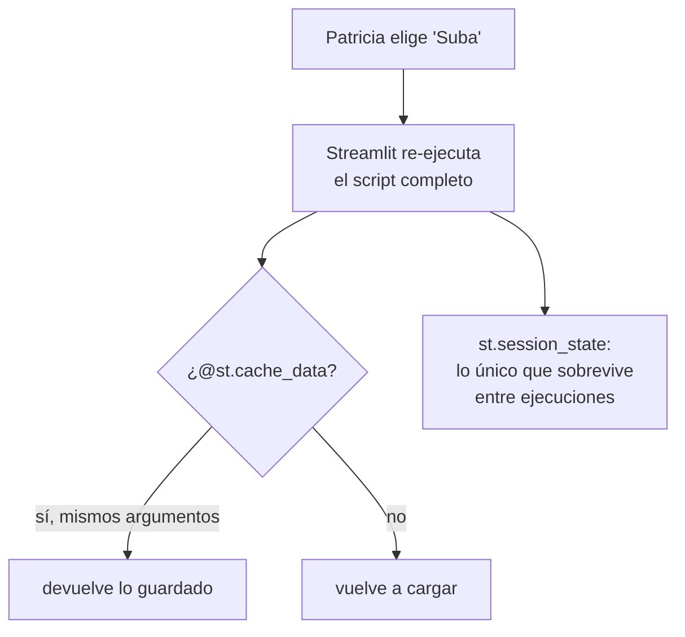

# 🔁 ui03 — Streamlit y su re-ejecución

> Python para desarrolladores Java senior · **Carta** · Track `ui` — Interfaces y entregables sin
> frontend · sección 3 de 13
> Se lee suelta: no hace falta ninguna otra sección de la carta.
> Versiones verificadas contra PyPI el 05/10/2026 · Código probado el 05/10/2026 con Python 3.14.7,
> en contenedor: las salidas son las de esa corrida.

---

## 🎯 1. Qué problema resuelve

El tablero de cartera de Patricia: elegir una sede de una lista, ver lo facturado y lo recaudado, marcar las sedes ya
revisadas en la semana. Es más que una función —hay una lista, unas métricas, un botón con memoria— y menos que una
aplicación con frontend. Es el caso para el que existe Streamlit, la biblioteca más usada de este track.

Streamlit tiene un modelo de programación que no se parece a nada de lo que este perfil conoce: **el script entero se
vuelve a ejecutar de arriba abajo en cada interacción**. Se elige una sede y corre todo de nuevo: la carga de datos, los
cálculos, el dibujo de cada componente. Es lo que hace que una aplicación de Streamlit se escriba como un script, sin
*callbacks* ni eventos. Y es lo que muerde: la carga que tarda cinco segundos se repite en cada clic, y la variable que
cuenta los clics vuelve a cero en cada clic.

---

## 🧠 2. El modelo



| Lo que se quiere | La forma de Streamlit | El error habitual |
|---|---|---|
| Cargar datos una vez | `@st.cache_data` (datos) o `@st.cache_resource` (conexiones) | Cargar en el cuerpo del script |
| Recordar algo entre clics | `st.session_state` | Una variable normal, que se reinicia |
| Reaccionar a un botón | `if st.button(...)`: verdadero solo en la ejecución del clic | Esperar que siga verdadero |
| Agrupar controles sin re-ejecutar cada uno | `st.form` | Diez controles que disparan diez ejecuciones |
| Re-ejecutar solo una parte | `@st.fragment` | Re-ejecutar la página para actualizar un número |

### 🪞 Tu instinto de Java dice… y esta vez se equivoca

En Swing, JSF o Angular, la pantalla es un objeto que vive, y un clic llama a un manejador que cambia una parte. El
instinto escribe `contador += 1` dentro del `if st.button(...)` y espera que el contador crezca. En Streamlit no hay
objeto que viva: hay un script que se ejecuta otra vez, y `contador` vuelve a valer cero en la línea donde se declara.
Lo que vive es `st.session_state`, un diccionario por sesión que Streamlit guarda entre ejecuciones.

---

## 💻 3. El ejemplo que corre

```bash
uv add streamlit
```

`contador.py` —un módulo aparte para contar desde fuera cuántas veces corre cada carga—:

```python
calls = {"sin caché": 0, "con caché": 0}
```

`cartera_app.py`:

```python
"""El tablero de cartera de Patricia, con los dos errores del modelo de re-ejecución a la vista."""

import streamlit as st

import contador

DATA = {"Centro": 187_450_000, "Suba": 142_900_000, "Kennedy": 98_300_000}


def load_uncached() -> dict:
    contador.calls["sin caché"] += 1          # en la vida real: una consulta de cinco segundos
    return dict(DATA)


@st.cache_data
def load_cached() -> dict:
    contador.calls["con caché"] += 1
    return dict(DATA)


data = load_uncached()
load_cached()

st.title("Cartera por sede")
sede = st.selectbox("Sede", list(data))
st.metric("Facturado", "$" + f"{data[sede]:,}".replace(",", "."))

reviewed = 0                                   # el instinto de Java
if st.button("Marcar como revisada"):
    reviewed += 1
    st.session_state.reviewed = st.session_state.get("reviewed", 0) + 1
st.write(f"revisadas (variable): {reviewed} · revisadas (session_state): {st.session_state.get('reviewed', 0)}")
```

`prueba_app.py` usa `AppTest`, el probador de Streamlit, que ejecuta la aplicación sin servidor ni navegador y simula
lo que haría Patricia:

```python
"""Simula a Patricia: elige una sede y marca tres veces. Cuenta cuántas veces corrió cada carga."""

from streamlit.testing.v1 import AppTest

import contador

app = AppTest.from_file("cartera_app.py").run()
app.selectbox[0].select("Suba").run()
for _ in range(3):
    app.button[0].click().run()

print("métrica:", app.metric[0].value)
print(app.markdown[-1].value)
print("cargas:", contador.calls)
```

```bash
python3 prueba_app.py
streamlit run cartera_app.py      # para verla en el navegador
```

Salida (Python 3.14.7, 05/10/2026):

```text
métrica: $142.900.000
revisadas (variable): 1 · revisadas (session_state): 3
cargas: {'sin caché': 5, 'con caché': 1}
```

Cinco interacciones —la carga inicial, la selección y tres clics— y cinco ejecuciones completas del script. La carga sin
caché corrió las cinco veces; con una consulta de cinco segundos, Patricia espera veinticinco. La carga con
`@st.cache_data` corrió una. Y la variable `reviewed` muestra 1 después de tres clics: cada clic la vuelve a poner en
cero y le suma uno. Solo `st.session_state` llegó a 3.

**Detalles con intención**

- **`AppTest` es la forma de probar una aplicación de Streamlit** sin levantar un servidor: ejecuta el script en el mismo
  proceso, con la misma re-ejecución, y expone los componentes (`app.selectbox`, `app.button`, `app.metric`) para leerlos
  y operarlos. Es lo que va en el CI. Al terminar escribe en la salida de error un aviso de `missing ScriptRunContext`
  que la propia biblioteca dice que se puede ignorar fuera del servidor.
- **`contador` es un módulo aparte** porque los módulos importados no se re-ejecutan: Python los guarda en
  `sys.modules`. Es también la razón por la que una conexión creada en un módulo importado sobrevive… y es compartida por
  todas las sesiones.
- **`@st.cache_data` devuelve una copia** en cada llamada (serializa el resultado), para que una sesión que modifica el
  diccionario no afecte a otra. Para conexiones, que no se pueden copiar, existe `@st.cache_resource`, que devuelve el
  mismo objeto a todos.

---

## ⚠️ 4. Lo que se rompe

**El caché compartido entre usuarios.** `@st.cache_data` es global al proceso, no por sesión. Si la función recibe la sede
como argumento, bien; si lee la sede del usuario de `st.session_state` adentro, el primer franquiciado que la llame
deja en caché sus datos, y el siguiente los ve. Todo lo que distingue a un usuario va como argumento.

**El caché que nunca vence.** Los datos de cartera cambian cada noche, y el caché de la mañana sigue sirviendo los de ayer
hasta que se reinicie el proceso. `@st.cache_data(ttl=3600)` le pone vencimiento.

**El formulario de diez campos.** Cada `st.text_input` re-ejecuta el script al cambiar. Diez campos con una consulta
detrás son diez consultas mientras Patricia escribe. `st.form` agrupa los controles y ejecuta una vez, al enviar.

**Streamlit Community Cloud con datos de Áurea.** Publicar es un clic desde GitHub, y la aplicación queda en
infraestructura de un tercero. Para datos de pacientes o de cartera, se sirve dentro de la casa.

---

## ⚖️ 5. Cuándo NO usarlo

**Con muchos usuarios a la vez y datos pesados.** Cada sesión re-ejecuta el script en el servidor, y el estado de cada
sesión vive en su memoria. Para diez personas de Áurea alcanza; para cien concurrentes con datos grandes, el modelo
cuesta.

**Para pantallas donde un clic debe cambiar una parte pequeña sin recalcular nada.** `@st.fragment` ayuda, pero un modelo
de *callbacks* (`ui04`) o de eventos (`ui05`) lo hace de forma natural.

**Para la calculadora de una sola función.** Gradio (`ui02`) lo hace con menos código.

---

## 🧪 6. Ejercicios (10)

**🟢 Fácil (1–3)**

1. Quita `@st.cache_data` y corre la prueba. **Criterio:** reportas las dos cifras de cargas.
2. Corre la aplicación en el navegador y agrega un `time.sleep(2)` en `load_uncached`. **Criterio:** describes lo que
   siente quien usa la lista.
3. Agrega `ttl=60` al caché y espera un minuto antes de la siguiente interacción. **Criterio:** la carga con caché corre
   una segunda vez.

**🟡 Intermedio (4–6)**

4. Pon la selección de sede y un rango de fechas en un `st.form`. **Criterio:** la prueba muestra una sola ejecución al
   enviar, no una por control.
5. Haz que la carga reciba la sede como argumento y cachea por sede. **Criterio:** cambiar de sede tres veces y volver a
   la primera hace tres cargas, no cuatro.
6. Escribe con `AppTest` la prueba de que un franquiciado de Suba no puede elegir otra sede. **Criterio:** la prueba falla
   si la lista muestra todas.

**🟠 Difícil (7–9)**

7. Provoca el error del caché compartido: lee la sede del usuario dentro de la función cacheada. **Criterio:** dos
   sesiones de `AppTest` con usuarios distintos y la segunda viendo los datos de la primera.
8. Mide la memoria del proceso de Streamlit con una, cinco y diez sesiones abiertas con los datos de cartera de un año.
   **Criterio:** la tabla, en tu máquina.
9. Usa `@st.fragment(run_every=…)` para refrescar solo la métrica cada 30 segundos. **Criterio:** el resto de la página no
   se re-ejecuta, demostrado con un contador.

**🔴 Muy difícil (10)**

10. Decide si el tablero de cartera va en Streamlit. **Criterio:** una página. *Rúbrica:* (a) cuántos usuarios y con qué
    datos; (b) qué se cachea, con qué vencimiento y por qué argumento; (c) cómo se separa lo que ve cada franquiciado;
    (d) dónde corre y quién la reinicia.

---

## 📚 7. Referencias

**Documentación oficial**

- Streamlit, el modelo de ejecución: https://docs.streamlit.io/develop/concepts/architecture/run-your-app
- Streamlit, caché: https://docs.streamlit.io/develop/concepts/architecture/caching
- Streamlit, `session_state`: https://docs.streamlit.io/develop/concepts/architecture/session-state
- Streamlit, `AppTest`: https://docs.streamlit.io/develop/api-reference/app-testing

**Orden de lectura sugerido:** la página de caché completa —es la que evita la mitad de los problemas—; después la de
`session_state`.

---

## 🚀 8. Cierre

Streamlit re-ejecuta el script entero en cada interacción. Es lo que permite escribir una aplicación como un script, y es
lo que obliga a dos disciplinas: cargar con caché (y con argumentos que distingan al usuario) y recordar con
`st.session_state`. `AppTest` lo prueba sin servidor.

**La señal de que quedó bien:** *"Patricia cambia de sede y la métrica aparece al instante, y las sedes que marcó como
revisadas siguen marcadas."*

> 🏷️ **Cierra la sección con su tag**, cuando los ejercicios que elegiste estén hechos:
>
> ```bash
> git tag -a op-ui-fase-03 -m "op ui03 cerrada: la re-ejecución, el caché y session_state, probados con AppTest"
> ```
>
> Los commits llevan su prefijo (`op ui03: …`) y los de ejercicio su número
> (`op ui03 ej07: …`).
