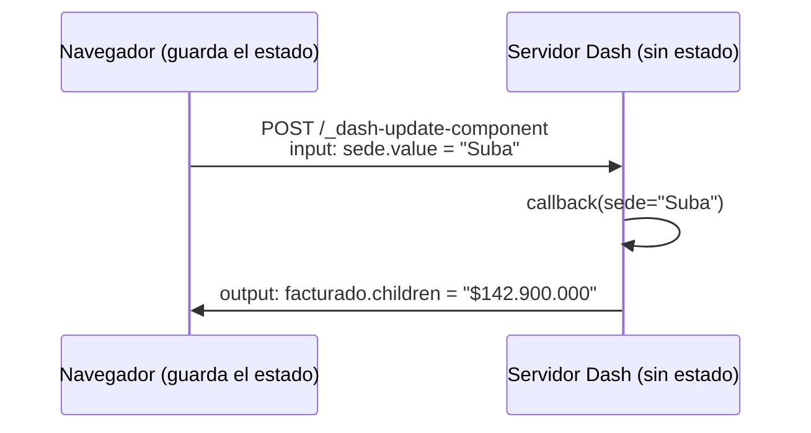

# 📈 ui04 — Dash y los callbacks

> Python para desarrolladores Java senior · **Carta** · Track `ui` — Interfaces y entregables sin
> frontend · sección 4 de 13
> Se lee suelta: no hace falta ninguna otra sección de la carta.
> Versiones verificadas contra PyPI el 05/10/2026 · Código probado el 05/10/2026 con Python 3.14.7,
> en contenedor: las salidas son las de esa corrida.

---

## 🎯 1. Qué problema resuelve

El tablero de cartera creció: ahora lo quieren ver Patricia, Julián y los diez franquiciados, cada uno con su sede, al
mismo tiempo, el lunes a las ocho. En el modelo de Streamlit (`ui03`) cada una de esas sesiones re-ejecuta el script en
el servidor y guarda su estado en la memoria del proceso. Con doce personas alcanza; el día que sean cincuenta, o que el
proceso se reinicie a mitad de la reunión, no.

Dash —de Plotly— resuelve la misma pantalla con un modelo opuesto. **El servidor no guarda nada**: el estado vive en el
navegador, y cada interacción es una petición HTTP que lleva sus entradas y recibe sus salidas. Lo que en Streamlit es "el
script corre de nuevo" en Dash es "esta función corre con estos argumentos": un *callback* que declara qué componentes lee
y cuáles escribe. Cuesta más código y un modelo mental más explícito; a cambio, el servidor se puede replicar detrás de un
balanceador como cualquier API.

---

## 🧠 2. El modelo



| | Streamlit (`ui03`) | Dash |
|---|---|---|
| Qué corre en cada interacción | El script entero | Solo los *callbacks* cuyas entradas cambiaron |
| Dónde vive el estado | En el servidor, por sesión | En el navegador (`dcc.Store`, los propios componentes) |
| Escalar | Sesiones pegadas a un proceso | Varios procesos detrás de un balanceador, sin sesión |
| Probar | `AppTest` | Llamar al *callback* como función, o al *endpoint* HTTP |
| Costo | Muy poco código | Declarar entradas y salidas de cada *callback* |

### 🩻 Esto sí funciona igual

El modelo de Dash es el de una API REST sin estado, que este perfil conoce de memoria: cada petición trae todo lo que
necesita, el servidor no recuerda nada entre peticiones, y por eso cualquier réplica la atiende. Los *callbacks* son
*handlers* con un contrato declarado (`Input`, `Output`, `State`), muy parecidos a un controlador de Spring con sus
parámetros.

---

## 💻 3. El ejemplo que corre

```bash
uv add dash
```

`tablero.py`:

```python
"""El tablero de cartera en Dash: un callback declarado, y el servidor sin estado."""

from dash import Dash, Input, Output, callback, dcc, html

DATA = {"Centro": (187_450_000, 162_300_000), "Suba": (142_900_000, 118_600_000),
        "Kennedy": (98_300_000, 91_200_000)}


def pesos(v: int) -> str:
    return "$" + f"{v:,}".replace(",", ".")


app = Dash(__name__)
app.layout = html.Div([
    html.H1("Cartera por sede"),
    dcc.Dropdown(list(DATA), "Centro", id="sede", clearable=False),
    html.P(id="facturado"),
    html.P(id="recaudo"),
])


@callback(Output("facturado", "children"), Output("recaudo", "children"), Input("sede", "value"))
def show(sede: str):
    billed, collected = DATA[sede]
    return f"Facturado: {pesos(billed)}", f"Recaudo: {collected / billed:.1%}"


if __name__ == "__main__":
    app.run(debug=False)
```

```bash
python3 tablero.py      # http://127.0.0.1:8050
```

`prueba_tablero.py` prueba lo mismo de dos formas: llamando al *callback* como función, y haciendo la petición HTTP que
haría el navegador, con el cliente de pruebas de Flask —el servidor que Dash lleva por dentro—.

```python
"""El callback es una función, y la interacción es un POST sin sesión."""

from tablero import app, show

print("como función:", show("Suba"))

client = app.server.test_client()
for sede in ("Suba", "Kennedy"):
    payload = {
        "output": "..facturado.children...recaudo.children..",
        "outputs": [{"id": "facturado", "property": "children"}, {"id": "recaudo", "property": "children"}],
        "inputs": [{"id": "sede", "property": "value", "value": sede}],
        "changedPropIds": ["sede.value"],
        "state": [],
    }
    response = client.post("/_dash-update-component", json=payload)
    print("por HTTP:    ", response.status_code, response.get_json()["response"])
```

```bash
python3 prueba_tablero.py
```

Salida (Python 3.14.7, 05/10/2026):

```text
como función: ('Facturado: $142.900.000', 'Recaudo: 83.0%')
por HTTP:     200 {'facturado': {'children': 'Facturado: $142.900.000'}, 'recaudo': {'children': 'Recaudo: 83.0%'}}
por HTTP:     200 {'facturado': {'children': 'Facturado: $98.300.000'}, 'recaudo': {'children': 'Recaudo: 92.8%'}}
```

Las dos peticiones HTTP no comparten nada: ni cookie, ni sesión, ni estado en el servidor. Cada una dice "la sede es
Suba" o "la sede es Kennedy" y recibe lo que va en la pantalla. Es la propiedad que permite correr cuatro procesos de este
tablero detrás de un balanceador el lunes a las ocho, y que el reinicio de uno no le borre nada a nadie.

**Detalles con intención**

- **El decorador `@callback` devuelve la misma función**, por eso `show("Suba")` se puede llamar en una prueba sin
  servidor. La lógica del tablero se prueba con `pytest` como cualquier función.
- **El formato del *payload*** (`output` con los dos puntos dobles, `outputs`, `changedPropIds`) es interno de Dash y
  cambia entre versiones. Para pruebas de punta a punta existe `dash[testing]` con un navegador; el `POST` del ejemplo es
  para ver el modelo, no para ponerlo en el CI.
- **`Recaudo: 83.0%`** sale con punto decimal: el formato `:.1%` de Python no sabe de Colombia. Para la pantalla de
  Patricia, `babel` (`tx08`) o el formato del lado del componente.

---

## ⚠️ 4. Lo que se rompe

**El estado en una variable global.** El reflejo de quien viene de Streamlit es guardar algo en un global del módulo para
el siguiente *callback*. Funciona con un proceso y un usuario; con dos usuarios, se pisan; con dos procesos, cada uno ve
otra cosa. El estado va en `dcc.Store` (en el navegador) o en una base.

**Los *callbacks* encadenados en cascada.** El que actualiza la sede dispara el de los planes, que dispara el de los
pacientes. Cada eslabón es un viaje al servidor; cinco eslabones son cinco viajes visibles. Se agrupan salidas en un solo
*callback* cuando dependen de lo mismo.

**Los datos del usuario en el navegador.** Lo que va en `dcc.Store` lo puede leer y cambiar quien usa el navegador. Si el
franquiciado de Suba cambia su sede a "Centro" en el `Store`, el *callback* tiene que verificar en el servidor que puede
verla. Los permisos no se delegan al estado del cliente.

**`debug=True` en producción.** Muestra *tracebacks* con código y variables en el navegador, y recarga al cambiar archivos.

---

## ⚖️ 5. Cuándo NO usarlo

**Para una pantalla de una persona.** Si solo Patricia lo usa, Streamlit lo hace con la mitad del código y sin pensar en
*callbacks*.

**Para un tablero estático que se mira una vez al mes.** Un HTML con gráficos de Plotly generado de noche (`ui08`) no
necesita servidor.

**Si la pantalla es casi toda interacción fina** (arrastrar, editar celdas, atajos de teclado). Dash lo permite con
componentes propios en React, y en ese punto ya se está escribiendo frontend.

---

## 🧪 6. Ejercicios (10)

**🟢 Fácil (1–3)**

1. Agrega un `dcc.Graph` con una barra por sede y resalta la elegida. **Criterio:** la barra cambia de color al cambiar la
   sede.
2. Formatea el recaudo con coma decimal. **Criterio:** `83,0 %` en la pantalla.
3. Escribe la prueba de `show` con `pytest` para las tres sedes. **Criterio:** tres casos, sin servidor.

**🟡 Intermedio (4–6)**

4. Guarda en un `dcc.Store` las sedes marcadas como revisadas. **Criterio:** sobrevive a recargar la página con
   `storage_type="local"`, y explicas qué significa eso para la privacidad.
5. Corre el tablero con `gunicorn` y cuatro procesos (`app.server` es la aplicación WSGI). **Criterio:** diez peticiones
   seguidas, atendidas por procesos distintos, con el mismo resultado.
6. Agrega un control de fecha y un botón "Actualizar" con `State` para que la fecha no dispare el *callback*.
   **Criterio:** cambiar la fecha no produce ninguna petición hasta el clic.

**🟠 Difícil (7–9)**

7. Haz que cada franquiciado solo vea su sede, con la sede tomada del encabezado del proxy de autenticación, no del
   navegador. **Criterio:** cambiar la sede en el `Store` desde las herramientas del navegador no muestra otra sede.
8. Mide la latencia de un *callback* con 50 usuarios simulados contra uno y cuatro procesos. **Criterio:** la tabla con
   las dos medidas.
9. Escribe una prueba de punta a punta con `dash[testing]`. **Criterio:** abre el tablero, elige Suba y verifica el texto.

**🔴 Muy difícil (10)**

10. Compara el tablero de cartera en Streamlit (`ui03`) y en Dash. **Criterio:** una tabla y una página. *Rúbrica:* (a)
    líneas de código de cada uno; (b) memoria con diez sesiones; (c) qué pasa al reiniciar el proceso con usuarios
    conectados; (d) cuál elegirías para Áurea y por qué.

---

## 📚 7. Referencias

**Documentación oficial**

- Dash, *callbacks* básicos: https://dash.plotly.com/basic-callbacks
- Dash, compartir datos entre *callbacks*: https://dash.plotly.com/sharing-data-between-callbacks
- Dash, pruebas: https://dash.plotly.com/testing

**Orden de lectura sugerido:** la página de compartir datos entre *callbacks*, que explica por qué el servidor no guarda
estado y qué hacer en su lugar.

---

## 🚀 8. Cierre

Dash declara cada interacción como un *callback* con entradas y salidas, y deja el estado en el navegador. Cuesta más código
que Streamlit, y compra un servidor sin estado que se replica como una API. Los *callbacks* son funciones que se prueban con
`pytest`, y los permisos se verifican en el servidor, nunca en lo que manda el navegador.

**La señal de que quedó bien:** *"El lunes a las ocho entraron los doce, reiniciamos un proceso a mitad de la reunión y nadie
lo notó."*

> 🏷️ **Cierra la sección con su tag**, cuando los ejercicios que elegiste estén hechos:
>
> ```bash
> git tag -a op-ui-fase-04 -m "op ui04 cerrada: callbacks declarados y un servidor sin estado"
> ```
>
> Los commits llevan su prefijo (`op ui04: …`) y los de ejercicio su número
> (`op ui04 ej07: …`).
