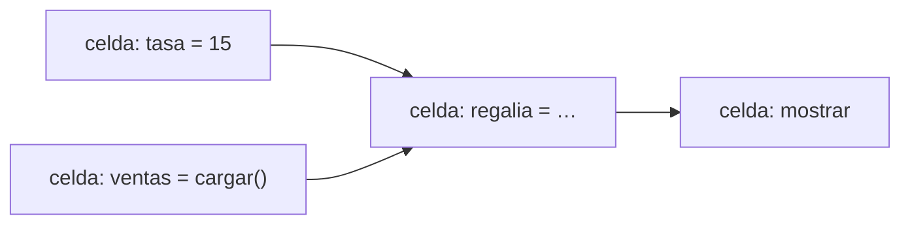

# 📓 ui06 — marimo: el notebook que es una app

> Python para desarrolladores Java senior · **Carta** · Track `ui` — Interfaces y entregables sin
> frontend · sección 6 de 13
> Se lee suelta: no hace falta ninguna otra sección de la carta.
> Versiones verificadas contra PyPI el 05/10/2026 · Código probado el 05/10/2026 con Python 3.14.7,
> en contenedor: las salidas son las de esa corrida.

---

## 🎯 1. Qué problema resuelve

El análisis de la liquidación de regalías de Suba vive en un notebook de Jupyter. Édgar Rojas discute la liquidación cada
trimestre, y este trimestre el número del notebook no coincide con el que se le mandó. Nadie sabe por qué. La explicación,
cuando aparece, es la de siempre: alguien cambió la tasa en la celda 3, corrió la celda 7 pero no la 5, y el resultado que
se copió al correo salió de un estado que ya no se puede reproducir. El notebook muestra el código nuevo y un resultado
calculado con el viejo.

Es el **estado oculto** de Jupyter: el orden en que se ejecutaron las celdas no es el orden en que aparecen, y nada obliga a
que coincidan. marimo es un notebook construido para que eso no pueda pasar. Cada celda declara qué variables define y
cuáles usa, marimo arma con eso un grafo, y **cambiar una celda vuelve a ejecutar todas las que dependen de ella**. Y como
efecto lateral, un notebook de marimo es un archivo `.py` normal: se versiona en git sin ruido, se corre como script y se
publica como aplicación.

---

## 🧠 2. El modelo



| | Jupyter | marimo 0.25.1 |
|---|---|---|
| Archivo | `.ipynb`: JSON con código, salidas e imágenes | `.py`: Python con decoradores |
| Orden de ejecución | El que eligió la persona | El del grafo de dependencias |
| Cambiar una celda | Solo esa celda cambia | Se re-ejecutan las que dependen de ella |
| Definir la misma variable en dos celdas | Permitido: gana la última que corrió | **Error** |
| Diferencias en git | Ilegibles (salidas, metadatos) | Las de un archivo Python |
| Correr sin interfaz | `nbconvert --execute` | `python notebook.py` |
| Publicar como aplicación | Voilà, con otro servidor | `marimo run notebook.py` |

### 🪞 Tu instinto de Java dice… y esta vez se equivoca

Este perfil probablemente desconfía de los notebooks por buenas razones: estado global, sin pruebas, imposible de revisar
en un *pull request*. El instinto concluye que el análisis serio va en un script. marimo ataca exactamente esas tres
razones, y el resultado es más cercano a un script con una interfaz que a un notebook de Jupyter.

---

## 💻 3. El ejemplo que corre

```bash
uv add marimo
```

Primero, el problema. `estado_oculto.py` simula lo que hace Jupyter: un espacio de nombres compartido y celdas que se
ejecutan en el orden que elige una persona.

```python
"""El estado oculto de Jupyter, simulado: celdas que comparten un espacio de nombres."""

cells = {
    "tasa": "tasa = 0.05",
    "ventas": "ventas = 142_900_000",
    "regalia": "regalia = round(ventas * tasa)",
}
ns: dict = {}
for name in ("tasa", "ventas", "regalia"):
    exec(cells[name], ns)
print("primera corrida:", ns["regalia"])

cells["tasa"] = "tasa = 0.045"           # el contrato de Suba dice 4,5 %: se corrige la celda…
exec(cells["tasa"], ns)                  # …y se corre solo esa
print("la celda dice 4,5 %, el resultado es:", ns["regalia"])
```

```bash
python3 estado_oculto.py
```

Salida (Python 3.14.7, 05/10/2026):

```text
primera corrida: 7145000
la celda dice 4,5 %, el resultado es: 7145000
```

La pantalla muestra `tasa = 0.045` y un resultado calculado con el 5 %. Eso es lo que llegó al correo de Édgar.

Ahora el notebook de marimo. Se edita con `marimo edit regalias.py`, que guarda exactamente esto:

`regalias.py`:

```python
import marimo

__generated_with = "0.25.1"
app = marimo.App()


@app.cell
def _():
    tasa = 0.045                       # contrato de franquicia de Suba
    return (tasa,)


@app.cell
def _():
    ventas = 142_900_000
    return (ventas,)


@app.cell
def _(tasa, ventas):
    regalia = round(ventas * tasa)
    print(f"Regalía de Suba: ${regalia:,}".replace(",", "."))
    return (regalia,)


if __name__ == "__main__":
    app.run()
```

```bash
python3 regalias.py                  # como script, sin interfaz
marimo run regalias.py               # como aplicación, solo lectura
```

Salida (Python 3.14.7, 05/10/2026):

```text
Regalía de Suba: $6.430.500
```

Cada celda es una función cuyos parámetros son lo que usa y cuyo `return` es lo que define. En el editor, cambiar `tasa`
re-ejecuta la celda de la regalía sola, porque marimo sabe que depende de ella; el estado de la simulación de arriba no
puede existir.

Y la regla que lo garantiza: dos celdas que definen la misma variable.

`malo.py`:

```python
import marimo

app = marimo.App()


@app.cell
def _():
    tasa = 0.05
    return (tasa,)


@app.cell
def _():
    tasa = 0.045
    return (tasa,)


if __name__ == "__main__":
    app.run()
```

```bash
python3 malo.py
```

Salida (Python 3.14.7, 05/10/2026) (sin el *traceback* intermedio):

```text
critical[multiple-definitions]: Variable 'tasa' is defined in multiple cells
 --> /w/malo.py:7:1
   7 | def _():
   8 |     tasa = 0.05
     |     ^
   9 |     return (tasa,)
   ...
  13 | def _():
  14 |     tasa = 0.045
     |     ^
  15 |     return (tasa,)
hint: Variables must be unique across cells. Alternatively, they can be private with an underscore prefix (i.e. `_tasa`.)
…
marimo._ast.errors.MultipleDefinitionError: This app can't be run because it has multiple definitions of the name tasa
```

En Jupyter, dos celdas que definen `tasa` son normales, y el valor que vale depende de cuál corrió último. En marimo es un
error antes de ejecutar nada, con las dos celdas señaladas. La pista del final es la otra regla del modelo: una variable que
empieza con `_` es privada de su celda y no entra al grafo, que es la forma de usar nombres temporales (`_i`, `_df`) sin
choques.

**Detalles con intención**

- **`return (tasa,)`** es lo que marimo usa para saber qué define cada celda; los parámetros de la función, lo que usa. El
  editor los escribe solo; a mano, se respetan.
- **`python3 regalias.py`** corre el notebook entero en el orden del grafo, sin servidor. Es lo que va en el CI, o en el
  cierre trimestral que produce la liquidación.
- **`marimo run`** sirve el notebook como aplicación de solo lectura: con controles (`mo.ui.slider`, `mo.ui.dropdown`),
  Patricia mueve la tasa y ve la regalía, sin ver el código.

---

## ⚠️ 4. Lo que se rompe

**Mutar un objeto en otra celda.** marimo sigue las **definiciones**, no las mutaciones. Si una celda hace
`ventas_df["total"] = …` sobre un DataFrame definido en otra, marimo no se entera de que cambió, y las celdas que dependen
de él no se re-ejecutan. La regla es crear un objeto nuevo en vez de mutar el de otra celda.

**Notebooks de Jupyter convertidos tal cual.** `marimo convert` traduce un `.ipynb`, y lo que antes era estado oculto aparece
como errores de definición múltiple. Es el punto: los errores son los problemas que el notebook tenía. Se arreglan, no se
silencian.

**Celdas lentas que se re-ejecutan solas.** Cambiar la tasa re-ejecuta la carga de ventas si la carga depende de algo que
cambió. Para cargas costosas, `mo.cache` o una celda que no dependa de los controles.

**El ecosistema de Jupyter.** Extensiones, *kernels* de otros lenguajes, JupyterHub. marimo es Python solamente y su propio
ecosistema; si la casa depende de JupyterHub, la migración es más que cambiar de editor.

---

## ⚖️ 5. Cuándo NO usarlo

**Para un análisis de una vez que nadie va a repetir.** El estado oculto importa cuando el resultado se usa o se repite.
Para explorar datos una tarde, cualquier notebook sirve.

**Como aplicación para muchos usuarios.** `marimo run` es cómodo para Patricia y Julián; para los diez franquiciados con
permisos por sede, las aplicaciones de `ui03`–`ui05` tienen más control.

**Si el equipo vive en JupyterHub con *kernels* de R o Julia.** Ahí Jupyter sigue siendo la plataforma.

---

## 🧪 6. Ejercicios (10)

**🟢 Fácil (1–3)**

1. Corre `marimo edit regalias.py`, cambia la tasa y observa qué celdas se re-ejecutan. **Criterio:** describes cuáles y
   por qué.
2. Corre `python3 malo.py` y copia el mensaje de error completo. **Criterio:** identificas las dos celdas.
3. Convierte la tasa en un `mo.ui.slider` de 3 % a 6 %. **Criterio:** mover el control actualiza la regalía.

**🟡 Intermedio (4–6)**

4. Convierte un notebook de Jupyter tuyo con `marimo convert`. **Criterio:** la lista de errores que aparecieron y qué
   problema real era cada uno.
5. Agrega una celda que mute la lista de ventas definida en otra. **Criterio:** demuestras que la regalía no se actualiza, y
   lo corriges creando un objeto nuevo.
6. Publica el notebook con `marimo run` detrás del proxy de la casa. **Criterio:** Patricia lo abre sin ver código.

**🟠 Difícil (7–9)**

7. Escribe la liquidación trimestral de las dos franquicias identificadas (Suba y Zipaquirá) con datos de prueba, y córrela
   en el CI con `python`. **Criterio:** el CI publica el resultado como artefacto.
8. Usa `mo.cache` en una carga simulada de cinco segundos. **Criterio:** mover el control de tasa no repite la carga.
9. Exporta el notebook a HTML estático con `marimo export html`. **Criterio:** el HTML se abre sin servidor y muestra el
   resultado.

**🔴 Muy difícil (10)**

10. Reproduce la discusión con Édgar: el número del correo contra el del notebook. **Criterio:** una página. *Rúbrica:* (a)
    cómo se reconstruye qué estado produjo el número del correo; (b) por qué con marimo no hubiera pasado, o en qué caso sí
    (las mutaciones); (c) qué se versiona en git y qué no; (d) cómo se adjunta a cada liquidación la evidencia de cómo se
    calculó.

---

## 📚 7. Referencias

**Documentación oficial**

- marimo: https://docs.marimo.io/
- marimo, la ejecución reactiva: https://docs.marimo.io/guides/reactivity/
- marimo, migrar desde Jupyter: https://docs.marimo.io/guides/coming_from/jupyter/

**Lectura**

- Joel Grus, *I don't like notebooks* (JupyterCon 2018), la charla que puso nombre al problema del estado oculto:
  https://www.youtube.com/watch?v=7jiPeIFXb6U

**Orden de lectura sugerido:** la charla de Grus, que es el diagnóstico; después la página de reactividad de marimo, que es
el tratamiento.

---

## 🚀 8. Cierre

El estado oculto de Jupyter es que el orden de ejecución no es el orden de la pantalla. marimo lo elimina con un grafo de
dependencias: cada celda declara lo que usa y lo que define, cambiar una re-ejecuta las que dependen de ella, y definir lo
mismo dos veces es un error. Como premio, el notebook es un `.py` que se versiona, se corre como script y se publica como
aplicación.

**La señal de que quedó bien:** *"Édgar discutió la liquidación, y el notebook que la calculó reprodujo el mismo número en
el CI."*

> 🏷️ **Cierra la sección con su tag**, cuando los ejercicios que elegiste estén hechos:
>
> ```bash
> git tag -a op-ui-fase-06 -m "op ui06 cerrada: el estado oculto de Jupyter y el grafo de marimo"
> ```
>
> Los commits llevan su prefijo (`op ui06: …`) y los de ejercicio su número
> (`op ui06 ej07: …`).
