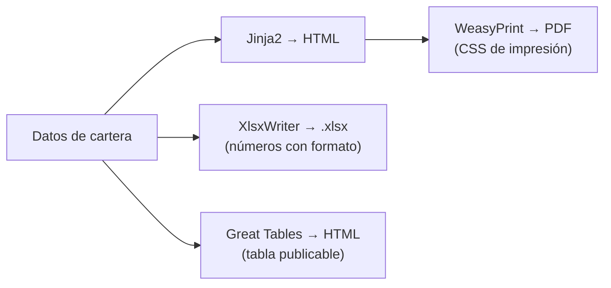

# 🧾 ui08 — Reportes: HTML, PDF y Excel

> Python para desarrolladores Java senior · **Carta** · Track `ui` — Interfaces y entregables sin
> frontend · sección 8 de 13
> Se lee suelta: no hace falta ninguna otra sección de la carta.
> Versiones verificadas contra PyPI el 05/10/2026 · Código probado el 05/10/2026 con Python 3.14.7,
> en contenedor: las salidas son las de esa corrida.

---

## 🎯 1. Qué problema resuelve

El escalón más bajo de la escalera de entregas —el archivo— es el que más se usa en Áurea, y el que peor se hace. El reporte
mensual de cartera le llega a cada franquiciado en dos formas: un **PDF** para leer e imprimir, que tiene que verse igual en
cualquier computador y no se puede alterar sin que se note; y un **Excel** para trabajar, en el que Patricia y Édgar Rojas
filtran, suman y discuten.

Los dos tienen una trampa conocida. El PDF hecho "imprimiendo el HTML desde el navegador" depende del navegador y de quien
imprime. Y el Excel hecho con `to_csv` o escribiendo los montos como texto se ve bien y no suma: Patricia selecciona la
columna y la barra de estado dice "Recuento: 10" en vez de la suma. Esta sección hace los dos bien, desde los mismos datos.

---

## 🧠 2. El modelo



| Salida | Herramienta | La regla |
|---|---|---|
| PDF desde HTML | WeasyPrint 70.0 | El diseño es CSS con `@page`: márgenes, encabezados, números de página |
| Excel nuevo | XlsxWriter 3.2.9 | Los montos son **números con formato de moneda**, nunca texto |
| Excel existente (leer o editar) | `openpyxl` 3.1.5 💤 | XlsxWriter solo escribe; para abrir uno que ya existe, `openpyxl` |
| Tabla para publicar | Great Tables 1.0.0 | Títulos, notas al pie, formatos por columna: la tabla de un informe, no la de un tablero |

### 🪞 Tu instinto de Java dice… y esta vez se equivoca

En Java, los reportes son JasperReports o BIRT: un diseñador visual, un formato propio y un motor. El instinto busca "el
Jasper de Python" y no lo encuentra, porque la respuesta de Python es armar el reporte con piezas que este perfil ya
conoce: una plantilla HTML (`tx02`), CSS para el papel, y una biblioteca que convierte. Sin diseñador, y con todo
versionado en git.

---

## 💻 3. El ejemplo que corre

WeasyPrint necesita Pango del sistema operativo. La imagen completa de Python (`python:3.14.7`) ya lo trae; en una
mínima (`-slim`), en Debian o Ubuntu:

```bash
sudo apt-get install -y libpango-1.0-0 libpangoft2-1.0-0
uv add weasyprint xlsxwriter jinja2 openpyxl
```

`reporte_mensual.py`:

```python
"""El reporte mensual de cartera en PDF (WeasyPrint) y en Excel que suma (XlsxWriter)."""

from jinja2 import Environment
from openpyxl import load_workbook
from weasyprint import HTML
import xlsxwriter

MES = "septiembre de 2026"
ROWS = [("Centro", 187_450_000, 162_300_000, 3_100_000), ("Suba", 142_900_000, 118_600_000, 9_800_000),
        ("Kennedy", 98_300_000, 91_200_000, 1_200_000), ("Zipaquirá", 61_750_000, 52_400_000, 4_450_000)]

# ------------------------------------------------- PDF: plantilla + CSS de impresión
env = Environment(autoescape=True)
env.filters["pesos"] = lambda v: "$" + f"{v:,}".replace(",", ".")
PAGE = env.from_string("""<!doctype html><html lang="es"><meta charset="utf-8"><style>
@page { size: Letter; margin: 2cm; @bottom-right { content: "Página " counter(page) " de " counter(pages); } }
body { font-family: sans-serif; font-size: 10pt; }
td.n { text-align: right; } .alerta { color: #b00020; font-weight: bold; }
</style><h1>Cartera de la red · {{ mes }}</h1><table>
<tr><th>Sede</th><th>Facturado</th><th>Recaudado</th><th>Mora &gt; 90 días</th></tr>
<tr><td>{{ sede }}</td><td class="n">{{ fac | pesos }}</td>
<td class="n">{{ rec | pesos }}</td><td class="n{{ ' alerta' if mora > 4000000 }}">{{ mora | pesos }}</td></tr>
</table></html>""")
document = HTML(string=PAGE.render(mes=MES, rows=ROWS)).render()
document.write_pdf("cartera-2026-09.pdf")
print("PDF:", len(document.pages), "página(s)")

# ------------------------------------------------- Excel: números con formato, y una fórmula
book = xlsxwriter.Workbook("cartera-2026-09.xlsx")
sheet = book.add_worksheet("Cartera")
money = book.add_format({"num_format": '"$"#,##0'})
percent = book.add_format({"num_format": "0.0%"})
bold = book.add_format({"bold": True})
sheet.write_row(0, 0, ["Sede", "Facturado", "Recaudado", "Mora > 90 días", "Recaudo"], bold)
for r, (sede, fac, rec, mora) in enumerate(ROWS, start=1):
    sheet.write(r, 0, sede)
    sheet.write_number(r, 1, fac, money)
    sheet.write_number(r, 2, rec, money)
    sheet.write_number(r, 3, mora, money)
    sheet.write_formula(r, 4, f"=C{r + 1}/B{r + 1}", percent)
total = len(ROWS) + 1
sheet.write(total, 0, "Total", bold)
sheet.write_formula(total, 1, f"=SUM(B2:B{total})", money)
sheet.conditional_format(1, 3, len(ROWS), 3, {"type": "cell", "criteria": ">", "value": 4_000_000,
                                              "format": book.add_format({"font_color": "#B00020"})})
sheet.set_column(0, 0, 12)
sheet.set_column(1, 4, 16)
sheet.autofilter(0, 0, len(ROWS), 4)
sheet.freeze_panes(1, 0)
book.close()

# Verificación: lo que verá Excel en la celda de Suba.
cell = load_workbook("cartera-2026-09.xlsx")["Cartera"]["B3"]
print("Excel B3:", cell.value, type(cell.value).__name__, cell.number_format)
```

```bash
python3 reporte_mensual.py
```

Salida (Python 3.14.7, 05/10/2026):

```text
PDF: 1 página(s)
Excel B3: 142900000 int "$"#,##0
```

Dos archivos desde los mismos datos. El PDF lleva el número de página en el pie, puesto por CSS (`@page`), y la mora alta en
rojo. Y la celda B3 del Excel es el **número** 142 900 000 con formato de moneda: se ve `$142,900,000` o `$142.900.000`
según la configuración del Excel de Patricia, y suma, filtra y entra en una tabla dinámica.

**Detalles con intención**

- **`@page` y `counter(pages)`** son CSS de impresión, que los navegadores implementan a medias y WeasyPrint implementa
  completo: encabezados y pies por página, saltos de página (`break-before: page`), tamaño carta.
- **El formato `"$"#,##0`** usa la coma del formato de Excel, que **no es** el separador que se ve: Excel lo traduce al
  separador de la configuración regional. El mismo archivo se ve con puntos en Bogotá y con comas en Miami.
- **`write_formula`** deja la fórmula viva: si Patricia corrige un recaudo, el porcentaje y el total se recalculan.
  XlsxWriter no calcula el resultado (lo hace Excel al abrir); por eso `openpyxl` leería la fórmula, no el valor.
- **`autofilter` y `freeze_panes`** son lo que Patricia hace a mano cada vez que abre un Excel. Hacerlo en el código es
  la diferencia entre un archivo y una herramienta.

---

## ⚠️ 4. Lo que se rompe

**WeasyPrint sin Pango.** Es una biblioteca de Python con dependencias del sistema operativo. En `python:3.14.7-slim`, el
`import` falla con `OSError: cannot load library 'libgobject-2.0-0'` —una biblioteca de GLib, que el mensaje no relaciona
con Pango—, y los dos paquetes de arriba lo resuelven, comprobado en esa imagen. Se instalan los paquetes del sistema en el `Dockerfile`
y se documentan; en Windows, es más difícil y conviene correrlo en un contenedor.

**Los montos como texto.** `sheet.write(r, 1, "$142.900.000")` se ve igual y no es un número: Excel lo alinea a la
izquierda, no suma, y a veces pone un triángulo verde. Es el error más común de los reportes de Excel generados, y el que
más tiempo le cuesta a quien los recibe.

**El PDF que depende de fuentes del servidor.** Si el CSS pide una fuente que el servidor no tiene, WeasyPrint usa otra y
el PDF cambia de aspecto entre la máquina del ingeniero y producción. Las fuentes se instalan o se incrustan con
`@font-face`.

**`openpyxl` para escribir reportes grandes.** Funciona, y con cien mil filas consume mucha más memoria que XlsxWriter. Para
escribir, XlsxWriter; para leer o modificar uno existente, `openpyxl` (sin versiones nuevas desde junio de 2024, 💤).

---

## ⚖️ 5. Cuándo NO usarlo

**PDF cuando el destinatario va a trabajar los datos.** Un franquiciado que copia números de un PDF a un Excel es una
señal de que el PDF sobraba.

**WeasyPrint para documentos de cientos de páginas con diseño editorial.** Para libros o catálogos, LaTeX, Typst o un
motor dedicado manejan mejor la tipografía y el rendimiento.

**Excel como base de datos.** El reporte se genera desde la base; si alguien empieza a editar el Excel y a mandarlo de vuelta
como fuente, el archivo dejó de ser un reporte. Eso es una entrada de datos (`ar05`), con su validación.

---

## 🧪 6. Ejercicios (10)

**🟢 Fácil (1–3)**

1. Abre el `.xlsx`, selecciona la columna de facturado y mira la barra de estado. **Criterio:** muestra la suma; luego
   cambia `write_number` por `write` con texto y reporta la diferencia.
2. Agrega un encabezado de página al PDF con `@top-center`. **Criterio:** aparece en todas las páginas.
3. Agrega al Excel una fila de total para cada columna de montos. **Criterio:** son fórmulas, no números calculados en
   Python.

**🟡 Intermedio (4–6)**

4. Genera un PDF por sede con un salto de página entre sedes. **Criterio:** una sede por página, con su título.
5. Haz la tabla del reporte con Great Tables, con título, nota al pie y formato de moneda. **Criterio:** se exporta a HTML y
   se incrusta en el PDF.
6. Pon un `Dockerfile` que instale Pango y genere el PDF. **Criterio:** el PDF sale igual en tu máquina y en el contenedor
   (compara las fuentes con `pdffonts`).

**🟠 Difícil (7–9)**

7. Genera un Excel de 200 000 filas con XlsxWriter (`constant_memory`) y con `openpyxl`. **Criterio:** memoria y tiempo de
   cada uno, medidos.
8. Firma el PDF o calcula y publica su hash para que una alteración se note. **Criterio:** cambiar un byte del PDF hace
   fallar la verificación.
9. Agrega al Excel una hoja con una tabla dinámica o, si la biblioteca no la permite, una tabla de Excel (`add_table`) con
   totales. **Criterio:** Patricia la filtra sin configurar nada.

**🔴 Muy difícil (10)**

10. Diseña el paquete de reportes mensuales de Áurea. **Criterio:** una página y el código. *Rúbrica:* (a) qué va en PDF y
    qué en Excel, por destinatario; (b) cómo se garantiza que los números de los dos coinciden; (c) dónde viven el diseño
    y las fuentes; (d) cómo se prueba que el PDF no cambió de aspecto entre versiones.

---

## 📚 7. Referencias

**Documentación oficial**

- WeasyPrint: https://doc.courtbouillon.org/weasyprint/stable/
- XlsxWriter: https://xlsxwriter.readthedocs.io/
- XlsxWriter, formatos de número: https://xlsxwriter.readthedocs.io/format.html#set_num_format
- Great Tables: https://posit-dev.github.io/great-tables/
- `openpyxl`: https://openpyxl.readthedocs.io/en/stable/

**Orden de lectura sugerido:** la página de formatos de XlsxWriter, que es la que evita los montos como texto; después la
sección de CSS de impresión de WeasyPrint.

---

## 🚀 8. Cierre

El reporte en PDF es HTML de una plantilla con CSS de impresión, convertido por WeasyPrint (que necesita Pango del sistema).
El reporte en Excel son números con formato, fórmulas vivas, filtros y la primera fila fija, escritos con XlsxWriter. Los dos
salen de los mismos datos, y ninguno lleva un monto como texto.

**La señal de que quedó bien:** *"Patricia seleccionó la columna del Excel y la barra de estado le mostró la suma; Édgar
imprimió el PDF y salió con el número de página."*

> 🏷️ **Cierra la sección con su tag**, cuando los ejercicios que elegiste estén hechos:
>
> ```bash
> git tag -a op-ui-fase-08 -m "op ui08 cerrada: PDF con CSS de impresión y Excel que suma"
> ```
>
> Los commits llevan su prefijo (`op ui08: …`) y los de ejercicio su número
> (`op ui08 ej07: …`).
