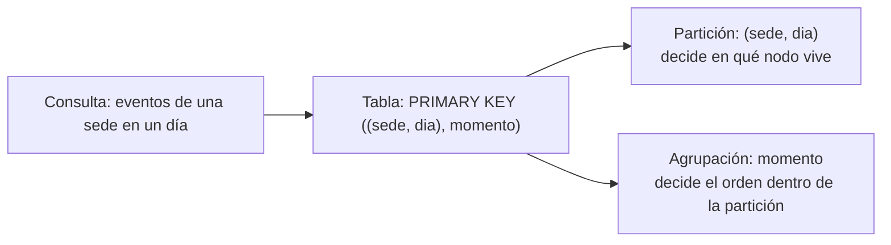

# 🧊 db08 — Columnar ancho: Cassandra y ScyllaDB

> Python para desarrolladores Java senior · **Carta** · Track `db` — Hablarle a cada sistema de
> datos desde Python · sección 8 de 15
> Se lee suelta: no hace falta ninguna otra sección de la carta.
> Versiones verificadas contra PyPI el 05/10/2026 · Código probado el 05/10/2026 con Python 3.14.7,
> en contenedor: las salidas son las de esa corrida.

---

## 🎯 1. Qué problema resuelve

Áurea no necesita Cassandra. La plataforma de mensajería con la que manda los recordatorios por WhatsApp sí la usa: guarda
cada evento de cada mensaje —enviado, entregado, leído— de miles de clientes, y le da a Áurea acceso de lectura a su parte.
Para conciliar qué recordatorios llegaron, el ingeniero va a consultar esas tablas desde Python, y va a escribir su primera
consulta como la escribiría en Postgres. No va a funcionar.

Cassandra y ScyllaDB (su reimplementación en C++, compatible en protocolo) se hablan desde Python con **`cassandra-driver`**
(de DataStax) o **`scylla-driver`** (su bifurcación). El *driver* es lo de menos: sesión, `prepare`, `execute`. Lo que cambia
todo es el modelo, que esta sección muestra con tres errores: **la tabla se diseña para una consulta**, la **clave de
partición** tiene que ir en el `WHERE`, y el **orden** lo fija la tabla, no el `ORDER BY`.

---

## 🧠 2. El modelo



| En Postgres | En Cassandra |
|---|---|
| Una tabla por entidad; las consultas se escriben después | **Una tabla por consulta**; los datos se duplican a propósito |
| `WHERE` sobre cualquier columna, con o sin índice | `WHERE` con **toda la clave de partición**; si no, error (o `ALLOW FILTERING`, que recorre todo) |
| `ORDER BY` cualquier columna | Solo por las columnas de agrupación, en el orden declarado |
| `JOIN` | No existe |
| Transacciones | Escrituras por fila; lotes con garantías limitadas |

| *Driver* | Versión |
|---|---|
| `cassandra-driver` | 3.30.1 |
| `scylla-driver` | 3.29.12 |

### 🪞 Tu instinto de Java dice… y esta vez se equivoca

Con el *driver* de Java de DataStax, este perfil quizás usó Spring Data Cassandra con `@Table` y repositorios, y esperó que
`findByMotivo` funcionara como en JPA. Funciona en el código y falla en el servidor, porque `motivo` no es parte de la clave.
El instinto de "primero las entidades, después las consultas" es exactamente el que Cassandra castiga.

---

## 💻 3. El ejemplo que corre

```bash
uv add cassandra-driver
```

`mensajeria.py`:

```python
"""Cassandra desde Python: la tabla diseñada para una consulta, y las consultas que no acepta."""

import datetime as dt
import os
import time

from cassandra import ConsistencyLevel, InvalidRequest
from cassandra.cluster import Cluster, NoHostAvailable
from cassandra.query import SimpleStatement

for _ in range(120):                                        # Cassandra tarda en arrancar
    try:
        cluster = Cluster([os.environ.get("AUREA_CASSANDRA", "cassandra")])
        session = cluster.connect()
        break
    except NoHostAvailable:
        time.sleep(2)
print("servidor:", session.execute("SELECT release_version FROM system.local").one().release_version)

session.execute("""CREATE KEYSPACE IF NOT EXISTS mensajeria
                   WITH replication = {'class': 'SimpleStrategy', 'replication_factor': 1}""")
session.set_keyspace("mensajeria")
session.execute("""CREATE TABLE IF NOT EXISTS evento_por_sede_dia (
                       sede text, dia date, momento timestamp, mensaje uuid, estado text,
                       PRIMARY KEY ((sede, dia), momento, mensaje)
                   ) WITH CLUSTERING ORDER BY (momento DESC, mensaje ASC)""")

insert = session.prepare("INSERT INTO evento_por_sede_dia (sede, dia, momento, mensaje, estado) "
                         "VALUES (?, ?, ?, uuid(), ?)")
insert.consistency_level = ConsistencyLevel.LOCAL_QUORUM
day = dt.date(2026, 10, 5)
for i in range(300):
    moment = dt.datetime(2026, 10, 5, 7, tzinfo=dt.UTC) + dt.timedelta(minutes=2 * i)
    session.execute(insert, ("Suba", day, moment, ["enviado", "entregado", "leído"][i % 3]))

# La consulta para la que se diseñó la tabla: toda la clave de partición, orden de la tabla.
rows = session.execute("SELECT momento, estado FROM evento_por_sede_dia WHERE sede = %s AND dia = %s LIMIT 3",
                       ("Suba", day))
print("últimos tres de Suba hoy:", [(r.momento.strftime("%H:%M"), r.estado) for r in rows])

# Paginación: el driver trae de a 100 filas y pide más al iterar.
paged = SimpleStatement("SELECT estado FROM evento_por_sede_dia WHERE sede = %s AND dia = %s", fetch_size=100)
result = session.execute(paged, ("Suba", day))
print("primera página:", len(result.current_rows), "filas · total al iterar:", sum(1 for _ in result))

# Las consultas de Postgres que Cassandra no acepta.
for cql in ("SELECT * FROM evento_por_sede_dia WHERE estado = 'leído'",
            "SELECT * FROM evento_por_sede_dia WHERE sede = 'Suba' AND dia = '2026-10-05' ORDER BY estado"):
    try:
        session.execute(cql)
    except InvalidRequest as e:
        print("rechazada:", str(e).split("message=")[-1][:110])
cluster.shutdown()
```

```bash
docker run -d --name aurea-cassandra -e MAX_HEAP_SIZE=512M -e HEAP_NEWSIZE=128M -p 9042:9042 cassandra:5.0
AUREA_CASSANDRA=127.0.0.1 python3 mensajeria.py
```

Salida (Python 3.14.7, 05/10/2026):

```text
servidor: 5.0.9
últimos tres de Suba hoy: [('16:58', 'leído'), ('16:56', 'entregado'), ('16:54', 'enviado')]
primera página: 100 filas · total al iterar: 300
rechazada: "Cannot execute this query as it might involve data filtering and thus may have unpredictable performance. If 
rechazada: "Order by is currently only supported on the clustered columns of the PRIMARY KEY, got estado"
```

La consulta para la que se diseñó la tabla devuelve los tres últimos eventos de Suba ya ordenados, sin ordenar nada. La paginación
trajo 100 filas y el resto al iterar. Y las dos consultas que en Postgres serían triviales —filtrar por `estado`, ordenar por
`estado`— el servidor las rechaza antes de ejecutar: la primera porque `estado` no es parte de la clave, la segunda porque el orden
de la partición ya está fijado.

**Detalles con intención**

- **`PRIMARY KEY ((sede, dia), momento, mensaje)`**: los dobles paréntesis son la clave de partición —todos los eventos de una
  sede en un día viven juntos, en un nodo—; lo demás ordena dentro de la partición. Incluir el día evita que la partición de una
  sede crezca para siempre.
- **`CLUSTERING ORDER BY (momento DESC)`** hace que "los últimos" sean los primeros sin ordenar nada: el orden está en el disco.
- **`session.prepare`** se usa para todo lo que se repite: el servidor analiza la consulta una vez y el *driver* sabe a qué nodo
  mandar cada fila. El marcador en las preparadas es `?`; en las simples, `%s`.
- **`fetch_size=100`**: el resultado no viene entero, viene por páginas; iterarlo pide las siguientes. `current_rows` es solo la
  página actual.

---

## ⚠️ 4. Lo que se rompe

**`ALLOW FILTERING` para "arreglar" la consulta.** El mensaje del servidor lo sugiere, y funciona en desarrollo con trescientas filas.
En producción recorre todas las particiones de todos los nodos. La consulta que necesita filtrar por `estado` necesita **otra tabla**
con `estado` en la clave, escrita al mismo tiempo que la primera.

**Particiones sin límite.** Una tabla con `PRIMARY KEY (sede, momento)` pone todos los eventos de una sede, de todos los años, en una
sola partición. Crece hasta que el nodo no puede con ella. La clave de partición incluye un "balde" de tiempo (día, mes).

**Las fechas.** `timestamp` vuelve como `datetime` **ingenuo** en UTC, y el tipo `date` de Cassandra vuelve como un objeto propio del
*driver* (`cassandra.util.Date`), no como `datetime.date`. Se convierten al leer.

**El *driver* y las versiones de Python.** `cassandra-driver` tiene extensiones en C opcionales y su propio *event loop*; en versiones
nuevas de Python conviene verificar que hay ruedas, o se instala sin las extensiones y es más lento.

---

## ⚖️ 5. Cuándo NO usarlo

**Para casi todo en Áurea.** Cassandra se justifica con volúmenes de escritura enormes y la necesidad de varios centros de datos. Áurea
no tiene ninguna de las dos.

**Cuando las consultas no se conocen de antemano.** El análisis exploratorio ("¿y si cruzamos por motivo?") es lo contrario del modelo
de Cassandra: los datos se exportan a DuckDB (`db05`) y se exploran ahí.

**Para datos con relaciones y totales que tienen que cuadrar.** Postgres.

---

## 🧪 6. Ejercicios (10)

**🟢 Fácil (1–3)**

1. Agrega `ALLOW FILTERING` a la primera consulta rechazada. **Criterio:** funciona, y explicas en dos oraciones qué hizo el servidor.
2. Lee una fila y muestra el tipo de `dia`. **Criterio:** el tipo exacto y cómo lo conviertes a `datetime.date`.
3. Cambia `fetch_size` a 1 000. **Criterio:** cuántas filas trae la primera página y por qué.

**🟡 Intermedio (4–6)**

4. Diseña la tabla para la consulta "mensajes leídos de una sede en un día". **Criterio:** la consulta funciona sin `ALLOW FILTERING`.
5. Escribe en las dos tablas a la vez con un `BatchStatement` *logged*. **Criterio:** describes qué garantiza y qué no.
6. Lee con consistencia `ONE` y con `QUORUM` en un nodo. **Criterio:** explicas por qué en un nodo da igual, y cuándo no.

**🟠 Difícil (7–9)**

7. Levanta tres nodos (o ScyllaDB) y apaga uno durante las escrituras con `LOCAL_QUORUM` y factor de replicación 3. **Criterio:** las
   escrituras siguen; con dos nodos caídos, fallan.
8. Mide inserciones con `execute` en bucle contra `execute_concurrent_with_args`. **Criterio:** la tabla de tiempos para 50 000 filas.
9. Exporta una partición a Parquet y explórala con DuckDB. **Criterio:** la consulta por `estado` corre en DuckDB.

**🔴 Muy difícil (10)**

10. Diseña la conciliación de recordatorios con la plataforma de mensajería. **Criterio:** una página. *Rúbrica:* (a) qué consultas
    necesita Áurea y qué tablas le pide al operador; (b) cómo se paginan las lecturas; (c) cómo se convierten fechas; (d) qué se
    concilia en Áurea y dónde.

---

## 📚 7. Referencias

**Documentación oficial**

- `cassandra-driver`: https://docs.datastax.com/en/developer/python-driver/latest/
- Cassandra, modelado de datos: https://cassandra.apache.org/doc/latest/cassandra/developing/data-modeling/index.html
- ScyllaDB University (cursos gratuitos de modelado): https://university.scylladb.com/

**Orden de lectura sugerido:** la sección de modelado de datos de la documentación de Cassandra —la clave del tema—; después el
*driver*.

---

## 🚀 8. Cierre

A Cassandra se le habla desde Python con `cassandra-driver`: sesión, `prepare`, consistencia y páginas. Lo que cambia es el modelo:
una tabla por consulta, la clave de partición completa en el `WHERE`, y el orden fijado en la tabla. `ALLOW FILTERING` no es la
solución: otra tabla lo es.

**La señal de que quedó bien:** *"La conciliación de recordatorios lee una partición por sede y día, y ninguna consulta lleva
`ALLOW FILTERING`."*

> 🏷️ **Cierra la sección con su tag**, cuando los ejercicios que elegiste estén hechos:
>
> ```bash
> git tag -a op-db-fase-08 -m "op db08 cerrada: la tabla por consulta, la clave de partición y las páginas"
> ```
>
> Los commits llevan su prefijo (`op db08: …`) y los de ejercicio su número
> (`op db08 ej07: …`).
