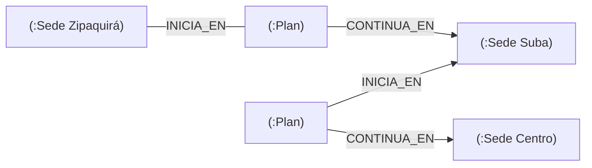

# 🕸️ db09 — Grafo: Neo4j

> Python para desarrolladores Java senior · **Carta** · Track `db` — Hablarle a cada sistema de
> datos desde Python · sección 9 de 15
> Se lee suelta: no hace falta ninguna otra sección de la carta.
> Versiones verificadas contra PyPI el 05/10/2026 · Código probado el 05/10/2026 con Python 3.14.7,
> en contenedor: las salidas son las de esa corrida.

---

## 🎯 1. Qué problema resuelve

El Dr. Édgar Rojas, franquiciado de Suba, es ortodoncista y no tiene rehabilitador oral: hace la fase 1 de los planes
integrales y deriva la fase 3 al Centro. Esos casos compartidos son los que discute en cada liquidación trimestral, y con los
años la red de derivaciones creció: Zipaquirá deriva a Suba, Suba al Centro, algunas sedes propias se derivan entre sí. La
pregunta "¿por qué sedes pasó este plan, y cuánto le toca a cada una?" es un recorrido por una red.

En SQL esa pregunta se responde con *joins* recursivos que nadie quiere mantener. En una base de grafos es la operación básica.
Neo4j se habla desde Python con el *driver* oficial, **`neo4j`**, en Cypher, su lenguaje de consultas. La sección muestra lo que
hay que saber desde Python —`execute_query`, los parámetros, los tipos que devuelve— y la trampa del modelo: **el recorrido es
barato cuando arranca de un nodo que se encuentra por índice**, y un recorrido que empieza buscando sin índice examina todo.

---

## 🧠 2. El modelo



| Pieza | En Neo4j | Desde Python |
|---|---|---|
| Consulta | Cypher: `MATCH (s:Sede {nombre: $sede})<-[:INICIA_EN]-(p)` | `driver.execute_query(cypher, sede="Suba")` |
| Parámetros | `$nombre` | Argumentos con nombre, o `parameters_=` |
| Resultado | Registros con claves | `records, summary, keys` |
| Fechas y horas | Tipos de Neo4j | **`neo4j.time.DateTime`**, no `datetime` (se convierte con `.to_native()`) |
| Índices | `CREATE INDEX FOR (p:Plan) ON (p.codigo)` | — |

| *Driver* | Versión | Nota |
|---|---|---|
| `neo4j` | 6.4.0 | El oficial |
| `py2neo` | 2021.2.4 💤 | Abandonado; aparece en tutoriales viejos |

### 🪞 Tu instinto de Java dice… y esta vez se equivoca

Con el *driver* de Java o Spring Data Neo4j, los resultados se mapean a entidades. El instinto de Python espera diccionarios con
tipos de Python, y casi lo consigue: los nodos se comportan como diccionarios, pero las fechas llegan como `neo4j.time.DateTime`,
que no es un `datetime` y falla en cualquier función que espere uno.

---

## 💻 3. El ejemplo que corre

```bash
uv add neo4j
```

`derivaciones.py`:

```python
"""Neo4j desde Python: las derivaciones entre sedes, el índice que hace barato el recorrido, y los tipos."""

import os
import random
import time

from neo4j import GraphDatabase
from neo4j.exceptions import ServiceUnavailable

URI = os.environ.get("AUREA_NEO4J", "neo4j://neo4j:7687")
driver = GraphDatabase.driver(URI, auth=("neo4j", "aurea-local-2026"))
for _ in range(60):
    try:
        driver.verify_connectivity()
        break
    except ServiceUnavailable:
        time.sleep(2)

SEDES = ["Centro", "Chapinero", "Suba", "Kennedy", "Usaquén", "Engativá", "Fontibón", "Restrepo", "Soacha", "Zipaquirá"]
DERIVA = {"Suba": "Centro", "Zipaquirá": "Suba", "Soacha": "Kennedy"}           # quién deriva la fase 3 a quién
random.seed(3)
plans = []
for i in range(20_000):
    start = random.choice(SEDES)
    plans.append({"codigo": f"PL-{i:05d}", "inicia": start, "continua": DERIVA.get(start) if i % 2 else None})

driver.execute_query("MATCH (n) DETACH DELETE n")
driver.execute_query("UNWIND $sedes AS nombre CREATE (:Sede {nombre: nombre})", sedes=SEDES)
driver.execute_query("""
    UNWIND $plans AS p
    MATCH (i:Sede {nombre: p.inicia})
    CREATE (pl:Plan {codigo: p.codigo, creado: datetime('2026-09-01T10:00:00-05:00')})-[:INICIA_EN]->(i)
    WITH pl, p WHERE p.continua IS NOT NULL
    MATCH (c:Sede {nombre: p.continua})
    CREATE (pl)-[:CONTINUA_EN]->(c)
""", plans=plans)

# La pregunta de la liquidación: ¿a dónde deriva Suba, y cuántos planes?
records, summary, keys = driver.execute_query("""
    MATCH (:Sede {nombre: $sede})<-[:INICIA_EN]-(p:Plan)-[:CONTINUA_EN]->(d:Sede)
    RETURN d.nombre AS destino, count(p) AS planes
""", sede="Suba")
print("derivaciones de Suba:", [r.data() for r in records], f"en {summary.result_available_after} ms")

# El recorrido que empieza en un plan: sin índice, buscarlo examina todos.
LOOKUP = "PROFILE MATCH (p:Plan {codigo: $codigo})-[:INICIA_EN|CONTINUA_EN]->(s) RETURN s.nombre"


def db_hits(plan) -> int:
    return plan["dbHits"] + sum(db_hits(child) for child in plan.get("children", []))


_, before, _ = driver.execute_query(LOOKUP, codigo="PL-12345")
driver.execute_query("CREATE INDEX plan_codigo IF NOT EXISTS FOR (p:Plan) ON (p.codigo)")
driver.execute_query("CALL db.awaitIndexes()")
records, after, _ = driver.execute_query(LOOKUP, codigo="PL-12345")
print("sedes de PL-12345:", [r["s.nombre"] for r in records])
print("accesos a la base: sin índice", db_hits(before.profile), "· con índice", db_hits(after.profile))

# Los tipos: la fecha no es un datetime.
created = driver.execute_query("MATCH (p:Plan {codigo: 'PL-00001'}) RETURN p.creado AS c").records[0]["c"]
print("tipo de la fecha:", type(created).__module__ + "." + type(created).__name__, "→", repr(created.to_native()))
driver.close()
```

```bash
docker run -d --name aurea-neo4j -e NEO4J_AUTH=neo4j/aurea-local-2026 -p 7687:7687 neo4j:2026.09.0-community
AUREA_NEO4J=neo4j://localhost:7687 python3 derivaciones.py
```

Salida (Python 3.14.7, 05/10/2026):

```text
derivaciones de Suba: [{'destino': 'Centro', 'planes': 960}] en 193 ms
sedes de PL-12345: ['Usaquén']
accesos a la base: sin índice 40004 · con índice 5
tipo de la fecha: neo4j.time.DateTime → datetime.datetime(2026, 9, 1, 10, 0, tzinfo=pytz.FixedOffset(-300))
```

La pregunta de la liquidación se responde con un recorrido: 960 planes de Suba siguieron en el Centro. Encontrar un plan por su
código sin índice costó 40 004 accesos a la base —dos por cada uno de los veinte mil planes—; con el índice, 5. El recorrido desde
ese plan es igual de barato en los dos casos: lo caro era encontrar dónde empezar. Y la fecha llegó como `neo4j.time.DateTime`,
que `.to_native()` convierte a un `datetime` con su zona… de `pytz`, que el *driver* todavía usa por dentro.

**Detalles con intención**

- **`neo4j://` hace enrutamiento** (pregunta al servidor por la topología del clúster); mientras el servidor arranca, los reintentos de
  `verify_connectivity` escriben `Unable to retrieve routing information` en la salida de error. Con un solo servidor, `bolt://` no
  enruta y no los escribe.
- **`execute_query`** es la API corta del *driver* desde la versión 5: abre la sesión, ejecuta en una transacción con reintentos,
  y devuelve registros, resumen y claves. Para varias consultas en una transacción, `driver.session()` y `execute_write`.
- **`UNWIND $plans`** manda veinte mil planes en una consulta. Una consulta por plan es veinte mil viajes de ida y vuelta.
- **`PROFILE`** ejecuta la consulta y cuenta los accesos a la base (`dbHits`) de cada operador. Es el `explain()` de MongoDB
  (`db07`) y el `EXPLAIN ANALYZE` de Postgres.
- **El recorrido desde la sede no necesita índice** para ser barato en este ejemplo porque hay diez sedes; con miles, `Sede.nombre`
  también lleva índice. La regla es la misma: el recorrido empieza en un nodo que se encuentra por índice.

---

## ⚠️ 4. Lo que se rompe

**Concatenar valores en el Cypher.** `f"MATCH (s:Sede {{nombre: '{sede}'}})"` es inyección, igual que en SQL, y además impide que
Neo4j reutilice el plan de la consulta. Los valores van como parámetros `$sede`.

**Las fechas de Neo4j en el resto del programa.** `neo4j.time.DateTime` pasado a `json.dumps`, a Pydantic o a una comparación con un
`datetime` falla. Se convierte con `.to_native()` en el borde, al leer.

**`py2neo` en un proyecto heredado.** Está abandonado y no soporta las versiones recientes de Neo4j. Se migra al *driver* oficial.

**Usar el grafo para todo.** Una vez que los datos están en Neo4j, la tentación es guardar ahí también los abonos y la agenda. Un
grafo responde recorridos; las sumas de cartera las responde mejor Postgres.

---

## ⚖️ 5. Cuándo NO usarlo

**Si la red tiene dos niveles y no crece.** "Qué planes de Suba siguieron en el Centro" es un *join* en Postgres. El grafo se justifica
cuando los recorridos tienen profundidad variable o desconocida.

**Para una consulta al año.** Exportar a Neo4j para responder una vez una pregunta de recorrido es más caro que un `WITH RECURSIVE`
de Postgres escrito una vez.

**Como base principal de una aplicación transaccional pequeña.** Por las mismas razones que con MongoDB (`db07`).

---

## 🧪 6. Ejercicios (10)

**🟢 Fácil (1–3)**

1. Corre el ejemplo. **Criterio:** los accesos a la base con y sin índice, y la razón entre ellos.
2. Imprime `summary.counters` después de la carga. **Criterio:** cuántos nodos y relaciones se crearon.
3. Pasa la fecha del plan a `json.dumps` sin convertir. **Criterio:** el error exacto.

**🟡 Intermedio (4–6)**

4. Responde "¿por qué sedes pasaron los planes que empezaron en Zipaquirá?" con un recorrido de longitud variable
   (`-[:CONTINUA_EN*]->`). **Criterio:** la consulta y su resultado.
5. Escribe la misma pregunta de la derivación de Suba en Postgres con un `JOIN`. **Criterio:** las dos dan el mismo número.
6. Usa `driver.session()` y `execute_write` para crear un plan y su derivación en una sola transacción. **Criterio:** si la segunda parte
   falla, no queda el plan suelto.

**🟠 Difícil (7–9)**

7. Convierte los registros a un `DataFrame` de pandas o Polars (`records` → lista de diccionarios). **Criterio:** las fechas llegan
   convertidas.
8. Mide la carga de 20 000 planes con `UNWIND` y con una consulta por plan. **Criterio:** la tabla de tiempos.
9. Escribe la liquidación: para cada plan compartido, el porcentaje que le toca a cada sede, recorriendo el grafo. **Criterio:** los
   porcentajes de cada plan suman 100.

**🔴 Muy difícil (10)**

10. Decide si las derivaciones de Áurea van en Neo4j o en Postgres. **Criterio:** una página. *Rúbrica:* (a) la profundidad real de las
    derivaciones; (b) las consultas que se necesitan, escritas en los dos; (c) lo que cuesta operar Neo4j; (d) la señal que haría
    cambiar la decisión.

---

## 📚 7. Referencias

**Documentación oficial**

- *Driver* de Python de Neo4j: https://neo4j.com/docs/python-manual/current/
- Cypher: https://neo4j.com/docs/cypher-manual/current/introduction/
- Neo4j, tipos de datos en el *driver* de Python: https://neo4j.com/docs/python-manual/current/data-types/

**Orden de lectura sugerido:** la página de tipos de datos del *driver* (corta, y evita el error de las fechas); después la
introducción a Cypher.

---

## 🚀 8. Cierre

A Neo4j se le habla desde Python con el *driver* oficial y `execute_query`, con Cypher y parámetros `$`. Los recorridos son su fuerte
cuando arrancan de un nodo que se encuentra por índice —`PROFILE` lo muestra—, y las fechas llegan con tipos propios que se convierten
en el borde.

**La señal de que quedó bien:** *"La pregunta de Édgar sobre por qué sedes pasó su plan se responde con una consulta, y el número
coincide con la liquidación."*

> 🏷️ **Cierra la sección con su tag**, cuando los ejercicios que elegiste estén hechos:
>
> ```bash
> git tag -a op-db-fase-09 -m "op db09 cerrada: execute_query, PROFILE con índice y los tipos de Neo4j"
> ```
>
> Los commits llevan su prefijo (`op db09: …`) y los de ejercicio su número
> (`op db09 ej07: …`).
