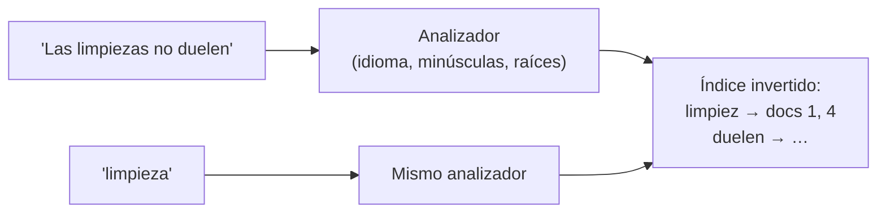

# 🔎 db12 — Búsqueda: OpenSearch y Meilisearch

> Python para desarrolladores Java senior · **Carta** · Track `db` — Hablarle a cada sistema de
> datos desde Python · sección 12 de 15
> Se lee suelta: no hace falta ninguna otra sección de la carta.
> Versiones verificadas contra PyPI el 05/10/2026 · Código probado el 05/10/2026 con Python 3.14.7,
> en contenedor: las salidas son las de esa corrida.

---

## 🎯 1. Qué problema resuelve

Las respuestas aprobadas por Marcela para WhatsApp (`db11`) también se buscan por palabras: la recepcionista escribe
"limpiezas" o "cuotas" y espera ver las respuestas que hablan de eso, aunque digan "limpieza" en singular o ella escriba
"limpiesa" con prisa y con los guantes puestos. Un `ILIKE '%limpiezas%'` en Postgres no encuentra "limpieza", no perdona
el error de tipeo y no ordena por relevancia.

Eso es búsqueda de texto completo, y tiene motores dedicados: **OpenSearch** (la bifurcación abierta de Elasticsearch, con su
cliente `opensearch-py`), **Meilisearch** y **Typesense** (más simples, pensados para búsqueda tipo "mientras escribes"). Esta
sección muestra lo que hay que saber desde Python, y las dos ideas que cambian respecto de una base de datos: el texto pasa por
un **analizador** que decide qué palabras se indexan, y **el índice es una estructura aparte** que se alimenta y que no ve un
documento en el instante en que se escribe.

---

## 🧠 2. El modelo



| | OpenSearch 3.8 | Meilisearch 1.54 | Postgres (`tsvector`) |
|---|---|---|---|
| Desde Python | `opensearch-py` 3.2.0 | `meilisearch` 0.43.0 | `psycopg` |
| Analizador por idioma | Sí (`spanish`: raíces, palabras vacías) | Automático por idioma detectado | Sí (`spanish`) |
| Errores de tipeo | Si se pide (`fuzziness`) | **Por defecto** | No (con `pg_trgm`, aparte) |
| Cuándo se ve un documento nuevo | Tras el *refresh* (≈ 1 s por defecto) | Cuando termina la **tarea** asíncrona | Al confirmar la transacción |
| Operarlo | Pesado: JVM, memoria, clúster | Liviano: un binario | Ya está |

### 🪞 Tu instinto de Java dice… y esta vez se equivoca

Este perfil probablemente usó Elasticsearch desde Spring Data y lo trató como un repositorio más: `save` y luego `findBy`. El
instinto espera que lo guardado se encuentre en la siguiente línea. En un motor de búsqueda, la escritura y la visibilidad están
separadas: el documento se indexa y aparece en las búsquedas un momento después. Una prueba que escribe y busca enseguida
falla de forma intermitente.

---

## 💻 3. El ejemplo que corre

```bash
uv add opensearch-py meilisearch
```

`faq.py`:

```python
"""Las respuestas de WhatsApp en OpenSearch y Meilisearch: el analizador, el tipeo y la visibilidad."""

import os
import time

import meilisearch
from opensearchpy import OpenSearch

FAQ = [
    {"id": 1, "texto": "La limpieza dura unos cuarenta minutos y no duele."},
    {"id": 2, "texto": "Los controles de ortodoncia son cada cuatro semanas."},
    {"id": 3, "texto": "Puedes pagar el tratamiento a cuotas sin interés hasta en doce meses."},
    {"id": 4, "texto": "Las limpiezas se recomiendan cada seis meses."},
    {"id": 5, "texto": "Si se despega un bracket, escríbenos y te damos cita de urgencia."},
]

# ------------------------------------------------- OpenSearch
os_client = OpenSearch(hosts=[{"host": os.environ.get("AUREA_OPENSEARCH", "search"), "port": 9200}], use_ssl=False)
for _ in range(120):
    try:
        if os_client.cluster.health(wait_for_status="yellow", timeout="1s"):
            break
    except Exception:
        time.sleep(2)
print("OpenSearch", os_client.info()["version"]["number"])

for analyzer in ("standard", "spanish"):
    tokens = os_client.indices.analyze(body={"analyzer": analyzer, "text": "Las limpiezas no duelen"})["tokens"]
    print(f"  analizador {analyzer:<8} →", [t["token"] for t in tokens])

os_client.indices.delete(index="faq", ignore_unavailable=True)
os_client.indices.create(index="faq", body={"mappings": {"properties": {
    "texto": {"type": "text", "analyzer": "spanish", "fields": {"std": {"type": "text", "analyzer": "standard"}}}}}})
for doc in FAQ:
    os_client.index(index="faq", id=doc["id"], body=doc)


def hits(field: str, text: str, **extra) -> list[int]:
    query = {"match": {field: {"query": text, **extra}}}
    return [int(h["_id"]) for h in os_client.search(index="faq", body={"query": query})["hits"]["hits"]]


print("  recién indexado, 'limpieza':", hits("texto", "limpieza"))
os_client.indices.refresh(index="faq")
print("  después del refresh:        ", hits("texto", "limpieza"))
print("  'limpiezas' con standard:   ", hits("texto.std", "limpiezas"))
print("  'limpiesa' sin fuzziness:   ", hits("texto", "limpiesa"))
print("  'limpiesa' con fuzziness:   ", hits("texto", "limpiesa", fuzziness="AUTO"))

# ------------------------------------------------- Meilisearch
meili = meilisearch.Client(os.environ.get("AUREA_MEILI", "http://meili:7700"))
for _ in range(60):
    try:
        meili.health()
        break
    except Exception:
        time.sleep(1)
print("Meilisearch", meili.get_version()["pkgVersion"])
index = meili.index("faq")
task = index.add_documents(FAQ, primary_key="id")
print("  tarea encolada:", task.status, "· resultados ya:", [h["id"] for h in index.search("limpieza")["hits"]])
meili.wait_for_task(task.task_uid)
print("  tras la tarea, 'limpiesa':  ", [h["id"] for h in index.search("limpiesa")["hits"]])
print("  'cuotas sin interes':       ", [h["id"] for h in index.search("cuotas sin interes")["hits"]])
```

```bash
docker run -d --name aurea-search -e discovery.type=single-node -e DISABLE_SECURITY_PLUGIN=true \
    -e DISABLE_INSTALL_DEMO_CONFIG=true -e OPENSEARCH_JAVA_OPTS="-Xms512m -Xmx512m" -p 9200:9200 \
    opensearchproject/opensearch:3.8.0
docker run -d --name aurea-meili -p 7700:7700 getmeili/meilisearch:v1.54.3
AUREA_OPENSEARCH=localhost AUREA_MEILI=http://localhost:7700 python3 faq.py
```

Salida (Python 3.14.7, 05/10/2026):

```text
OpenSearch 3.8.0
  analizador standard → ['las', 'limpiezas', 'no', 'duelen']
  analizador spanish  → ['limpiez', 'duelen']
  recién indexado, 'limpieza': []
  después del refresh:         [1, 4]
  'limpiezas' con standard:    [4]
  'limpiesa' sin fuzziness:    []
  'limpiesa' con fuzziness:    [1, 4]
Meilisearch 1.54.3
  tarea encolada: enqueued · resultados ya: []
  tras la tarea, 'limpiesa':   [1, 4]
  'cuotas sin interes':        [3]
```

**Detalles con intención**

- **El analizador `spanish`** quita palabras vacías ("las", "no") y reduce a la raíz ("limpiezas" → "limpiez"), así "limpieza" y
  "limpiezas" se encuentran mutuamente. Con los verbos es menos hábil: "duelen" quedó igual, y no se encontraría buscando "duele".
  Es un reductor de raíces por reglas, no un diccionario. El campo `texto.std` guarda el mismo texto con el analizador estándar, para ver la
  diferencia.
- **`indices.refresh`** fuerza que lo indexado sea visible. En producción no se llama después de cada escritura —es caro—: se acepta
  el segundo de retraso o se usa `refresh="wait_for"` en la escritura que lo necesite.
- **Meilisearch devuelve una tarea**, no el resultado: toda escritura es asíncrona. `wait_for_task` espera a que termine; en una
  prueba es obligatorio, en producción casi nunca.
- **"interes" sin tilde** encuentra "interés": Meilisearch normaliza tildes por defecto. En OpenSearch, depende del analizador
  (`asciifolding`).

---

## ⚠️ 4. Lo que se rompe

**El índice desincronizado de la base.** Las respuestas viven en Postgres y se copian al motor de búsqueda. Si Marcela cambia una
respuesta y la copia falla, la búsqueda devuelve la versión vieja. Hace falta un proceso que alimente el índice (en cada cambio, o
de noche), y una forma de reconstruirlo desde cero.

**Cambiar el analizador de un índice existente.** No se puede: el analizador decidió qué se indexó. Se crea un índice nuevo, se
reindexa y se cambia un alias. Es la operación que hay que tener ensayada.

**OpenSearch con poca memoria.** Es una JVM con un *heap* que se configura, y además usa la caché del sistema operativo. En un servidor
pequeño compartido con Postgres, compite por memoria y pierde.

**La seguridad apagada.** El ejemplo desactiva el *plugin* de seguridad de OpenSearch para correr localmente. En cualquier servidor,
OpenSearch va con usuarios, TLS y sin acceso desde fuera.

---

## ⚖️ 5. Cuándo NO usarlo

**Para doscientas respuestas.** Postgres con `tsvector` y el diccionario `spanish`, más `pg_trgm` para los errores de tipeo, lo resuelve
sin un servicio más. El motor dedicado se justifica con volumen, facetas, relevancia afinada o búsqueda "mientras escribes".

**OpenSearch, si Meilisearch alcanza.** Para búsqueda en un catálogo pequeño, Meilisearch es un binario y una configuración mínima;
OpenSearch es un clúster.

**Como base de datos principal.** El índice se reconstruye desde la base; nunca al revés.

---

## 🧪 6. Ejercicios (10)

**🟢 Fácil (1–3)**

1. Corre el ejemplo. **Criterio:** explicas cada línea de resultado de OpenSearch.
2. Agrega `asciifolding` a un analizador propio en OpenSearch y busca "interes". **Criterio:** encuentra la respuesta 3.
3. Busca "dolor" en OpenSearch con el analizador `spanish`. **Criterio:** reportas si encuentra "duele" y por qué.

**🟡 Intermedio (4–6)**

4. Haz la misma búsqueda en Postgres con `to_tsvector('spanish', texto)` y un índice GIN. **Criterio:** "limpiezas" encuentra 1 y 4.
5. Agrega a Postgres `pg_trgm` y busca "limpiesa" por similitud. **Criterio:** encuentra 1 y 4, con su puntaje.
6. Escribe el alimentador: cada cambio en la tabla de respuestas se manda al índice de Meilisearch. **Criterio:** cambiar una respuesta
   en Postgres cambia el resultado de la búsqueda.

**🟠 Difícil (7–9)**

7. Cambia el analizador de OpenSearch sin cortar el servicio: índice nuevo, reindexado y alias. **Criterio:** la búsqueda nunca devuelve
   cero resultados durante el cambio.
8. Mide la búsqueda con 100 000 respuestas sintéticas en Postgres, Meilisearch y OpenSearch. **Criterio:** la tabla de tiempos y de
   memoria de cada servicio.
9. Usa la búsqueda híbrida (texto y vectores, `db11`) de Meilisearch u OpenSearch. **Criterio:** una consulta que combina las dos, y un
   caso donde mejora a cada una por separado.

**🔴 Muy difícil (10)**

10. Decide cómo se buscan las respuestas en Áurea. **Criterio:** una página. *Rúbrica:* (a) volumen y forma de búsqueda real; (b)
    Postgres, Meilisearch u OpenSearch, con la medición del ejercicio 8; (c) cómo se mantiene el índice al día; (d) qué pasa si el
    índice se pierde.

---

## 📚 7. Referencias

**Documentación oficial**

- `opensearch-py`: https://opensearch.org/docs/latest/clients/python-low-level/
- OpenSearch, analizadores de idioma: https://opensearch.org/docs/latest/analyzers/language-analyzers/index/
- Meilisearch: https://www.meilisearch.com/docs
- Postgres, búsqueda de texto: https://www.postgresql.org/docs/current/textsearch.html

**Orden de lectura sugerido:** la documentación de búsqueda de texto de Postgres (para saber cuándo no hace falta un motor); después la
de analizadores de OpenSearch.

---

## 🚀 8. Cierre

Un motor de búsqueda pasa el texto por un analizador que decide qué se indexa, y mantiene un índice aparte que se alimenta y que ve los
documentos un momento después de escritos. OpenSearch da control total con el peso de un clúster; Meilisearch perdona los errores de
tipeo por defecto con el peso de un binario; y para doscientas respuestas, Postgres ya lo tiene.

**La señal de que quedó bien:** *"La recepcionista escribe 'limpiesa' con los guantes puestos y aparecen las dos respuestas de limpieza."*

> 🏷️ **Cierra la sección con su tag**, cuando los ejercicios que elegiste estén hechos:
>
> ```bash
> git tag -a op-db-fase-12 -m "op db12 cerrada: analizadores, errores de tipeo y el índice que se ve un momento después"
> ```
>
> Los commits llevan su prefijo (`op db12: …`) y los de ejercicio su número
> (`op db12 ej07: …`).
