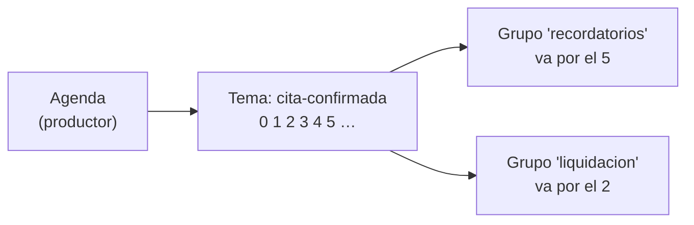

# 📜 db14 — Bitácora de eventos: Kafka y NATS

> Python para desarrolladores Java senior · **Carta** · Track `db` — Hablarle a cada sistema de
> datos desde Python · sección 14 de 15
> Se lee suelta: no hace falta ninguna otra sección de la carta.
> Versiones verificadas contra PyPI el 05/10/2026 · Código probado el 05/10/2026 con Python 3.14.7,
> en contenedor: las salidas son las de esa corrida.

---

## 🎯 1. Qué problema resuelve

Cada vez que se confirma una cita en la agenda en línea, tres procesos quieren enterarse: el que manda el recordatorio, el que
actualiza el tablero y el que la anota para la liquidación de regalías. Si la agenda llama a los tres, cada proceso nuevo es un
cambio en la agenda, y si uno está caído, la llamada falla. La alternativa es que la agenda **publique un evento** —"cita
confirmada"— y que cada interesado lo lea a su ritmo.

Este perfil seguramente conoce Kafka desde Java. Desde Python se usa con **`confluent-kafka`** (sobre `librdkafka`, la misma
biblioteca de C que usan casi todos los clientes que no son de Java). Y hay una alternativa más liviana que vale conocer:
**NATS**, con **`nats-py`**, que en su forma básica es mensajería sin memoria y con **JetStream** se vuelve una bitácora
persistente. La idea que esta sección pone en el centro es la que separa una bitácora de una cola: **leer no borra**. Cada
grupo de lectores lleva su propia posición, y cualquiera puede volver a empezar.

---

## 🧠 2. El modelo



| | Kafka 4.3 | NATS 2.15 básico | NATS con JetStream |
|---|---|---|---|
| ¿Guarda los mensajes? | Sí, por tiempo o tamaño | **No**: quien no está conectado, no lo recibe | Sí |
| Posición de cada lector | *Offset* por grupo y partición | — | Consumidor durable |
| Orden | Por partición (misma clave, misma partición) | Por sujeto | Por *stream* |
| Desde Python | `confluent-kafka` 2.15.1 | `nats-py` 2.16.0 | `nats-py` 2.16.0 |
| Operarlo | Un clúster (sin ZooKeeper desde la 4.0) | Un binario de 20 MB | El mismo binario con `-js` |

### 🪞 Tu instinto de Java dice… y esta vez se equivoca

Con Spring Kafka, el `@KafkaListener` confirma los *offsets* solo y el instinto los olvida. `confluent-kafka` también los confirma
solo por defecto (`enable.auto.commit`), **cada cinco segundos y antes de que el código termine de procesar**: si el proceso muere
justo después, esos mensajes no se vuelven a leer. Para no perder eventos de liquidación, la confirmación es manual y va después de
procesar.

---

## 💻 3. El ejemplo que corre

```bash
uv add confluent-kafka nats-py
```

`eventos.py`:

```python
"""Kafka y NATS desde Python: leer no borra, los grupos, y la mensajería que no guarda nada."""

import asyncio
import json
import os

from confluent_kafka import Consumer, Producer
from confluent_kafka.admin import AdminClient, NewTopic

BROKER = os.environ.get("AUREA_KAFKA", "kafka:9092")
admin = AdminClient({"bootstrap.servers": BROKER})
admin.list_topics(timeout=60)                           # espera a que el broker responda
admin.create_topics([NewTopic("cita-confirmada", num_partitions=3, replication_factor=1)])["cita-confirmada"].result()

producer = Producer({"bootstrap.servers": BROKER})
for i, sede in enumerate(["Suba", "Centro", "Suba", "Kennedy", "Suba", "Centro"]):
    producer.produce("cita-confirmada", key=sede, value=json.dumps({"cita": i, "sede": sede}))
producer.flush()


def read_all(group: str, from_start: bool = True) -> list[tuple[str, int, int]]:
    consumer = Consumer({"bootstrap.servers": BROKER, "group.id": group, "enable.auto.commit": False,
                         "auto.offset.reset": "earliest" if from_start else "latest"})
    consumer.subscribe(["cita-confirmada"])
    seen, idle = [], 0
    while idle < 5:
        msg = consumer.poll(1.0)
        if msg is None:
            idle += 1
            continue
        event = json.loads(msg.value())
        seen.append((event["sede"], event["cita"], msg.partition()))
        consumer.commit(message=msg, asynchronous=False)        # después de procesar, no antes
    consumer.close()
    return seen


first = read_all("recordatorios")
print("recordatorios lee:", len(first), "eventos")
print("  Suba siempre en la misma partición:", {p for s, _, p in first if s == "Suba"},
      "· orden de Suba:", [c for s, c, _ in first if s == "Suba"])
print("recordatorios otra vez:", len(read_all("recordatorios")), "eventos (ya los confirmó)")
print("liquidacion, grupo nuevo:", len(read_all("liquidacion")), "eventos (leer no borró nada)")


# ------------------------------------------------- NATS: sin JetStream no guarda; con JetStream, sí
async def nats_demo():
    import nats

    nc = await nats.connect(os.environ.get("AUREA_NATS", "nats://nats:4222"))
    await nc.publish("cita.confirmada", b'{"cita": 99}')        # nadie está suscrito todavía
    sub = await nc.subscribe("cita.confirmada")
    try:
        await sub.next_msg(timeout=1)
        print("NATS básico: llegó")
    except nats.errors.TimeoutError:
        print("NATS básico: el mensaje publicado antes de suscribirse se perdió")

    js = nc.jetstream()
    await js.add_stream(name="CITAS", subjects=["citas.>"])
    await js.publish("citas.confirmada", b'{"cita": 99}')        # tampoco hay nadie
    psub = await js.pull_subscribe("citas.>", durable="liquidacion")
    msgs = await psub.fetch(1, timeout=2)
    print("JetStream:", [m.data.decode() for m in msgs], "· secuencia", msgs[0].metadata.sequence.stream)
    await msgs[0].ack()
    await nc.close()


asyncio.run(nats_demo())
```

```bash
docker run -d --name aurea-kafka -p 9092:9092 apache/kafka:4.3.1
docker run -d --name aurea-nats -p 4222:4222 nats:2.15.0 -js
AUREA_KAFKA=localhost:9092 AUREA_NATS=nats://localhost:4222 python3 eventos.py
```

Salida (Python 3.14.7, 05/10/2026):

```text
recordatorios lee: 6 eventos
  Suba siempre en la misma partición: {2} · orden de Suba: [0, 2, 4]
recordatorios otra vez: 0 eventos (ya los confirmó)
liquidacion, grupo nuevo: 6 eventos (leer no borró nada)
NATS básico: el mensaje publicado antes de suscribirse se perdió
JetStream: ['{"cita": 99}'] · secuencia 1
```

**Detalles con intención**

- **`key=sede`** decide la partición: todos los eventos de Suba caen en la misma, y dentro de una partición el orden se conserva. Entre
  particiones no hay orden; si lo que importa es el orden por sede, la clave es la sede.
- **`enable.auto.commit: False` y `commit` después de procesar** dan "al menos una vez": si el proceso muere entre procesar y
  confirmar, el evento se vuelve a leer. El consumidor tiene que tolerar repetidos (idempotencia, `wf`).
- **Un grupo nuevo empieza desde el principio** por `auto.offset.reset: earliest`; con `latest`, solo vería los eventos nuevos.
- **El *listener* anunciado.** El contenedor de Kafka de las instrucciones anuncia `localhost:9092`, que sirve para un cliente en el
  mismo equipo. Si el programa de Python corre en otro contenedor, el cliente recibe esa dirección del broker y no puede conectarse:
  hay que configurar `KAFKA_ADVERTISED_LISTENERS` con el nombre del servicio en la red (la prueba de humo de esta sección lo tuvo que
  hacer, junto con las demás variables de un nodo KRaft).
- **`nats-py` es asíncrono**: no hay cliente síncrono oficial. En un programa síncrono, se corre con `asyncio.run` como en el ejemplo.

---

## ⚠️ 4. Lo que se rompe

**Una partición, "para mantener el orden".** Garantiza orden total y deja un solo lector activo por grupo: el día que los recordatorios
se atrasan, agregar consumidores no ayuda. El orden se pide por clave, no por tema.

**El evento con datos personales.** Un tema de Kafka guarda los mensajes días o semanas, y cualquier grupo nuevo los puede leer desde el
principio. El evento lleva identificadores, no el nombre ni la cédula del paciente (`se01`).

**NATS básico para algo que no se puede perder.** Si el proceso de liquidación estaba reiniciándose cuando se confirmó una cita, el
evento no existió para él. Para eso, JetStream o Kafka.

**`confluent-kafka` y su configuración en texto.** Las opciones son las de `librdkafka`, en un diccionario con nombres con puntos
(`"auto.offset.reset"`). Un error de tipeo en un nombre se reporta al crear el cliente; uno en un valor puede no reportarse.

---

## ⚖️ 5. Cuándo NO usarlo

**Kafka para el volumen de Áurea.** Unos miles de citas al día no necesitan un clúster de Kafka; NATS con JetStream, o una tabla de
eventos en Postgres leída con `LISTEN/NOTIFY` o por sondeo, alcanzan y se operan con mucho menos.

**Como cola de trabajos con reintentos y prioridades.** Una bitácora no es una cola de tareas: para eso, las de `wf` (RQ, Celery).

**Para pedir algo y esperar respuesta.** Eso es una llamada (HTTP, gRPC); NATS tiene petición-respuesta, pero si todo el sistema es eso,
la bitácora no aporta.

---

## 🧪 6. Ejercicios (10)

**🟢 Fácil (1–3)**

1. Corre el ejemplo. **Criterio:** explicas cada línea, y en qué partición quedó Suba.
2. Lee con un grupo nuevo y `auto.offset.reset: latest`. **Criterio:** cuántos eventos lee y por qué.
3. Publica en NATS básico con el suscriptor ya conectado. **Criterio:** esta vez llega.

**🟡 Intermedio (4–6)**

4. Vuelve a leer todo el tema con el grupo `recordatorios`, moviendo sus *offsets* al principio (`seek` o la herramienta de grupos).
   **Criterio:** los seis eventos otra vez.
5. Simula la caída entre procesar y confirmar. **Criterio:** el evento se procesa dos veces, y tu consumidor lo detecta como repetido.
6. Usa un consumidor durable de JetStream que se reinicia. **Criterio:** al volver, sigue desde donde quedó.

**🟠 Difícil (7–9)**

7. Corre dos consumidores del mismo grupo en paralelo. **Criterio:** se reparten las particiones, y ves el rebalanceo al detener uno.
8. Serializa los eventos con un esquema (JSON Schema o Avro) y rechaza en el productor uno inválido. **Criterio:** un evento sin `sede`
   no llega al tema.
9. Mide producir 100 000 eventos a Kafka y a JetStream desde Python. **Criterio:** la tabla de tiempos, con y sin esperar confirmación.

**🔴 Muy difícil (10)**

10. Diseña los eventos de la agenda de Áurea. **Criterio:** una página. *Rúbrica:* (a) qué eventos, con qué clave y qué campos (sin datos
    personales); (b) Kafka, JetStream o Postgres, con su razón; (c) cómo se garantiza "al menos una vez" y cómo se toleran repetidos;
    (d) cuánto tiempo se guardan.

---

## 📚 7. Referencias

**Documentación oficial**

- `confluent-kafka` para Python: https://docs.confluent.io/kafka-clients/python/current/overview.html
- Kafka, consumidores y grupos: https://kafka.apache.org/documentation/#intro_consumers
- NATS, JetStream: https://docs.nats.io/nats-concepts/jetstream
- `nats-py`: https://github.com/nats-io/nats.py

**Orden de lectura sugerido:** la introducción de Kafka (temas, particiones, grupos); después la página de JetStream, para ver la misma idea
en un motor más chico.

---

## 🚀 8. Cierre

Una bitácora de eventos guarda lo publicado y cada grupo lleva su posición: leer no borra, y un grupo nuevo puede empezar desde el
principio. Desde Python, Kafka es `confluent-kafka` con la confirmación después de procesar, y NATS es `nats-py`, que sin JetStream no guarda
nada. La clave decide la partición y el orden.

**La señal de que quedó bien:** *"Agregamos el proceso de liquidación un mes después y leyó desde el primer evento de la agenda."*

> 🏷️ **Cierra la sección con su tag**, cuando los ejercicios que elegiste estén hechos:
>
> ```bash
> git tag -a op-db-fase-14 -m "op db14 cerrada: leer no borra, grupos y offsets, y NATS con y sin JetStream"
> ```
>
> Los commits llevan su prefijo (`op db14: …`) y los de ejercicio su número
> (`op db14 ej07: …`).
