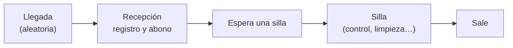

# ⏳ so05 — Simulación de eventos discretos

> Python para desarrolladores Java senior · **Carta** · Track `so` — Optimización, simulación y
> decisiones · sección 5 de 7
> Se lee suelta: no hace falta ninguna otra sección de la carta.
> Versiones verificadas contra PyPI el 05/10/2026 · Código probado el 05/10/2026 con Python 3.14.7,
> en contenedor: las salidas son las de esa corrida.

---

## 🎯 1. Qué problema resuelve

Los sábados en Chapinero la sala de espera se llena. La explicación de todos es la misma: faltan sillas, y la propuesta es una
tercera unidad odontológica, que cuesta lo que cuesta. Antes de comprarla, alguien debería preguntar **dónde se forma la cola**:
¿esperan por una silla, o esperan en el mostrador, donde Yuli o su compañera registran la llegada, cobran el abono y contestan
WhatsApp al mismo tiempo?

Un modelo de optimización (`so02`) no responde eso: no tiene tiempo, ni colas, ni azar. Lo que lo responde es una **simulación de
eventos discretos**: pacientes que llegan a horas aleatorias, recursos limitados (la recepción, las sillas) por los que esperan, y
duraciones que varían. Se corre el sábado mil veces en un segundo, se mide la espera en cada punto y se prueban cambios —una silla
más, una recepcionista más— sin gastar un peso. En Python se hace con **SimPy**, que modela cada paciente como un proceso con
`yield`.

---

## 🧠 2. El modelo



| Pieza de SimPy 4.1.2 | Qué representa | En la sala de espera |
|---|---|---|
| `Environment` | El reloj de la simulación | La jornada del sábado |
| Proceso (función con `yield`) | Algo que pasa en el tiempo | Cada paciente |
| `Resource(capacity=n)` | Algo por lo que se hace fila | La recepción (1 o 2), las sillas (2 o 3) |
| `env.timeout(t)` | Que pase el tiempo | Lo que dura el registro o la atención |

**Lo que se mide** no es un número, es una distribución: la espera promedio dice poco, el percentil 90 (la espera que sufre uno de cada
diez pacientes) dice más. Y se corre muchas veces (**réplicas**) con distintas semillas, porque una sola jornada simulada es una anécdota.

### 🪞 Tu instinto de Java dice… y esta vez se equivoca

El instinto hace la cuenta promedio: si llegan 12 pacientes por hora y cada atención dura 20 minutos, dos sillas atienden 6 por hora…
y la cuenta dice que no alcanza, o que alcanza justo. Lo que la cuenta promedio no ve es la **variabilidad**: con un sistema al 90 % de
su capacidad, las colas no son el 90 % de algo, son enormes, porque cada atención que se alarga empuja a todos los que vienen. La
simulación lo ve.

---

## 💻 3. El ejemplo que corre

```bash
uv add simpy
```

`sala_de_espera.py`:

```python
"""El sábado de Chapinero en SimPy: dónde se forma la cola, y qué la arregla."""

import random
import statistics

import simpy

OPEN_MINUTES = 8 * 60
ARRIVAL_MEAN = 6.5          # un paciente cada 6,5 minutos en promedio
CHECKIN_MEAN = 6.0          # registro, abono y la pregunta de WhatsApp que interrumpe


def patient(env, front_desk, chairs, waits):
    arrived = env.now
    with front_desk.request() as turn:
        yield turn
        waits["recepción"].append(env.now - arrived)
        yield env.timeout(random.expovariate(1 / CHECKIN_MEAN))
    ready = env.now
    with chairs.request() as chair:
        yield chair
        waits["silla"].append(env.now - ready)
        yield env.timeout(random.lognormvariate(2.3, 0.4))      # atención en la silla: media ≈ 10,8 min


def arrivals(env, front_desk, chairs, waits):
    while env.now < OPEN_MINUTES:
        yield env.timeout(random.expovariate(1 / ARRIVAL_MEAN))
        env.process(patient(env, front_desk, chairs, waits))


def saturday(receptionists: int, n_chairs: int, seed: int) -> dict[str, list[float]]:
    random.seed(seed)
    env = simpy.Environment()
    front_desk, chairs = simpy.Resource(env, receptionists), simpy.Resource(env, n_chairs)
    waits = {"recepción": [], "silla": []}
    env.process(arrivals(env, front_desk, chairs, waits))
    env.run()
    return waits


def p90(values: list[float]) -> float:
    return statistics.quantiles(values, n=10)[-1]


for receptionists, n_chairs in [(1, 2), (1, 3), (2, 2)]:
    runs = [saturday(receptionists, n_chairs, seed) for seed in range(500)]
    desk = [w for r in runs for w in r["recepción"]]
    chair = [w for r in runs for w in r["silla"]]
    print(f"{receptionists} recepción, {n_chairs} sillas · espera en recepción: media {statistics.mean(desk):5.1f} min,"
          f" p90 {p90(desk):5.1f} · espera por silla: media {statistics.mean(chair):5.1f}, p90 {p90(chair):5.1f}")
```

```bash
python3 sala_de_espera.py
```

Salida (Python 3.14.7, 05/10/2026):

```text
1 recepción, 2 sillas · espera en recepción: media  28.1 min, p90  70.0 · espera por silla: media   7.9, p90  22.5
1 recepción, 3 sillas · espera en recepción: media  27.7 min, p90  69.7 · espera por silla: media   1.1, p90   4.3
2 recepción, 2 sillas · espera en recepción: media   1.5 min, p90   5.7 · espera por silla: media  10.6, p90  28.5
```

Quinientos sábados por escenario, y la respuesta contradice a todos. Hoy, un paciente espera en promedio 28 minutos en el mostrador y 8
por una silla: 36 en total, y uno de cada diez espera más de una hora solo para registrarse. La tercera silla deja la espera por silla
casi en cero y **no toca la del mostrador**: el total baja de 36 a 29 minutos. La segunda recepcionista baja el mostrador a minuto y
medio, y el total a 12, aunque la espera por silla **suba** un poco: los pacientes llegan antes a las sillas, y ahí se forma ahora la fila
que antes se formaba adelante. El cuello de botella estaba en el mostrador, con una ocupación teórica de 6 / 6,5 ≈ 92 % (registro medio sobre llegada media), y un recurso tan cargado
genera colas desproporcionadas.

**Detalles con intención**

- **Cada paciente es una función con `yield`**: pide la recepción, espera, la usa, la suelta, pide una silla. SimPy maneja el reloj y las
  filas; el código se lee como la historia de un paciente.
- **`with resource.request()`** suelta el recurso al salir del bloque, aunque el proceso termine distinto: el mismo patrón que un `with`
  de archivos.
- **Las duraciones son distribuciones**, no promedios: exponencial para llegadas y registro (mucha variación), lognormal para la atención
  (casi nunca muy corta, a veces bastante larga). Los parámetros se calibran con los datos reales de la agenda (ejercicio 7).
- **500 réplicas** por escenario: la diferencia entre escenarios tiene que ser mayor que la variación entre sábados para creerla.

---

## ⚠️ 4. Lo que se rompe

**Simular con promedios.** Con duraciones fijas iguales al promedio, la simulación muestra colas mucho más cortas que las reales. La
variabilidad es la mitad del modelo.

**Una sola réplica.** Un sábado simulado con mucha cola o con poca es azar. Las conclusiones salen de cientos de réplicas, y se reporta la
variación.

**El modelo sin validar.** Antes de probar cambios, el modelo tiene que reproducir el sábado actual: la espera simulada con dos sillas y una
recepcionista tiene que parecerse a la que se mide hoy. Si no se parece, las conclusiones sobre la tercera silla no valen nada.

**Llegadas que no son al azar.** Con agenda, los pacientes llegan cerca de su hora, no "cuando quieren". El modelo de llegadas tiene que
reflejar la agenda (horas citadas más un retraso aleatorio), no un proceso de Poisson, si las citas dominan.

---

## ⚖️ 5. Cuándo NO usarlo

**Si la cuenta promedio ya muestra que no alcanza por mucho.** Si llegan el doble de pacientes de los que se pueden atender, no hace falta
simular para saber que falta capacidad.

**Sin datos para calibrar.** Una simulación con duraciones inventadas produce números precisos y falsos.

**Para decidir la mezcla de procedimientos.** Eso es optimización (`so02`). La simulación evalúa una configuración dada; no busca la mejor
entre millones.

---

## 🧪 6. Ejercicios (10)

**🟢 Fácil (1–3)**

1. Corre el ejemplo. **Criterio:** dónde se forma la cola en el escenario actual, y qué cambio la reduce más.
2. Corre con 20 réplicas en vez de 500, cinco veces. **Criterio:** cuánto varía el p90 entre corridas.
3. Cambia las duraciones a fijas (los promedios). **Criterio:** cuánto bajan las esperas, y por qué eso es engañoso.

**🟡 Intermedio (4–6)**

4. Agrega la llegada por agenda: citas cada 15 minutos con un retraso aleatorio de ±10 minutos. **Criterio:** las esperas con el nuevo modelo
   de llegadas.
5. Agrega un 10 % de pacientes que necesitan una limpieza larga (30 minutos). **Criterio:** el efecto en el p90 de la silla.
6. Mide la ocupación de cada recurso (proporción del tiempo en uso). **Criterio:** la ocupación de la recepción y de las sillas en cada
   escenario.

**🟠 Difícil (7–9)**

7. Calibra el modelo con datos reales de la agenda (o de una agenda de prueba): duraciones y llegadas. **Criterio:** la espera simulada
   del escenario actual a menos de 20 % de la medida.
8. Simula el autorregistro: el 40 % de los pacientes no pasa por la recepción. **Criterio:** el efecto, comparado con contratar otra
   recepcionista.
9. Haz la misma simulación con `salabim` y compara la forma del código. **Criterio:** los mismos resultados con la misma semilla.

**🔴 Muy difícil (10)**

10. Prepara la respuesta a "¿compramos la tercera silla para Chapinero?". **Criterio:** una página. *Rúbrica:* (a) el modelo y su
    validación contra el sábado actual; (b) los escenarios y sus esperas con su variación; (c) el costo de cada cambio; (d) la
    recomendación y qué la haría cambiar.

---

## 📚 7. Referencias

**Documentación oficial**

- SimPy: https://simpy.readthedocs.io/en/latest/
- SimPy, recursos compartidos: https://simpy.readthedocs.io/en/latest/topical_guides/resources.html

**Libro**

- Averill M. Law, *Simulation Modeling and Analysis*, 5.ª ed. (McGraw-Hill, 2014). La referencia sobre cómo validar un modelo y cuántas
  réplicas correr.

**Orden de lectura sugerido:** el tutorial de SimPy (una hora); después los capítulos de Law sobre validación y análisis de resultados,
que son los que evitan conclusiones falsas.

---

## 🚀 8. Cierre

La simulación de eventos discretos responde dónde se forma la cola y qué la arregla, sin gastar un peso: pacientes como procesos, recursos
por los que se espera, duraciones que varían, y cientos de réplicas. Se valida contra la realidad antes de probar cambios, y se miran los
percentiles, no solo el promedio.

**La señal de que quedó bien:** *"Antes de comprar la tercera silla, el modelo mostró que la cola estaba en el mostrador."*

> 🏷️ **Cierra la sección con su tag**, cuando los ejercicios que elegiste estén hechos:
>
> ```bash
> git tag -a op-so-fase-05 -m "op so05 cerrada: la sala de espera en SimPy, dónde se forma la cola"
> ```
>
> Los commits llevan su prefijo (`op so05: …`) y los de ejercicio su número
> (`op so05 ej07: …`).
