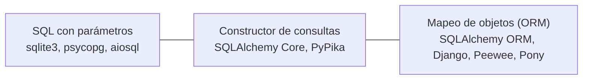

# 🧭 or01 — El eje: mapeo, constructor, SQL

> Python para desarrolladores Java senior · **Carta** · Track `or` — ORMs y acceso a datos desde
> Python · sección 1 de 8
> Se lee suelta: no hace falta ninguna otra sección de la carta.
> Versiones verificadas contra PyPI el 05/10/2026 · Código probado el 05/10/2026 con Python 3.14.7,
> en contenedor: las salidas son las de esa corrida.

---

## 🎯 1. Qué problema resuelve

El camino base usó SQLAlchemy y explicó que su Core y su ORM son dos herramientas distintas, no dos pisos de la misma. Este track
recorre el resto del terreno: los otros ORM de Python, los constructores de consultas, y la opción que más se subestima —escribir el
SQL—. Para no perderse entre doce bibliotecas, hace falta un eje que las ordene, y esta sección lo arma sobre una consulta de Áurea:
**los tres planes de tratamiento de Suba con más saldo pendiente**.

El eje tiene tres puntos. En un extremo, **SQL con parámetros**: se escribe lo que se manda a la base. En el medio, un **constructor
de consultas**: se arma el SQL con objetos de Python, y el resultado sigue siendo filas. En el otro extremo, el **mapeo de objetos**
(ORM): se trabaja con objetos `Plan` que tienen `fases`, y la biblioteca decide qué SQL mandar y cuándo. Cada punto compra algo y lo
paga con algo, y la sección lo muestra contando cuántas sentencias llegan a la base.

---

## 🧠 2. El modelo



| Punto del eje | Qué se escribe | Qué devuelve | Qué compra | Qué paga |
|---|---|---|---|---|
| SQL con parámetros | El SQL | Filas | Control total; el SQL se lee y se optimiza | El SQL depende del motor; nada de objetos |
| Constructor | Expresiones de Python que arman SQL | Filas | Consultas armadas con condiciones; portabilidad entre motores | Una sintaxis más que aprender |
| ORM | Clases y relaciones | **Objetos con relaciones navegables** | Productividad en CRUD; identidad y unidad de trabajo | El SQL que se manda queda oculto: N+1 |

### 🪞 Tu instinto de Java dice… y esta vez se equivoca

Este perfil viene de JPA y Hibernate, donde el ORM es el punto de partida y el SQL nativo la excepción. En Python el centro de gravedad
está más cerca del SQL: Django lo trae de fábrica, pero fuera de Django buena parte de los equipos escribe SQL o usa un constructor, y
el ORM se elige para el CRUD. El instinto de "primero las entidades" no está mal; lo que se equivoca es en suponer que es el único
punto del eje.

---

## 💻 3. El ejemplo que corre

```bash
uv add sqlalchemy pypika
```

`eje.py`:

```python
"""La misma consulta en los tres puntos del eje: SQL, constructor (PyPika, SQLAlchemy Core) y ORM."""

import random

from pypika import Order, Query, Table
from pypika import functions as fn
from sqlalchemy import ForeignKey, create_engine, event, func, select, text
from sqlalchemy.orm import DeclarativeBase, Mapped, Session, mapped_column, relationship


class Base(DeclarativeBase):
    pass


class Plan(Base):
    __tablename__ = "plan"
    id: Mapped[int] = mapped_column(primary_key=True)
    codigo: Mapped[str]
    sede: Mapped[str]
    fases: Mapped[list["Fase"]] = relationship(back_populates="plan")


class Fase(Base):
    __tablename__ = "fase"
    id: Mapped[int] = mapped_column(primary_key=True)
    plan_id: Mapped[int] = mapped_column(ForeignKey("plan.id"))
    valor: Mapped[int]
    estado: Mapped[str]
    plan: Mapped[Plan] = relationship(back_populates="fases")


engine = create_engine("sqlite://")
Base.metadata.create_all(engine)
random.seed(2)
with Session(engine) as s:
    for i in range(60):
        plan = Plan(codigo=f"PL-{i:03d}", sede=random.choice(["Suba", "Centro", "Kennedy"]))
        plan.fases = [Fase(valor=random.randrange(200_000, 3_000_000, 50_000),
                           estado=random.choice(["pagada", "pendiente"])) for _ in range(4)]
        s.add(plan)
    s.commit()

statements = []
event.listen(engine, "before_cursor_execute", lambda *a: statements.append(a[2]))


def run(label, fn_):
    statements.clear()
    result = fn_()
    print(f"{label:<22} {len(statements):>2} sentencias → {result}")


# 1. SQL con parámetros
SQL = """SELECT p.codigo, sum(f.valor) AS saldo FROM plan p JOIN fase f ON f.plan_id = p.id
         WHERE p.sede = :sede AND f.estado = 'pendiente' GROUP BY p.codigo ORDER BY saldo DESC LIMIT 3"""
run("SQL", lambda: engine.connect().execute(text(SQL), {"sede": "Suba"}).all())

# 2. Constructor: PyPika arma el texto; SQLAlchemy Core arma y ejecuta
p, f = Table("plan"), Table("fase")
pypika_sql = (Query.from_(p).join(f).on(f.plan_id == p.id).select(p.codigo, fn.Sum(f.valor).as_("saldo"))
              .where((p.sede == "Suba") & (f.estado == "pendiente")).groupby(p.codigo)
              .orderby(fn.Sum(f.valor), order=Order.desc).limit(3))
print("PyPika genera:", str(pypika_sql)[:95], "…")
core = (select(Plan.codigo, func.sum(Fase.valor).label("saldo")).join(Fase)
        .where(Plan.sede == "Suba", Fase.estado == "pendiente")
        .group_by(Plan.codigo).order_by(func.sum(Fase.valor).desc()).limit(3))
run("SQLAlchemy Core", lambda: engine.connect().execute(core).all())


# 3. ORM: objetos con relaciones navegables
def orm():
    with Session(engine) as s:
        plans = s.scalars(select(Plan).where(Plan.sede == "Suba")).all()
        owed = {pl.codigo: sum(x.valor for x in pl.fases if x.estado == "pendiente") for pl in plans}
        return sorted(owed.items(), key=lambda kv: -kv[1])[:3]


run("ORM, navegando", orm)
```

```bash
python3 eje.py
```

Salida (Python 3.14.7, 05/10/2026):

```text
SQL                     1 sentencias → [('PL-033', 6350000), ('PL-024', 5400000), ('PL-051', 4750000)]
PyPika genera: SELECT "plan"."codigo",SUM("fase"."valor") "saldo" FROM "plan" JOIN "fase" ON "fase"."plan_id"= …
SQLAlchemy Core         1 sentencias → [('PL-033', 6350000), ('PL-024', 5400000), ('PL-051', 4750000)]
ORM, navegando         21 sentencias → [('PL-033', 6350000), ('PL-024', 5400000), ('PL-051', 4750000)]
```

Los tres puntos del eje dan la misma respuesta. El SQL y el constructor mandan una sentencia y traen tres filas. El ORM, navegando, manda
**veintiuna**: una para los veinte planes de Suba y una por cada plan para traer sus fases. Es el N+1, y no hay nada en el código del ORM que
lo delate: `pl.fases` parece un atributo y es una consulta.

**Detalles con intención**

- **El contador de sentencias** (`before_cursor_execute`) es la herramienta de toda la sección y de todo el track: dice qué llega de verdad a
  la base, que es lo único que importa para el rendimiento.
- **PyPika solo arma texto**: no conecta ni ejecuta; el SQL que produce se manda con cualquier *driver*. Es un constructor puro.
- **SQLAlchemy Core** arma y ejecuta, con los parámetros separados del texto y el dialecto de cada motor.
- **El ORM devuelve objetos `Plan`** y la suma se hace en Python recorriendo `pl.fases`. Cada `pl.fases` que no estaba cargado es una consulta
  más: el famoso N+1, que `or02` corrige.

---

## ⚠️ 4. Lo que se rompe

**El N+1 del ORM.** Una consulta para los planes y una más por cada plan para sus fases. Con veinte planes no se nota; con dos mil, la página
tarda segundos. El ORM lo resuelve con estrategias de carga (`or02`); lo que hay que hacer es mirar el contador.

**Calcular en Python lo que la base calcula mejor.** La versión ORM trae todas las fases de Suba para sumar en Python. Las otras dos traen tres
filas ya sumadas. El ORM no impide escribir la consulta agregada (`select(Plan.codigo, func.sum(...))` en el mismo ORM), pero invita a navegar.

**SQL armado con f-strings.** El extremo "SQL" del eje es **SQL con parámetros** (`:sede`), no SQL con valores pegados (`tx01`, `se07`).

---

## ⚖️ 5. Cuándo NO usar cada punto

**El ORM, para reportes y agregados.** Para "los tres planes con más saldo", el SQL o el constructor traen tres filas; el ORM trae objetos que
no se necesitan.

**El SQL a mano, para CRUD de muchas entidades.** Insertar, actualizar y borrar cuarenta tipos de entidad con relaciones es el trabajo que el ORM
hace bien.

**Un constructor, para una consulta fija.** Si la consulta no cambia según condiciones, el SQL escrito se lee mejor que su versión en objetos.

---

## 🧪 6. Ejercicios (10)

**🟢 Fácil (1–3)**

1. Corre el ejemplo. **Criterio:** las tres listas coinciden, y cuántas sentencias mandó el ORM y por qué.
2. Imprime el SQL que genera la consulta Core (`str(core)` y `core.compile(engine)`). **Criterio:** dónde quedó el parámetro de la sede.
3. Ejecuta el SQL de PyPika con `sqlite3`. **Criterio:** el mismo resultado.

**🟡 Intermedio (4–6)**

4. Escribe la consulta agregada con el ORM (`select(Plan.codigo, func.sum(...))` en una `Session`). **Criterio:** una sentencia.
5. Agrega un filtro opcional por estado del plan que solo se aplica si se pide. **Criterio:** cómo queda en SQL, en PyPika y en Core.
6. Cambia el motor a Postgres (`db01`). **Criterio:** qué cambia en cada versión (marcadores, comillas, funciones).

**🟠 Difícil (7–9)**

7. Mide las tres versiones con 20 000 planes. **Criterio:** la tabla de tiempos y de sentencias.
8. Usa `sqlglot` para traducir el SQL de SQLite a Postgres y a SQL Server. **Criterio:** las tres versiones, y qué tradujo.
9. Escribe la misma consulta en Django ORM con `annotate`. **Criterio:** una sentencia, y el SQL que genera.

**🔴 Muy difícil (10)**

10. Ubica en el eje cada acceso a datos de un sistema tuyo. **Criterio:** una tabla. *Rúbrica:* (a) cada consulta o grupo con su punto del eje;
    (b) cuántas sentencias manda cada una, medido; (c) cuáles cambiarías de punto y por qué; (d) qué ganarías y qué perderías.

---

## 📚 7. Referencias

**Documentación oficial**

- SQLAlchemy 2.1: https://docs.sqlalchemy.org/en/21/
- PyPika: https://pypika.readthedocs.io/en/latest/
- SQLAlchemy, eventos de conexión: https://docs.sqlalchemy.org/en/21/core/events.html

**Lectura**

- Martin Fowler, *Patterns of Enterprise Application Architecture* (Addison-Wesley, 2002): los capítulos de *Data Mapper*, *Active Record* y
  *Query Object*, que son el vocabulario del track.

**Orden de lectura sugerido:** los tres patrones de Fowler (unas pocas páginas cada uno); después la página de eventos de SQLAlchemy para
instalar el contador en cualquier proyecto.

---

## 🚀 8. Cierre

El acceso a datos en Python se ordena en un eje: SQL con parámetros, constructor de consultas, mapeo de objetos. Cada punto compra algo —control,
composición, productividad— y lo paga con algo. El contador de sentencias dice qué llega de verdad a la base, y es lo primero que se mira.

**La señal de que quedó bien:** *"Pusimos el contador de sentencias en las pruebas, y el reporte de cartera dejó de mandar trescientas consultas."*

> 🏷️ **Cierra la sección con su tag**, cuando los ejercicios que elegiste estén hechos:
>
> ```bash
> git tag -a op-or-fase-01 -m "op or01 cerrada: el eje mapeo-constructor-SQL y el contador de sentencias"
> ```
>
> Los commits llevan su prefijo (`op or01: …`) y los de ejercicio su número
> (`op or01 ej07: …`).
