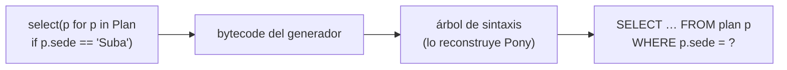

# 🐴 or04 — Pony ORM: generadores a SQL

> Python para desarrolladores Java senior · **Carta** · Track `or` — ORMs y acceso a datos desde
> Python · sección 4 de 8
> Se lee suelta: no hace falta ninguna otra sección de la carta.
> Versiones verificadas contra PyPI el 05/10/2026 · Código probado el 05/10/2026 con Python 3.14.7,
> en contenedor: las salidas son las de esa corrida.

---

## 🎯 1. Qué problema resuelve

De todo el inventario de este track, Pony es el que no tiene equivalente en Java. Su idea es audaz: **la consulta se escribe como un
generador de Python**, el mismo `x for x in ... if ...` que este perfil ya usa para filtrar listas, y Pony lo traduce a SQL. No
construye la consulta con objetos ni con texto: lee el código del generador —su *bytecode*— y lo convierte en un `SELECT` con su
`WHERE`, sus subconsultas y sus agregados.

Para la consulta de siempre —los planes de Suba con más saldo pendiente— el resultado es la consulta más legible del track. La
sección la escribe, muestra el SQL que genera, y muestra también el precio de la audacia: no todo lo que se puede escribir en un
generador se puede traducir, y depender del *bytecode* ata a Pony a cada versión nueva de Python.

---

## 🧠 2. El modelo



| | Pony 0.7.20 | SQLAlchemy | Django ORM |
|---|---|---|---|
| Cómo se escribe la consulta | **Generador de Python** | Expresiones (`select(Plan).where(...)`) | Métodos con `__` (`filter(sede="Suba")`) |
| Agregados y subconsultas | `sum(f.valor for f in p.fases if ...)` | `func.sum` y `scalar_subquery()` | `annotate(Sum(...))` |
| Patrón | Identity map por `db_session` | Data Mapper | Active Record |
| Riesgo | Lo que no puede traducir; versiones nuevas de Python | — | — |

### 🪞 Tu instinto de Java dice… y esta vez se equivoca

El equivalente más cercano en Java sería JINQ, que traducía *lambdas* de *streams* a SQL leyendo el *bytecode*, y que nunca salió del nicho.
El instinto supone que en Python tampoco puede funcionar en serio. Pony lleva más de diez años haciéndolo, con un costo honesto que la
sección muestra: cada versión de Python cambia el *bytecode*, y Pony tiene que ponerse al día.

---

## 💻 3. El ejemplo que corre

```bash
uv add pony
```

`pony_saldos.py`:

```python
"""La consulta del track escrita como un generador de Python, el SQL que genera, y lo que no se puede traducir."""

import random

from pony.orm import Database, Required, Set, db_session, desc, select, sum as pony_sum

db = Database()


class Plan(db.Entity):
    codigo = Required(str)
    sede = Required(str)
    fases = Set("Fase")


class Fase(db.Entity):
    plan = Required(Plan)
    valor = Required(int)
    estado = Required(str)


db.bind(provider="sqlite", filename=":memory:")
db.generate_mapping(create_tables=True)

random.seed(2)
with db_session:
    for i in range(60):
        plan = Plan(codigo=f"PL-{i:03d}", sede=random.choice(["Suba", "Centro", "Kennedy"]))
        for _ in range(4):
            Fase(plan=plan, valor=random.randrange(200_000, 3_000_000, 50_000),
                 estado=random.choice(["pagada", "pendiente"]))

with db_session:
    query = select(
        (p.codigo, pony_sum(f.valor for f in p.fases if f.estado == "pendiente"))
        for p in Plan if p.sede == "Suba"
    ).order_by(desc(2))
    print("los tres con más saldo:", query[:3])
    print(query.get_sql())


def ends_in_3(code: str) -> bool:                      # simple: Pony la descompila y la mete en el SQL
    return code.endswith("3")


def has_a_3(code: str) -> bool:                         # con un bucle: no hay SQL que la represente
    for ch in code:
        if ch == "3":
            return True
    return False


with db_session:
    for check in (ends_in_3, has_a_3):
        try:
            q = select(p for p in Plan if check(p.codigo))
            print(f"\n{check.__name__}: {len(q[:])} planes ·", q.get_sql().splitlines()[-1])
        except Exception as e:
            print(f"\n{check.__name__}: {type(e).__name__}: {e}")
```

```bash
python3 pony_saldos.py
```

Salida (Python 3.14.7, 05/10/2026):

```text
los tres con más saldo: [('PL-033', 6350000), ('PL-024', 5400000), ('PL-051', 4750000)]
SELECT "p"."codigo", (
    SELECT coalesce(SUM("f"."valor"), 0)
    FROM "Fase" "f"
    WHERE "p"."id" = "f"."plan"
      AND "f"."estado" = 'pendiente'
    )
FROM "Plan" "p"
WHERE "p"."sede" = 'Suba'
ORDER BY 2 DESC

ends_in_3: 6 planes · WHERE "p"."codigo" LIKE '%3'

has_a_3: TranslationError: has_a_3(...) is too complex to decompile
```

Los mismos tres planes que en `or01` y `or02`, con una consulta que se lee como Python y un SQL que es exactamente el que se escribiría a mano: la
suma condicional como subconsulta correlacionada, una sola sentencia. Y las dos funciones propias muestran el borde de la traducción: la simple
la descompiló y la convirtió en `LIKE '%3'`; la del bucle no tiene SQL posible, y Pony lo dice antes de mandar nada.

**Detalles con intención**

- **`pony_sum(f.valor for f in p.fases if f.estado == "pendiente")`** dentro del generador se traduce a una subconsulta correlacionada con
  `coalesce(SUM(...), 0)`. Es la misma regla que en `or02` costó un `hybrid_property` con dos versiones.
- **`order_by(desc(2))`** ordena por la segunda columna del resultado, el saldo.
- **`db_session`** es la unidad de trabajo de Pony: un *identity map* y un *commit* al salir. Fuera de un `db_session`, no se puede consultar.
- **`sum` se importa como `pony_sum`** para no tapar el `sum` de Python: dentro del generador, Pony reconoce las dos, pero fuera del generador,
  `sum` debe seguir siendo el de siempre.

---

## ⚠️ 4. Lo que se rompe

**Funciones de Python dentro del generador.** Pony va más lejos de lo que parece: una función propia **simple** la descompila también y la
mete en el SQL —`ends_in_3` se volvió `LIKE '%3'`, cosa que la primera versión de este ejemplo daba por imposible y la corrida desmintió—. Lo que
no puede traducir es lo que no tiene forma de SQL: un bucle, una expresión regular (`re.search` falla dentro de sus propias funciones internas),
una llamada a otra biblioteca. Ahí la consulta falla con `TranslationError`, y la lógica se escribe con lo traducible o se filtra después en
Python.

**Las versiones nuevas de Python.** El *bytecode* cambia en cada versión de Python, y Pony tiene que actualizar su descompilador. Pony 0.7.20
funciona con Python 3.14 (este ejemplo lo comprueba), pero el soporte de cada versión nueva depende de que Pony actualice su descompilador, y no
llega el mismo día que la versión de Python (el ejercicio 9 pide medir cuánto tardó con las anteriores). Para un proyecto que sigue la última
versión de Python apenas sale, es un riesgo concreto.

**El ritmo del proyecto.** Pony lo mantiene un equipo pequeño; la serie 0.7 lleva años. Funciona y se actualiza, pero no tiene el tamaño de
comunidad de SQLAlchemy o Django.

---

## ⚖️ 5. Cuándo NO usarlo

**En un proyecto que adopta cada versión de Python el día que sale.** Por el descompilador.

**Si el equipo ya conoce SQLAlchemy.** La elegancia de Pony no compensa un segundo ORM en la casa.

**Para consultas que dependen de funciones del motor que Pony no conoce.** Ahí, SQL directo (`or06`).

---

## 🧪 6. Ejercicios (10)

**🟢 Fácil (1–3)**

1. Corre el ejemplo. **Criterio:** los tres planes coinciden con los de `or01`, y señalas en el SQL la subconsulta.
2. Agrega al generador la condición "solo planes con al menos una fase pagada". **Criterio:** el SQL nuevo y su resultado.
3. Reescribe `has_a_3` con lo que Pony traduce (`"3" in p.codigo`). **Criterio:** la consulta corre, y muestras el SQL que generó.

**🟡 Intermedio (4–6)**

4. Activa `set_sql_debug(True)` y cuenta las sentencias de recorrer `plan.fases` para los planes de Suba. **Criterio:** si Pony hace N+1 y por qué.
5. Usa `prefetch(Plan.fases)` en la consulta. **Criterio:** cuántas sentencias se mandan ahora.
6. Escribe la misma consulta en SQLAlchemy y en Django. **Criterio:** las tres versiones lado a lado, y cuál leerías mejor dentro de un año.

**🟠 Difícil (7–9)**

7. Conecta Pony a Postgres (`db01`). **Criterio:** el SQL generado para Postgres y sus diferencias con el de SQLite.
8. Mide la consulta con 20 000 planes en Pony y en SQLAlchemy. **Criterio:** la tabla de tiempos, incluido el tiempo de traducción de Pony.
9. Busca en el historial de Pony cuánto tardó en soportar Python 3.12 y 3.13 después de su salida. **Criterio:** las fechas y la conclusión para tu
   proyecto.

**🔴 Muy difícil (10)**

10. Decide si Pony tiene lugar en Áurea. **Criterio:** una página. *Rúbrica:* (a) qué consultas se escriben mejor con generadores; (b) el riesgo de
    versión de Python, con fechas; (c) el costo de un segundo ORM; (d) la decisión y la señal que la cambiaría.

---

## 📚 7. Referencias

**Documentación oficial**

- Pony ORM: https://docs.ponyorm.org/
- Pony ORM, consultas: https://docs.ponyorm.org/queries.html
- Pony ORM, repositorio: https://github.com/ponyorm/pony

**Orden de lectura sugerido:** la página de consultas de Pony, con la lista de lo que puede traducir; después las notas de versión del repositorio,
para ver el ritmo con las versiones de Python.

---

## 🚀 8. Cierre

Pony traduce generadores de Python a SQL leyendo su *bytecode*: la consulta más legible del track, con subconsultas y agregados escritos como
Python. Traduce lo que conoce y falla con lo demás, y su descompilador tiene que seguir a cada versión de Python. Es una idea sin equivalente en
Java, y una decisión de riesgo medido.

**La señal de que quedó bien:** *"La consulta de saldos en Pony se lee como Python, y sabemos qué haríamos si una versión nueva de Python la
rompe."*

> 🏷️ **Cierra la sección con su tag**, cuando los ejercicios que elegiste estén hechos:
>
> ```bash
> git tag -a op-or-fase-04 -m "op or04 cerrada: la consulta como generador, su SQL y lo que no se traduce"
> ```
>
> Los commits llevan su prefijo (`op or04: …`) y los de ejercicio su número
> (`op or04 ej07: …`).
