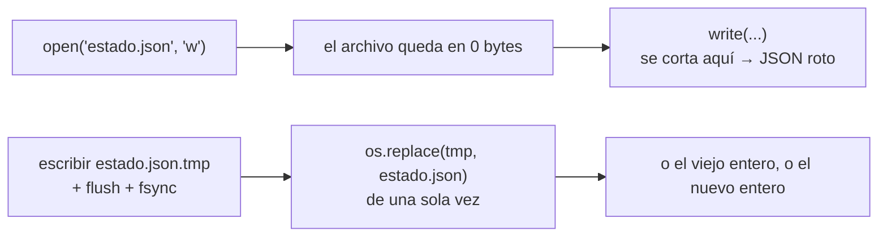

# 💽 sy04 — El sistema de archivos en serio

> Python para desarrolladores Java senior · **Carta** · Track `sy` — El sistema operativo, los
> procesos y los archivos en movimiento · sección 4 de 8
> Se lee suelta: no hace falta ninguna otra sección de la carta.
> Versiones verificadas contra PyPI el 05/10/2026 · Código probado el 05/10/2026 con Python 3.14.7,
> en contenedor: las salidas son las de esa corrida.

---

## 🎯 1. Qué problema resuelve

El cierre nocturno de Áurea guarda su estado en un JSON: qué sedes ya se procesaron, con qué resultado. Una madrugada se fue la luz en
el servidor de la sede mientras el cierre escribía ese archivo, y a la mañana el JSON estaba cortado a la mitad. El cierre siguiente no
pudo leerlo, no supo qué sedes faltaban, y Patricia reprocesó todo a mano. "Escribir un archivo" parecía resuelto desde la primera fase;
no lo estaba.

Es el tipo de cosa que el reflejo de la JVM no cubre, porque allá lo hacía el framework o la base de datos. Python da las piezas y hay que
armarlas: **la escritura atómica** (un archivo temporal en el mismo directorio, `fsync` y `os.replace`, que en POSIX reemplaza de una sola
vez) y **el bloqueo de archivos** (`filelock`) para que dos procesos no escriban el mismo archivo a la vez. La sección provoca las dos
fallas veinte veces y cuenta.

---

## 🧠 2. El modelo



| Operación | ¿Atómica? | La trampa |
|---|---|---|
| `open(path, "w")` + `write` | **No** | El archivo se trunca a cero **al abrir**; si el proceso muere antes de terminar, queda a medias |
| `os.replace(tmp, path)` | **Sí**, en el mismo sistema de archivos (POSIX) | Entre sistemas de archivos distintos, no: por eso el temporal va en el mismo directorio |
| `os.rename` | Sí en POSIX; en Windows falla si el destino existe | `os.replace` es la versión portátil |
| `f.flush()` | Pasa el búfer de Python al sistema | No garantiza que esté en el disco |
| `os.fsync(f.fileno())` | Pide al sistema que lo escriba en el disco | Es lo que sobrevive a un corte de luz, no solo a un proceso muerto |

| Biblioteca | Versión | Para qué |
|---|---|---|
| `filelock` | 4.0.12 | Un bloqueo entre procesos con un archivo `.lock`; multiplataforma |

### 🪞 Tu instinto de Java dice… y esta vez se equivoca

En Java, `Files.write` con `StandardOpenOption.TRUNCATE_EXISTING` tiene el mismo problema, y `Files.move` con `ATOMIC_MOVE` es la solución, pero casi
nadie la escribe porque el estado vive en una base de datos. El instinto da por hecho que escribir un archivo pequeño "es instantáneo". No lo es: entre
el truncado y el último byte hay una ventana, y un `SIGKILL` o un corte de luz en esa ventana deja el archivo roto.

---

## 💻 3. El ejemplo que corre

```bash
uv add filelock
```

`atomico.py`:

```python
"""Escribir el estado del cierre: ingenuo contra atómico, con SIGKILL a mitad de camino; y un contador con y sin filelock."""

import json
import multiprocessing as mp
import os
import random
import signal
import time

from filelock import FileLock

STATE = {"fecha": "2026-10-05", "sedes": {f"sede-{i:05d}": {"estado": "ok", "filas": i * 1000} for i in range(40_000)}}
PAYLOAD = json.dumps(STATE)


def naive(path: str, started=None):
    with open(path, "w") as f:
        if started:
            started.set()                                 # avisa que ya abrió (y truncó) el archivo
        for i in range(0, len(PAYLOAD), 4096):
            f.write(PAYLOAD[i:i + 4096])
            f.flush()


def atomic(path: str, started=None):
    tmp = path + ".tmp"
    with open(tmp, "w") as f:
        if started:
            started.set()
        for i in range(0, len(PAYLOAD), 4096):
            f.write(PAYLOAD[i:i + 4096])
            f.flush()
        os.fsync(f.fileno())
    os.replace(tmp, path)                                 # el cambio de nombre es atómico


def is_valid(path: str) -> bool:
    try:
        with open(path) as f:
            return json.load(f)["fecha"] == "2026-10-05"
    except (OSError, ValueError, KeyError):
        return False


# ------------------------------------------------- un contador en un archivo, desde cuatro procesos
def bump(path: str, n: int, lock: bool):
    for _ in range(n):
        with FileLock(path + ".lock") if lock else open(os.devnull):
            value = int(open(path).read() or 0)          # sin bloqueo, a veces lo lee recién truncado: vacío
            with open(path, "w") as f:
                f.write(str(value + 1))


if __name__ == "__main__":                                # obligatorio con multiprocessing en Python 3.14 (ver §4)
    random.seed(1)
    for writer in (naive, atomic):
        broken = 0
        for _ in range(20):
            atomic("estado.json")                         # un estado válido de la noche anterior
            started = mp.Event()
            p = mp.Process(target=writer, args=("estado.json", started))
            p.start()
            started.wait(10)
            time.sleep(random.uniform(0, 0.005))          # el corte llega en cualquier momento de la escritura
            try:
                os.kill(p.pid, signal.SIGKILL)
            except ProcessLookupError:                    # alcanzó a terminar: no hubo corte
                pass
            p.join()
            broken += not is_valid("estado.json")
        print(f"{writer.__name__:<7} con SIGKILL a mitad de camino: {broken:>2} de 20 archivos quedaron rotos")

    for lock in (False, True):
        with open("contador.txt", "w") as f:
            f.write("0")
        procs = [mp.Process(target=bump, args=("contador.txt", 250, lock)) for _ in range(4)]
        for p in procs:
            p.start()
        for p in procs:
            p.join()
        print(f"contador {'con' if lock else 'sin'} filelock: {open('contador.txt').read():>4} (esperado 1000)")
```

```bash
python3 atomico.py
```

Salida (Python 3.14.7, 05/10/2026):

```text
naive   con SIGKILL a mitad de camino: 20 de 20 archivos quedaron rotos
atomic  con SIGKILL a mitad de camino:  0 de 20 archivos quedaron rotos
contador sin filelock:    6 (esperado 1000)
contador con filelock: 1000 (esperado 1000)
```

Veinte cortes en cada versión. La escritura ingenua dejó **los veinte** archivos rotos: desde el `open(..., "w")`, el estado de la noche anterior ya no
existía, y cualquier corte posterior dejaba un JSON a medias. La atómica no rompió ninguno: el corte encontraba el archivo viejo entero, porque el
nuevo solo reemplaza al viejo en el `os.replace`. El contador sin bloqueo terminó en 6 de 1 000 —en otra corrida, 4: el número cambia, el desastre
no—, porque además de pisarse las sumas, cada lectura de un archivo recién truncado lo devolvía a cero. Con `FileLock`, 1 000 exactos.

**Detalles con intención**

- **El temporal va en el mismo directorio** que el destino. `os.replace` es atómico solo dentro del mismo sistema de archivos; un temporal en `/tmp`
  puede estar en otro, y ahí el reemplazo es una copia que también se puede cortar.
- **`fsync` antes del `replace`**: si se omite, el nombre nuevo puede quedar apuntando a un archivo cuyo contenido todavía no llegó al disco, y un corte
  de luz (no un proceso muerto, que es lo que mide el ejemplo) deja un archivo vacío con el nombre correcto.
- **El contador sin bloqueo pierde actualizaciones** por la misma razón que el `save()` de `or03`: leer, sumar y escribir no es una operación. Y
  peor: a veces un proceso lee el archivo justo después de que otro lo truncó, y encuentra una cadena vacía —la primera versión de este ejemplo
  se cayó con `ValueError: invalid literal for int() with base 10: ''`—; el `or 0` reproduce lo que pasaría en la realidad: el contador vuelve a
  cero. Con `FileLock`, un solo proceso a la vez hace las tres.
- **`multiprocessing` con `SIGKILL`** simula el corte: el proceso no tiene oportunidad de terminar nada, como en un apagón.

---

## ⚠️ 4. Lo que se rompe

**`multiprocessing` sin `if __name__ == "__main__"` en Python 3.14.** Desde la 3.14, el método de arranque por defecto en Linux es `forkserver`, no
`fork`: cada proceso hijo vuelve a importar el módulo principal. Un *script* sin la guarda vuelve a ejecutarse en cada hijo, y la primera versión de
este ejemplo falló con `ConnectionResetError` desde el servidor de *fork*. Código que funcionaba en 3.13 se rompe al actualizar; la guarda lo arregla.

**Abrir con `"w"` el archivo que se quiere conservar.** El truncado ocurre al abrir, antes de escribir el primer byte: desde ese momento, el estado
anterior ya no existe. Todo estado que importe se escribe con el patrón atómico.

**`filelock` en una carpeta de red.** Los bloqueos sobre SMB o NFS dependen de la implementación del servidor y no siempre funcionan, igual que con
SQLite (`db04`). Para coordinar entre máquinas, un bloqueo en una base o en Valkey (`db06`).

**El directorio sin `fsync`.** En algunos sistemas de archivos, el cambio de nombre vive en el directorio, que también hay que sincronizar
(`os.fsync` sobre el descriptor del directorio) para que sobreviva a un corte de luz. Para el estado del cierre, vale la línea extra.

**Permisos del temporal.** El archivo temporal se crea con los permisos por defecto del proceso, no con los del original. Si el estado tenía permisos
restringidos, se aplican al temporal antes del `replace`.

---

## ⚖️ 5. Cuándo NO usarlo

**Si el estado puede vivir en una base.** SQLite (`db04`) ya hace escrituras atómicas y durables con su diario; un JSON con escritura atómica es para
cuando el estado tiene que ser un archivo legible.

**Para archivos que se escriben una vez y no se reemplazan.** Un exporte nuevo con nombre nuevo no pisa nada; basta con escribirlo con un nombre
temporal y renombrarlo al terminar, para que nadie lo lea a medias (`sy05`).

**`fsync` en cada escritura de un archivo de bitácora.** Es caro; para bitácoras se acepta perder las últimas líneas en un corte.

---

## 🧪 6. Ejercicios (10)

**🟢 Fácil (1–3)**

1. Corre el ejemplo. **Criterio:** cuántos archivos rompió la versión ingenua y por qué ninguno la atómica.
2. Abre uno de los JSON rotos. **Criterio:** describes dónde se cortó.
3. Mueve el temporal a `/tmp` y usa `os.replace`. **Criterio:** si funciona en tu sistema, y qué pasaría con `/tmp` en otra partición.

**🟡 Intermedio (4–6)**

4. Escribe una función `write_atomic(path, data)` que también conserve los permisos del original. **Criterio:** una prueba con permisos `0o600`.
5. Agrega el `fsync` del directorio. **Criterio:** el código y en qué sistemas hace falta.
6. Mide el costo de `fsync`: 1 000 escrituras atómicas con y sin él. **Criterio:** los dos tiempos.

**🟠 Difícil (7–9)**

7. Haz que el cierre retome desde el estado después de un `SIGKILL`: procesa solo las sedes que faltan. **Criterio:** matarlo a mitad dos veces termina
   con todas las sedes procesadas una sola vez.
8. Reemplaza el contador en archivo por uno en SQLite y repite el experimento sin `filelock`. **Criterio:** 1000 siempre, y por qué.
9. Usa `FileLock` con `timeout=` y provoca la espera. **Criterio:** el segundo proceso falla con `Timeout` después del tiempo pedido.

**🔴 Muy difícil (10)**

10. Audita las escrituras de archivos de un proceso tuyo (o del cierre de Áurea). **Criterio:** una tabla. *Rúbrica:* (a) cada archivo que se escribe y si
    se reemplaza; (b) qué pasa con cada uno si el proceso muere a mitad; (c) cuáles necesitan escritura atómica o bloqueo; (d) la corrección.

---

## 📚 7. Referencias

**Documentación oficial**

- `os.replace`: https://docs.python.org/3/library/os.html#os.replace
- `os.fsync`: https://docs.python.org/3/library/os.html#os.fsync
- `filelock`: https://py-filelock.readthedocs.io/en/latest/

**Lectura**

- Dan Luu, *Files are hard* (2015): https://danluu.com/file-consistency/

**Orden de lectura sugerido:** *Files are hard*, que cuenta por qué incluso las bases de datos se equivocan con esto; después la documentación de
`filelock`.

---

## 🚀 8. Cierre

Escribir un archivo que importa es: temporal en el mismo directorio, `flush`, `fsync`, `os.replace`. Así, si el proceso muere o se va la luz, queda el
archivo viejo entero o el nuevo entero, nunca uno a medias. Y leer-modificar-escribir desde varios procesos necesita un bloqueo, que `filelock` da sin
depender del sistema operativo.

**La señal de que quedó bien:** *"Se fue la luz a mitad del cierre, y a la mañana el estado estaba entero y el cierre siguió desde donde quedó."*

> 🏷️ **Cierra la sección con su tag**, cuando los ejercicios que elegiste estén hechos:
>
> ```bash
> git tag -a op-sy-fase-04 -m "op sy04 cerrada: escritura atómica con fsync y os.replace, y filelock medidos"
> ```
>
> Los commits llevan su prefijo (`op sy04: …`) y los de ejercicio su número
> (`op sy04 ej07: …`).
