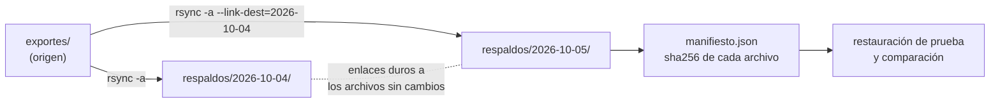

# 🗄️ sy07 — Sincronización y respaldo

> Python para desarrolladores Java senior · **Carta** · Track `sy` — El sistema operativo, los
> procesos y los archivos en movimiento · sección 7 de 8
> Se lee suelta: no hace falta ninguna otra sección de la carta.
> Versiones verificadas contra PyPI el 05/10/2026 · Código probado el 05/10/2026 con Python 3.14.7,
> en contenedor: las salidas son las de esa corrida.

---

## 🎯 1. Qué problema resuelve

Áurea respalda los exportes de cada noche copiándolos a un disco aparte. El respaldo "funciona": el proceso termina sin errores todas
las noches. Nadie probó nunca restaurar. Cuando hizo falta —un exporte de agosto que la aseguradora reclamaba—, el archivo estaba en el
respaldo y estaba dañado, y también lo estaba en todas las copias de los días siguientes.

Respaldar bien tiene tres partes, y la tercera es la que nadie hace. **Copiar solo lo que cambió**, para que el respaldo de cada noche
sea rápido: `rsync`, que Python orquesta. **Guardar versiones** sin multiplicar el espacio: instantáneas incrementales con enlaces duros
(`--link-dest`), donde cada día parece una copia completa y solo ocupa lo nuevo. Y **verificar que se puede restaurar**: un manifiesto con
el *hash* de cada archivo, y una restauración de prueba que lo compara. La sección hace las tres y muestra la trampa de la segunda: los
enlaces duros comparten el dato, y un archivo dañado lo está en todas las instantáneas que lo comparten.

---

## 🧠 2. El modelo



| Herramienta | Qué hace | Para qué |
|---|---|---|
| `rsync` (binario) | Copia solo las diferencias; `--link-dest` reutiliza archivos iguales de otra copia | Respaldo local o por SSH |
| `rclone` (binario) | `rsync` para almacenamiento en la nube (S3, Drive, etc.) | Respaldo fuera del edificio (`db13`) |
| `hashlib` | `sha256` de cada archivo | El manifiesto que prueba que lo restaurado es lo respaldado |
| Instantáneas del sistema de archivos (ZFS, btrfs, LVM) | Copias instantáneas del disco entero | Cuando el servidor las tiene |

### 🪞 Tu instinto de Java dice… y esta vez se equivoca

El instinto delega el respaldo en "la infraestructura" y lo da por hecho si el trabajo termina en verde. Un respaldo sin restauración probada no es un
respaldo: es una copia de la que no se sabe nada. La verificación con *hash* es barata, se programa en veinte líneas de Python, y es la única forma
de saber, antes de necesitarlo, que lo que hay en el disco de respaldo sirve.

---

## 💻 3. El ejemplo que corre

```bash
sudo apt-get install -y rsync
```

`respaldo.py`:

```python
"""Instantáneas con rsync, manifiesto calculado del origen, la copia que no copió, y el daño compartido por enlaces duros."""

import hashlib
import json
import os
import pathlib
import random
import shutil
import subprocess

SRC, BACKUPS = pathlib.Path("exportes"), pathlib.Path("respaldos")
for d in (SRC, BACKUPS, pathlib.Path("restaurado")):
    shutil.rmtree(d, ignore_errors=True)
SRC.mkdir()
BACKUPS.mkdir()                                              # rsync solo crea el último nivel del destino
random.seed(3)
for i in range(50):
    (SRC / f"exporte-{i:02d}.csv").write_bytes(random.randbytes(100_000))


def sha256(path: pathlib.Path) -> str:
    return hashlib.sha256(path.read_bytes()).hexdigest()


def snapshot(day: str, previous: str | None, checksum: bool = False) -> list[str]:
    target = BACKUPS / day
    shutil.rmtree(target, ignore_errors=True)
    cmd = ["rsync", "-a", "--delete"] + (["--checksum"] if checksum else [])
    if previous:
        cmd.append(f"--link-dest=../{previous}")             # relativo al destino
    manifest = {p.name: sha256(p) for p in sorted(SRC.glob("*.csv"))}    # lo que DEBERÍA quedar respaldado
    subprocess.run([*cmd, f"{SRC}/", f"{target}/"], check=True)
    (target / "manifiesto.json").write_text(json.dumps(manifest))
    return verify(target)


def verify(snapshot_dir: pathlib.Path) -> list[str]:
    manifest = json.loads((snapshot_dir / "manifiesto.json").read_text())
    return [name for name, digest in manifest.items() if sha256(snapshot_dir / name) != digest]


def used_mb(path: pathlib.Path) -> float:
    inodes = {p.stat().st_ino: p.stat().st_size for p in path.rglob("*.csv")}
    return sum(inodes.values()) / 1e6


print("2026-10-04:", snapshot("2026-10-04", None) or "verificada")
for i in (3, 7):                                             # dos exportes cambian, con el mismo tamaño y la misma
    path = SRC / f"exporte-{i:02d}.csv"                      # fecha de modificación: como un cambio en el mismo segundo,
    before = path.stat()                                     # o una herramienta que conserva la fecha al reescribir
    path.write_bytes(random.randbytes(100_000))
    os.utime(path, ns=(before.st_atime_ns, before.st_mtime_ns))
(SRC / "exporte-50.csv").write_bytes(random.randbytes(100_000))
print("2026-10-05 con -a:        no coinciden con el origen", snapshot("2026-10-05", "2026-10-04"))
print("2026-10-05 con --checksum: no coinciden con el origen", snapshot("2026-10-05", "2026-10-04", checksum=True))
print(f"las dos instantáneas parecen de {2 * 5.05:.1f} MB y ocupan {used_mb(BACKUPS):.1f} MB")

shutil.copytree(BACKUPS / "2026-10-05", "restaurado")
print("restauración de prueba:", verify(pathlib.Path("restaurado")) or "verificada")

# Un sector del disco de respaldo se daña: un byte de un archivo que no cambió entre los dos días.
victim = BACKUPS / "2026-10-04" / "exporte-20.csv"
data = bytearray(victim.read_bytes())
data[5_000] ^= 0xFF
with open(victim, "r+b") as f:                               # escribir en el mismo inodo, como el daño real
    f.write(data)
for day in ("2026-10-04", "2026-10-05"):
    print(f"verificación de {day}: dañados {verify(BACKUPS / day)}")
print("¿es el mismo archivo en disco?",
      os.path.samefile(BACKUPS / "2026-10-04" / "exporte-20.csv", BACKUPS / "2026-10-05" / "exporte-20.csv"))
```

```bash
python3 respaldo.py
```

Salida (Python 3.14.7, 05/10/2026):

```text
2026-10-04: verificada
2026-10-05 con -a:        no coinciden con el origen ['exporte-03.csv', 'exporte-07.csv']
2026-10-05 con --checksum: no coinciden con el origen []
las dos instantáneas parecen de 10.1 MB y ocupan 5.3 MB
restauración de prueba: verificada
verificación de 2026-10-04: dañados ['exporte-20.csv']
verificación de 2026-10-05: dañados ['exporte-20.csv']
¿es el mismo archivo en disco? True
```

La segunda línea es la que da sentido a la sección. Con `rsync -a`, la instantánea del 5 de octubre **no tiene los dos cambios del día**: `rsync`
decide si un archivo cambió mirando el tamaño y la fecha de modificación, y estos dos tenían los mismos; los dio por iguales y enlazó la versión
vieja. El proceso terminó sin errores, y solo la verificación contra el manifiesto **del origen** lo detectó. Con `--checksum`, que compara el
contenido, la instantánea queda bien. Las dos instantáneas ocupan 5,3 MB en vez de 10,1. Y el final: el byte dañado en el respaldo del 4 de octubre
aparece también en el del 5, porque es el mismo archivo en el disco.

**Detalles con intención**

- **`--link-dest`** hace que `rsync`, en vez de copiar un archivo que no cambió, cree un enlace duro al de la instantánea anterior. Las dos carpetas
  tienen los 51 archivos; el disco guarda una sola vez los 48 que no cambiaron.
- **`used_mb` cuenta inodos, no archivos**: es la forma de medir el espacio real cuando hay enlaces duros, igual que hace `du`.
- **El manifiesto se calcula del origen**, en el momento del respaldo, y se guarda dentro de la instantánea. Verificar es calcular el *hash* de lo
  respaldado y comparar. La primera versión de este ejemplo calculaba el manifiesto **de la instantánea**, y por eso certificaba como correcta una
  copia a la que le faltaban los cambios: un manifiesto de lo que se copió no prueba que se copió lo que había.
- **`os.utime`** deja en los archivos cambiados la fecha que tenían: simula un cambio en el mismo segundo, o una herramienta que conserva la fecha al
  reescribir. En la primera corrida pasó sin forzarlo, porque todo ocurrió dentro del mismo segundo; en la siguiente, no. Es un error que depende del
  reloj, que es la peor clase.
- **El daño se escribe en el mismo inodo** (`r+b`), como lo haría un sector defectuoso. Si se reemplazara el archivo con uno nuevo, el enlace se rompería
  y solo una instantánea quedaría dañada.

---

## ⚠️ 4. Lo que se rompe

**Las instantáneas con enlaces duros no son copias independientes.** Lo que muestra el final del ejemplo: el archivo que no cambió entre los dos días es
**el mismo** en el disco, y su daño está en las dos. Contra el daño del medio, hace falta una segunda copia en otro medio (otro disco, la nube con
`rclone`), no más instantáneas en el mismo.

**La comparación rápida de `rsync`.** Por defecto, `rsync` da por igual un archivo con el mismo tamaño y la misma fecha de modificación, sin leer el
contenido. Un exporte que se regenera en el mismo segundo, con el mismo tamaño, no se respalda, y el respaldo termina sin errores. `--checksum` lee y
compara todo (más lento), y la verificación contra el manifiesto del origen lo detecta en cualquier caso.

**`--delete` apuntando al lugar equivocado.** `rsync --delete` borra en el destino lo que no está en el origen. Con el origen y el destino invertidos, borra
los datos de producción. El orquestador valida las rutas antes de llamar, y se prueba con `--dry-run`.

**El destino cuyo padre no existe.** `rsync` crea la carpeta final del destino, pero no las intermedias: con `respaldos/` inexistente, copiar a
`respaldos/2026-10-04/` termina con código 11 (error de E/S), que fue el primer error de este ejemplo. Se crea el padre antes, o se usa
`--mkpath` (rsync 3.2.3 en adelante); y como siempre, `check=True` para que el fallo no pase en silencio.

**La barra final de `rsync`.** `rsync -a exportes respaldos/x` copia la carpeta *dentro* de `x`; `exportes/` copia su *contenido*. La diferencia de un carácter
cambia la estructura del respaldo y rompe la `--link-dest` de la noche siguiente.

**El respaldo que nadie restaura.** El ejemplo restaura y verifica en cada corrida. Si se hace solo cuando hace falta, el día que hace falta se descubre que no
servía.

---

## ⚖️ 5. Cuándo NO usarlo

**Si el servidor tiene instantáneas del sistema de archivos.** ZFS o btrfs hacen instantáneas instantáneas y verificadas por bloque; orquestar `rsync` encima es
redundante.

**Para la base de datos.** Copiar los archivos de Postgres mientras corre no produce un respaldo consistente; para eso, `pg_dump` o el respaldo físico de la base.

**Como único respaldo.** Una copia en el mismo edificio no sobrevive a un incendio ni a un *ransomware* que cifra todo lo que ve. La regla 3-2-1 (tres copias,
dos medios, una fuera) sigue vigente.

---

## 🧪 6. Ejercicios (10)

**🟢 Fácil (1–3)**

1. Corre el ejemplo. **Criterio:** explicas los 5,3 MB, por qué `-a` no copió dos cambios, y por qué el daño aparece en los dos días.
2. Corre `du -sh respaldos/*` y `du -sh respaldos`. **Criterio:** explicas por qué los números no suman.
3. Corre la segunda instantánea con `--dry-run --itemize-changes`. **Criterio:** identificas los tres archivos que copiaría.

**🟡 Intermedio (4–6)**

4. Agrega una política de retención: conservar 7 diarias y 4 semanales. **Criterio:** borrar las viejas no daña las que quedan (por los enlaces).
5. Verifica todas las instantáneas cada noche y avisa si alguna tiene daños (`au06`). **Criterio:** el aviso con el nombre del archivo y el día.
6. Cambia el daño a "reemplazar el archivo" (`write_bytes`) en vez de escribir en el mismo inodo. **Criterio:** qué instantáneas quedan dañadas ahora y por qué.

**🟠 Difícil (7–9)**

7. Copia la última instantánea a un *bucket* S3 compatible con `rclone` (`db13`). **Criterio:** la copia remota pasa la verificación del manifiesto.
8. Restaura el archivo dañado desde la copia remota. **Criterio:** la verificación local vuelve a dar cero dañados.
9. Mide el tiempo del respaldo de 5 000 archivos con y sin `--link-dest`, y el espacio. **Criterio:** la tabla.

**🔴 Muy difícil (10)**

10. Diseña el respaldo de los exportes de Áurea. **Criterio:** una página. *Rúbrica:* (a) instantáneas, retención y espacio; (b) la segunda copia en otro medio;
    (c) cómo y cada cuánto se prueba la restauración; (d) qué pasa con un daño en el medio y con un *ransomware*.

---

## 📚 7. Referencias

**Documentación oficial**

- `rsync(1)`: https://download.samba.org/pub/rsync/rsync.1
- `rclone`: https://rclone.org/docs/
- `hashlib`: https://docs.python.org/3/library/hashlib.html

**Orden de lectura sugerido:** de la página de `rsync`, las opciones `--link-dest`, `--delete` y `--dry-run`; después la documentación de `rclone` para la copia
remota.

---

## 🚀 8. Cierre

Un respaldo tiene tres partes: copiar lo que cambió (`rsync`), guardar versiones sin multiplicar el espacio (`--link-dest`), y verificar con un manifiesto que lo
restaurado es lo respaldado. Las instantáneas con enlaces duros comparten el dato, así que el daño del medio las alcanza a todas: hace falta otra copia en otro
medio. Y la restauración se prueba siempre, no el día que hace falta.

**La señal de que quedó bien:** *"La aseguradora reclamó un exporte de agosto y lo restauramos en cinco minutos, con el hash que prueba que es el mismo."*

> 🏷️ **Cierra la sección con su tag**, cuando los ejercicios que elegiste estén hechos:
>
> ```bash
> git tag -a op-sy-fase-07 -m "op sy07 cerrada: instantáneas con rsync, manifiesto y restauración probada"
> ```
>
> Los commits llevan su prefijo (`op sy07: …`) y los de ejercicio su número
> (`op sy07 ej07: …`).
