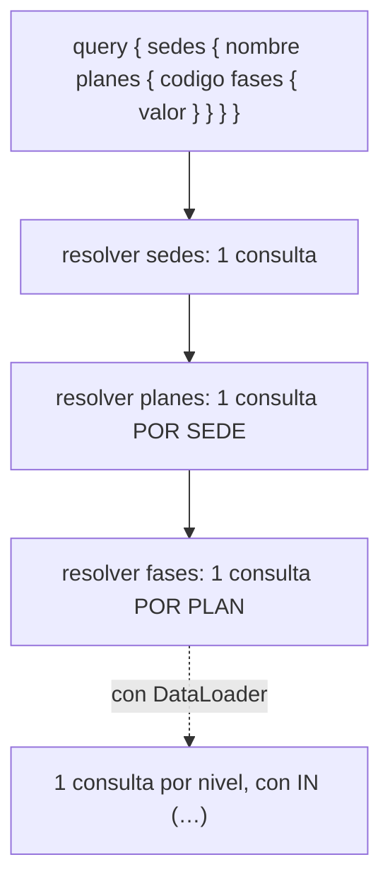

# 🕸️ pr04 — GraphQL desde Python

> Python para desarrolladores Java senior · **Carta** · Track `pr` — Protocolos y contratos más
> allá de REST · sección 4 de 8
> Se lee suelta: no hace falta ninguna otra sección de la carta.
> Versiones verificadas contra PyPI el 05/10/2026 · Código probado el 05/10/2026 con Python 3.14.7,
> en contenedor: las salidas son las de esa corrida.

---

## 🎯 1. Qué problema resuelve

El portal de franquiciados quiere, en una pantalla, cada sede con sus planes activos y las fases de cada plan, y la pantalla siguiente quiere lo mismo
pero solo los saldos. Con REST son dos endpoints a la medida o un endpoint gordo que devuelve todo. GraphQL propone otra cosa: **el cliente escribe la
forma de la respuesta** que necesita, y un solo endpoint la resuelve.

En Python, la biblioteca más usada para servir GraphQL es **Strawberry**, que define el esquema con clases y anotaciones de tipo. La sección la usa para
mostrar lo que GraphQL compra y el costo con nombre propio que trae: **el N+1**. Cada nivel de la consulta se resuelve campo por campo, y una consulta de
sedes con planes con fases dispara una consulta a la base por cada plan. La solución también tiene nombre: el ***DataLoader***, que agrupa esas consultas
en una por nivel.

---

## 🧠 2. El modelo



| Biblioteca | Versión | Cómo se define el esquema |
|---|---|---|
| Strawberry | 0.331.5 | **Clases con anotaciones de tipo** (`@strawberry.type`) |
| Ariadne | 1.1.0 | El esquema en SDL (texto) y *resolvers* aparte |
| Graphene | 3.4.3 | Clases propias; sin versiones desde noviembre de 2024 |

### 🪞 Tu instinto de Java dice… y esta vez se equivoca

Con Spring for GraphQL, los `@SchemaMapping` resuelven cada campo y el instinto espera que la biblioteca se encargue del rendimiento. No lo hace en ninguna de
las dos plataformas: cada *resolver* es una función independiente, y si cada una consulta la base, la cuenta de consultas crece con la forma de la consulta
del cliente. El `@BatchMapping` de Spring y el `DataLoader` de Strawberry existen por lo mismo.

---

## 💻 3. El ejemplo que corre

```bash
uv add strawberry-graphql
```

`portal.py`:

```python
"""El portal de franquiciados en GraphQL con Strawberry: el N+1 contado, y el DataLoader que lo corrige."""

import asyncio
import random
import sqlite3

import strawberry
from strawberry.dataloader import DataLoader

db = sqlite3.connect(":memory:")
db.executescript("""CREATE TABLE plan (id INTEGER PRIMARY KEY, codigo TEXT, sede TEXT);
                    CREATE TABLE fase (id INTEGER PRIMARY KEY, plan_id INTEGER, valor INTEGER);""")
random.seed(2)
for i in range(30):
    pid = db.execute("INSERT INTO plan (codigo, sede) VALUES (?, ?)",
                     (f"PL-{i:03d}", random.choice(["Suba", "Zipaquirá"]))).lastrowid
    db.executemany("INSERT INTO fase (plan_id, valor) VALUES (?, ?)",
                   [(pid, random.randrange(200_000, 3_000_000, 50_000)) for _ in range(4)])
queries: list[str] = []
db.set_trace_callback(queries.append)


async def load_phases(plan_ids: list[int]) -> list[list["Fase"]]:
    marks = ",".join("?" * len(plan_ids))
    rows = db.execute(f"SELECT plan_id, valor FROM fase WHERE plan_id IN ({marks})", plan_ids).fetchall()
    by_plan = {pid: [] for pid in plan_ids}
    for pid, valor in rows:
        by_plan[pid].append(Fase(valor=valor))
    return [by_plan[pid] for pid in plan_ids]


@strawberry.type
class Fase:
    valor: int


@strawberry.type
class Plan:
    id: strawberry.Private[int]
    codigo: str

    @strawberry.field
    async def fases(self, info: strawberry.Info) -> list[Fase]:
        if info.context["batch"]:
            return await info.context["phases"].load(self.id)
        return [Fase(valor=v) for (v,) in db.execute("SELECT valor FROM fase WHERE plan_id = ?", (self.id,))]


@strawberry.type
class Sede:
    nombre: str

    @strawberry.field
    def planes(self) -> list[Plan]:
        return [Plan(id=i, codigo=c) for i, c in db.execute("SELECT id, codigo FROM plan WHERE sede = ?", (self.nombre,))]


@strawberry.type
class Query:
    @strawberry.field
    def sedes(self) -> list[Sede]:
        return [Sede(nombre=n) for (n,) in db.execute("SELECT DISTINCT sede FROM plan ORDER BY sede")]


schema = strawberry.Schema(query=Query)
QUERY = "{ sedes { nombre planes { codigo fases { valor } } } }"


async def run(batch: bool):
    queries.clear()
    result = await schema.execute(QUERY, context_value={"batch": batch, "phases": DataLoader(load_fn=load_phases)})
    sedes = result.data["sedes"]
    total = sum(f["valor"] for s in sedes for p in s["planes"] for f in p["fases"])
    print(f"{'con' if batch else 'sin'} DataLoader: {len(queries):>2} consultas a la base · "
          f"{len(sedes)} sedes, {sum(len(s['planes']) for s in sedes)} planes · total ${total:,}")


asyncio.run(run(batch=False))
asyncio.run(run(batch=True))
print(schema.as_str().splitlines()[0:3])
```

```bash
python3 portal.py
```

Salida (Python 3.14.7, 05/10/2026):

```text
sin DataLoader: 33 consultas a la base · 2 sedes, 30 planes · total $195,250,000
con DataLoader:  4 consultas a la base · 2 sedes, 30 planes · total $195,250,000
['type Fase {', '  valor: Int!', '}']
```

La misma consulta, la misma respuesta, y 33 consultas a la base contra 4. Sin `DataLoader`: una para las sedes, una por sede para sus planes (2) y una por
plan para sus fases (30). Con él, las 30 del último nivel se volvieron una sola con `IN (…)`. Las tres líneas finales son el comienzo del esquema en SDL,
generado desde las clases: el contrato que se publica.

**Detalles con intención**

- **El esquema sale de las clases**: `Sede`, `Plan` y `Fase` con anotaciones de tipo son el esquema de GraphQL; `schema.as_str()` lo imprime en SDL, el
  contrato que se publica (`pr01`).
- **`strawberry.Private[int]`** guarda el `id` del plan en el objeto sin exponerlo en el esquema: el cliente no lo ve ni lo puede pedir.
- **El `DataLoader` vive en el contexto de cada petición**: junta todos los `load(plan_id)` que se piden mientras se resuelve un nivel y llama una sola vez a
  `load_phases` con la lista. Uno por petición, porque también hace de caché y no debe mezclar usuarios.
- **Las fases se resuelven con `async`** porque el `DataLoader` agrupa lo que se pide dentro de la misma vuelta del ciclo de eventos; en un *resolver*
  síncrono no tendría qué agrupar.

---

## ⚠️ 4. Lo que se rompe

**El N+1 que depende del cliente.** Con REST, el servidor decide cuántas consultas hace un endpoint; con GraphQL, las decide **la consulta del cliente**. Un
cliente que pide un nivel más multiplica la carga. Se mide con la consulta más profunda que se permita, no con la de la demo.

**Consultas sin límite.** Una consulta anidada a propósito (`sedes { planes { sede { planes { … } } } }`) puede tumbar el servidor. Se limitan la profundidad y
el costo (Strawberry tiene extensiones para eso).

**Los permisos por campo.** En REST se protege un endpoint; en GraphQL, cada campo es una puerta. El franquiciado de Suba que pide `sedes { planes }` no debe
ver los de Zipaquirá: el filtro va en el *resolver*, no en la pantalla.

**El caché HTTP que no sirve.** Todo es un `POST` al mismo endpoint, y los cachés de HTTP no ayudan. El caché se hace en el servidor o con consultas
persistidas.

---

## ⚖️ 5. Cuándo NO usarlo

**Para una API con dos o tres clientes conocidos.** Endpoints REST a la medida, con su OpenAPI, son más simples de proteger, medir y cachear.

**Entre servicios.** Para servicio a servicio, REST o gRPC (`pr02`) con contratos fijos. GraphQL brilla cuando hay muchas pantallas con necesidades distintas.

**Si nadie va a vigilar las consultas.** Sin límites ni medición, GraphQL le entrega al cliente el control de la carga del servidor.

---

## 🧪 6. Ejercicios (10)

**🟢 Fácil (1–3)**

1. Corre el ejemplo. **Criterio:** explicas las dos cifras de consultas.
2. Pide solo `{ sedes { nombre } }`. **Criterio:** cuántas consultas hace, y por qué GraphQL no resuelve lo que no se pidió.
3. Imprime el esquema completo con `schema.as_str()`. **Criterio:** encuentras que `id` no está.

**🟡 Intermedio (4–6)**

4. Agrega un `DataLoader` también para los planes por sede. **Criterio:** la consulta del ejemplo baja a 3 consultas.
5. Agrega un argumento `sede` a `sedes` y filtra por el franquiciado del contexto. **Criterio:** el de Suba no ve Zipaquirá aunque la pida.
6. Sirve el esquema con FastAPI (`strawberry.fastapi.GraphQLRouter`) y consúltalo con `httpx`. **Criterio:** la misma respuesta por HTTP.

**🟠 Difícil (7–9)**

7. Limita la profundidad de las consultas a 4 con la extensión de Strawberry. **Criterio:** una consulta de profundidad 5 se rechaza con un error claro.
8. Escribe el mismo esquema en Ariadne (SDL primero). **Criterio:** las mismas respuestas, y qué prefieres de cada estilo.
9. Mide la consulta con 1 000 planes con y sin `DataLoader`. **Criterio:** consultas y milisegundos de cada caso.

**🔴 Muy difícil (10)**

10. Decide si el portal de franquiciados de Áurea se sirve en GraphQL o en REST. **Criterio:** una página. *Rúbrica:* (a) las pantallas y lo que pide cada una;
    (b) el número de consultas medido en el peor caso; (c) cómo se aplican los permisos por sede; (d) la decisión y su costo de operación.

---

## 📚 7. Referencias

**Documentación oficial**

- Strawberry: https://strawberry.rocks/docs
- Strawberry, *DataLoaders*: https://strawberry.rocks/docs/guides/dataloaders
- GraphQL, la especificación: https://spec.graphql.org/

**Orden de lectura sugerido:** la guía de *DataLoaders* de Strawberry; después la de seguridad (límites de consultas) de la misma documentación.

---

## 🚀 8. Cierre

GraphQL deja que el cliente pida la forma exacta de la respuesta, y Strawberry define el esquema con clases tipadas. El costo es que la consulta del cliente
decide la carga del servidor: el N+1 aparece por nivel y se corrige con un `DataLoader` por petición, y la profundidad, el costo y los permisos por campo se
controlan en el servidor.

**La señal de que quedó bien:** *"La pantalla de sedes con planes y fases hace cuatro consultas a la base, y el franquiciado de Suba no ve las de nadie más."*

> 🏷️ **Cierra la sección con su tag**, cuando los ejercicios que elegiste estén hechos:
>
> ```bash
> git tag -a op-pr-fase-04 -m "op pr04 cerrada: GraphQL con Strawberry, el N+1 contado y el DataLoader"
> ```
>
> Los commits llevan su prefijo (`op pr04: …`) y los de ejercicio su número
> (`op pr04 ej07: …`).
