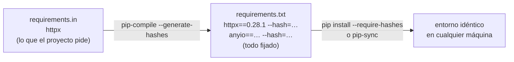

# 🧰 pk02 — pip, venv y pip-tools

> Python para desarrolladores Java senior · **Carta** · Track `pk` — El panorama de gestores y
> empaquetado · sección 2 de 8
> Se lee suelta: no hace falta ninguna otra sección de la carta.
> Versiones verificadas contra PyPI el 05/10/2026 · Código probado el 05/10/2026 con Python 3.14.7,
> en contenedor: las salidas son las de esa corrida.

---

## 🎯 1. Qué problema resuelve

El servidor de una sede tiene Python y nada más: no se puede instalar `uv`, la política de la empresa del cliente no lo permite, o es un servidor viejo
que nadie quiere tocar. El camino que funciona en cualquier máquina con Python es el que viene con Python: **`venv`** para el entorno y **`pip`** para
instalar. Su límite es conocido: `pip install -r requirements.txt` con versiones sueltas instala hoy una cosa y en seis meses otra, porque las
dependencias de las dependencias cambian.

**`pip-tools`** cierra ese hueco sin cambiar de herramienta: de un `requirements.in` con lo que el proyecto pide, `pip-compile` genera un
`requirements.txt` con **todas** las versiones fijadas —también las transitivas— y, si se pide, con el *hash* de cada archivo. Es el equivalente de un
*lock*, en el formato que `pip` ya entiende. El camino base midió sus tiempos frente a `uv` y Miniforge (`BENCHMARKS.md` §07: 11,1 s contra 0,4 s en caché
fría); esta sección no los repite: muestra lo que compra.

---

## 🧠 2. El modelo



| Herramienta | Versión | Qué hace |
|---|---|---|
| `pip` | 26.2.1 | Instala; resuelve versiones al momento de instalar |
| `venv` | biblioteca estándar | El entorno (`pk01`) |
| `pip-tools` | 7.6.1 | `pip-compile` fija todo en un `requirements.txt`; `pip-sync` deja el entorno exactamente igual a ese archivo |

| | `pip` solo | `pip` + `pip-tools` |
|---|---|---|
| Dependencias transitivas | Las que haya ese día | **Fijadas** |
| Verificación de lo descargado | No | **Con `--require-hashes`** |
| Quitar lo que sobra del entorno | No (`pip uninstall` a mano) | `pip-sync` |
| Instalar el intérprete | No | No |

### 🪞 Tu instinto de Java dice… y esta vez se equivoca

Con Maven, las versiones del `pom.xml` son exactas y las transitivas se resuelven igual cada vez, así que el instinto asume que `requirements.txt` con `httpx`
es "una dependencia declarada". Sin versión, es una invitación a instalar lo último; con `httpx==0.28.1`, las dependencias de `httpx` siguen sueltas. Lo que da
la reproducibilidad de Maven es el archivo **compilado**, con todo fijado.

---

## 💻 3. El ejemplo que corre

```bash
python3 -m venv .venv && .venv/bin/pip install pip-tools
```

`requirements.in`:

```pip-requirements
httpx
```

`fijar.sh`:

```bash
set -euo pipefail
.venv/bin/pip-compile --quiet --strip-extras --generate-hashes --output-file requirements.txt requirements.in
echo "paquetes fijados: $(grep -c '==' requirements.txt) · hashes: $(grep -c -- '--hash=' requirements.txt)"
grep -E '^[a-z].*==' requirements.txt | cut -d' ' -f1

python3 -m venv limpio
limpio/bin/pip install --quiet --require-hashes -r requirements.txt && echo "instalación verificada: OK"

# Alguien (o algo) altera los hashes: lo que se descarga ya no coincide con ninguno.
sed -i 's/--hash=sha256:[0-9a-f]\{4\}/--hash=sha256:0000/g' requirements.txt
python3 -m venv limpio2
limpio2/bin/pip install --quiet --require-hashes -r requirements.txt 2>&1 | grep -m1 -E 'THESE PACKAGES DO NOT MATCH|ERROR' || true
```

```bash
bash fijar.sh
```

Salida (Python 3.14.7, 05/10/2026):

```text
paquetes fijados: 7 · hashes: 14
anyio==4.15.1
certifi==2026.7.22
h11==0.16.0
httpcore==1.0.9
httpx==0.28.1
idna==3.20
typing-extensions==4.16.0
instalación verificada: OK
ERROR: THESE PACKAGES DO NOT MATCH THE HASHES FROM THE REQUIREMENTS FILE. If you have updated the package versions, please update the hashes. Otherwise, examine the package contents carefully; someone may have tampered with them.
```

Una dependencia pedida, siete fijadas con catorce *hashes*. La instalación en un entorno limpio verificó cada archivo contra su *hash*; con los *hashes* alterados,
`pip` se negó a instalar y dijo por qué, sugiriendo exactamente la sospecha correcta.

**Detalles con intención**

- **Una línea en `requirements.in`, siete paquetes fijados**: `httpx` trae `anyio`, `certifi`, `h11`, `httpcore`, `idna` y `typing-extensions`. Sin `pip-compile`,
  esas seis quedan a la suerte del día de la instalación.
- **Dos *hashes* por paquete** (la rueda y el código fuente): `pip` acepta el archivo si coincide con **cualquiera** de los dos. La primera versión de este ejemplo
  alteró uno solo y la instalación pasó igual, porque descargó la rueda, cuyo *hash* seguía bien. La protección es contra un archivo distinto, no contra
  una línea editada del `requirements.txt`; esa la protege la revisión del *diff*.
- **`--strip-extras`** quita los *extras* (`paquete[extra]`) del archivo compilado; `pip-tools` avisa que será el comportamiento por defecto en la versión 8, y
  conviene fijarlo ya.
- **`--generate-hashes`** guarda el *hash* de cada archivo descargable. Con `--require-hashes`, `pip` se niega a instalar algo cuyo contenido no coincide: protege
  contra un paquete reemplazado en el índice o en un espejo (`se07`).
- **El `requirements.txt` compilado se versiona**; el `.in` también. Para actualizar: `pip-compile --upgrade`, se revisa el *diff*, y se confirma.
- **Todo esto funciona con el Python del sistema y nada más** que `pip-tools` dentro del entorno: es la razón para conocer este camino aunque el proyecto use `uv`.

---

## ⚠️ 4. Lo que se rompe

**Compilar en una plataforma e instalar en otra.** `pip-compile` resuelve para la plataforma y la versión de Python donde corre. Un `requirements.txt` compilado en
macOS puede fijar un paquete que en Linux necesita otra dependencia, o un *hash* de una rueda que en Linux no existe. Se compila en la misma plataforma que
producción (un contenedor), o una vez por plataforma.

**`pip freeze` como *lock*.** Congela lo que hay en el entorno, incluidas las herramientas que alguien instaló a mano y sin distinguir lo pedido de lo arrastrado.
El `.in` dice qué quiere el proyecto; `freeze` dice qué tiene una máquina.

**Las dependencias de desarrollo mezcladas.** `pytest` y `ruff` no van a producción. Se separan en `requirements-dev.in` con `-c requirements.txt`, para que las
versiones compartidas coincidan.

---

## ⚖️ 5. Cuándo NO usarlo

**Si se puede instalar `uv`.** Hace lo mismo —incluido exportar a `requirements.txt` con *hashes*— diez a cien veces más rápido (`pk03`, `BENCHMARKS.md` §07), y
además instala el intérprete.

**Para paquetes con dependencias que no son de Python.** GDAL, CUDA o un compilador: `pip` no los instala; conda sí (`pk04`).

**Para publicar una biblioteca.** Una biblioteca no fija versiones exactas (las fija la aplicación que la usa); declara rangos en `pyproject.toml` (`pk06`).

---

## 🧪 6. Ejercicios (10)

**🟢 Fácil (1–3)**

1. Corre el ejemplo. **Criterio:** los siete paquetes fijados y explicas por qué falló la segunda instalación.
2. Instala `httpx` sin versión con `pip` solo y compara lo que quedó con el `requirements.txt`. **Criterio:** las mismas versiones hoy; explicas qué cambiaría en seis
   meses.
3. Corre `pip-compile --upgrade-package httpx`. **Criterio:** describes qué cambia en el archivo.

**🟡 Intermedio (4–6)**

4. Separa `requirements-dev.in` con `pytest` y `-c requirements.txt`. **Criterio:** las dos compilaciones, y una dependencia compartida con la misma versión.
5. Agrega un paquete al entorno a mano y corre `pip-sync`. **Criterio:** el paquete sobrante desaparece.
6. Compila el mismo `.in` en macOS y en un contenedor Linux. **Criterio:** las diferencias, si las hay, y por qué.

**🟠 Difícil (7–9)**

7. Exporta el mismo *lock* desde `uv` (`uv export --format requirements-txt`). **Criterio:** compara con el de `pip-compile`.
8. Arma un `Dockerfile` que instale con `--require-hashes` en una etapa y copie el entorno a la imagen final. **Criterio:** la imagen final no tiene `pip-tools`.
9. Usa un índice privado (o un espejo local con `pip download` y `--find-links`) para instalar sin internet. **Criterio:** la instalación funciona con la red cortada.

**🔴 Muy difícil (10)**

10. Prepara la instalación del agente de sede para servidores donde solo hay Python. **Criterio:** una página y los archivos. *Rúbrica:* (a) qué se versiona; (b) cómo se
    compila para la plataforma de las sedes; (c) cómo se instala sin internet; (d) cómo se actualiza.

---

## 📚 7. Referencias

**Documentación oficial**

- `pip-tools`: https://pip-tools.readthedocs.io/en/stable/
- `pip`, modo de verificación de *hashes*: https://pip.pypa.io/en/stable/topics/secure-installs/
- *Python Packaging User Guide*: https://packaging.python.org/en/latest/

**Orden de lectura sugerido:** la página de instalaciones seguras de `pip`; después la documentación de `pip-tools`.

---

## 🚀 8. Cierre

`venv` y `pip` funcionan en cualquier máquina con Python; `pip-tools` les agrega lo que faltaba: un `requirements.txt` compilado con todo fijado y con *hashes*
que `pip` verifica. Es el camino sin dependencias, más lento que `uv`, y el que sigue funcionando en el servidor donde no se puede instalar nada más.

**La señal de que quedó bien:** *"El agente se instaló en el servidor viejo de la sede con el mismo `requirements.txt` que en el CI, y `pip` verificó cada paquete."*

> 🏷️ **Cierra la sección con su tag**, cuando los ejercicios que elegiste estén hechos:
>
> ```bash
> git tag -a op-pk-fase-02 -m "op pk02 cerrada: pip-compile con hashes y la instalación verificada"
> ```
>
> Los commits llevan su prefijo (`op pk02: …`) y los de ejercicio su número
> (`op pk02 ej07: …`).
