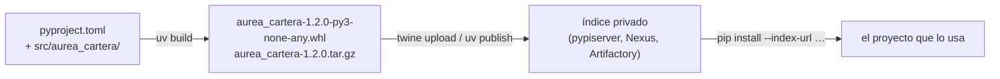

# 📮 pk06 — Empaquetar y publicar

> Python para desarrolladores Java senior · **Carta** · Track `pk` — El panorama de gestores y
> empaquetado · sección 6 de 8
> Se lee suelta: no hace falta ninguna otra sección de la carta.
> Versiones verificadas contra PyPI el 05/10/2026 · Código probado el 05/10/2026 con Python 3.14.7,
> en contenedor: las salidas son las de esa corrida.

---

## 🎯 1. Qué problema resuelve

El cálculo de mora y regalías (`aurea-cartera`) lo usan tres procesos de Áurea y el desarrollador externo de la franquicia de Zipaquirá. Hoy cada uno copia
la carpeta del código, y hay tres versiones distintas del mismo cálculo dando vueltas. Lo que hace falta es lo que en Java es un *jar* en el Nexus de la casa:
**un paquete con versión, publicado en un índice**, que cada proyecto instala y fija.

En Python eso es una **rueda** (*wheel*, un `.whl`: el paquete listo para instalar) y un **sdist** (el código fuente empaquetado), construidos desde el
`pyproject.toml` por un *backend* de construcción (hatchling, setuptools, el de `uv`), y publicados en PyPI o en un **índice privado**. La sección construye el
paquete, mira qué hay adentro de la rueda —incluido el comando de consola que agrega—, lo publica en un índice privado propio y lo instala desde ahí, como haría
la franquicia.

---

## 🧠 2. El modelo



| Pieza | Qué es | Equivalente en Java |
|---|---|---|
| `pyproject.toml` `[project]` | Nombre, versión, dependencias (PEP 621) | `pom.xml` |
| `[build-system]` | Qué *backend* construye el paquete (hatchling, setuptools, `uv_build`) | El *plugin* de empaquetado |
| Rueda (`.whl`) | Un zip listo para instalar, con metadatos | El *jar* |
| sdist (`.tar.gz`) | El código fuente, para construir donde no hay rueda | El *jar* de fuentes |
| `[project.scripts]` | Comandos de consola que se crean al instalar | La clase `Main` con un *launcher* |
| Índice | PyPI, o uno privado | Maven Central, o el Nexus de la casa |

| Herramienta | Versión | Para qué |
|---|---|---|
| `uv build` / `python -m build` | 0.12.23 / 1.6.1 | Construir rueda y sdist |
| `hatchling` | 1.32.4 | *Backend* de construcción |
| `twine` | 7.0.0 | Subir a un índice |
| `pypiserver` | 2.4.2 | Un índice privado mínimo |

### 🪞 Tu instinto de Java dice… y esta vez se equivoca

En Maven, el número de versión vive en el `pom.xml` y la versión `-SNAPSHOT` se reemplaza en el repositorio. En PyPI y en la mayoría de los índices, **una versión
publicada no se puede reemplazar**: subir `1.2.0` dos veces falla. El instinto de "vuelvo a subir la misma versión con el arreglo" no funciona; se publica `1.2.1`.

---

## 💻 3. El ejemplo que corre

El paquete, `aurea-cartera/pyproject.toml`:

```toml
[project]
name = "aurea-cartera"
version = "1.2.0"
description = "Cálculos de cartera de la red Áurea"
requires-python = ">=3.12"
dependencies = []

[project.scripts]
aurea-mora = "aurea_cartera.cli:main"

[build-system]
requires = ["hatchling"]
build-backend = "hatchling.build"
```

`aurea-cartera/src/aurea_cartera/__init__.py`:

```python
"""Cálculos de cartera de la red Áurea."""


def mora(saldo: int, dias: int, tasa_mensual_milesimas: int = 15) -> int:
    return round(saldo * tasa_mensual_milesimas * dias / (1000 * 30))
```

`aurea-cartera/src/aurea_cartera/cli.py`:

```python
import sys

from aurea_cartera import mora


def main() -> None:
    saldo, dias = map(int, sys.argv[1:3])
    print(f"${mora(saldo, dias):,}".replace(",", "."))
```

`publicar.sh` construye, mira la rueda, levanta un índice privado, publica e instala desde él:

```bash
set -euo pipefail
(cd aurea-cartera && uv build --quiet)
ls aurea-cartera/dist
python3 -m zipfile -l aurea-cartera/dist/aurea_cartera-1.2.0-py3-none-any.whl | awk 'NR>1 {print "  ", $1}'
unzip -p aurea-cartera/dist/aurea_cartera-1.2.0-py3-none-any.whl 'aurea_cartera-1.2.0.dist-info/entry_points.txt'

mkdir -p indice && pypi-server run -p 8151 -a . -P . indice >/dev/null 2>&1 &
sleep 2
twine upload --repository-url http://127.0.0.1:8151 -u x -p x aurea-cartera/dist/* >/dev/null && echo "publicado en el índice privado"
twine upload --repository-url http://127.0.0.1:8151 -u x -p x aurea-cartera/dist/*.whl 2>&1 | grep -m1 -oE "HTTPError: [0-9]+ [A-Za-z ]+" || true

python3 -m venv franquicia
franquicia/bin/pip install --quiet --index-url http://127.0.0.1:8151/simple/ aurea-cartera==1.2.0
franquicia/bin/aurea-mora 1250000 45
```

```bash
pip install uv twine pypiserver
bash publicar.sh
```

Salida (Python 3.14.7, 05/10/2026):

```text
aurea_cartera-1.2.0-py3-none-any.whl
aurea_cartera-1.2.0.tar.gz
   aurea_cartera/__init__.py
   aurea_cartera/cli.py
   aurea_cartera-1.2.0.dist-info/METADATA
   aurea_cartera-1.2.0.dist-info/WHEEL
   aurea_cartera-1.2.0.dist-info/entry_points.txt
   aurea_cartera-1.2.0.dist-info/RECORD
[console_scripts]
aurea-mora = aurea_cartera.cli:main
publicado en el índice privado
HTTPError: 400 Bad Request from http
$28.125
```

La rueda trae el código, los metadatos y el `entry_points.txt` que declara `aurea-mora`. Publicada en el índice privado, la "franquicia" la instaló con `pip` desde ese
índice y el comando apareció solo, calculando la misma mora de toda la carta. El segundo intento de subir la misma versión lo rechazó el índice —`pypiserver` responde
400; PyPI también responde 400, con el motivo "File already exists"—: una versión publicada no se reemplaza.

**Detalles con intención**

- **La disposición `src/`** (el código en `src/aurea_cartera/`) obliga a probar el paquete instalado y no la carpeta: un archivo que no entró en la rueda falla en las
  pruebas, no en la franquicia.
- **`py3-none-any`** en el nombre de la rueda dice que sirve para cualquier Python 3, cualquier ABI y cualquier plataforma: es Python puro. Un paquete con extensiones
  en C tendría una rueda por plataforma (`cp314-cp314-manylinux…`).
- **`entry_points.txt`** es lo que hace que al instalar aparezca el comando `aurea-mora` en el `bin/` del entorno: el *launcher* lo genera el instalador, no el paquete.
- **El segundo `upload` falla**: la misma versión no se puede volver a subir. Es la regla que protege a quien ya instaló `1.2.0`. El código de error no es el 409 que uno
  esperaría (la primera versión de este ejemplo lo buscaba y no lo encontró): `pypiserver` y PyPI responden 400.

---

## ⚠️ 4. Lo que se rompe

**Archivos que no entran en la rueda.** Un CSV de tasas o una plantilla que el código lee y que el *backend* no incluyó: funciona en la máquina del ingeniero (que
corre desde la carpeta) y falla instalado. Se declaran (`[tool.hatch.build]`) y se leen con `importlib.resources`, y `check-wheel-contents` revisa la rueda.

**La versión escrita en dos lugares.** `version = "1.2.0"` en `pyproject.toml` y `__version__ = "1.2.1"` en el código. Se escribe en un solo lugar (dinámica desde
`importlib.metadata`, o desde las etiquetas de git con un *plugin*).

**Dependencias fijadas en una biblioteca.** `aurea-cartera` no debe pedir `httpx==0.28.1`: obligaría a todos sus usuarios a esa versión exacta. Una biblioteca
declara rangos (`httpx>=0.27,<1`); la aplicación que la usa fija todo con su *lock* (`pk02`, `pk03`).

**El índice privado sin TLS ni autenticación.** El ejemplo corre `pypiserver` sin las dos cosas para la prueba. En la casa, el índice va detrás del proxy con TLS (`se06`)
y con usuarios para publicar.

---

## ⚖️ 5. Cuándo NO empaquetar

**Para un *script* que usa una persona.** Un archivo con PEP 723 (`pk07`) se comparte sin índice ni versión.

**Para código que vive en un solo repositorio.** Si los tres procesos están en el mismo repositorio, un paquete local (`uv` *workspaces*) evita publicar.

**PyPI público para código de la casa.** El cálculo de regalías de Áurea no va a PyPI: un índice privado, o el registro de paquetes del proveedor de Git.

---

## 🧪 6. Ejercicios (10)

**🟢 Fácil (1–3)**

1. Corre el ejemplo. **Criterio:** explicas cada archivo de la rueda y el error del segundo `upload`.
2. Sube la versión a `1.2.1`, construye y publica. **Criterio:** la franquicia instala `1.2.1` con `pip install -U`.
3. Abre `METADATA` dentro de la rueda. **Criterio:** encuentras el nombre, la versión y `Requires-Python`.

**🟡 Intermedio (4–6)**

4. Agrega un CSV de tasas al paquete y léelo con `importlib.resources`. **Criterio:** funciona instalado desde el índice, no solo desde la carpeta.
5. Pasa `check-wheel-contents` sobre la rueda. **Criterio:** qué revisa y si encuentra algo.
6. Lee la versión desde `importlib.metadata.version("aurea-cartera")` en el código. **Criterio:** un solo lugar para la versión.

**🟠 Difícil (7–9)**

7. Agrega una dependencia con rango y verifica qué instala la franquicia con un *lock* propio. **Criterio:** la franquicia controla la versión exacta.
8. Publica con `uv publish` en vez de `twine`. **Criterio:** el mismo resultado, y qué configuración necesitó.
9. Pon el índice detrás de Caddy con TLS y autenticación (en un contenedor, sin puertos por defecto). **Criterio:** `pip` instala con las credenciales; sin ellas, falla.

**🔴 Muy difícil (10)**

10. Diseña la distribución de `aurea-cartera`. **Criterio:** una página. *Rúbrica:* (a) índice y quién publica; (b) la política de versiones y qué se hace con un error
    publicado; (c) cómo instala la franquicia y con qué credenciales; (d) cómo se prueba la rueda antes de publicarla.

---

## 📚 7. Referencias

**Documentación oficial**

- *Python Packaging User Guide*, empaquetar un proyecto: https://packaging.python.org/en/latest/tutorials/packaging-projects/
- Especificación de las ruedas: https://packaging.python.org/en/latest/specifications/binary-distribution-format/
- `pypiserver`: https://github.com/pypiserver/pypiserver

**Orden de lectura sugerido:** el tutorial de empaquetado de la guía oficial; después la especificación de ruedas, para leer el nombre de un `.whl`.

---

## 🚀 8. Cierre

Un paquete de Python es una rueda y un sdist construidos desde el `pyproject.toml`, con sus comandos de consola declarados, publicados en un índice donde una versión
no se reemplaza. Para el código de la casa, un índice privado; las bibliotecas declaran rangos y las aplicaciones fijan.

**La señal de que quedó bien:** *"La franquicia instala `aurea-cartera==1.2.0` del índice de la casa, y el cálculo de mora es el mismo en los cuatro lugares."*

> 🏷️ **Cierra la sección con su tag**, cuando los ejercicios que elegiste estén hechos:
>
> ```bash
> git tag -a op-pk-fase-06 -m "op pk06 cerrada: la rueda por dentro y el índice privado de la casa"
> ```
>
> Los commits llevan su prefijo (`op pk06: …`) y los de ejercicio su número
> (`op pk06 ej07: …`).
