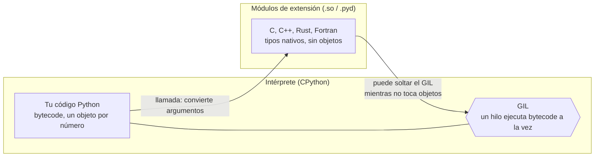

# 🧱 ff01 — El modelo: GIL y módulos de extensión

> Python para desarrolladores Java senior · **Carta** · Track `ff` — La frontera nativa ·
> sección 1 de 8
> Se lee suelta: no hace falta ninguna otra sección de la carta.
> Versiones verificadas contra PyPI el 05/10/2026 · Código probado el 05/10/2026 con Python 3.14.7,
> en contenedor: las salidas son las de esa corrida.

---

## 🎯 1. Qué problema resuelve

"Python es lento" es cierto y casi inútil. El bucle de Python es lento; la multiplicación de matrices de NumPy, que se llama desde Python, corre a la velocidad
de C, porque **es** C. Para quien viene de Java, el equivalente mental es JNI, con una diferencia que cambia todo: en Java, cruzar a código nativo es un último
recurso que casi nadie toca; en Python es **lo normal**. Buena parte de lo que importas —`json`, `hashlib`, `sqlite3`, NumPy entero— ya vive del otro lado.

Este track trata de esa frontera: dónde está, qué cuesta cruzarla y qué herramientas hay para moverla. Esta primera sección arma el modelo con tres mediciones:
cuánto de lo que ya usas es C, cuánto cuesta el mismo cálculo a cada lado, y qué hace el GIL con los hilos según de qué lado corre el trabajo. Las secciones
siguientes usan un ejemplo propio —un cálculo numérico cualquiera, medido antes y después—, porque el tema no necesita a Áurea para justificarse.

---

## 🧠 2. El modelo



| Pieza | Qué es | El equivalente en Java |
|---|---|---|
| **Módulo de extensión** | Una biblioteca compartida (`.so`, `.pyd`) que el intérprete carga con `import` | Una biblioteca nativa cargada con JNI o FFM |
| **API de C de CPython** | Las funciones con las que el código nativo crea y lee objetos de Python | `JNIEnv` y sus funciones |
| **GIL** | El candado que deja ejecutar *bytecode* a un hilo a la vez | No existe: la JVM corre hilos en paralelo |
| **Soltar el GIL** | El código nativo lo libera mientras trabaja con sus propios datos | — |
| **Compilación sin GIL** (PEP 703) | Un CPython distinto, `3.14t`, sin el candado (`ff07`) | El modelo normal de la JVM |

### 🪞 Tu instinto de Java dice… y esta vez se equivoca

El instinto dice que el GIL impide el paralelismo con hilos, y en general es cierto: dos hilos que ejecutan Python puro no corren a la vez. Pero el GIL protege al
**intérprete**, no al proceso: el código nativo que no toca objetos de Python puede soltarlo, y entonces los hilos sí corren en paralelo. `hashlib`, la compresión,
NumPy en muchas operaciones y casi toda la E/S lo hacen. "Hilos en Python no sirven para CPU" es verdad para el bucle; para el trabajo que vive en C, la respuesta
depende de si la biblioteca suelta el candado.

---

## 💻 3. El ejemplo que corre

`frontera.py`:

```python
"""Dónde está la frontera con C: qué ya es nativo, cuánto cuesta el bucle, y quién suelta el GIL."""

import hashlib
import pathlib
import sys
import threading
import time

import numpy as np

# 1) Lo que ya es C sin que nadie lo dijera
core = pathlib.Path(np.__file__).parent
print("numpy: archivos .py", len(list(core.rglob("*.py"))), "· extensiones .so", len(list(core.rglob("*.so"))))
print("el corazón de numpy:", pathlib.Path(np._core._multiarray_umath.__file__).name)
import json.decoder
print("json usa su acelerador en C:", json.decoder.scanstring.__module__)

# 2) El mismo cálculo a los dos lados de la frontera
values = [i * 0.001 for i in range(5_000_000)]
array = np.array(values)
def best(fn, n=3):
    times = []
    for _ in range(n):
        start = time.perf_counter(); fn(); times.append(time.perf_counter() - start)
    return min(times) * 1000
def loop():
    total = 0.0
    for v in values:
        total += v * v
    return total
print(f"suma de cuadrados, 5M · bucle {best(loop):6.1f} ms · sum() {best(lambda: sum(v * v for v in values)):6.1f} ms"
      f" · numpy {best(lambda: float(array @ array)):5.1f} ms")

# 3) El GIL: quién lo suelta
def pure(): 
    x = 0
    for i in range(3_000_000):
        x += i
blob = b"x" * 64_000_000
def native():
    hashlib.sha256(blob).digest()
def speedup(work, threads=4):
    start = time.perf_counter()
    for _ in range(threads):
        work()
    sequential = time.perf_counter() - start
    start = time.perf_counter()
    pool = [threading.Thread(target=work) for _ in range(threads)]
    for t in pool: t.start()
    for t in pool: t.join()
    return sequential / (time.perf_counter() - start)
print(f"GIL activo: {sys._is_gil_enabled()} · 4 hilos, Python puro: {speedup(pure):.2f}× · 4 hilos, sha256 en C: {speedup(native):.2f}×")
```

```bash
pip install numpy
python3 frontera.py
```

Salida (Python 3.14.7, 05/10/2026) (8 núcleos; los milisegundos son de la máquina que corre):

```text
numpy: archivos .py 407 · extensiones .so 19
el corazón de numpy: _multiarray_umath.cpython-314-aarch64-linux-gnu.so
json usa su acelerador en C: _json
suma de cuadrados, 5M · bucle  104.8 ms · sum()  135.2 ms · numpy   1.6 ms
GIL activo: True · 4 hilos, Python puro: 1.09× · 4 hilos, sha256 en C: 3.76×
```

Tres lecturas. NumPy tiene 407 archivos `.py` y 19 extensiones, y el trabajo pesado está en una de ellas, compilada para **CPython 3.14 en Linux ARM**: el nombre
del archivo dice para qué intérprete y qué plataforma es (el problema de distribución que cierra el track, `ff08`). El mismo cálculo cuesta **104,8 ms** en el
bucle y **1,6 ms** en NumPy, 65 veces menos; y la versión "pythónica" con `sum()` y un generador es **más lenta** que el bucle, porque agrega una llamada por
elemento. Y el GIL: con cuatro hilos, el bucle de Python puro gana 1,09× —nada—, mientras `sha256` sobre 64 MB gana **3,76×** con el GIL activo, porque
`hashlib` lo suelta mientras calcula.

**Detalles con intención**

- **`np._core._multiarray_umath`** es la extensión central de NumPy 2 (en NumPy 1 vivía en `np.core`). Su nombre lleva la etiqueta de ABI: `cpython-314` y
  `aarch64-linux-gnu`.
- **`json.decoder.scanstring.__module__`** devuelve `_json`: la biblioteca estándar tiene versiones en Python puro y aceleradores en C que se usan si están.
- **`best`** reporta el mínimo de tres corridas: lo que se quiere es el costo del cálculo, no el ruido de la máquina.
- **El blob de 64 MB** es para que el cálculo domine sobre el costo de crear los hilos. `hashlib` suelta el GIL solo para datos de más de 2 KB; con cadenas
  cortas, cuatro hilos no ganarían nada.

---

## ⚠️ 4. Lo que se rompe

**Medir "Python" cuando el trabajo está en C.** Un *benchmark* que compara Java con un *script* de Python que llama a NumPy está midiendo C. No está mal, pero hay
que saberlo antes de sacar conclusiones sobre el lenguaje.

**Cruzar la frontera un millón de veces.** Cada llamada de Python a C convierte argumentos y resultados. Una función nativa rápida llamada desde un bucle de Python
por cada elemento puede ser más lenta que el bucle solo; el beneficio está en cruzar **una vez** con mucho trabajo (`ds01` del camino base lo midió con la
conversión de listas a *arrays*).

**Suponer que una biblioteca suelta el GIL.** Algunas lo hacen, otras no, y la documentación casi nunca lo dice. Se mide con hilos antes de diseñar alrededor.

**Mezclar extensiones de versiones distintas.** Una `.so` compilada para `cpython-313` no se carga en 3.14. Al cambiar de intérprete, se reinstala todo.

---

## ⚖️ 5. Cuándo NO cruzar la frontera

**Si la función no es el cuello de botella.** Se mide primero (`cProfile`, `py-spy`); casi siempre el tiempo está en la base de datos o la red.

**Si NumPy o la biblioteca estándar ya lo hacen.** Antes de escribir C, se busca quién ya lo escribió: la frontera más barata es la que otro mantiene.

**Si el trabajo es E/S.** Los hilos o `asyncio` ya la paralelizan con el GIL activo (`BENCHMARKS.md` §14: 3,95× con hilos).

---

## 🧪 6. Ejercicios (10)

**🟢 Fácil (1–3)**

1. Corre el ejemplo. **Criterio:** las cinco líneas, y por qué `sum()` es más lento que el bucle.
2. Lista las extensiones `.so` de tu entorno (`find .venv -name "*.so"`). **Criterio:** cuántas son y de qué paquetes.
3. Compara `json.decoder.scanstring` (C) con `json.decoder.py_scanstring` (Python) sobre una cadena JSON de un millón de caracteres. **Criterio:** los dos tiempos.

**🟡 Intermedio (4–6)**

4. Repite la medición del GIL con `zlib.compress` y con `bz2.compress`. **Criterio:** cuál suelta el GIL y cuánto gana cada una.
5. Repite el `sha256` con bloques de 1 KB en vez de 64 MB (el mismo total). **Criterio:** la ganancia con hilos baja, y por qué.
6. Mide la suma de cuadrados con `math.fsum(map(...))` y con `np.dot` sobre una lista sin convertir antes. **Criterio:** dónde se va el tiempo en cada una.

**🟠 Difícil (7–9)**

7. Llama a `np.sqrt` sobre un escalar dentro de un bucle de 5 millones y compara con `math.sqrt`. **Criterio:** el costo de cruzar la frontera por elemento.
8. Usa `py-spy` (o `perf`) sobre `frontera.py`. **Criterio:** ves en qué funciones de C pasa el tiempo la parte de NumPy.
9. Repite el experimento del GIL con la compilación `3.14t` (`uv python install 3.14t`). **Criterio:** la nueva ganancia del bucle puro.

**🔴 Muy difícil (10)**

10. Toma un servicio tuyo y clasifica su tiempo de CPU en "Python puro" y "nativo". **Criterio:** una página. *Rúbrica:* (a) el perfil y cómo lo obtuviste; (b) qué
    porcentaje está de cada lado; (c) qué partes paralelizarían con hilos y cuáles no; (d) dónde valdría la pena mover la frontera, y dónde no.

---

## 📚 7. Referencias

**Documentación oficial**

- Extender e incrustar el intérprete de Python: https://docs.python.org/3/extending/extending.html
- El GIL en el glosario de Python: https://docs.python.org/3/glossary.html#term-global-interpreter-lock
- PEP 703, hacer opcional el GIL: https://peps.python.org/pep-0703/

**Charlas y lecturas**

- Larry Hastings, *Removing Python's GIL: The Gilectomy* (PyCon 2016), la historia de por qué quitarlo era difícil: https://www.youtube.com/watch?v=P3AyI_u66Bw

**Orden de lectura sugerido:** el glosario (el GIL en un párrafo); después la introducción de "Extending" para ver qué es un módulo de extensión por dentro.

---

## 🚀 8. Cierre

La frontera entre Python y el código nativo no es un último recurso: es donde vive buena parte de lo que ya usas. El bucle de Python cuesta 65 veces más que el
mismo cálculo en NumPy, y el GIL solo frena a los hilos mientras ejecutan Python: el código nativo que lo suelta corre en paralelo. Las siguientes secciones
mueven la frontera con herramientas distintas, y la última mide lo que cuesta construir y distribuir cada una.

**La señal de que quedó bien:** *"Antes de decir que Python es lento, sé qué parte de mi programa corre en Python y qué parte en C."*

> 🏷️ **Cierra la sección con su tag**, cuando los ejercicios que elegiste estén hechos:
>
> ```bash
> git tag -a op-ff-fase-01 -m "op ff01 cerrada: la frontera con C, medida, y quién suelta el GIL"
> ```
>
> Los commits llevan su prefijo (`op ff01: …`) y los de ejercicio su número
> (`op ff01 ej07: …`).
